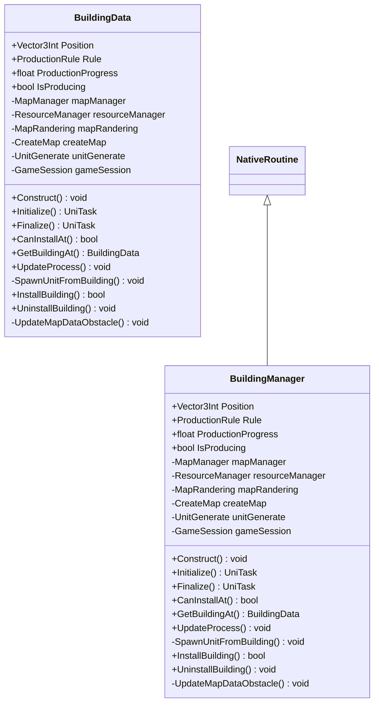

# Package `Building` UML Class Diagram

**소스 경로:** `Assets/Building`

### 📋 스크립트 클래스 명세

#### `BuildingData` (class)
- **경로:** `Script/Building/BuildingManager.cs`
- **변수/프로퍼티:**
  - `+Vector3Int Position`
  - `+ProductionRule Rule`
  - `+float ProductionProgress`
  - `+bool IsProducing`
  - `-MapManager mapManager`
  - `-ResourceManager resourceManager`
  - `-MapRandering mapRandering`
  - `-CreateMap createMap`
  - `-UnitGenerate unitGenerate`
  - `-GameSession gameSession`
  - `-Floor floor`
  - `-int cx`
  - `-int cy`
  - `-int tx`
  - `-int ty`
- **함수:**
  - `+Construct() void`
  - `+Initialize() UniTask`
  - `+Finalize() UniTask`
  - `+CanInstallAt() bool`
  - `+GetBuildingAt() BuildingData`
  - `+UpdateProcess() void`
  - `-SpawnUnitFromBuilding() void`
  - `+InstallBuilding() bool`
  - `+UninstallBuilding() void`
  - `-UpdateMapDataObstacle() void`

#### `BuildingManager` (class)
- **경로:** `Script/Building/BuildingManager.cs`
- **상속/인터페이스:** `NativeRoutine`
- **변수/프로퍼티:**
  - `+Vector3Int Position`
  - `+ProductionRule Rule`
  - `+float ProductionProgress`
  - `+bool IsProducing`
  - `-MapManager mapManager`
  - `-ResourceManager resourceManager`
  - `-MapRandering mapRandering`
  - `-CreateMap createMap`
  - `-UnitGenerate unitGenerate`
  - `-GameSession gameSession`
  - `-Floor floor`
  - `-int cx`
  - `-int cy`
  - `-int tx`
  - `-int ty`
- **함수:**
  - `+Construct() void`
  - `+Initialize() UniTask`
  - `+Finalize() UniTask`
  - `+CanInstallAt() bool`
  - `+GetBuildingAt() BuildingData`
  - `+UpdateProcess() void`
  - `-SpawnUnitFromBuilding() void`
  - `+InstallBuilding() bool`
  - `+UninstallBuilding() void`
  - `-UpdateMapDataObstacle() void`

