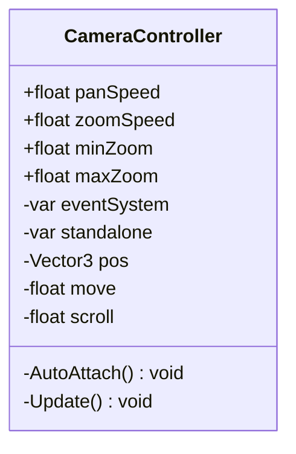

# Package `Camera` UML Class Diagram

**소스 경로:** `Assets/Camera`

### 📋 스크립트 클래스 명세

#### `CameraController` (class)
- **경로:** `Script/Camera/CameraController.cs`
- **상속/인터페이스:** `MonoBehaviour`
- **변수/프로퍼티:**
  - `+float panSpeed`
  - `+float zoomSpeed`
  - `+float minZoom`
  - `+float maxZoom`
  - `-var eventSystem`
  - `-var standalone`
  - `-Vector3 pos`
  - `-float move`
  - `-float scroll`
- **함수:**
  - `-AutoAttach() void`
  - `-Update() void`

