# Package `Editor` UML Class Diagram

**소스 경로:** `Assets/Editor`

```mermaid
classDiagram
    class EncyclopediaSetup {
        -string prefabPath
        -string addressableKey
        -GameObject prefab
        -AddressableAssetSettings settings
        -AddressableAssetGroup group
        -string guid
        -AddressableAssetEntry entry
        -bool found
        -var entries
        +FixAddressables() void
        +RemoveAddressables() void
    }
    class HaareDemoSetup {
        -string PrefabFolder
        -string SceneFolder
        -string_Arr Scenes
        -var settings
        -var group
        -string scenePath
        -int removedCount
        -var entries
        -bool shouldRemove
        -string guid
        +SetupHaareDemoAddressables() void
        +RemoveHaareDemoAddressables() void
        -RegisterEntry() void
    }
    class HaareUIAddressableSetupWindow {
        -string _prefabName
        -var window
        -string prefabPath
        -string addressableKey
        -GameObject prefab
        -AddressableAssetSettings settings
        -AddressableAssetGroup group
        -string guid
        -AddressableAssetEntry entry
        -bool found
        +ShowWindow() void
        -OnGUI() void
        -RegisterAddressable() void
        -RemoveAddressable() void
    }
    class HaareUISetup {
        -string OutputFolder
        -string CoreCanvasAddress
        -string DebugPanelAddress
        -string LoadingFadePanelAddress
        -string ScenePath
        -string KoreanFontPath
        -GameObject canvasPrefab
        -GameObject panelPrefab
        -GameObject fadePanelPrefab
        -var root
        +SetupHaareUI() void
        -CreateCoreCanvasPrefab() GameObject
        -CreateDebugInfoPanelPrefab() GameObject
        -CreateLoadingFadePanelPrefab() GameObject
        -CreateCustomButton() GameObject
        -RegisterAddressable() void
        -WireCompositionRoot() void
        -GetKoreanFont() TMP_FontAsset
    }
    class JsonToUnitPrefabConverter {
        -string UnitsJsonPath
        -string SkillsJsonPath
        -string OutputFolder
        +bool isSpecialUnit
        +bool isInterestTarget
        +float baseInterest
        +float baseDanger
        +float heavyHitThreshold
        +float stealth
        +float baseVisibility
        +ConvertJsonToPrefabs() void
        -CreateFolderRecursive() void
        -SanitizeFileName() string
    }
    JsonToUnitPrefabConverter --> JsonEffectsData
    JsonToUnitPrefabConverter --> JsonWeaponData
    JsonToUnitPrefabConverter --> JsonWeightData
    JsonToUnitPrefabConverter --> JsonVisualData
    class JsonWeightData {
        -string UnitsJsonPath
        -string SkillsJsonPath
        -string OutputFolder
        +bool isSpecialUnit
        +bool isInterestTarget
        +float baseInterest
        +float baseDanger
        +float heavyHitThreshold
        +float stealth
        +float baseVisibility
        +ConvertJsonToPrefabs() void
        -CreateFolderRecursive() void
        -SanitizeFileName() string
    }
    JsonWeightData --> JsonWeaponData
    JsonWeightData --> JsonVisualData
    JsonWeightData --> JsonEffectsData
    class JsonWeaponData {
        -string UnitsJsonPath
        -string SkillsJsonPath
        -string OutputFolder
        +bool isSpecialUnit
        +bool isInterestTarget
        +float baseInterest
        +float baseDanger
        +float heavyHitThreshold
        +float stealth
        +float baseVisibility
        +ConvertJsonToPrefabs() void
        -CreateFolderRecursive() void
        -SanitizeFileName() string
    }
    JsonWeaponData --> JsonWeightData
    JsonWeaponData --> JsonVisualData
    JsonWeaponData --> JsonEffectsData
    class JsonEffectsData {
        -string UnitsJsonPath
        -string SkillsJsonPath
        -string OutputFolder
        +bool isSpecialUnit
        +bool isInterestTarget
        +float baseInterest
        +float baseDanger
        +float heavyHitThreshold
        +float stealth
        +float baseVisibility
        +ConvertJsonToPrefabs() void
        -CreateFolderRecursive() void
        -SanitizeFileName() string
    }
    JsonEffectsData --> JsonWeaponData
    JsonEffectsData --> JsonWeightData
    JsonEffectsData --> JsonVisualData
    class JsonVisualData {
        -string UnitsJsonPath
        -string SkillsJsonPath
        -string OutputFolder
        +bool isSpecialUnit
        +bool isInterestTarget
        +float baseInterest
        +float baseDanger
        +float heavyHitThreshold
        +float stealth
        +float baseVisibility
        +ConvertJsonToPrefabs() void
        -CreateFolderRecursive() void
        -SanitizeFileName() string
    }
    JsonVisualData --> JsonWeaponData
    JsonVisualData --> JsonWeightData
    JsonVisualData --> JsonEffectsData
    class JsonUnitData {
        -string UnitsJsonPath
        -string SkillsJsonPath
        -string OutputFolder
        +bool isSpecialUnit
        +bool isInterestTarget
        +float baseInterest
        +float baseDanger
        +float heavyHitThreshold
        +float stealth
        +float baseVisibility
        +ConvertJsonToPrefabs() void
        -CreateFolderRecursive() void
        -SanitizeFileName() string
    }
    JsonUnitData --> JsonEffectsData
    JsonUnitData --> JsonWeaponData
    JsonUnitData --> JsonWeightData
    JsonUnitData --> JsonVisualData
    class JsonUnitDatabase {
        -string UnitsJsonPath
        -string SkillsJsonPath
        -string OutputFolder
        +bool isSpecialUnit
        +bool isInterestTarget
        +float baseInterest
        +float baseDanger
        +float heavyHitThreshold
        +float stealth
        +float baseVisibility
        +ConvertJsonToPrefabs() void
        -CreateFolderRecursive() void
        -SanitizeFileName() string
    }
    JsonUnitDatabase --> JsonEffectsData
    JsonUnitDatabase --> JsonWeaponData
    JsonUnitDatabase --> JsonWeightData
    JsonUnitDatabase --> JsonVisualData
    class JsonSkillData {
        -string UnitsJsonPath
        -string SkillsJsonPath
        -string OutputFolder
        +bool isSpecialUnit
        +bool isInterestTarget
        +float baseInterest
        +float baseDanger
        +float heavyHitThreshold
        +float stealth
        +float baseVisibility
        +ConvertJsonToPrefabs() void
        -CreateFolderRecursive() void
        -SanitizeFileName() string
    }
    JsonSkillData --> JsonEffectsData
    JsonSkillData --> JsonWeaponData
    JsonSkillData --> JsonWeightData
    JsonSkillData --> JsonVisualData
    class JsonSkillDatabase {
        -string UnitsJsonPath
        -string SkillsJsonPath
        -string OutputFolder
        +bool isSpecialUnit
        +bool isInterestTarget
        +float baseInterest
        +float baseDanger
        +float heavyHitThreshold
        +float stealth
        +float baseVisibility
        +ConvertJsonToPrefabs() void
        -CreateFolderRecursive() void
        -SanitizeFileName() string
    }
    JsonSkillDatabase --> JsonEffectsData
    JsonSkillDatabase --> JsonWeaponData
    JsonSkillDatabase --> JsonWeightData
    JsonSkillDatabase --> JsonVisualData
    class MapGeneratorTool {
        -CreateMap cm
        -bool showGizmoSettings
        -GUIStyle sectionHeaderStyle
        -GUIStyle boxStyle
        -string errMsg
        -bool hasMap
        -string dirPath
        -string path
        -string defaultName
        -bool isSelected
        +ShowWindow() void
        -OnEnable() void
        -OnGUI() void
        -InitStyles() void
        -DrawDefaultProperties() void
        -DrawGenerateButton() void
        -DrawValidationResult() void
        -DrawSaveLoadButtons() void
        -DrawGizmoSettings() void
        -DrawGizmoFloorSelector() void
    }
    class MapViewTool {
        -CreateMap cm
        -int selectedFloor
        -int selectedChunkX
        -int selectedChunkY
        -int selectedTileX
        -int selectedTileY
        -Vector2 chunkScrollPos
        -Vector2 tileScrollPos
        -bool showChunkGrid
        -bool showTileGrid
        +ShowWindow() void
        -OnEnable() void
        -OnDisable() void
        -OnPlayModeStateChanged() void
        -OnMapUpdated() void
        -OnGUI() void
        -InitStyles() void
        -DrawFloorSelector() void
        -DrawChunkGrid() void
        -DrawTileGrid() void
    }
    class ProjectileSetupTool {
        -GameObject selectedPrefab
        -string assetPath
        -GameObject instance
        -bool modified
        -var rb
        -var colliders
        -var proj
        -var sr
        +ShowWindow() void
        -OnGUI() void
        -SetupProjectilePrefab() void
    }
    class TestMapGen {
        -CreateMap cm
        +Run() void
    }
    class TitleSceneSetup {
        -string PrefabFolder
        -string TitlePanelPrefabPath
        -string TitlePanelAddress
        -string TitleScenePath
        -string SshScenePath
        -string KoreanFontPath
        -Color BackgroundColor
        -Color TitleColor
        -Color ButtonLabelColor
        -GameObject panelPrefab
        +SetupTitleScene() void
        -CreateTitlePanelPrefab() GameObject
        -CreateTitleButton() GameObject
        -BuildAndSaveTitleScene() void
        -WireDefaultUIActions() void
        -AddSceneToBuildSettings() void
        -RegisterAddressable() void
        -GetKoreanFont() TMP_FontAsset
    }
    class UnitVisualEditor {
        -var visual
        -var tex
        -Rect rect
        +OnInspectorGUI() void
    }
    class WeaponSocketSetup {
        -GameObject unitPrefab
        -Sprite weaponSprite
        -string socketName
        -string path
        -GameObject root
        -Transform visual
        -Transform existing
        -GameObject socketGo
        -SpriteRenderer sr
        +ShowWindow() void
        -OnGUI() void
        -AddWeaponSocket() void
    }
    class AddressablesPlayModeSetup {
        -var settings
        -int targetIndex
        -AddressablesPlayModeSetup() static
        +SetPlayModeToAssetDatabase() void
    }
    class OffenseDebugWindow {
        -GameSession _gameSession
        -var root
        -return _gameSession
        -float _customWaveCooldown
        -int _addResourceAmount
        -Room _dummyRoom
        -int randomIndex
        -return null
        -Room targetRoom
        -Vector2Int spawnPos
        +ShowWindow() void
        -OnGUI() void
        -GetRandomRealRoom() Room
    }
    class SetupStatusInfoPanel {
        -string folderPath
        -string prefabPath
        -GameObject go
        -GameObject prefab
        -AddressableAssetSettings settings
        -AddressableAssetGroup group
        -string guid
        -AddressableAssetEntry entry
        +Setup() void
    }
```

### 📋 스크립트 클래스 명세

#### `EncyclopediaSetup` (class)
- **경로:** `Editor/EncyclopediaSetup.cs`
- **변수/프로퍼티:**
  - `-string prefabPath`
  - `-string addressableKey`
  - `-GameObject prefab`
  - `-AddressableAssetSettings settings`
  - `-AddressableAssetGroup group`
  - `-string guid`
  - `-AddressableAssetEntry entry`
  - `-string addressableKey`
  - `-AddressableAssetSettings settings`
  - `-bool found`
  - `-var entries`
- **함수:**
  - `+FixAddressables() void`
  - `+RemoveAddressables() void`

#### `HaareDemoSetup` (class)
- **경로:** `Editor/HaareDemoSetup.cs`
- **변수/프로퍼티:**
  - `-string PrefabFolder`
  - `-string SceneFolder`
  - `-string_Arr Scenes`
  - `-var settings`
  - `-var group`
  - `-string scenePath`
  - `-var settings`
  - `-int removedCount`
  - `-var entries`
  - `-bool shouldRemove`
  - `-string scenePath`
  - `-string guid`
  - `-var entry`
- **함수:**
  - `+SetupHaareDemoAddressables() void`
  - `+RemoveHaareDemoAddressables() void`
  - `-RegisterEntry() void`

#### `HaareUIAddressableSetupWindow` (class)
- **경로:** `Editor/HaareUIAddressableSetupWindow.cs`
- **상속/인터페이스:** `EditorWindow`
- **변수/프로퍼티:**
  - `-string _prefabName`
  - `-var window`
  - `-string prefabPath`
  - `-string addressableKey`
  - `-GameObject prefab`
  - `-AddressableAssetSettings settings`
  - `-AddressableAssetGroup group`
  - `-string guid`
  - `-AddressableAssetEntry entry`
  - `-string addressableKey`
  - `-AddressableAssetSettings settings`
  - `-bool found`
  - `-var entries`
- **함수:**
  - `+ShowWindow() void`
  - `-OnGUI() void`
  - `-RegisterAddressable() void`
  - `-RemoveAddressable() void`

#### `HaareUISetup` (class)
- **경로:** `Editor/HaareUISetup.cs`
- **변수/프로퍼티:**
  - `-string OutputFolder`
  - `-string CoreCanvasAddress`
  - `-string DebugPanelAddress`
  - `-string LoadingFadePanelAddress`
  - `-string ScenePath`
  - `-string KoreanFontPath`
  - `-GameObject canvasPrefab`
  - `-GameObject panelPrefab`
  - `-GameObject fadePanelPrefab`
  - `-var root`
  - `-var canvas`
  - `-var scaler`
  - `-var safeArea`
  - `-var safeRt`
  - `-var coreUIManager`
- **함수:**
  - `+SetupHaareUI() void`
  - `-CreateCoreCanvasPrefab() GameObject`
  - `-CreateDebugInfoPanelPrefab() GameObject`
  - `-CreateLoadingFadePanelPrefab() GameObject`
  - `-CreateCustomButton() GameObject`
  - `-RegisterAddressable() void`
  - `-WireCompositionRoot() void`
  - `-GetKoreanFont() TMP_FontAsset`

#### `JsonToUnitPrefabConverter` (class)
- **경로:** `Editor/JsonToUnitPrefabConverter.cs`
- **변수/프로퍼티:**
  - `-string UnitsJsonPath`
  - `-string SkillsJsonPath`
  - `-string OutputFolder`
  - `+bool isSpecialUnit`
  - `+bool isInterestTarget`
  - `+float baseInterest`
  - `+float baseDanger`
  - `+float heavyHitThreshold`
  - `+float stealth`
  - `+float baseVisibility`
  - `+string sprite`
  - `+float nativeSpriteAngle`
  - `+string hitSpark`
  - `+string guard`
  - `+string parry`
- **함수:**
  - `+ConvertJsonToPrefabs() void`
  - `-CreateFolderRecursive() void`
  - `-SanitizeFileName() string`

#### `JsonWeightData` (class)
- **경로:** `Editor/JsonToUnitPrefabConverter.cs`
- **변수/프로퍼티:**
  - `-string UnitsJsonPath`
  - `-string SkillsJsonPath`
  - `-string OutputFolder`
  - `+bool isSpecialUnit`
  - `+bool isInterestTarget`
  - `+float baseInterest`
  - `+float baseDanger`
  - `+float heavyHitThreshold`
  - `+float stealth`
  - `+float baseVisibility`
  - `+string sprite`
  - `+float nativeSpriteAngle`
  - `+string hitSpark`
  - `+string guard`
  - `+string parry`
- **함수:**
  - `+ConvertJsonToPrefabs() void`
  - `-CreateFolderRecursive() void`
  - `-SanitizeFileName() string`

#### `JsonWeaponData` (class)
- **경로:** `Editor/JsonToUnitPrefabConverter.cs`
- **변수/프로퍼티:**
  - `-string UnitsJsonPath`
  - `-string SkillsJsonPath`
  - `-string OutputFolder`
  - `+bool isSpecialUnit`
  - `+bool isInterestTarget`
  - `+float baseInterest`
  - `+float baseDanger`
  - `+float heavyHitThreshold`
  - `+float stealth`
  - `+float baseVisibility`
  - `+string sprite`
  - `+float nativeSpriteAngle`
  - `+string hitSpark`
  - `+string guard`
  - `+string parry`
- **함수:**
  - `+ConvertJsonToPrefabs() void`
  - `-CreateFolderRecursive() void`
  - `-SanitizeFileName() string`

#### `JsonEffectsData` (class)
- **경로:** `Editor/JsonToUnitPrefabConverter.cs`
- **변수/프로퍼티:**
  - `-string UnitsJsonPath`
  - `-string SkillsJsonPath`
  - `-string OutputFolder`
  - `+bool isSpecialUnit`
  - `+bool isInterestTarget`
  - `+float baseInterest`
  - `+float baseDanger`
  - `+float heavyHitThreshold`
  - `+float stealth`
  - `+float baseVisibility`
  - `+string sprite`
  - `+float nativeSpriteAngle`
  - `+string hitSpark`
  - `+string guard`
  - `+string parry`
- **함수:**
  - `+ConvertJsonToPrefabs() void`
  - `-CreateFolderRecursive() void`
  - `-SanitizeFileName() string`

#### `JsonVisualData` (class)
- **경로:** `Editor/JsonToUnitPrefabConverter.cs`
- **변수/프로퍼티:**
  - `-string UnitsJsonPath`
  - `-string SkillsJsonPath`
  - `-string OutputFolder`
  - `+bool isSpecialUnit`
  - `+bool isInterestTarget`
  - `+float baseInterest`
  - `+float baseDanger`
  - `+float heavyHitThreshold`
  - `+float stealth`
  - `+float baseVisibility`
  - `+string sprite`
  - `+float nativeSpriteAngle`
  - `+string hitSpark`
  - `+string guard`
  - `+string parry`
- **함수:**
  - `+ConvertJsonToPrefabs() void`
  - `-CreateFolderRecursive() void`
  - `-SanitizeFileName() string`

#### `JsonUnitData` (class)
- **경로:** `Editor/JsonToUnitPrefabConverter.cs`
- **변수/프로퍼티:**
  - `-string UnitsJsonPath`
  - `-string SkillsJsonPath`
  - `-string OutputFolder`
  - `+bool isSpecialUnit`
  - `+bool isInterestTarget`
  - `+float baseInterest`
  - `+float baseDanger`
  - `+float heavyHitThreshold`
  - `+float stealth`
  - `+float baseVisibility`
  - `+string sprite`
  - `+float nativeSpriteAngle`
  - `+string hitSpark`
  - `+string guard`
  - `+string parry`
- **함수:**
  - `+ConvertJsonToPrefabs() void`
  - `-CreateFolderRecursive() void`
  - `-SanitizeFileName() string`

#### `JsonUnitDatabase` (class)
- **경로:** `Editor/JsonToUnitPrefabConverter.cs`
- **변수/프로퍼티:**
  - `-string UnitsJsonPath`
  - `-string SkillsJsonPath`
  - `-string OutputFolder`
  - `+bool isSpecialUnit`
  - `+bool isInterestTarget`
  - `+float baseInterest`
  - `+float baseDanger`
  - `+float heavyHitThreshold`
  - `+float stealth`
  - `+float baseVisibility`
  - `+string sprite`
  - `+float nativeSpriteAngle`
  - `+string hitSpark`
  - `+string guard`
  - `+string parry`
- **함수:**
  - `+ConvertJsonToPrefabs() void`
  - `-CreateFolderRecursive() void`
  - `-SanitizeFileName() string`

#### `JsonSkillData` (class)
- **경로:** `Editor/JsonToUnitPrefabConverter.cs`
- **변수/프로퍼티:**
  - `-string UnitsJsonPath`
  - `-string SkillsJsonPath`
  - `-string OutputFolder`
  - `+bool isSpecialUnit`
  - `+bool isInterestTarget`
  - `+float baseInterest`
  - `+float baseDanger`
  - `+float heavyHitThreshold`
  - `+float stealth`
  - `+float baseVisibility`
  - `+string sprite`
  - `+float nativeSpriteAngle`
  - `+string hitSpark`
  - `+string guard`
  - `+string parry`
- **함수:**
  - `+ConvertJsonToPrefabs() void`
  - `-CreateFolderRecursive() void`
  - `-SanitizeFileName() string`

#### `JsonSkillDatabase` (class)
- **경로:** `Editor/JsonToUnitPrefabConverter.cs`
- **변수/프로퍼티:**
  - `-string UnitsJsonPath`
  - `-string SkillsJsonPath`
  - `-string OutputFolder`
  - `+bool isSpecialUnit`
  - `+bool isInterestTarget`
  - `+float baseInterest`
  - `+float baseDanger`
  - `+float heavyHitThreshold`
  - `+float stealth`
  - `+float baseVisibility`
  - `+string sprite`
  - `+float nativeSpriteAngle`
  - `+string hitSpark`
  - `+string guard`
  - `+string parry`
- **함수:**
  - `+ConvertJsonToPrefabs() void`
  - `-CreateFolderRecursive() void`
  - `-SanitizeFileName() string`

#### `MapGeneratorTool` (class)
- **경로:** `Editor/MapGeneratorTool.cs`
- **상속/인터페이스:** `EditorWindow`
- **변수/프로퍼티:**
  - `-CreateMap cm`
  - `-bool showGizmoSettings`
  - `-GUIStyle sectionHeaderStyle`
  - `-GUIStyle boxStyle`
  - `-string errMsg`
  - `-bool hasMap`
  - `-string dirPath`
  - `-string path`
  - `-string defaultName`
  - `-string path`
  - `-string path`
  - `-bool isSelected`
  - `-string label`
- **함수:**
  - `+ShowWindow() void`
  - `-OnEnable() void`
  - `-OnGUI() void`
  - `-InitStyles() void`
  - `-DrawDefaultProperties() void`
  - `-DrawGenerateButton() void`
  - `-DrawValidationResult() void`
  - `-DrawSaveLoadButtons() void`
  - `-DrawGizmoSettings() void`
  - `-DrawGizmoFloorSelector() void`

#### `MapViewTool` (class)
- **경로:** `Editor/MapViewTool.cs`
- **상속/인터페이스:** `EditorWindow`
- **변수/프로퍼티:**
  - `-CreateMap cm`
  - `-int selectedFloor`
  - `-int selectedChunkX`
  - `-int selectedChunkY`
  - `-int selectedTileX`
  - `-int selectedTileY`
  - `-Vector2 chunkScrollPos`
  - `-Vector2 tileScrollPos`
  - `-bool showChunkGrid`
  - `-bool showTileGrid`
  - `-bool showTileDetail`
  - `-GUIStyle centeredMiniLabel`
  - `-GUIStyle sectionHeaderStyle`
  - `-GUIStyle boxStyle`
  - `-int ChunkCellSize`
- **함수:**
  - `+ShowWindow() void`
  - `-OnEnable() void`
  - `-OnDisable() void`
  - `-OnPlayModeStateChanged() void`
  - `-OnMapUpdated() void`
  - `-OnGUI() void`
  - `-InitStyles() void`
  - `-DrawFloorSelector() void`
  - `-DrawChunkGrid() void`
  - `-DrawTileGrid() void`
  - `-DrawTileDetail() void`
  - `-DrawDetailRow() void`
  - `-GetRoomColor() Color`
  - `-DrawLegendBox() void`
  - `-GetRolePrefix() string`

#### `ProjectileSetupTool` (class)
- **경로:** `Editor/ProjectileSetupTool.cs`
- **상속/인터페이스:** `EditorWindow`
- **변수/프로퍼티:**
  - `-GameObject selectedPrefab`
  - `-string assetPath`
  - `-GameObject instance`
  - `-bool modified`
  - `-var rb`
  - `-var colliders`
  - `-var proj`
  - `-var sr`
- **함수:**
  - `+ShowWindow() void`
  - `-OnGUI() void`
  - `-SetupProjectilePrefab() void`

#### `TestMapGen` (class)
- **경로:** `Editor/TestMapGen.cs`
- **변수/프로퍼티:**
  - `-CreateMap cm`
- **함수:**
  - `+Run() void`

#### `TitleSceneSetup` (class)
- **경로:** `Editor/TitleSceneSetup.cs`
- **변수/프로퍼티:**
  - `-string PrefabFolder`
  - `-string TitlePanelPrefabPath`
  - `-string TitlePanelAddress`
  - `-string TitleScenePath`
  - `-string SshScenePath`
  - `-string KoreanFontPath`
  - `-Color BackgroundColor`
  - `-Color TitleColor`
  - `-Color ButtonLabelColor`
  - `-GameObject panelPrefab`
  - `-var tmpResources`
  - `-var root`
  - `-var rootRt`
  - `-var bg`
  - `-var bgRt`
- **함수:**
  - `+SetupTitleScene() void`
  - `-CreateTitlePanelPrefab() GameObject`
  - `-CreateTitleButton() GameObject`
  - `-BuildAndSaveTitleScene() void`
  - `-WireDefaultUIActions() void`
  - `-AddSceneToBuildSettings() void`
  - `-RegisterAddressable() void`
  - `-GetKoreanFont() TMP_FontAsset`

#### `UnitVisualEditor` (class)
- **경로:** `Editor/UnitVisualEditor.cs`
- **상속/인터페이스:** `Editor`
- **변수/프로퍼티:**
  - `-var visual`
  - `-var tex`
  - `-Rect rect`
- **함수:**
  - `+OnInspectorGUI() void`

#### `WeaponSocketSetup` (class)
- **경로:** `Editor/WeaponSocketSetup.cs`
- **상속/인터페이스:** `EditorWindow`
- **변수/프로퍼티:**
  - `-GameObject unitPrefab`
  - `-Sprite weaponSprite`
  - `-string socketName`
  - `-string path`
  - `-GameObject root`
  - `-Transform visual`
  - `-Transform existing`
  - `-GameObject socketGo`
  - `-SpriteRenderer sr`
- **함수:**
  - `+ShowWindow() void`
  - `-OnGUI() void`
  - `-AddWeaponSocket() void`

#### `AddressablesPlayModeSetup` (class)
- **경로:** `Script/Editor/AddressablesPlayModeSetup.cs`
- **변수/프로퍼티:**
  - `-var settings`
  - `-int targetIndex`
- **함수:**
  - `-AddressablesPlayModeSetup() static`
  - `+SetPlayModeToAssetDatabase() void`

#### `OffenseDebugWindow` (class)
- **경로:** `Script/Editor/OffenseDebugWindow.cs`
- **상속/인터페이스:** `EditorWindow`
- **변수/프로퍼티:**
  - `-GameSession _gameSession`
  - `-var root`
  - `-return _gameSession`
  - `-float _customWaveCooldown`
  - `-int _addResourceAmount`
  - `-Room _dummyRoom`
  - `-int randomIndex`
  - `-return null`
  - `-Room targetRoom`
  - `-Vector2Int spawnPos`
  - `-Monster monster`
  - `-Room targetRoom`
  - `-Monster baseUnit`
  - `-WildBaseSpawnerComponent spawnerComp`
  - `-Vector2Int centerPos`
- **함수:**
  - `+ShowWindow() void`
  - `-OnGUI() void`
  - `-GetRandomRealRoom() Room`

#### `SetupStatusInfoPanel` (class)
- **경로:** `Script/Editor/SetupStatusInfoPanel.cs`
- **변수/프로퍼티:**
  - `-string folderPath`
  - `-string prefabPath`
  - `-GameObject go`
  - `-GameObject prefab`
  - `-AddressableAssetSettings settings`
  - `-AddressableAssetGroup group`
  - `-string guid`
  - `-AddressableAssetEntry entry`
- **함수:**
  - `+Setup() void`

