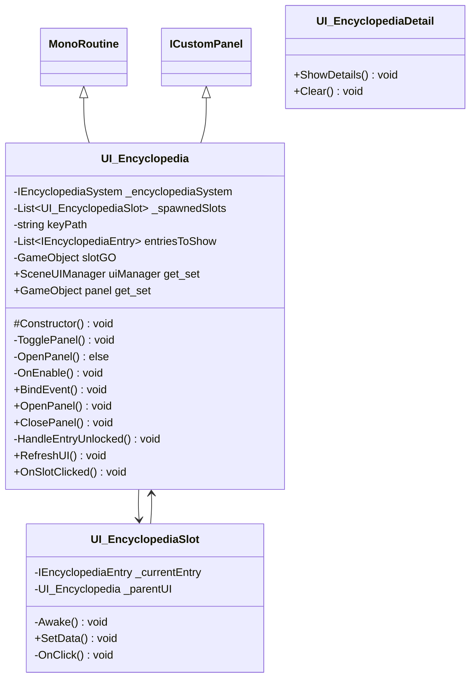

# Package `Encyclopedia/UI` UML Class Diagram

**소스 경로:** `Assets/Encyclopedia/UI`

### 📋 스크립트 클래스 명세

#### `UI_Encyclopedia` (class)
- **경로:** `Script/Encyclopedia/UI/UI_Encyclopedia.cs`
- **상속/인터페이스:** `MonoRoutine, ICustomPanel`
- **변수/프로퍼티:**
  - `-IEncyclopediaSystem _encyclopediaSystem`
  - `-List~UI_EncyclopediaSlot~ _spawnedSlots`
  - `-string keyPath`
  - `-List~IEncyclopediaEntry~ entriesToShow`
  - `-GameObject slotGO`
  - `+SceneUIManager uiManager get_set`
  - `+GameObject panel get_set`
- **함수:**
  - `#Constructor() void`
  - `-TogglePanel() void`
  - `-OpenPanel() else`
  - `-OnEnable() void`
  - `+BindEvent() void`
  - `+OpenPanel() void`
  - `+ClosePanel() void`
  - `-HandleEntryUnlocked() void`
  - `+RefreshUI() void`
  - `+OnSlotClicked() void`
  - `-OnDestroy() void`

#### `UI_EncyclopediaDetail` (class)
- **경로:** `Script/Encyclopedia/UI/UI_EncyclopediaDetail.cs`
- **상속/인터페이스:** `MonoBehaviour`
- **함수:**
  - `+ShowDetails() void`
  - `+Clear() void`

#### `UI_EncyclopediaSlot` (class)
- **경로:** `Script/Encyclopedia/UI/UI_EncyclopediaSlot.cs`
- **상속/인터페이스:** `MonoBehaviour`
- **변수/프로퍼티:**
  - `-IEncyclopediaEntry _currentEntry`
  - `-UI_Encyclopedia _parentUI`
- **함수:**
  - `-Awake() void`
  - `+SetData() void`
  - `-OnClick() void`

