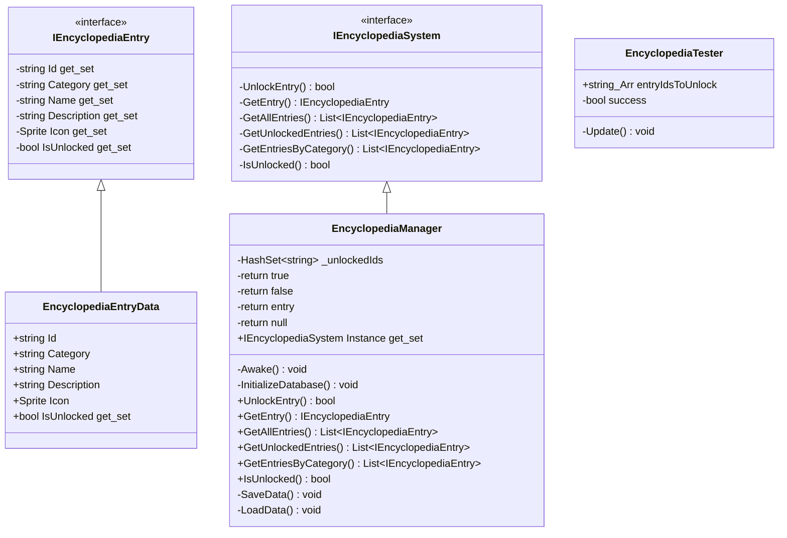

# Package `Encyclopedia` UML Class Diagram

**소스 경로:** `Assets/Encyclopedia`

### 📋 스크립트 클래스 명세

#### `EncyclopediaEntryData` (class)
- **경로:** `Script/Encyclopedia/EncyclopediaEntryData.cs`
- **상속/인터페이스:** `ScriptableObject, IEncyclopediaEntry`
- **변수/프로퍼티:**
  - `+string Id`
  - `+string Category`
  - `+string Name`
  - `+string Description`
  - `+Sprite Icon`
  - `+bool IsUnlocked get_set`

#### `EncyclopediaManager` (class)
- **경로:** `Script/Encyclopedia/EncyclopediaManager.cs`
- **상속/인터페이스:** `MonoBehaviour, IEncyclopediaSystem`
- **변수/프로퍼티:**
  - `-HashSet~string~ _unlockedIds`
  - `-return true`
  - `-return false`
  - `-return entry`
  - `-return null`
  - `+IEncyclopediaSystem Instance get_set`
- **함수:**
  - `-Awake() void`
  - `-InitializeDatabase() void`
  - `+UnlockEntry() bool`
  - `+GetEntry() IEncyclopediaEntry`
  - `+GetAllEntries() List~IEncyclopediaEntry~`
  - `+GetUnlockedEntries() List~IEncyclopediaEntry~`
  - `+GetEntriesByCategory() List~IEncyclopediaEntry~`
  - `+IsUnlocked() bool`
  - `-SaveData() void`
  - `-LoadData() void`

#### `EncyclopediaTester` (class)
- **경로:** `Script/Encyclopedia/EncyclopediaTester.cs`
- **상속/인터페이스:** `MonoBehaviour`
- **변수/프로퍼티:**
  - `+string_Arr entryIdsToUnlock`
  - `-bool success`
  - `-bool success`
- **함수:**
  - `-Update() void`

#### `IEncyclopediaEntry` (interface)
- **경로:** `Script/Encyclopedia/IEncyclopediaEntry.cs`
- **변수/프로퍼티:**
  - `-string Id get_set`
  - `-string Category get_set`
  - `-string Name get_set`
  - `-string Description get_set`
  - `-Sprite Icon get_set`
  - `-bool IsUnlocked get_set`

#### `IEncyclopediaSystem` (interface)
- **경로:** `Script/Encyclopedia/IEncyclopediaSystem.cs`
- **함수:**
  - `-UnlockEntry() bool`
  - `-GetEntry() IEncyclopediaEntry`
  - `-GetAllEntries() List~IEncyclopediaEntry~`
  - `-GetUnlockedEntries() List~IEncyclopediaEntry~`
  - `-GetEntriesByCategory() List~IEncyclopediaEntry~`
  - `-IsUnlocked() bool`

