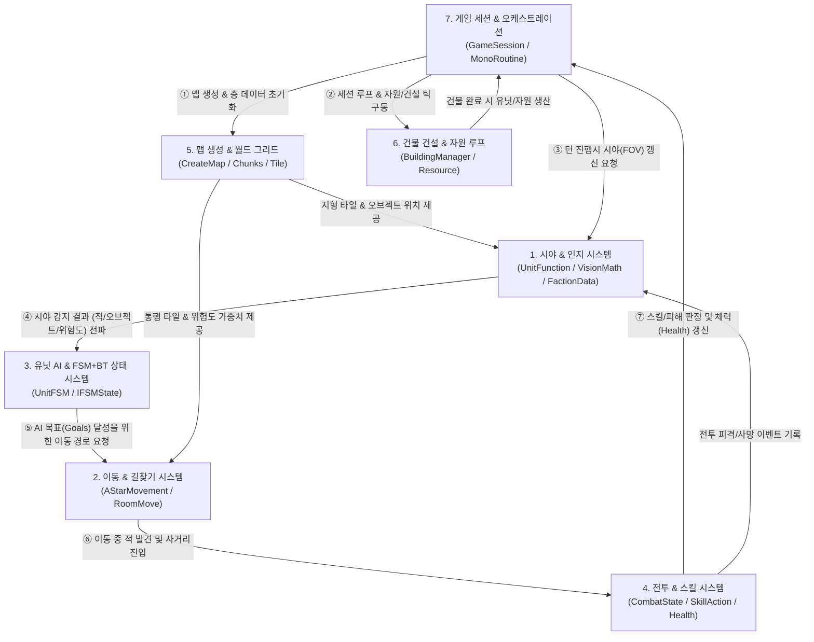
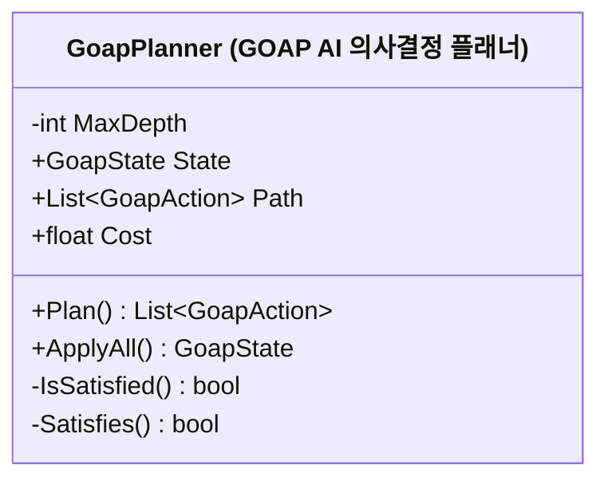
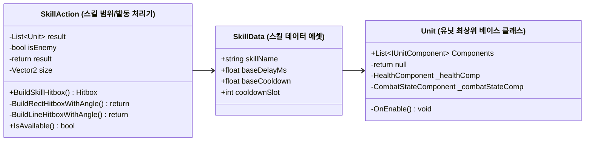

# ⚡ GrimArchive Prototype - 한글 기능 설명이 포함된 기능 단위 협력 UML 다이어그램

본 문서는 각 클래스의 이름 바로 옆에 **한글 역할 번역 및 핵심 기능 명칭**을 괄호 형태로 첨부하여, 코드를 깊이 보지 않더라도 각 스크립트의 역할을 한눈에 직관적으로 파악할 수 있도록 작성된 협력 다이어그램 모음입니다.

---

## 🌐 7개 핵심 기능 시스템 간 상호작용 통합 다이어그램 (Subsystem Interaction Flow)

본 다이어그램은 게임의 7가지 핵심 시스템이 **초기화 → 맵 생성 → 시야 감지 → AI 의사결정 → 길찾기 이동 → 전투 발생 → 세션 갱신** 과정에서 서로 어떻게 데이터를 주고받고 연결되어 작동하는지 상호작용 흐름을 보여줍니다.

### 🔄 7대 시스템 상호작용 4단계 데이터 순환 (System Lifecycle Loop)

1. **[1단계: 세션 부팅 및 맵 생성]**
   - **`7. 게임 세션`**이 시작되면 **`5. 맵 생성 시스템`**을 호출하여 던전 층(Floor)과 청크/타일을 구성하고, **`6. 건설 시스템`**을 초기화합니다.

2. **[2단계: 시야 탐색 및 감지]**
   - 세션 턴 루프에서 유닛이 움직일 때마다 **`1. 시야&인지 시스템`**이 발동하여 **`5. 맵 그리드`** 상의 벽과 오브젝트를 탐색하고, 적의 위치와 타일 위험도를 전파합니다.

3. **[3단계: AI 기획 및 A* 길찾기]**
   - **`3. 유닛 AI`**가 전달받은 시야 감지 정보와 개인 가중치를 바탕으로 최고 우선순위 목표를 결정하고, **`2. 이동&길찾기 시스템`**에 A* 경로 생성을 요청하여 움직입니다.

4. **[4단계: 전투 교전 및 세션 반영]**
   - 이동 중 적과 인접하거나 사거리에 들어오면 **`4. 전투&스킬 시스템`**이 발동하여 스킬 캐스팅 및 데미지를 처리하고, 결과를 다시 **`7. 게임 세션`**과 **`1. 인지 지도`**에 반영합니다.

---

## 🎯 1. 시야 및 인지 시스템 (Vision & Perception Subsystem)

**기능 설명**: 유닛이 시야각(120도) 및 인지 거리를 기반으로 주변 지형/적/오브젝트/전멸 흔적을 레이캐스팅으로 감지하고 개인/진영 지도 데이터를 갱신하는 기능 그룹

```mermaid
classDiagram
    direction LR

    class UnitFunction["UnitFunction (유닛 시야/공격 핵심 처리기)"] {
        -float prevHp
        -float damage
        -float damage
        -bool defenderIsHuman
        +TakeDamage() void
        +TakePhysicalDamage() void
        +TakeMagicalDamage() void
        +RecordHitWeightEvent() void
    }
    class VisionMath["VisionMath (시야 각도 및 감지 거리 수식 계산기)"] {
        +float DetectionStatMax
        +float BaseViewAngleDeg
        +int BaseViewDistanceTiles
        +int ViewDistancePerSpottingStep
        +ViewDistance() int
        +AwarenessDistance() int
        +AwarenessAngle() float
        +ResolveBaseVisibility() float
    }
    class IVisionContext["IVisionContext (시야 감지 컨텍스트 인터페이스)"] {
        <<interface>>
        -ResolveReachedTarget() PerceptionOutcome
        -HasReachedPerceptionThisPass() bool
        -HasVisionOnlyNonEmptyTile() bool
        -AddVisionOnlyNonEmptyTile() void
    }
    class PersonalMapKnowledge["PersonalMapKnowledge (유닛 개인 기억 지도)"] {
        +IEnumerable~Vector3Int~ KnownInterestTiles
        -string objId
        -bool newInterestPresent
        -float elapsed
        +TickTileInterestConfirm() void
        +GetTileDanger() float
        +SetTileDangerFromUnit() void
        +TickTileSafety() void
    }
    class FactionData["FactionData (진영 공유 시야/탐색 맵 데이터)"] {
        +int_Arr discoveredMap
        +List~Unit~ spottedEnemyUnits
        -int floorCount
        -int w
        -FactionData() public
        +InitMap() void
    }
    class ObjectPerceptionHandler["ObjectPerceptionHandler (오브젝트 감지 처리기)"] {
        -float objVisibility
        -PerceptionOutcome outcome
        -bool isBossRoom
        +Handle() void
    }
    class UnitPerceptionHandler["UnitPerceptionHandler (적/동료 감지 처리기)"] {
        -bool isEnemy
        -PerceptionOutcome outcome
        -float danger
        -float interest
        +Handle() void
    }
    class TerrainRevealHandler["TerrainRevealHandler (지형 타일 밝힘 처리기)"] {
        -bool tileIsWall
        -bool isFirstReveal
        -bool isBossRoom
        -int totalFloorTiles
        +Handle() void
    }

    %% 상호 작용 및 관계선
    IVisionContext <|-- UnitFunction
    UnitFunction --> VisionMath
    VisionMath --> IVisionContext
    IVisionContext --> PersonalMapKnowledge
    PersonalMapKnowledge --> FactionData
    FactionData --> ObjectPerceptionHandler
    ObjectPerceptionHandler --> UnitPerceptionHandler
    UnitPerceptionHandler --> TerrainRevealHandler
```

### 🔄 1단계별 런타임 작동 흐름 (Execution Step Flow)
1. **[시야 갱신 요청]** `GameSession` 턴 루프에서 매 프레임/턴마다 유닛의 `UnitFunction.UpdateFOV()`를 호출합니다.
2. **[감지 수식 연산]** `UnitFunction`이 `VisionMath`를 참조하여 감지 스탯(spotting)에 따른 시야각(120도), 시야 거리, 인지각, 인지 거리를 연산합니다.
3. **[레이캐스팅 스윕]** 정면 각도를 중심으로 72~80개의 레이(`CastRay`)를 방사형으로 발사하며 그리드 타일을 검사합니다.
4. **[핸들러 탐색 판정]**:
   - `TerrainRevealHandler`: 타일 벽/바닥 여부를 판정하여 시야 차단 여부를 체크하고 개인 지도(`PersonalMapKnowledge`) 타일을 밝힙니다.
   - `ObjectPerceptionHandler`: 시체, 전멸 흔적, 함정 등 오브젝트 가시성 및 위험도를 판정하여 등록합니다.
   - `UnitPerceptionHandler`: 시야 범위 내 적 유닛 탐지 시 `PersonalMapKnowledge.personalSpottedEnemies` 및 `FactionData`에 실시간 전파합니다.

### 📋 포함 스크립트 역할 가이드

- **`UnitFunction`**: `UnitFunction (유닛 시야/공격 핵심 처리기)`
- **`VisionMath`**: `VisionMath (시야 각도 및 감지 거리 수식 계산기)`
- **`IVisionContext`**: `IVisionContext (시야 감지 컨텍스트 인터페이스)`
- **`PersonalMapKnowledge`**: `PersonalMapKnowledge (유닛 개인 기억 지도)`
- **`FactionData`**: `FactionData (진영 공유 시야/탐색 맵 데이터)`
- **`ObjectPerceptionHandler`**: `ObjectPerceptionHandler (오브젝트 감지 처리기)`
- **`UnitPerceptionHandler`**: `UnitPerceptionHandler (적/동료 감지 처리기)`
- **`TerrainRevealHandler`**: `TerrainRevealHandler (지형 타일 밝힘 처리기)`

---

## 🎯 2. 이동 및 길찾기 시스템 (Movement & Pathfinding Subsystem)

**기능 설명**: 유닛이 타일 가중치(위험도/흥미도) 및 맵 지형 정보를 고려하여 A* 알고리즘으로 이동 경로를 계산하고 위치를 갱신하는 기능 그룹

```mermaid
classDiagram
    direction LR

    class AStarMovement["AStarMovement (A* 경로 탐색 이동기)"] {
        +Vector2Int Pos
        +AStarNode Parent
        +int GCost
        +int HCost
        +TryGetNextStep() bool
        -TryFallbackMove() return
    }
    class Unit["Unit (유닛 최상위 베이스 클래스)"] {
        +List~IUnitComponent~ Components
        -return null
        -HealthComponent _healthComp
        -CombatStateComponent _combatStateComp
        -OnEnable() void
    }
    class CreateMap["CreateMap (던전 맵/층 동적 생성기)"] {
        -int w
        -int h
        -int_Arr ddx
        -int_Arr ddy
        -BuildGraph() void
        -AddEdge() void
        -ConnectRooms() void
    }
    class Tile["Tile (단일 타일 데이터)"] {
        <<struct>>
        +int roomA
        +int roomB
        +int chunkAX
        +int chunkAY
        +Wall() Tile
        +Floor() Tile
        +Stair() Tile
        +CreateDefault() FloorConfig_Arr
    }
    class Chunks["Chunks (8x8 타일 청크 관리자)"] {
        <<struct>>
        +int roomA
        +int roomB
        +int chunkAX
        +int chunkAY
        +Wall() Tile
        +Floor() Tile
        +Stair() Tile
        +CreateDefault() FloorConfig_Arr
    }
    class Floor["Floor (단일 층 그리드 데이터)"] {
        <<struct>>
        +int roomA
        +int roomB
        +int chunkAX
        +int chunkAY
        +Wall() Tile
        +Floor() Tile
        +Stair() Tile
        +CreateDefault() FloorConfig_Arr
    }

    %% 상호 작용 및 관계선
    AStarMovement --> Unit
    Unit --> CreateMap
    CreateMap --> Tile
    Tile --> Chunks
    Chunks --> Floor
```

### 🔄 2단계별 런타임 작동 흐름 (Execution Step Flow)
1. **[이동 목표 설정]** AI(`GoapPlanner`) 또는 플레이어 입력에 의해 유닛의 이동 목표 좌표(Vector2Int)가 결정됩니다.
2. **[지형 그리드 검증]** `AStarMovement`가 `CreateMap` ➔ `Floor` ➔ `Chunks` ➔ `Tile` 데이터를 조회하여 해당 위치가 벽이거나 막힌 구조물인지 확인합니다.
3. **[타일 가중치 연산 및 A* 검색]** `PersonalMapKnowledge`에 기록된 타일 위험도/흥미도 가중치를 반영하여 시작점에서 목적지까지의 최적 웨이포인트 노드 리스트를 산출합니다.
4. **[위치 갱신]** `IMovement` 인터페이스 구현체(`RoomMoveManager`)가 유닛 프레임 루프에서 캐릭터 월드 위치 및 방(Room) 할당 정보를 갱신합니다.

### 📋 포함 스크립트 역할 가이드

- **`AStarMovement`**: `AStarMovement (A* 경로 탐색 이동기)`
- **`Unit`**: `Unit (유닛 최상위 베이스 클래스)`
- **`CreateMap`**: `CreateMap (던전 맵/층 동적 생성기)`
- **`Tile`**: `Tile (단일 타일 데이터)`
- **`Chunks`**: `Chunks (8x8 타일 청크 관리자)`
- **`Floor`**: `Floor (단일 층 그리드 데이터)`

---

## 🎯 3. 유닛 AI 및 GOAP 목표 기획 시스템 (AI & GOAP Subsystem)

**기능 설명**: 유닛이 인지한 정보, 개인 성향 가중치(Weight), 던전 지식을 바탕으로 목표(Goals)와 행동(Actions)을 산출하여 자율 행동하는 기능 그룹

### 🔄 3단계별 런타임 작동 흐름 (Execution Step Flow)
1. **[세계 상태(WorldState) 수집]** `GoapPlanner`가 현재 유닛의 체력, 개인 지도 정보, 감지된 적 유닛 및 던전 지식(`HumanKnowledge`)을 수집합니다.
2. **[가중치(Weight) 합성]** `WeightSystem`이 성격 가중치(`PersonalityWeight`), 종족 가중치(`SpeciesWeight`), 지식 가중치(`HumanKnowledgeWeight`)를 합성하여 행동 우선순위를 계산합니다.
3. **[목표(Goals) 선정 및 행동(Actions) 대기열 생성]** 가장 긴급한 목표(`Goals`)를 달성하기 위한 행동 시퀀스(`Actions` 큐)를 플래닝합니다.
4. **[행동 실행]** 플래닝된 행동(이동, 탐색, 스킬 사용, 경계 등)을 유닛 실행기에 전달하여 순차적으로 수행합니다.

### 📋 포함 스크립트 역할 가이드

- **`GoapPlanner`**: `GoapPlanner (GOAP AI 의사결정 플래너)`

---

## 🎯 4. 전투 및 스킬 시스템 (Combat & Skill Action Subsystem)

**기능 설명**: 유닛이 적을 탐지했을 때 위협도를 계산하고 스킬 판정 및 공격 사거리/캐스팅 루프를 처리하는 기능 그룹

### 🔄 4단계별 런타임 작동 흐름 (Execution Step Flow)
1. **[적 유닛 감지 및 위협도 산출]** `UnitFunction`이 적을 인식하면 `ThreatLevelCalculator`를 통해 해당 적의 위협 순위를 계산합니다.
2. **[전투 상태(CombatState) 진입]** 대상 공격 목표가 정해지면 `CombatState`가 캐스팅 상태(`isCastingAttack`)로 전환됩니다.
3. **[스킬 범위 및 방향 연산]** `SkillAction`이 `SkillData` 및 `WeaponData` 사거리/방향 각도를 참조하여 공격 부채꼴 범위 내 대상을 판정합니다.
4. **[피해 적용]** 사거리 안의 대상 `Health` 컴포넌트에 데미지를 적용하고 사망/타격 이벤트를 발생시킵니다.

### 📋 포함 스크립트 역할 가이드

- **`SkillAction`**: `SkillAction (스킬 범위/발동 처리기)`
- **`SkillData`**: `SkillData (스킬 데이터 에셋)`
- **`Unit`**: `Unit (유닛 최상위 베이스 클래스)`

---

## 🎯 5. 맵 생성 및 오브젝트 그리드 시스템 (Map Generation & World Subsystem)

**기능 설명**: 던전 청크, 방(RoomRole), 바닥, 게이트 및 인터랙터블 오브젝트 배치 및 물리 그리드를 관리하는 기능 그룹

```mermaid
classDiagram
    direction LR

    class CreateMap["CreateMap (던전 맵/층 동적 생성기)"] {
        -int w
        -int h
        -int_Arr ddx
        -int_Arr ddy
        -BuildGraph() void
        -AddEdge() void
        -ConnectRooms() void
    }
    class MapManager["MapManager (전역 맵 상태 매니저)"] {
        -CreateMap _createMap
        -MapRandering _mapRandering
        -WaveSpawner _waveSpawner
        +MapRandering mapRandering
        +Construct() void
        +Initialize() UniTask
        +SetupAndVisualizeMap() void
    }
    class Chunks["Chunks (8x8 타일 청크 관리자)"] {
        <<struct>>
        +int roomA
        +int roomB
        +int chunkAX
        +int chunkAY
        +Wall() Tile
        +Floor() Tile
        +Stair() Tile
        +CreateDefault() FloorConfig_Arr
    }
    class Floor["Floor (단일 층 그리드 데이터)"] {
        <<struct>>
        +int roomA
        +int roomB
        +int chunkAX
        +int chunkAY
        +Wall() Tile
        +Floor() Tile
        +Stair() Tile
        +CreateDefault() FloorConfig_Arr
    }
    class FloorConfig["FloorConfig (층별 크기/설정 에셋)"] {
        <<struct>>
        +int roomA
        +int roomB
        +int chunkAX
        +int chunkAY
        +Wall() Tile
        +Floor() Tile
        +Stair() Tile
        +CreateDefault() FloorConfig_Arr
    }
    class Gate["Gate (문/게이트 인터랙션 객체)"] {
        <<struct>>
        +int roomA
        +int roomB
        +int chunkAX
        +int chunkAY
        +Wall() Tile
        +Floor() Tile
        +Stair() Tile
        +CreateDefault() FloorConfig_Arr
    }
    class InteractableObject["InteractableObject (상호작용 오브젝트 객체)"] {
        +string Id
        +Vector3Int Position
        +float BaseInterest
        +float BaseDanger
        -InteractableObject() public
    }

    %% 상호 작용 및 관계선
    CreateMap --> MapManager
    MapManager --> Chunks
    Chunks --> Floor
    Floor --> FloorConfig
    FloorConfig --> Gate
    Gate --> InteractableObject
```

### 🔄 5단계별 런타임 작동 흐름 (Execution Step Flow)
1. **[층 Config 설정]** `CreateMap`이 `FloorConfig` 데이터를 읽어 층별 너비, 높이, 룸 개수를 준비합니다.
2. **[청크 및 타일격자 초기화]** `MapBuilder`가 각 층마다 8x8 크기의 `Chunks` 배열과 `Tile` 그리드를 할당합니다.
3. **[방 역할(RoomRole) 및 오브젝트 배치]** 각 방(보스룸, 일반룸 등)에 `Gate` 및 `InteractableObject`(상자, 함정, 유물)를 세션 그리드에 등록합니다.
4. **[맵 완성 파이프라인]** 완성된 `CreateMap` 인스턴스를 `GameSession` 및 `MapManager`에 전달하여 런타임 데이터 준비를 마칩니다.

### 📋 포함 스크립트 역할 가이드

- **`CreateMap`**: `CreateMap (던전 맵/층 동적 생성기)`
- **`MapManager`**: `MapManager (전역 맵 상태 매니저)`
- **`Chunks`**: `Chunks (8x8 타일 청크 관리자)`
- **`Floor`**: `Floor (단일 층 그리드 데이터)`
- **`FloorConfig`**: `FloorConfig (층별 크기/설정 에셋)`
- **`Gate`**: `Gate (문/게이트 인터랙션 객체)`
- **`InteractableObject`**: `InteractableObject (상호작용 오브젝트 객체)`

---

## 🎯 6. 건물 건설 및 자원 생산 루프 (Building & Production Subsystem)

**기능 설명**: 플레이어 및 세션이 구역에 건물을 배치하고 타일 가중치 및 유닛/자원 생산 프로세스를 제어하는 기능 그룹

```mermaid
classDiagram
    direction LR

    class BuildingManager["BuildingManager (건물 건설 및 총괄 매니저)"] {
        +Vector3Int Position
        +ProductionRule Rule
        +float ProductionProgress
        +bool IsProducing
        +Construct() void
        +Initialize() UniTask
        +Finalize() UniTask
        +CanInstallAt() bool
    }
    class BuildingData["BuildingData (단일 건물 정보 데이터)"] {
        +Vector3Int Position
        +ProductionRule Rule
        +float ProductionProgress
        +bool IsProducing
        +Construct() void
        +Initialize() UniTask
        +Finalize() UniTask
        +CanInstallAt() bool
    }
    class ProductionRule["ProductionRule (건물 생산 규칙 데이터)"] {
        +ResourceType resourceType
        +int amount
        +string ruleId
        +string displayName
    }
    class ResourceManager["ResourceManager (자원 보유/소비 매니저)"] {
        +int MonsterPlaceWoodCost
        +int TrapPlaceStoneCost
        -return true
        -return false
        +Initialize() UniTask
        +Finalize() UniTask
        +AddResource() void
        +TryConsumeResource() bool
    }
    class UnitGenerate["UnitGenerate (유닛 생성 및 스폰 매니저)"] {
        +bool ShowAllVisionRanges
        -float SelectionRingDiameterRatio
        -float SelectionRingFlatten
        -float SelectionRingFootOffset
        -CreateRingSprite() Sprite
        -GetCache() VisualCache
        -GetMapRandering() MapRandering
        +Construct() void
    }

    %% 상호 작용 및 관계선
    BuildingManager --> BuildingData
    BuildingData --> ProductionRule
    ProductionRule --> ResourceManager
    ResourceManager --> UnitGenerate
```

### 🔄 6단계별 런타임 작동 흐름 (Execution Step Flow)
1. **[건설 위치 검증]** 플레이어/AI가 건물 설치를 요청하면 `BuildingManager.CanInstallAt()`이 맵 타일 중복 여부를 체크합니다.
2. **[건물 인스턴스 생성]** `BuildingData`가 생성되어 지정된 타일 좌표와 `ProductionRule`(생산 규칙)을 지닙니다.
3. **[자원 소비 및 틱(Tick) 진행]** `ResourceManager`에서 비용 자원을 차감하고 프레임마다 `ProductionProgress`를 누적합니다.
4. **[생산 완료 및 스폰]** 생산 게이지가 100%에 도달하면 `UnitGenerate`를 호출하여 새 유닛/아이템을 스폰합니다.

### 📋 포함 스크립트 역할 가이드

- **`BuildingManager`**: `BuildingManager (건물 건설 및 총괄 매니저)`
- **`BuildingData`**: `BuildingData (단일 건물 정보 데이터)`
- **`ProductionRule`**: `ProductionRule (건물 생산 규칙 데이터)`
- **`ResourceManager`**: `ResourceManager (자원 보유/소비 매니저)`
- **`UnitGenerate`**: `UnitGenerate (유닛 생성 및 스폰 매니저)`

---

## 🎯 7. 메인 게임 세션 및 프레임워크 (Game Session & Core Orchestration)

**기능 설명**: 전체 게임 세션의 턴 루프, 유닛 행동 할당, R3 이벤트 파이프라인 및 UI와의 접점을 관리하는 최상위 지휘 기능 그룹

```mermaid
classDiagram
    direction LR

    class GameSession["GameSession (게임 세션 핵심 지휘관)"] {
        +UnitGenerate unitGenerate
        +MapManager mapManager
        +MapRandering mapRandering
        +HumanWaveManager humanWaveManager
        +Construct() void
        +GetUnitsInRoom() IReadOnlyList~Unit~
        +RegisterUnitPos() void
        +UnregisterUnitPos() void
    }
    class UnitGenerate["UnitGenerate (유닛 생성 및 스폰 매니저)"] {
        +bool ShowAllVisionRanges
        -float SelectionRingDiameterRatio
        -float SelectionRingFlatten
        -float SelectionRingFootOffset
        -CreateRingSprite() Sprite
        -GetCache() VisualCache
        -GetMapRandering() MapRandering
        +Construct() void
    }
    class MonoRoutine["MonoRoutine (프레임 업데이트 루프 베이스)"] {
        +CompositeDisposable disposables
        -bool _isFinalized
        -Awake() void
        #InitializeAsync() UniTask
        #Constructor() void
        +Initialize() UniTask
    }
    class Processor["Processor (R3 반응형 이벤트 프로세서)"] {
        +ReadOnlyReactiveProperty~bool~ PROCESSING
        -ReactiveProperty~bool~ processing
        -List~IRoutine~ Routines
        -List~IRoutine~ deleteRoutines
        -OnValidate() void
        +Constructor() UniTask
        -initializePlugin() await
        -RegisterEvents() await
    }
    class InputManager["InputManager (플레이어 단축키/입력 매니저)"] {
        +List~Unit~ selectedUnits
        -float DragThresholdPixels
        -bool _isMouseDown
        -bool _dragBoxActive
        +Construct() void
        -IsPointInFootprint() bool
        -FindUnitAtGridPos() Unit
        -ScreenToWorldPoint() Vector3
    }
    class UI_Encyclopedia["UI_Encyclopedia (도감 UI 뷰 컨트롤러)"] {
        -IEncyclopediaSystem _encyclopediaSystem
        -List~UI_EncyclopediaSlot~ _spawnedSlots
        -string keyPath
        #Constructor() void
        -TogglePanel() void
        -OpenPanel() else
        -OnEnable() void
    }
    class EncyclopediaManager["EncyclopediaManager (도감 데이터 로드 매니저)"] {
        -HashSet~string~ _unlockedIds
        -return true
        -return false
        -return entry
        -Awake() void
        -InitializeDatabase() void
        +UnlockEntry() bool
        +GetEntry() IEncyclopediaEntry
    }

    %% 상호 작용 및 관계선
    MonoRoutine <|-- UI_Encyclopedia
    GameSession --> UnitGenerate
    UnitGenerate --> MonoRoutine
    MonoRoutine --> Processor
    Processor --> InputManager
    InputManager --> UI_Encyclopedia
    UI_Encyclopedia --> EncyclopediaManager
```

### 🔄 7단계별 런타임 작동 흐름 (Execution Step Flow)
1. **[세션 부팅 및 초기화]** `GameSession.Initialize()`가 `CreateMap`과 `FactionData.InitMap()`을 순차 호출하여 메모리를 준비합니다.
2. **[턴 및 유닛 프로세싱]** `MonoRoutine` 메인 루프에서 `GameSession.UpdateProcess()`를 실행하여 순번에 따라 유닛 행동(`ProcessUnitAction`)을 수행합니다.
3. **[R3 이벤트 파이프라인]** `Processor`가 유닛 상태 변화, 로그, UI 이벤트를 R3 반응형 라이브러리로 수신 및 분패합니다.
4. **[UI 및 도감 바인딩]** `InputManager` 입력(단축키 I 등)에 따라 `UI_Encyclopedia`가 `EncyclopediaManager`에서 도감 데이터를 불러와 화면에 그려줍니다.

### 📋 포함 스크립트 역할 가이드

- **`GameSession`**: `GameSession (게임 세션 핵심 지휘관)`
- **`UnitGenerate`**: `UnitGenerate (유닛 생성 및 스폰 매니저)`
- **`MonoRoutine`**: `MonoRoutine (프레임 업데이트 루프 베이스)`
- **`Processor`**: `Processor (R3 반응형 이벤트 프로세서)`
- **`InputManager`**: `InputManager (플레이어 단축키/입력 매니저)`
- **`UI_Encyclopedia`**: `UI_Encyclopedia (도감 UI 뷰 컨트롤러)`
- **`EncyclopediaManager`**: `EncyclopediaManager (도감 데이터 로드 매니저)`

---

