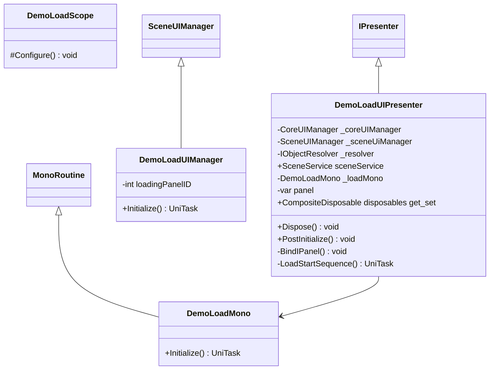

# Package `Haare/Demo/Script/LoadScene` UML Class Diagram

**소스 경로:** `Assets/Haare/Demo/Script/LoadScene`

### 📋 스크립트 클래스 명세

#### `DemoLoadMono` (class)
- **경로:** `Haare/Demo/Script/LoadScene/DemoLoadMono.cs`
- **상속/인터페이스:** `MonoRoutine`
- **함수:**
  - `+Initialize() UniTask`

#### `DemoLoadScope` (class)
- **경로:** `Haare/Demo/Script/LoadScene/DemoLoadScope.cs`
- **상속/인터페이스:** `LifetimeScope`
- **함수:**
  - `#Configure() void`

#### `DemoLoadUIManager` (class)
- **경로:** `Haare/Demo/Script/LoadScene/DemoLoadUIManager.cs`
- **상속/인터페이스:** `SceneUIManager`
- **변수/프로퍼티:**
  - `-int loadingPanelID`
- **함수:**
  - `+Initialize() UniTask`

#### `DemoLoadUIPresenter` (class)
- **경로:** `Haare/Demo/Script/LoadScene/DemoLoadUIPresenter.cs`
- **상속/인터페이스:** `IPresenter`
- **변수/프로퍼티:**
  - `-CoreUIManager _coreUIManager`
  - `-SceneUIManager _sceneUiManager`
  - `-IObjectResolver _resolver`
  - `+SceneService sceneService`
  - `-DemoLoadMono _loadMono`
  - `-var panel`
  - `+CompositeDisposable disposables get_set`
- **함수:**
  - `+Dispose() void`
  - `+PostInitialize() void`
  - `-BindIPanel() void`
  - `-LoadStartSequence() UniTask`

