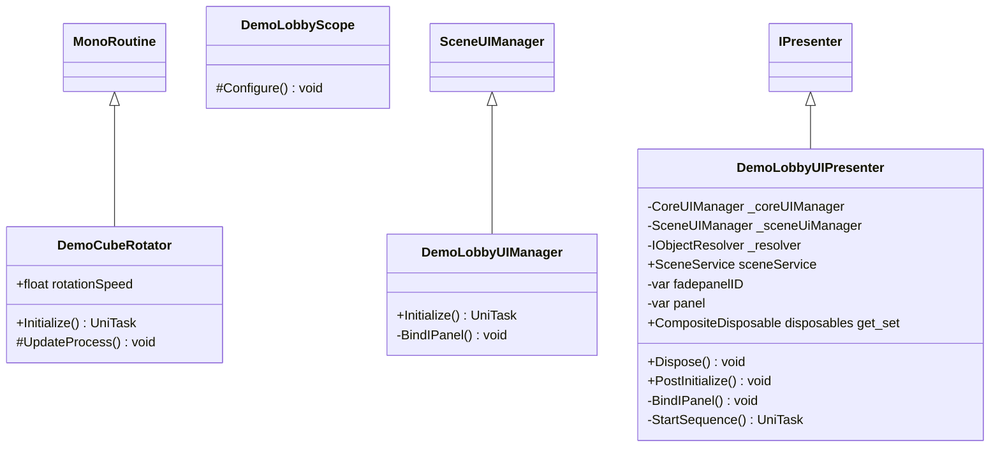

# Package `Haare/Demo/Script/LobbyScene` UML Class Diagram

**소스 경로:** `Assets/Haare/Demo/Script/LobbyScene`

### 📋 스크립트 클래스 명세

#### `DemoCubeRotator` (class)
- **경로:** `Haare/Demo/Script/LobbyScene/DemoCubeRotator.cs`
- **상속/인터페이스:** `MonoRoutine`
- **변수/프로퍼티:**
  - `+float rotationSpeed`
- **함수:**
  - `+Initialize() UniTask`
  - `#UpdateProcess() void`

#### `DemoLobbyScope` (class)
- **경로:** `Haare/Demo/Script/LobbyScene/DemoLobbyScope.cs`
- **상속/인터페이스:** `LifetimeScope`
- **함수:**
  - `#Configure() void`

#### `DemoLobbyUIManager` (class)
- **경로:** `Haare/Demo/Script/LobbyScene/DemoLobbyUIManager.cs`
- **상속/인터페이스:** `SceneUIManager`
- **함수:**
  - `+Initialize() UniTask`
  - `-BindIPanel() void`

#### `DemoLobbyUIPresenter` (class)
- **경로:** `Haare/Demo/Script/LobbyScene/DemoLobbyUIPresenter.cs`
- **상속/인터페이스:** `IPresenter`
- **변수/프로퍼티:**
  - `-CoreUIManager _coreUIManager`
  - `-SceneUIManager _sceneUiManager`
  - `-IObjectResolver _resolver`
  - `+SceneService sceneService`
  - `-var fadepanelID`
  - `-var panel`
  - `+CompositeDisposable disposables get_set`
- **함수:**
  - `+Dispose() void`
  - `+PostInitialize() void`
  - `-BindIPanel() void`
  - `-StartSequence() UniTask`

