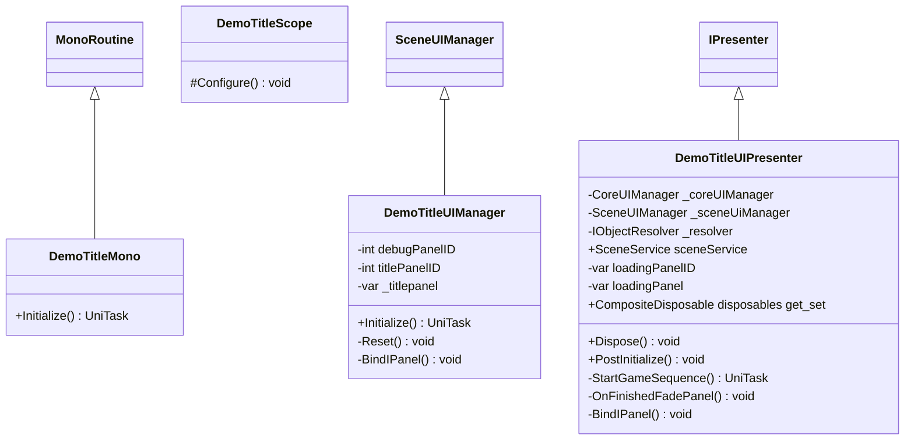

# Package `Haare/Demo/Script/TitleScene` UML Class Diagram

**소스 경로:** `Assets/Haare/Demo/Script/TitleScene`

### 📋 스크립트 클래스 명세

#### `DemoTitleMono` (class)
- **경로:** `Haare/Demo/Script/TitleScene/DemoTitleMono.cs`
- **상속/인터페이스:** `MonoRoutine`
- **함수:**
  - `+Initialize() UniTask`

#### `DemoTitleScope` (class)
- **경로:** `Haare/Demo/Script/TitleScene/DemoTitleScope.cs`
- **상속/인터페이스:** `LifetimeScope`
- **함수:**
  - `#Configure() void`

#### `DemoTitleUIManager` (class)
- **경로:** `Haare/Demo/Script/TitleScene/DemoTitleUIManager.cs`
- **상속/인터페이스:** `SceneUIManager`
- **변수/프로퍼티:**
  - `-int debugPanelID`
  - `-int titlePanelID`
  - `-var _titlepanel`
- **함수:**
  - `+Initialize() UniTask`
  - `-Reset() void`
  - `-BindIPanel() void`

#### `DemoTitleUIPresenter` (class)
- **경로:** `Haare/Demo/Script/TitleScene/DemoTitleUIPresenter.cs`
- **상속/인터페이스:** `IPresenter`
- **변수/프로퍼티:**
  - `-CoreUIManager _coreUIManager`
  - `-SceneUIManager _sceneUiManager`
  - `-IObjectResolver _resolver`
  - `+SceneService sceneService`
  - `-var loadingPanelID`
  - `-var loadingPanel`
  - `+CompositeDisposable disposables get_set`
- **함수:**
  - `+Dispose() void`
  - `+PostInitialize() void`
  - `-StartGameSequence() UniTask`
  - `-OnFinishedFadePanel() void`
  - `-BindIPanel() void`

