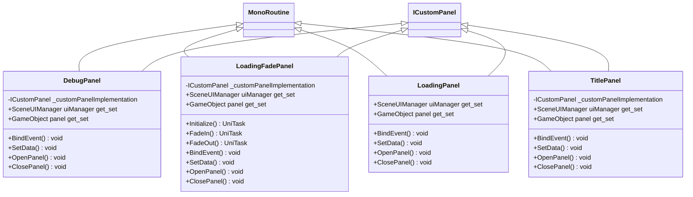

# Package `Haare/Demo/Script/UI` UML Class Diagram

**소스 경로:** `Assets/Haare/Demo/Script/UI`

### 📋 스크립트 클래스 명세

#### `DebugPanel` (class)
- **경로:** `Haare/Demo/Script/UI/DebugPanel.cs`
- **상속/인터페이스:** `MonoRoutine, ICustomPanel`
- **변수/프로퍼티:**
  - `-ICustomPanel _customPanelImplementation`
  - `+SceneUIManager uiManager get_set`
  - `+GameObject panel get_set`
- **함수:**
  - `+BindEvent() void`
  - `+BindEvent() void`
  - `+SetData() void`
  - `+OpenPanel() void`
  - `+ClosePanel() void`

#### `LoadingFadePanel` (class)
- **경로:** `Haare/Demo/Script/UI/LoadingFadePanel.cs`
- **상속/인터페이스:** `MonoRoutine, ICustomPanel`
- **변수/프로퍼티:**
  - `-ICustomPanel _customPanelImplementation`
  - `+SceneUIManager uiManager get_set`
  - `+GameObject panel get_set`
- **함수:**
  - `+Initialize() UniTask`
  - `+FadeIn() UniTask`
  - `+FadeOut() UniTask`
  - `+BindEvent() void`
  - `+BindEvent() void`
  - `+SetData() void`
  - `+OpenPanel() void`
  - `+ClosePanel() void`

#### `LoadingPanel` (class)
- **경로:** `Haare/Demo/Script/UI/LoadingPanel.cs`
- **상속/인터페이스:** `MonoRoutine, ICustomPanel`
- **변수/프로퍼티:**
  - `+SceneUIManager uiManager get_set`
  - `+GameObject panel get_set`
- **함수:**
  - `+BindEvent() void`
  - `+SetData() void`
  - `+OpenPanel() void`
  - `+ClosePanel() void`

#### `TitlePanel` (class)
- **경로:** `Haare/Demo/Script/UI/TitlePanel.cs`
- **상속/인터페이스:** `MonoRoutine, ICustomPanel`
- **변수/프로퍼티:**
  - `-ICustomPanel _customPanelImplementation`
  - `+SceneUIManager uiManager get_set`
  - `+GameObject panel get_set`
- **함수:**
  - `+BindEvent() void`
  - `+BindEvent() void`
  - `+SetData() void`
  - `+OpenPanel() void`
  - `+ClosePanel() void`

