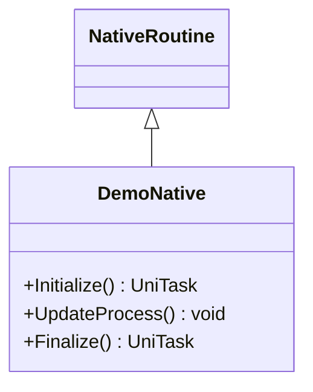

# Package `Haare/Demo/Script` UML Class Diagram

**소스 경로:** `Assets/Haare/Demo/Script`

### 📋 스크립트 클래스 명세

#### `DemoNative` (class)
- **경로:** `Haare/Demo/Script/DemoNative.cs`
- **상속/인터페이스:** `NativeRoutine`
- **함수:**
  - `+Initialize() UniTask`
  - `+UpdateProcess() void`
  - `+Finalize() UniTask`

