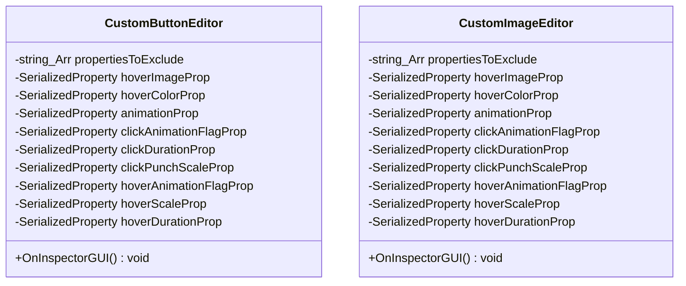

# Package `Haare/Editor/UI` UML Class Diagram

**소스 경로:** `Assets/Haare/Editor/UI`

### 📋 스크립트 클래스 명세

#### `CustomButtonEditor` (class)
- **경로:** `Haare/Editor/UI/AnimationUIEditor.cs`
- **상속/인터페이스:** `UnityEditor.Editor`
- **변수/프로퍼티:**
  - `-string_Arr propertiesToExclude`
  - `-SerializedProperty hoverImageProp`
  - `-SerializedProperty hoverColorProp`
  - `-SerializedProperty animationProp`
  - `-SerializedProperty clickAnimationFlagProp`
  - `-SerializedProperty clickDurationProp`
  - `-SerializedProperty clickPunchScaleProp`
  - `-SerializedProperty hoverAnimationFlagProp`
  - `-SerializedProperty hoverScaleProp`
  - `-SerializedProperty hoverDurationProp`
  - `-string_Arr propertiesToExclude`
  - `-SerializedProperty animationProp`
  - `-SerializedProperty animationSlideProp`
  - `-SerializedProperty animationPopupProp`
  - `-SerializedProperty slideDurationProp`
- **함수:**
  - `+OnInspectorGUI() void`
  - `+OnInspectorGUI() void`

#### `CustomImageEditor` (class)
- **경로:** `Haare/Editor/UI/AnimationUIEditor.cs`
- **상속/인터페이스:** `UnityEditor.Editor`
- **변수/프로퍼티:**
  - `-string_Arr propertiesToExclude`
  - `-SerializedProperty hoverImageProp`
  - `-SerializedProperty hoverColorProp`
  - `-SerializedProperty animationProp`
  - `-SerializedProperty clickAnimationFlagProp`
  - `-SerializedProperty clickDurationProp`
  - `-SerializedProperty clickPunchScaleProp`
  - `-SerializedProperty hoverAnimationFlagProp`
  - `-SerializedProperty hoverScaleProp`
  - `-SerializedProperty hoverDurationProp`
  - `-string_Arr propertiesToExclude`
  - `-SerializedProperty animationProp`
  - `-SerializedProperty animationSlideProp`
  - `-SerializedProperty animationPopupProp`
  - `-SerializedProperty slideDurationProp`
- **함수:**
  - `+OnInspectorGUI() void`
  - `+OnInspectorGUI() void`

