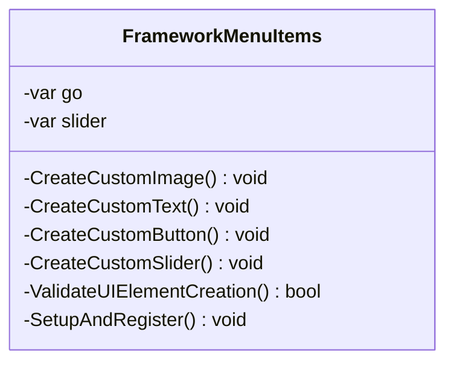

# Package `Haare/Editor` UML Class Diagram

**소스 경로:** `Assets/Haare/Editor`

### 📋 스크립트 클래스 명세

#### `FrameworkMenuItems` (class)
- **경로:** `Haare/Editor/HaareUI.cs`
- **변수/프로퍼티:**
  - `-var go`
  - `-var go`
  - `-var go`
  - `-var go`
  - `-var slider`
- **함수:**
  - `-CreateCustomImage() void`
  - `-CreateCustomText() void`
  - `-CreateCustomButton() void`
  - `-CreateCustomSlider() void`
  - `-ValidateUIElementCreation() bool`
  - `-SetupAndRegister() void`

