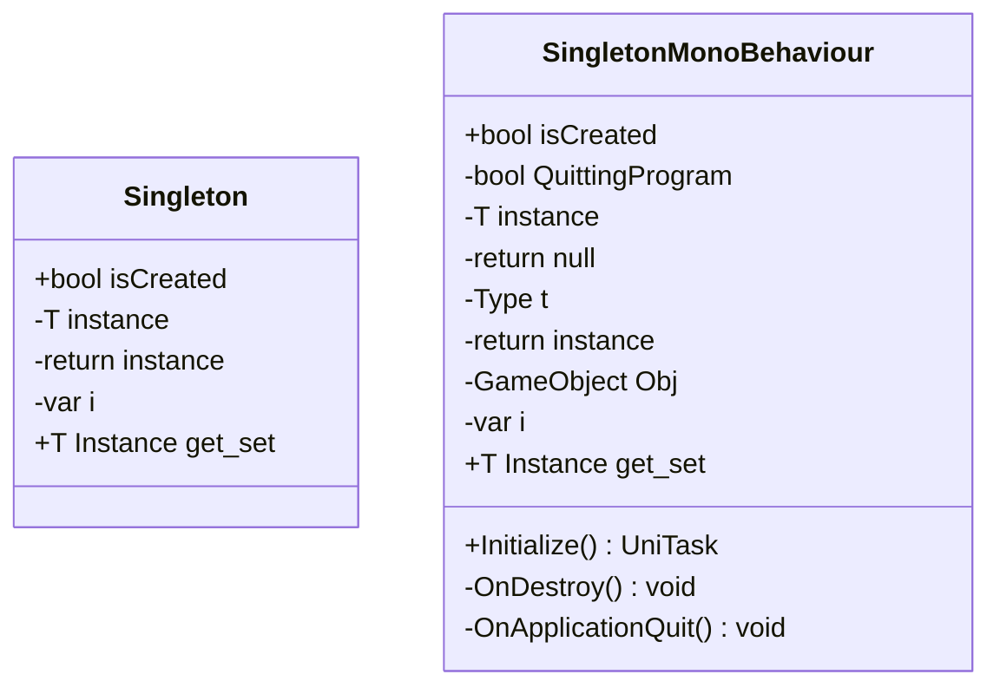

# Package `Haare/Scripts/Client/Core/Singleton` UML Class Diagram

**소스 경로:** `Assets/Haare/Scripts/Client/Core/Singleton`

### 📋 스크립트 클래스 명세

#### `Singleton` (class)
- **경로:** `Haare/Scripts/Client/Core/Singleton/Singleton.cs`
- **변수/프로퍼티:**
  - `+bool isCreated`
  - `-T instance`
  - `-return instance`
  - `-var i`
  - `+T Instance get_set`

#### `SingletonMonoBehaviour` (class)
- **경로:** `Haare/Scripts/Client/Core/Singleton/SingletonMono.cs`
- **변수/프로퍼티:**
  - `+bool isCreated`
  - `-bool QuittingProgram`
  - `-T instance`
  - `-return null`
  - `-Type t`
  - `-return instance`
  - `-Type t`
  - `-GameObject Obj`
  - `-var i`
  - `+T Instance get_set`
- **함수:**
  - `+Initialize() UniTask`
  - `-OnDestroy() void`
  - `-OnApplicationQuit() void`

