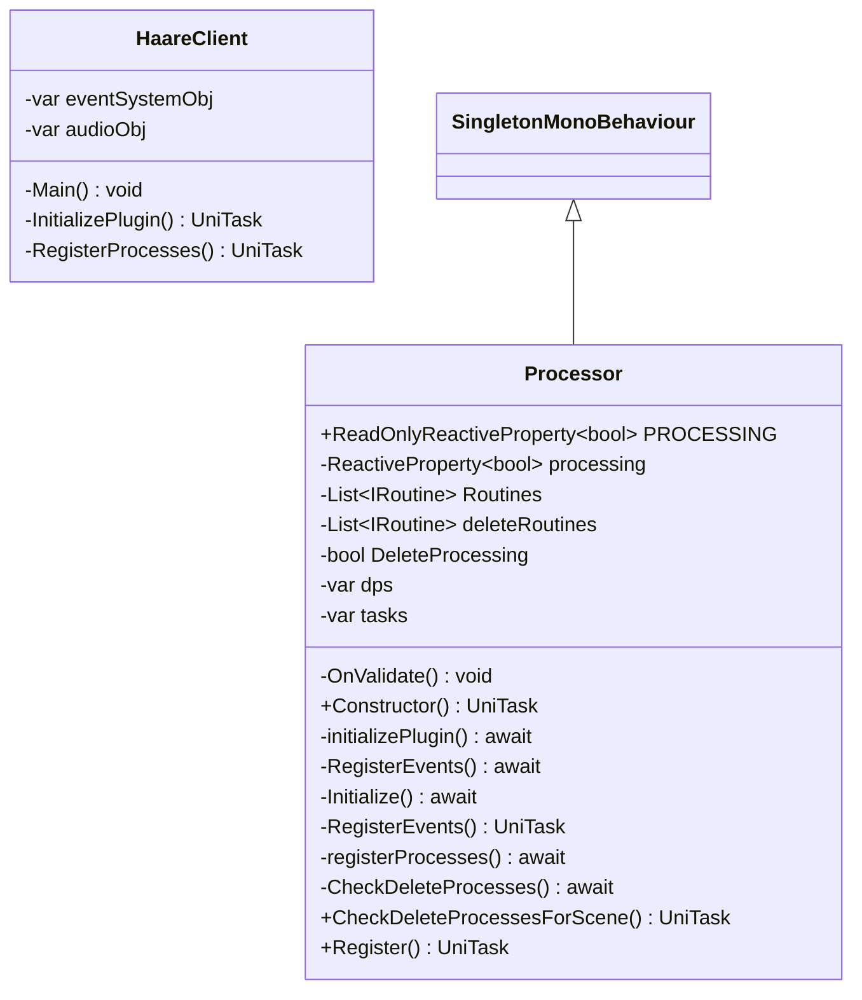

# Package `Haare/Scripts/Client/Core` UML Class Diagram

**소스 경로:** `Assets/Haare/Scripts/Client/Core`

### 📋 스크립트 클래스 명세

#### `HaareClient` (class)
- **경로:** `Haare/Scripts/Client/Core/HaareClient.cs`
- **변수/프로퍼티:**
  - `-var eventSystemObj`
  - `-var audioObj`
- **함수:**
  - `-Main() void`
  - `-InitializePlugin() UniTask`
  - `-RegisterProcesses() UniTask`

#### `Processor` (class)
- **경로:** `Haare/Scripts/Client/Core/Processor.cs`
- **상속/인터페이스:** `SingletonMonoBehaviour`
- **변수/프로퍼티:**
  - `+ReadOnlyReactiveProperty~bool~ PROCESSING`
  - `-ReactiveProperty~bool~ processing`
  - `-List~IRoutine~ Routines`
  - `-List~IRoutine~ deleteRoutines`
  - `-bool DeleteProcessing`
  - `-var dps`
  - `-var tasks`
- **함수:**
  - `-OnValidate() void`
  - `+Constructor() UniTask`
  - `-initializePlugin() await`
  - `-RegisterEvents() await`
  - `-Initialize() await`
  - `-RegisterEvents() UniTask`
  - `-registerProcesses() await`
  - `-CheckDeleteProcesses() await`
  - `+CheckDeleteProcessesForScene() UniTask`
  - `+Register() UniTask`
  - `+UnRegister() void`
  - `-CheckDeleteProcesses() UniTask`
  - `-OnApplicationQuit() void`
  - `-OnApplicationPause() void`

