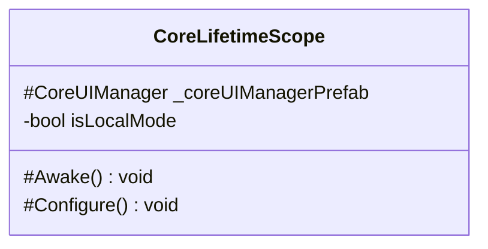

# Package `Haare/Scripts/Client/DI/Container` UML Class Diagram

**소스 경로:** `Assets/Haare/Scripts/Client/DI/Container`

### 📋 스크립트 클래스 명세

#### `CoreLifetimeScope` (class)
- **경로:** `Haare/Scripts/Client/DI/Container/CoreLifetimeScope.cs`
- **상속/인터페이스:** `LifetimeScope`
- **변수/프로퍼티:**
  - `#CoreUIManager _coreUIManagerPrefab`
  - `-bool isLocalMode`
- **함수:**
  - `#Awake() void`
  - `#Configure() void`

