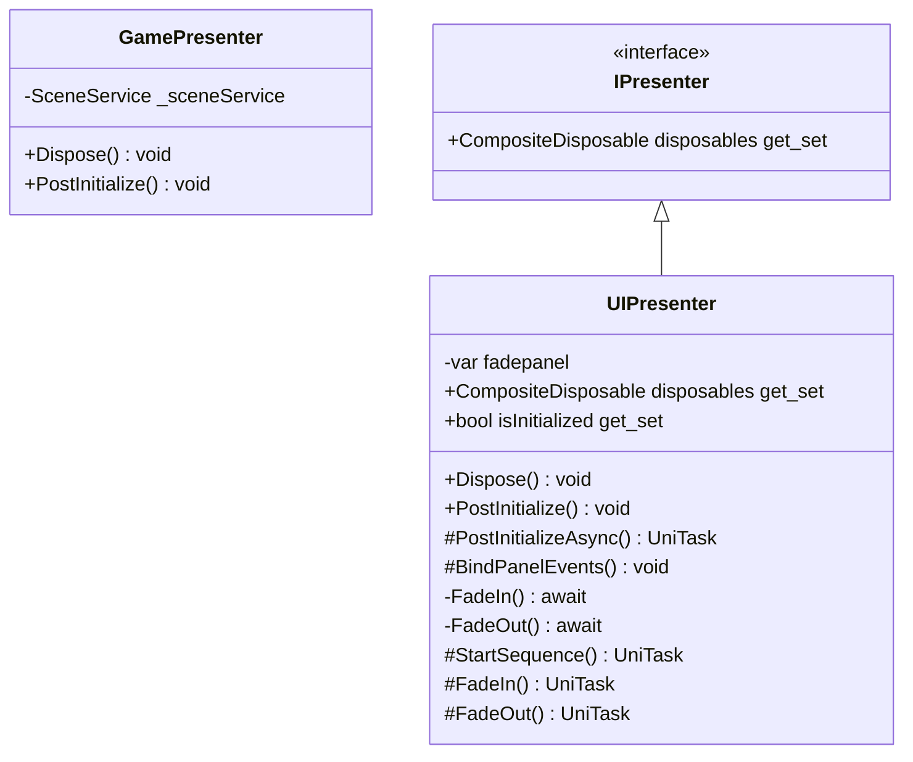

# Package `Haare/Scripts/Client/DI/Presenter` UML Class Diagram

**소스 경로:** `Assets/Haare/Scripts/Client/DI/Presenter`

### 📋 스크립트 클래스 명세

#### `GamePresenter` (class)
- **경로:** `Haare/Scripts/Client/DI/Presenter/GamePresenter.cs`
- **상속/인터페이스:** `IPostInitializable, IDisposable`
- **변수/프로퍼티:**
  - `-SceneService _sceneService`
- **함수:**
  - `+Dispose() void`
  - `+PostInitialize() void`

#### `IPresenter` (interface)
- **경로:** `Haare/Scripts/Client/DI/Presenter/IPresenter.cs`
- **상속/인터페이스:** `IPostInitializable, IDisposable`
- **변수/프로퍼티:**
  - `+CompositeDisposable disposables get_set`

#### `UIPresenter` (class)
- **경로:** `Haare/Scripts/Client/DI/Presenter/UIPresenter.cs`
- **상속/인터페이스:** `IPresenter`
- **변수/프로퍼티:**
  - `-var fadepanel`
  - `-var fadepanel`
  - `+CompositeDisposable disposables get_set`
  - `+bool isInitialized get_set`
- **함수:**
  - `+Dispose() void`
  - `+PostInitialize() void`
  - `#PostInitializeAsync() UniTask`
  - `#BindPanelEvents() void`
  - `-FadeIn() await`
  - `-FadeOut() await`
  - `-FadeIn() await`
  - `-FadeOut() await`
  - `#StartSequence() UniTask`
  - `-FadeOut() await`
  - `#FadeIn() UniTask`
  - `#FadeOut() UniTask`

