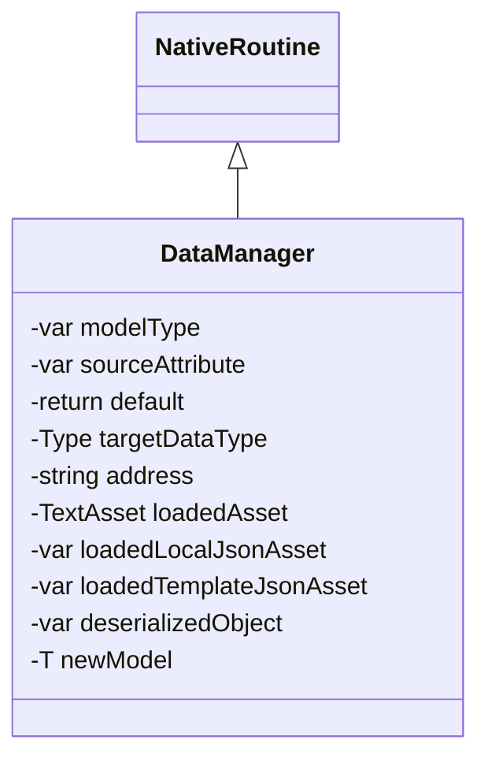

# Package `Haare/Scripts/Client/Data` UML Class Diagram

**소스 경로:** `Assets/Haare/Scripts/Client/Data`

### 📋 스크립트 클래스 명세

#### `DataManager` (class)
- **경로:** `Haare/Scripts/Client/Data/DataManager.cs`
- **상속/인터페이스:** `NativeRoutine`
- **변수/프로퍼티:**
  - `-var modelType`
  - `-var sourceAttribute`
  - `-return default`
  - `-Type targetDataType`
  - `-string address`
  - `-TextAsset loadedAsset`
  - `-var loadedLocalJsonAsset`
  - `-var loadedTemplateJsonAsset`
  - `-return default`
  - `-var deserializedObject`
  - `-T newModel`
  - `-var constructor`
  - `-return default`
  - `-return default`
  - `-return newModel`

