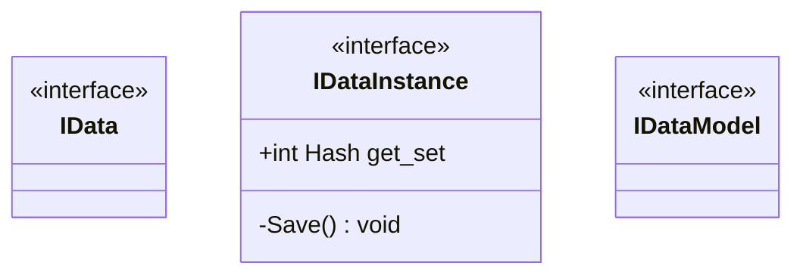

# Package `Haare/Scripts/Client/Data/interface` UML Class Diagram

**소스 경로:** `Assets/Haare/Scripts/Client/Data/interface`

### 📋 스크립트 클래스 명세

#### `IData` (interface)
- **경로:** `Haare/Scripts/Client/Data/interface/IData.cs`

#### `IDataInstance` (interface)
- **경로:** `Haare/Scripts/Client/Data/interface/IDataInstance.cs`
- **변수/프로퍼티:**
  - `+int Hash get_set`
- **함수:**
  - `-Save() void`

#### `IDataModel` (interface)
- **경로:** `Haare/Scripts/Client/Data/interface/IDataModel.cs`

