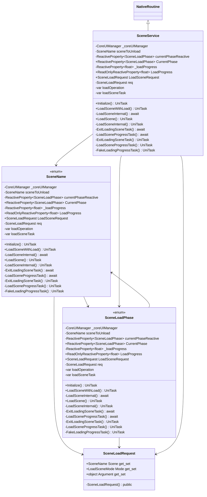

# Package `Haare/Scripts/Client/Routine/Service/SceneService` UML Class Diagram

**소스 경로:** `Assets/Haare/Scripts/Client/Routine/Service/SceneService`

### 📋 스크립트 클래스 명세

#### `SceneLoadRequest` (class)
- **경로:** `Haare/Scripts/Client/Routine/Service/SceneService/SceneLoadRequest.cs`
- **변수/프로퍼티:**
  - `+SceneName Scene get_set`
  - `+LoadSceneMode Mode get_set`
  - `+object Argument get_set`
- **함수:**
  - `-SceneLoadRequest() public`

#### `SceneName` (enum)
- **경로:** `Haare/Scripts/Client/Routine/Service/SceneService/SceneService.cs`
- **변수/프로퍼티:**
  - `-CoreUIManager _coreUIManager`
  - `-SceneName sceneToUnload`
  - `-ReactiveProperty~SceneLoadPhase~ currentPhaseReactive`
  - `+ReactiveProperty~SceneLoadPhase~ CurrentPhase`
  - `-ReactiveProperty~float~ _loadProgress`
  - `+ReadOnlyReactiveProperty~float~ LoadProgress`
  - `+SceneLoadRequest LoadSceneRequest`
  - `-SceneLoadRequest req`
  - `-var loadOperation`
  - `-var loadSceneTask`
  - `-var minTimeTask`
  - `-var sceneInstance`
  - `-var loadingPanelID`
  - `-var loadingPanel`
  - `-var progress`
- **함수:**
  - `+Initialize() UniTask`
  - `+LoadSceneWithLoad() UniTask`
  - `-LoadSceneInternal() await`
  - `+LoadScene() UniTask`
  - `-LoadSceneInternal() await`
  - `+LoadScene() UniTask`
  - `-LoadSceneInternal() await`
  - `-LoadSceneInternal() UniTask`
  - `-ExitLoadingSceneTask() await`
  - `-LoadSceneProgressTask() await`
  - `-ExitLoadingSceneTask() UniTask`
  - `-LoadSceneProgressTask() UniTask`
  - `-FakeLoadingProgressTask() UniTask`
  - `-OnSceneLoadedHandler() void`

#### `SceneLoadPhase` (enum)
- **경로:** `Haare/Scripts/Client/Routine/Service/SceneService/SceneService.cs`
- **변수/프로퍼티:**
  - `-CoreUIManager _coreUIManager`
  - `-SceneName sceneToUnload`
  - `-ReactiveProperty~SceneLoadPhase~ currentPhaseReactive`
  - `+ReactiveProperty~SceneLoadPhase~ CurrentPhase`
  - `-ReactiveProperty~float~ _loadProgress`
  - `+ReadOnlyReactiveProperty~float~ LoadProgress`
  - `+SceneLoadRequest LoadSceneRequest`
  - `-SceneLoadRequest req`
  - `-var loadOperation`
  - `-var loadSceneTask`
  - `-var minTimeTask`
  - `-var sceneInstance`
  - `-var loadingPanelID`
  - `-var loadingPanel`
  - `-var progress`
- **함수:**
  - `+Initialize() UniTask`
  - `+LoadSceneWithLoad() UniTask`
  - `-LoadSceneInternal() await`
  - `+LoadScene() UniTask`
  - `-LoadSceneInternal() await`
  - `+LoadScene() UniTask`
  - `-LoadSceneInternal() await`
  - `-LoadSceneInternal() UniTask`
  - `-ExitLoadingSceneTask() await`
  - `-LoadSceneProgressTask() await`
  - `-ExitLoadingSceneTask() UniTask`
  - `-LoadSceneProgressTask() UniTask`
  - `-FakeLoadingProgressTask() UniTask`
  - `-OnSceneLoadedHandler() void`

#### `SceneService` (class)
- **경로:** `Haare/Scripts/Client/Routine/Service/SceneService/SceneService.cs`
- **상속/인터페이스:** `NativeRoutine`
- **변수/프로퍼티:**
  - `-CoreUIManager _coreUIManager`
  - `-SceneName sceneToUnload`
  - `-ReactiveProperty~SceneLoadPhase~ currentPhaseReactive`
  - `+ReactiveProperty~SceneLoadPhase~ CurrentPhase`
  - `-ReactiveProperty~float~ _loadProgress`
  - `+ReadOnlyReactiveProperty~float~ LoadProgress`
  - `+SceneLoadRequest LoadSceneRequest`
  - `-SceneLoadRequest req`
  - `-var loadOperation`
  - `-var loadSceneTask`
  - `-var minTimeTask`
  - `-var sceneInstance`
  - `-var loadingPanelID`
  - `-var loadingPanel`
  - `-var progress`
- **함수:**
  - `+Initialize() UniTask`
  - `+LoadSceneWithLoad() UniTask`
  - `-LoadSceneInternal() await`
  - `+LoadScene() UniTask`
  - `-LoadSceneInternal() await`
  - `+LoadScene() UniTask`
  - `-LoadSceneInternal() await`
  - `-LoadSceneInternal() UniTask`
  - `-ExitLoadingSceneTask() await`
  - `-LoadSceneProgressTask() await`
  - `-ExitLoadingSceneTask() UniTask`
  - `-LoadSceneProgressTask() UniTask`
  - `-FakeLoadingProgressTask() UniTask`
  - `-OnSceneLoadedHandler() void`

