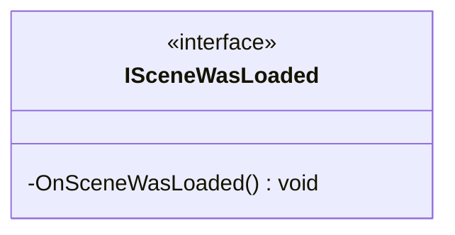

# Package `Haare/Scripts/Client/Routine/Service/SceneService/interface` UML Class Diagram

**소스 경로:** `Assets/Haare/Scripts/Client/Routine/Service/SceneService/interface`

### 📋 스크립트 클래스 명세

#### `ISceneWasLoaded` (interface)
- **경로:** `Haare/Scripts/Client/Routine/Service/SceneService/interface/ISceneWasLoaded.cs`
- **상속/인터페이스:** `IEventSystemHandler`
- **함수:**
  - `-OnSceneWasLoaded() void`

