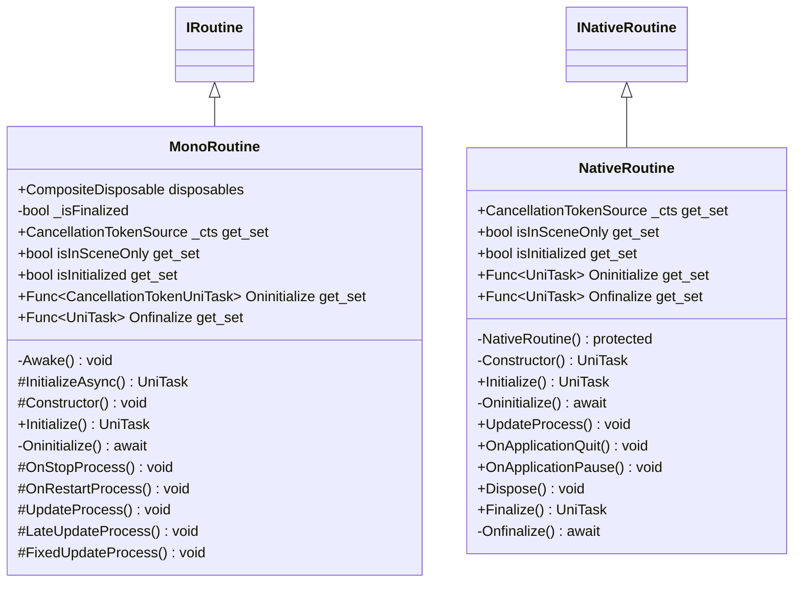

# Package `Haare/Scripts/Client/Routine` UML Class Diagram

**소스 경로:** `Assets/Haare/Scripts/Client/Routine`

### 📋 스크립트 클래스 명세

#### `MonoRoutine` (class)
- **경로:** `Haare/Scripts/Client/Routine/MonoRoutine.cs`
- **상속/인터페이스:** `MonoBehaviour, IRoutine`
- **변수/프로퍼티:**
  - `+CompositeDisposable disposables`
  - `-bool _isFinalized`
  - `+CancellationTokenSource _cts get_set`
  - `+bool isInSceneOnly get_set`
  - `+bool isInitialized get_set`
  - `+Func~CancellationTokenUniTask~ Oninitialize get_set`
  - `+Func~UniTask~ Onfinalize get_set`
- **함수:**
  - `-Awake() void`
  - `#InitializeAsync() UniTask`
  - `#Constructor() void`
  - `+Initialize() UniTask`
  - `-Oninitialize() await`
  - `#OnStopProcess() void`
  - `#OnRestartProcess() void`
  - `#UpdateProcess() void`
  - `#LateUpdateProcess() void`
  - `#FixedUpdateProcess() void`
  - `+Finalize() UniTask`
  - `-Onfinalize() await`
  - `-OnApplicationQuit() void`
  - `-OnDestroy() void`

#### `NativeRoutine` (class)
- **경로:** `Haare/Scripts/Client/Routine/NativeRoutine.cs`
- **상속/인터페이스:** `INativeRoutine, IDisposable`
- **변수/프로퍼티:**
  - `+CancellationTokenSource _cts get_set`
  - `+bool isInSceneOnly get_set`
  - `+bool isInitialized get_set`
  - `+Func~UniTask~ Oninitialize get_set`
  - `+Func~UniTask~ Onfinalize get_set`
- **함수:**
  - `-NativeRoutine() protected`
  - `-Constructor() UniTask`
  - `+Initialize() UniTask`
  - `-Oninitialize() await`
  - `+UpdateProcess() void`
  - `+OnApplicationQuit() void`
  - `+OnApplicationPause() void`
  - `+Dispose() void`
  - `+Finalize() UniTask`
  - `-Onfinalize() await`

