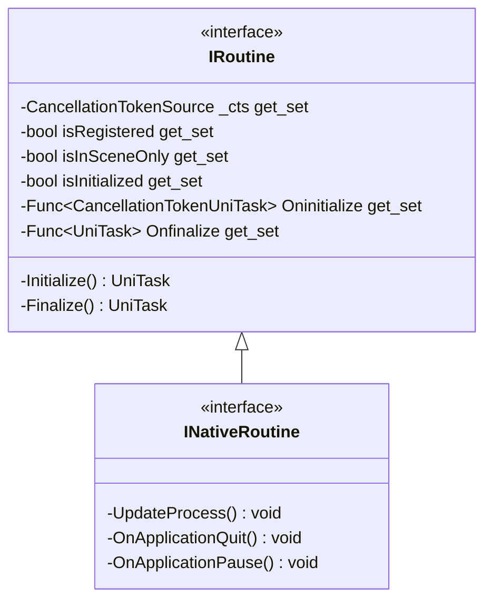

# Package `Haare/Scripts/Client/Routine/interface` UML Class Diagram

**소스 경로:** `Assets/Haare/Scripts/Client/Routine/interface`

### 📋 스크립트 클래스 명세

#### `INativeRoutine` (interface)
- **경로:** `Haare/Scripts/Client/Routine/interface/INativeRoutine.cs`
- **상속/인터페이스:** `IRoutine`
- **함수:**
  - `-UpdateProcess() void`
  - `-OnApplicationQuit() void`
  - `-OnApplicationPause() void`

#### `IRoutine` (interface)
- **경로:** `Haare/Scripts/Client/Routine/interface/IRoutine.cs`
- **변수/프로퍼티:**
  - `-CancellationTokenSource _cts get_set`
  - `-bool isRegistered get_set`
  - `-bool isInSceneOnly get_set`
  - `-bool isInitialized get_set`
  - `-Func~CancellationTokenUniTask~ Oninitialize get_set`
  - `-Func~UniTask~ Onfinalize get_set`
- **함수:**
  - `-Initialize() UniTask`
  - `-Finalize() UniTask`

