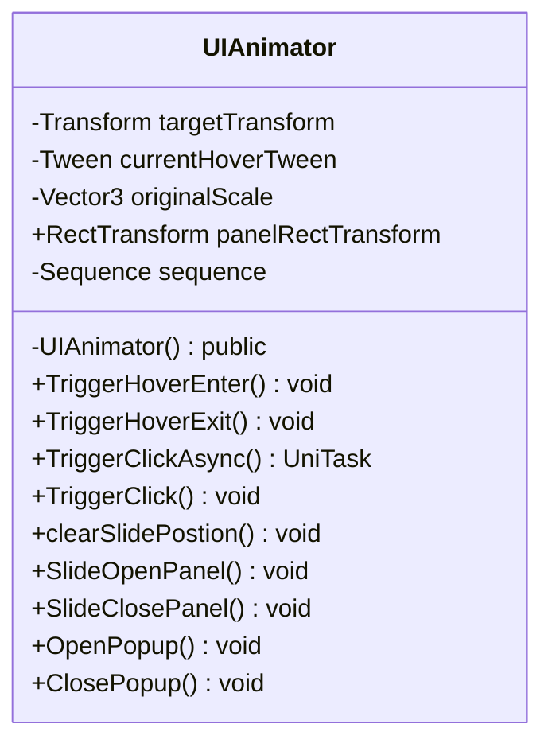

# Package `Haare/Scripts/Client/UI/Animator` UML Class Diagram

**소스 경로:** `Assets/Haare/Scripts/Client/UI/Animator`

### 📋 스크립트 클래스 명세

#### `UIAnimator` (class)
- **경로:** `Haare/Scripts/Client/UI/Animator/TweenUI.cs`
- **변수/프로퍼티:**
  - `-Transform targetTransform`
  - `-Tween currentHoverTween`
  - `-Vector3 originalScale`
  - `+RectTransform panelRectTransform`
  - `-Sequence sequence`
  - `-Sequence sequence`
- **함수:**
  - `-UIAnimator() public`
  - `+TriggerHoverEnter() void`
  - `+TriggerHoverExit() void`
  - `+TriggerClickAsync() UniTask`
  - `+TriggerClick() void`
  - `+clearSlidePostion() void`
  - `+SlideOpenPanel() void`
  - `+SlideClosePanel() void`
  - `+OpenPopup() void`
  - `+ClosePopup() void`
  - `+KillAllTweens() void`

