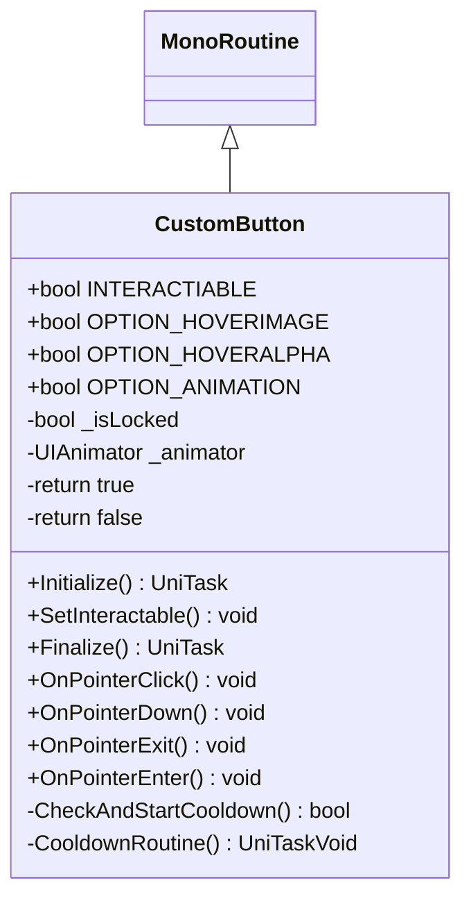

# Package `Haare/Scripts/Client/UI/Button` UML Class Diagram

**소스 경로:** `Assets/Haare/Scripts/Client/UI/Button`

### 📋 스크립트 클래스 명세

#### `CustomButton` (class)
- **경로:** `Haare/Scripts/Client/UI/Button/CustomButton.cs`
- **상속/인터페이스:** `MonoRoutine`
- **변수/프로퍼티:**
  - `+bool INTERACTIABLE`
  - `+bool OPTION_HOVERIMAGE`
  - `+bool OPTION_HOVERALPHA`
  - `+bool OPTION_ANIMATION`
  - `-bool _isLocked`
  - `-UIAnimator _animator`
  - `-return true`
  - `-return false`
- **함수:**
  - `+Initialize() UniTask`
  - `+SetInteractable() void`
  - `+Finalize() UniTask`
  - `+OnPointerClick() void`
  - `+OnPointerDown() void`
  - `+OnPointerExit() void`
  - `+OnPointerEnter() void`
  - `-CheckAndStartCooldown() bool`
  - `-CooldownRoutine() UniTaskVoid`

