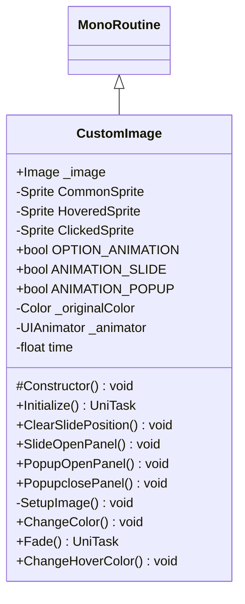

# Package `Haare/Scripts/Client/UI/Image` UML Class Diagram

**소스 경로:** `Assets/Haare/Scripts/Client/UI/Image`

### 📋 스크립트 클래스 명세

#### `CustomImage` (class)
- **경로:** `Haare/Scripts/Client/UI/Image/CustomImage.cs`
- **상속/인터페이스:** `MonoRoutine`
- **변수/프로퍼티:**
  - `+Image _image`
  - `-Sprite CommonSprite`
  - `-Sprite HoveredSprite`
  - `-Sprite ClickedSprite`
  - `+bool OPTION_ANIMATION`
  - `+bool ANIMATION_SLIDE`
  - `+bool ANIMATION_POPUP`
  - `-Color _originalColor`
  - `-UIAnimator _animator`
  - `-float time`
  - `-float progress`
- **함수:**
  - `#Constructor() void`
  - `+Initialize() UniTask`
  - `+ClearSlidePosition() void`
  - `+SlideOpenPanel() void`
  - `+PopupOpenPanel() void`
  - `+PopupclosePanel() void`
  - `-SetupImage() void`
  - `+ChangeColor() void`
  - `+Fade() UniTask`
  - `+ChangeHoverColor() void`
  - `+ChangeClickedColor() void`
  - `+ChangeCommonColor() void`
  - `+ChangeAlpha() void`
  - `+ChangeCommonImage() void`
  - `+ChangeHoverImage() void`

