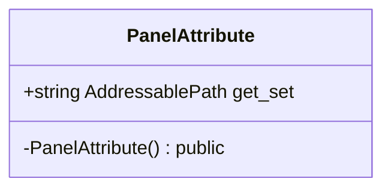

# Package `Haare/Scripts/Client/UI/Panel/Attribute` UML Class Diagram

**소스 경로:** `Assets/Haare/Scripts/Client/UI/Panel/Attribute`

### 📋 스크립트 클래스 명세

#### `PanelAttribute` (class)
- **경로:** `Haare/Scripts/Client/UI/Panel/Attribute/PanelAttribute.cs`
- **상속/인터페이스:** `Attribute`
- **변수/프로퍼티:**
  - `+string AddressablePath get_set`
- **함수:**
  - `-PanelAttribute() public`

