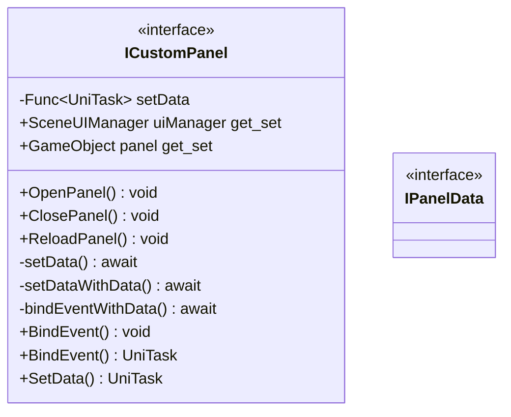

# Package `Haare/Scripts/Client/UI/Panel/interface` UML Class Diagram

**소스 경로:** `Assets/Haare/Scripts/Client/UI/Panel/interface`

### 📋 스크립트 클래스 명세

#### `ICustomPanel` (interface)
- **경로:** `Haare/Scripts/Client/UI/Panel/interface/ICustomPanel.cs`
- **변수/프로퍼티:**
  - `-Func~UniTask~ setData`
  - `-Func~UniTask~ setData`
  - `+SceneUIManager uiManager get_set`
  - `+GameObject panel get_set`
- **함수:**
  - `+OpenPanel() void`
  - `+ClosePanel() void`
  - `+ReloadPanel() void`
  - `-setData() await`
  - `-setData() await`
  - `-setDataWithData() await`
  - `-bindEventWithData() await`
  - `+BindEvent() void`
  - `+BindEvent() UniTask`
  - `+SetData() UniTask`
  - `+SetData() UniTask`

#### `IPanelData` (interface)
- **경로:** `Haare/Scripts/Client/UI/Panel/interface/IPanelData.cs`

