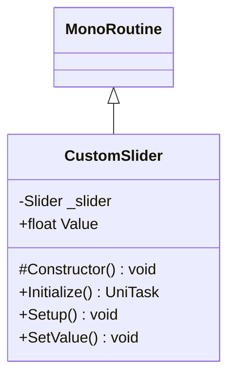

# Package `Haare/Scripts/Client/UI/Slider` UML Class Diagram

**소스 경로:** `Assets/Haare/Scripts/Client/UI/Slider`

### 📋 스크립트 클래스 명세

#### `CustomSlider` (class)
- **경로:** `Haare/Scripts/Client/UI/Slider/CustomSlider.cs`
- **상속/인터페이스:** `MonoRoutine`
- **변수/프로퍼티:**
  - `-Slider _slider`
  - `+float Value`
- **함수:**
  - `#Constructor() void`
  - `+Initialize() UniTask`
  - `+Setup() void`
  - `+SetValue() void`

