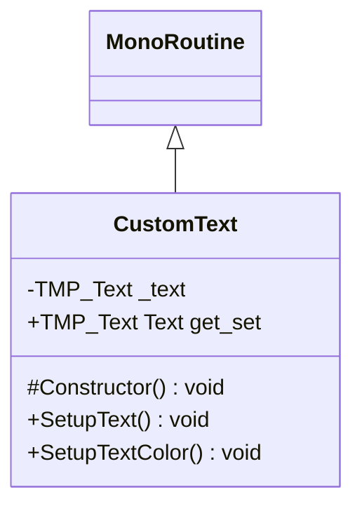

# Package `Haare/Scripts/Client/UI/Text` UML Class Diagram

**소스 경로:** `Assets/Haare/Scripts/Client/UI/Text`

### 📋 스크립트 클래스 명세

#### `CustomText` (class)
- **경로:** `Haare/Scripts/Client/UI/Text/CustomText.cs`
- **상속/인터페이스:** `MonoRoutine`
- **변수/프로퍼티:**
  - `-TMP_Text _text`
  - `+TMP_Text Text get_set`
- **함수:**
  - `#Constructor() void`
  - `+SetupText() void`
  - `+SetupTextColor() void`

