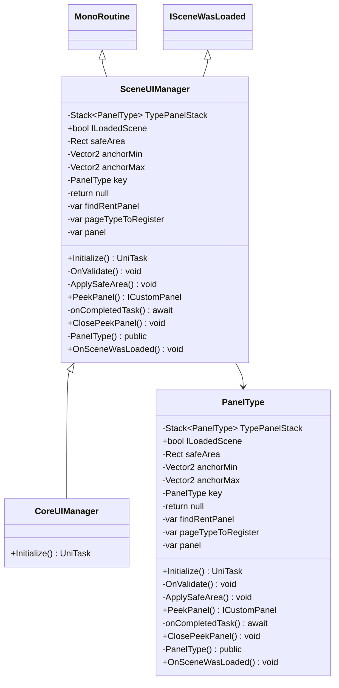

# Package `Haare/Scripts/Client/UI/UiManager` UML Class Diagram

**소스 경로:** `Assets/Haare/Scripts/Client/UI/UiManager`

### 📋 스크립트 클래스 명세

#### `CoreUIManager` (class)
- **경로:** `Haare/Scripts/Client/UI/UiManager/CoreUIManager.cs`
- **상속/인터페이스:** `SceneUIManager`
- **함수:**
  - `+Initialize() UniTask`

#### `SceneUIManager` (class)
- **경로:** `Haare/Scripts/Client/UI/UiManager/SceneUiManager.cs`
- **상속/인터페이스:** `MonoRoutine, ISceneWasLoaded`
- **변수/프로퍼티:**
  - `-Stack~PanelType~ TypePanelStack`
  - `+bool ILoadedScene`
  - `-Rect safeArea`
  - `-Vector2 anchorMin`
  - `-Vector2 anchorMax`
  - `-PanelType key`
  - `-return null`
  - `-var findRentPanel`
  - `-var pageTypeToRegister`
  - `-var panel`
  - `-var component`
  - `-return component`
  - `-return null`
  - `-Func~UniTask~ onCompletedTask`
  - `-var panel`
- **함수:**
  - `+Initialize() UniTask`
  - `-OnValidate() void`
  - `-ApplySafeArea() void`
  - `+PeekPanel() ICustomPanel`
  - `-onCompletedTask() await`
  - `-onCompletedTask() await`
  - `-onCompletedTask() await`
  - `-onCompletedTask() await`
  - `+ClosePeekPanel() void`
  - `-PanelType() public`
  - `+OnSceneWasLoaded() void`

#### `PanelType` (class)
- **경로:** `Haare/Scripts/Client/UI/UiManager/SceneUiManager.cs`
- **변수/프로퍼티:**
  - `-Stack~PanelType~ TypePanelStack`
  - `+bool ILoadedScene`
  - `-Rect safeArea`
  - `-Vector2 anchorMin`
  - `-Vector2 anchorMax`
  - `-PanelType key`
  - `-return null`
  - `-var findRentPanel`
  - `-var pageTypeToRegister`
  - `-var panel`
  - `-var component`
  - `-return component`
  - `-return null`
  - `-Func~UniTask~ onCompletedTask`
  - `-var panel`
- **함수:**
  - `+Initialize() UniTask`
  - `-OnValidate() void`
  - `-ApplySafeArea() void`
  - `+PeekPanel() ICustomPanel`
  - `-onCompletedTask() await`
  - `-onCompletedTask() await`
  - `-onCompletedTask() await`
  - `-onCompletedTask() await`
  - `+ClosePeekPanel() void`
  - `-PanelType() public`
  - `+OnSceneWasLoaded() void`

