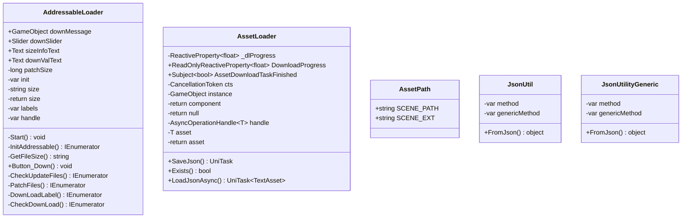

# Package `Haare/Scripts/Util/AssetLoader` UML Class Diagram

**소스 경로:** `Assets/Haare/Scripts/Util/AssetLoader`

### 📋 스크립트 클래스 명세

#### `AddressableLoader` (class)
- **경로:** `Haare/Scripts/Util/AssetLoader/AddressableLoader.cs`
- **상속/인터페이스:** `MonoBehaviour`
- **변수/프로퍼티:**
  - `+GameObject downMessage`
  - `+Slider downSlider`
  - `+Text sizeInfoText`
  - `+Text downValText`
  - `-long patchSize`
  - `-var init`
  - `-string size`
  - `-return size`
  - `-var labels`
  - `-var handle`
  - `-var labels`
  - `-var handle`
  - `-var handle`
  - `-var total`
- **함수:**
  - `-Start() void`
  - `-InitAddressable() IEnumerator`
  - `-GetFileSize() string`
  - `+Button_Down() void`
  - `-CheckUpdateFiles() IEnumerator`
  - `-PatchFiles() IEnumerator`
  - `-DownLoadLabel() IEnumerator`
  - `-CheckDownLoad() IEnumerator`

#### `AssetLoader` (class)
- **경로:** `Haare/Scripts/Util/AssetLoader/AssetLoader.cs`
- **변수/프로퍼티:**
  - `-ReactiveProperty~float~ _dlProgress`
  - `+ReadOnlyReactiveProperty~float~ DownloadProgress`
  - `+Subject~bool~ AssetDownloadTaskFinished`
  - `-CancellationToken cts`
  - `-GameObject instance`
  - `-return component`
  - `-return null`
  - `-return null`
  - `-AsyncOperationHandle~T~ handle`
  - `-T asset`
  - `-return asset`
  - `-return null`
  - `-return null`
  - `-string BasePath`
  - `-string path`
- **함수:**
  - `+SaveJson() UniTask`
  - `+Exists() bool`
  - `+LoadJsonAsync() UniTask~TextAsset~`

#### `AssetPath` (class)
- **경로:** `Haare/Scripts/Util/AssetLoader/AssetPath.cs`
- **변수/프로퍼티:**
  - `+string SCENE_PATH`
  - `+string SCENE_EXT`

#### `JsonUtil` (class)
- **경로:** `Haare/Scripts/Util/AssetLoader/JsonUtil.cs`
- **변수/프로퍼티:**
  - `-var method`
  - `-var genericMethod`
- **함수:**
  - `+FromJson() object`

#### `JsonUtilityGeneric` (class)
- **경로:** `Haare/Scripts/Util/AssetLoader/JsonUtil.cs`
- **변수/프로퍼티:**
  - `-var method`
  - `-var genericMethod`
- **함수:**
  - `+FromJson() object`

