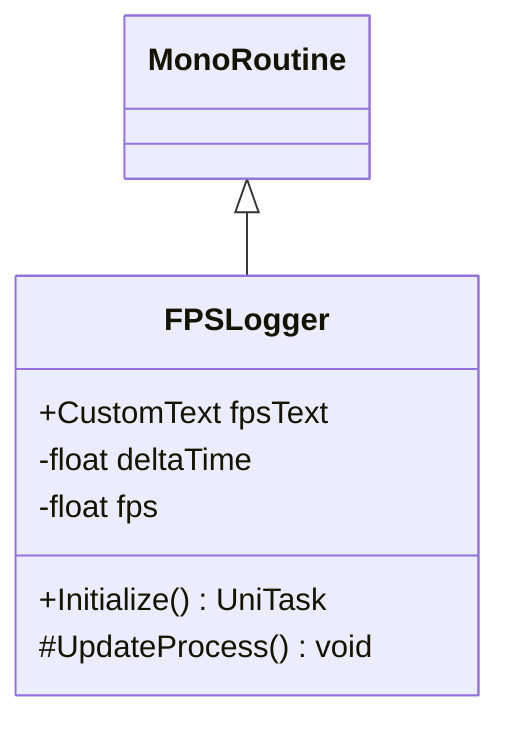

# Package `Haare/Scripts/Util/FPSLogger` UML Class Diagram

**소스 경로:** `Assets/Haare/Scripts/Util/FPSLogger`

### 📋 스크립트 클래스 명세

#### `FPSLogger` (class)
- **경로:** `Haare/Scripts/Util/FPSLogger/FPSLogger.cs`
- **상속/인터페이스:** `MonoRoutine`
- **변수/프로퍼티:**
  - `+CustomText fpsText`
  - `-float deltaTime`
  - `-float fps`
- **함수:**
  - `+Initialize() UniTask`
  - `#UpdateProcess() void`

