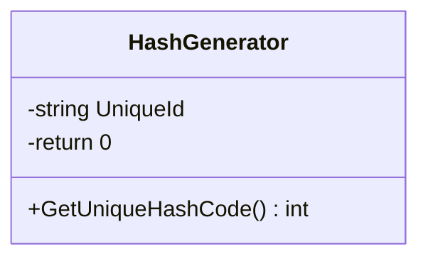

# Package `Haare/Scripts/Util/HashGenerator` UML Class Diagram

**소스 경로:** `Assets/Haare/Scripts/Util/HashGenerator`

### 📋 스크립트 클래스 명세

#### `HashGenerator` (class)
- **경로:** `Haare/Scripts/Util/HashGenerator/HashGenerator.cs`
- **변수/프로퍼티:**
  - `-string UniqueId`
  - `-return 0`
- **함수:**
  - `+GetUniqueHashCode() int`

