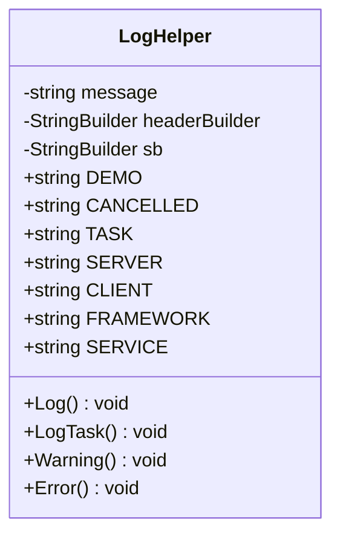

# Package `Haare/Scripts/Util/LogHelper` UML Class Diagram

**소스 경로:** `Assets/Haare/Scripts/Util/LogHelper`

### 📋 스크립트 클래스 명세

#### `LogHelper` (class)
- **경로:** `Haare/Scripts/Util/LogHelper/LogHelper.cs`
- **변수/프로퍼티:**
  - `-string message`
  - `-StringBuilder headerBuilder`
  - `-string message`
  - `-StringBuilder headerBuilder`
  - `-string message`
  - `-StringBuilder sb`
  - `+string DEMO`
  - `+string CANCELLED`
  - `+string TASK`
  - `+string SERVER`
  - `+string CLIENT`
  - `+string FRAMEWORK`
  - `+string SERVICE`
  - `+string ASSETLOADER`
  - `+string DATAMANAGER`
- **함수:**
  - `+Log() void`
  - `+LogTask() void`
  - `+Warning() void`
  - `+Error() void`

