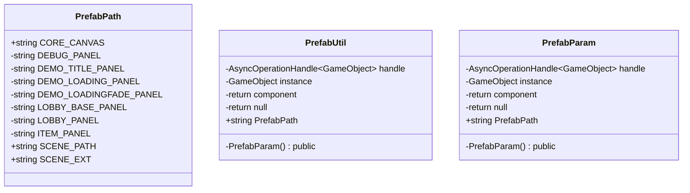

# Package `Haare/Scripts/Util/Prefab` UML Class Diagram

**소스 경로:** `Assets/Haare/Scripts/Util/Prefab`

### 📋 스크립트 클래스 명세

#### `PrefabPath` (class)
- **경로:** `Haare/Scripts/Util/Prefab/PrefabPath.cs`
- **변수/프로퍼티:**
  - `+string CORE_CANVAS`
  - `-string DEBUG_PANEL`
  - `-string DEMO_TITLE_PANEL`
  - `-string DEMO_LOADING_PANEL`
  - `-string DEMO_LOADINGFADE_PANEL`
  - `-string LOBBY_BASE_PANEL`
  - `-string LOBBY_PANEL`
  - `-string ITEM_PANEL`
  - `+string SCENE_PATH`
  - `+string SCENE_EXT`

#### `PrefabUtil` (class)
- **경로:** `Haare/Scripts/Util/Prefab/PrefabUtil.cs`
- **변수/프로퍼티:**
  - `-AsyncOperationHandle~GameObject~ handle`
  - `-GameObject instance`
  - `-return component`
  - `-return null`
  - `-return null`
  - `+string PrefabPath`
- **함수:**
  - `-PrefabParam() public`

#### `PrefabParam` (class)
- **경로:** `Haare/Scripts/Util/Prefab/PrefabUtil.cs`
- **변수/프로퍼티:**
  - `-AsyncOperationHandle~GameObject~ handle`
  - `-GameObject instance`
  - `-return component`
  - `-return null`
  - `-return null`
  - `+string PrefabPath`
- **함수:**
  - `-PrefabParam() public`

