# Package `Map` UML Class Diagram

**소스 경로:** `Assets/Map`

```mermaid
classDiagram
    class CreateMap {
        -int w
        -int h
        -int_Arr ddx
        -int_Arr ddy
        -int idA
        -int nx
        -int ny
        -int idB
        -var roomRoleMap
        -var subPurposeIds
        -BuildGraph() void
        -AddEdge() void
        -ConnectRooms() void
        -BridgeDisconnectedRoom() bool
        -OpenPassage() void
        -RegisterGate() else
        -ComputeGateWidth() int
        -RegisterGate() void
        -OpenPassageBetweenChunks() void
        -OpenHorizontalPassage() int
    }
    CreateMap --> Gate
    CreateMap --> Chunks
    CreateMap --> RoomRole
    class CreateMap {
        +Map map
        +FloorConfig_Arr floorConfigs
        +bool useFixedSeed
        +int seed
        +int currentFloorIndex
        +int maxRetryCount
        +bool showGizmos
        +bool gizmoShowRoomBounds
        +bool gizmoShowPassages
        +bool gizmoShowStairs
        +GenerateMap() void
        -InitMap() void
        -SetRoomRole() void
    }
    CreateMap --> Floor
    CreateMap --> Chunks
    CreateMap --> Map
    CreateMap --> FloorConfig
    class CreateMap {
    }
    class CreateMap {
        -bool bossOccupied
        -int w
        -int h
        -string fmt
        -var shapes
        -var corners
        -int sx
        -float da
        -float db
        -bool placed
        -PlaceBossRoom() void
        -PlaceRooms() void
        -PlaceRoomsOfSize() void
        -CanPlaceRect() bool
        -PlaceRoomsWithShapes() void
        -FillRemainingWithSingle() void
        -MergeAdjacentSingleRooms() void
        -AssignStartRoom() void
    }
    CreateMap --> Chunks
    class CreateMap {
        -int w
        -int h
        -var roomIds
        -int startRoomId
        -bool hasBossAlready
        -Chunks c
        -var distFromStart
        -var sortedByDist
        -int da
        -int db
        -AssignRoomRoles() void
        -PruneExcessRooms() void
        -PruneRoomSet() void
        -EnsureSubPurposeRooms() void
        -HasNonSubNeighbor() bool
    }
    CreateMap --> Chunks
    class CreateMap {
        -return default
        -var key
        -Floor floor
        -int count
        -int w
        -Chunks c
        -return count
        -string json
        -int h
        -bool isControlled
        +GetCurrentFloor() Floor
        +SerializeMap() string
        +ApplyMap() void
        +GetRoomFloorTileCount() int
        +DeserializeMap() void
        +SaveMapToFile() void
        +LoadMapFromFile() void
        +ConquerRoom() void
        +RetreatFromRoom() void
        -SetChunksOccupation() void
    }
    CreateMap --> Floor
    CreateMap --> Chunks
    CreateMap --> Tile
    CreateMap --> Gate
    class CreateMap {
        -int w
        -int h
        -int lobbyId
        -string lobbyName
        -Chunks c
        -Tile t
        -int w0
        -int h0
        -int stairX
        -int stairY
        -GenerateFloor0() void
        -PlaceStairs() void
        -UpdateGateWidthsAfterStairs() void
        -PlaceBossRoomStair() void
        -PlaceStairTiles() void
        -InitOccupationAndDanger() void
        -InitWeightVisibilityLandform() void
        -AssignFootprint() void
        -GetNormalFootprint() int
        -GetBossFootprint() int
    }
    CreateMap --> Chunks
    CreateMap --> Tile
    CreateMap --> Gate
    class CreateMap {
        -int w
        -int h
        -Chunks c
        -int thkMin
        -int thkMax
        -var roomBounds
        -bool isLeft
        -bool isRight
        -bool isBottom
        -bool isTop
        -AssignTileNames() void
        -ApplyOuterWallThickness() void
        -SampleThicknessForSpan() int
        -OpenInternalWalls() void
        -GetRoomId() int
        -IsWorldBorder() bool
        -GetWallThickness() int
        -RemoveHorizontalWall() void
        -RemoveVerticalWall() void
    }
    CreateMap --> Chunks
    class CreateMap {
        -var errors
        -return errors
        -int fId
        -int w
        -int h
        -int startCount
        -var startIds
        -var bossIds
        -var subIds
        -var normalIds
        +ValidateMap() List~string~
        -ValidateFloor() List~string~
        -ParseExpectedBossChunkCount() int
        -ValidateFloor0() List~string~
        -ValidateStairs() List~string~
        -FloodFillReachableRooms() HashSet~int~
        -IsChunkReachable() bool
    }
    CreateMap --> Chunks
    CreateMap --> Tile
    CreateMap --> Gate
    class InteractableObject {
        +string Id
        +Vector3Int Position
        +float BaseInterest
        +float BaseDanger
        +float BaseVisibility
        +bool IsFullyBlocking
        +bool IsCollected
        +bool IsInvestigated
        +List~string~ Tags
        +DangerStage CauserStage
        -InteractableObject() public
    }
    class FloorId {
        <<enum>>
        +int roomA
        +int roomB
        +int chunkAX
        +int chunkAY
        +int chunkBX
        +int chunkBY
        +int width
        +bool isHorizontal
        +string name
        +TileEffect effect
        +Wall() Tile
        +Floor() Tile
        +Stair() Tile
        +CreateDefault() FloorConfig_Arr
    }
    FloorId --> Map
    FloorId --> Floor
    FloorId --> TileEffect
    FloorId --> RoomRole
    FloorId --> Chunks
    class RoomRole {
        <<enum>>
        +int roomA
        +int roomB
        +int chunkAX
        +int chunkAY
        +int chunkBX
        +int chunkBY
        +int width
        +bool isHorizontal
        +string name
        +TileEffect effect
        +Wall() Tile
        +Floor() Tile
        +Stair() Tile
        +CreateDefault() FloorConfig_Arr
    }
    RoomRole --> Map
    RoomRole --> Floor
    RoomRole --> TileEffect
    RoomRole --> Chunks
    RoomRole --> FloorConfig
    class OccupationState {
        <<enum>>
        +int roomA
        +int roomB
        +int chunkAX
        +int chunkAY
        +int chunkBX
        +int chunkBY
        +int width
        +bool isHorizontal
        +string name
        +TileEffect effect
        +Wall() Tile
        +Floor() Tile
        +Stair() Tile
        +CreateDefault() FloorConfig_Arr
    }
    OccupationState --> Map
    OccupationState --> Floor
    OccupationState --> TileEffect
    OccupationState --> RoomRole
    OccupationState --> Chunks
    class TileEffect {
        <<enum>>
        +int roomA
        +int roomB
        +int chunkAX
        +int chunkAY
        +int chunkBX
        +int chunkBY
        +int width
        +bool isHorizontal
        +string name
        +TileEffect effect
        +Wall() Tile
        +Floor() Tile
        +Stair() Tile
        +CreateDefault() FloorConfig_Arr
    }
    TileEffect --> Map
    TileEffect --> Floor
    TileEffect --> RoomRole
    TileEffect --> Chunks
    TileEffect --> FloorConfig
    class Footprint {
        <<enum>>
        +int roomA
        +int roomB
        +int chunkAX
        +int chunkAY
        +int chunkBX
        +int chunkBY
        +int width
        +bool isHorizontal
        +string name
        +TileEffect effect
        +Wall() Tile
        +Floor() Tile
        +Stair() Tile
        +CreateDefault() FloorConfig_Arr
    }
    Footprint --> Map
    Footprint --> Floor
    Footprint --> TileEffect
    Footprint --> RoomRole
    Footprint --> Chunks
    class Gate {
        <<struct>>
        +int roomA
        +int roomB
        +int chunkAX
        +int chunkAY
        +int chunkBX
        +int chunkBY
        +int width
        +bool isHorizontal
        +string name
        +TileEffect effect
        +Wall() Tile
        +Floor() Tile
        +Stair() Tile
        +CreateDefault() FloorConfig_Arr
    }
    Gate --> Map
    Gate --> Floor
    Gate --> TileEffect
    Gate --> RoomRole
    Gate --> Chunks
    class Tile {
        <<struct>>
        +int roomA
        +int roomB
        +int chunkAX
        +int chunkAY
        +int chunkBX
        +int chunkBY
        +int width
        +bool isHorizontal
        +string name
        +TileEffect effect
        +Wall() Tile
        +Floor() Tile
        +Stair() Tile
        +CreateDefault() FloorConfig_Arr
    }
    Tile --> Map
    Tile --> Floor
    Tile --> TileEffect
    Tile --> RoomRole
    Tile --> Chunks
    class Chunks {
        <<struct>>
        +int roomA
        +int roomB
        +int chunkAX
        +int chunkAY
        +int chunkBX
        +int chunkBY
        +int width
        +bool isHorizontal
        +string name
        +TileEffect effect
        +Wall() Tile
        +Floor() Tile
        +Stair() Tile
        +CreateDefault() FloorConfig_Arr
    }
    Chunks --> Map
    Chunks --> Floor
    Chunks --> TileEffect
    Chunks --> RoomRole
    Chunks --> FloorConfig
    class Floor {
        <<struct>>
        +int roomA
        +int roomB
        +int chunkAX
        +int chunkAY
        +int chunkBX
        +int chunkBY
        +int width
        +bool isHorizontal
        +string name
        +TileEffect effect
        +Wall() Tile
        +Floor() Tile
        +Stair() Tile
        +CreateDefault() FloorConfig_Arr
    }
    Floor --> Map
    Floor --> TileEffect
    Floor --> RoomRole
    Floor --> Chunks
    Floor --> FloorConfig
    class Map {
        <<struct>>
        +int roomA
        +int roomB
        +int chunkAX
        +int chunkAY
        +int chunkBX
        +int chunkBY
        +int width
        +bool isHorizontal
        +string name
        +TileEffect effect
        +Wall() Tile
        +Floor() Tile
        +Stair() Tile
        +CreateDefault() FloorConfig_Arr
    }
    Map --> Floor
    Map --> TileEffect
    Map --> RoomRole
    Map --> Chunks
    Map --> FloorConfig
    class FloorConfig {
        <<struct>>
        +int roomA
        +int roomB
        +int chunkAX
        +int chunkAY
        +int chunkBX
        +int chunkBY
        +int width
        +bool isHorizontal
        +string name
        +TileEffect effect
        +Wall() Tile
        +Floor() Tile
        +Stair() Tile
        +CreateDefault() FloorConfig_Arr
    }
    FloorConfig --> Map
    FloorConfig --> Floor
    FloorConfig --> TileEffect
    FloorConfig --> RoomRole
    FloorConfig --> Chunks
    class MapData {
        <<struct>>
        +int roomA
        +int roomB
        +int chunkAX
        +int chunkAY
        +int chunkBX
        +int chunkBY
        +int width
        +bool isHorizontal
        +string name
        +TileEffect effect
        +Wall() Tile
        +Floor() Tile
        +Stair() Tile
        +CreateDefault() FloorConfig_Arr
    }
    MapData --> Map
    MapData --> Floor
    MapData --> TileEffect
    MapData --> RoomRole
    MapData --> Chunks
    class TileFactory {
        +int roomA
        +int roomB
        +int chunkAX
        +int chunkAY
        +int chunkBX
        +int chunkBY
        +int width
        +bool isHorizontal
        +string name
        +TileEffect effect
        +Wall() Tile
        +Floor() Tile
        +Stair() Tile
        +CreateDefault() FloorConfig_Arr
    }
    TileFactory --> Map
    TileFactory --> Floor
    TileFactory --> TileEffect
    TileFactory --> RoomRole
    TileFactory --> Chunks
    class RoomIdGenerator {
        +int roomA
        +int roomB
        +int chunkAX
        +int chunkAY
        +int chunkBX
        +int chunkBY
        +int width
        +bool isHorizontal
        +string name
        +TileEffect effect
        +Wall() Tile
        +Floor() Tile
        +Stair() Tile
        +CreateDefault() FloorConfig_Arr
    }
    RoomIdGenerator --> Map
    RoomIdGenerator --> Floor
    RoomIdGenerator --> TileEffect
    RoomIdGenerator --> RoomRole
    RoomIdGenerator --> Chunks
    class FloorConfigFactory {
        +int roomA
        +int roomB
        +int chunkAX
        +int chunkAY
        +int chunkBX
        +int chunkBY
        +int width
        +bool isHorizontal
        +string name
        +TileEffect effect
        +Wall() Tile
        +Floor() Tile
        +Stair() Tile
        +CreateDefault() FloorConfig_Arr
    }
    FloorConfigFactory --> Map
    FloorConfigFactory --> Floor
    FloorConfigFactory --> TileEffect
    FloorConfigFactory --> RoomRole
    FloorConfigFactory --> Chunks
    class MapManager {
        -CreateMap _createMap
        -MapRandering _mapRandering
        -WaveSpawner _waveSpawner
        +MapRandering mapRandering
        +WaveSpawner waveSpawner
        +Construct() void
        +Initialize() UniTask
        +SetupAndVisualizeMap() void
    }
    NativeRoutine <|-- MapManager
    MapManager --> CreateMap
    class MapSaveModel {
        +Map Map get_set
        -MapSaveModel() public
    }
    IDataModel <|-- MapSaveModel
    class MapSerializer {
        -var dto
        -return dto
        -Floor floor
        -var floorDto
        -int w
        -int h
        -Chunks c
        -var cDto
        -var map
        -return map
        +ToJson() string
        +FromJson() Map
        -DtoToMap() return
        +MapToDto() MapDto
        +DtoToMap() Map
    }
    MapSerializer --> Floor
    MapSerializer --> RoomRole
    MapSerializer --> Chunks
    MapSerializer --> FloorConfig
    MapSerializer --> FloorDto
    class MapDto {
        -var dto
        -return dto
        -Floor floor
        -var floorDto
        -int w
        -int h
        -Chunks c
        -var cDto
        -var map
        -return map
        +ToJson() string
        +FromJson() Map
        -DtoToMap() return
        +MapToDto() MapDto
        +DtoToMap() Map
    }
    IData <|-- MapDto
    MapDto --> Floor
    MapDto --> RoomRole
    MapDto --> Chunks
    MapDto --> FloorConfig
    MapDto --> FloorDto
    class FloorDto {
        -var dto
        -return dto
        -Floor floor
        -var floorDto
        -int w
        -int h
        -Chunks c
        -var cDto
        -var map
        -return map
        +ToJson() string
        +FromJson() Map
        -DtoToMap() return
        +MapToDto() MapDto
        +DtoToMap() Map
    }
    FloorDto --> Floor
    FloorDto --> RoomRole
    FloorDto --> Chunks
    FloorDto --> FloorConfig
    FloorDto --> Gate
    class ChunksDto {
        -var dto
        -return dto
        -Floor floor
        -var floorDto
        -int w
        -int h
        -Chunks c
        -var cDto
        -var map
        -return map
        +ToJson() string
        +FromJson() Map
        -DtoToMap() return
        +MapToDto() MapDto
        +DtoToMap() Map
    }
    ChunksDto --> Floor
    ChunksDto --> RoomRole
    ChunksDto --> Chunks
    ChunksDto --> FloorConfig
    ChunksDto --> FloorDto
```

### 📋 스크립트 클래스 명세

#### `CreateMap` (class)
- **경로:** `Script/Map/CreateMap.Connection.cs`
- **변수/프로퍼티:**
  - `-int w`
  - `-int h`
  - `-int_Arr ddx`
  - `-int_Arr ddy`
  - `-int idA`
  - `-int nx`
  - `-int ny`
  - `-int idB`
  - `-var roomRoleMap`
  - `-var subPurposeIds`
  - `-RoomRole nRole`
  - `-var pair`
  - `-var pair`
  - `-var visited`
  - `-var mstNodes`
- **함수:**
  - `-BuildGraph() void`
  - `-AddEdge() void`
  - `-ConnectRooms() void`
  - `-BridgeDisconnectedRoom() bool`
  - `-OpenPassage() void`
  - `-RegisterGate() else`
  - `-RegisterGate() else`
  - `-ComputeGateWidth() int`
  - `-RegisterGate() void`
  - `-OpenPassageBetweenChunks() void`
  - `-RegisterGate() else`
  - `-RegisterGate() else`
  - `-RegisterGate() else`
  - `-RegisterGate() else`
  - `-OpenHorizontalPassage() int`

#### `CreateMap` (class)
- **경로:** `Script/Map/CreateMap.cs`
- **변수/프로퍼티:**
  - `+Map map`
  - `+FloorConfig_Arr floorConfigs`
  - `+bool useFixedSeed`
  - `+int seed`
  - `+int currentFloorIndex`
  - `+int maxRetryCount`
  - `+bool showGizmos`
  - `+bool gizmoShowRoomBounds`
  - `+bool gizmoShowPassages`
  - `+bool gizmoShowStairs`
  - `+bool gizmoShowRoomLabels`
  - `-int spawnRoomId`
  - `-var errors`
  - `-FloorConfig cfg`
  - `-int w`
- **함수:**
  - `+GenerateMap() void`
  - `-InitMap() void`
  - `-SetRoomRole() void`

#### `CreateMap` (class)
- **경로:** `Script/Map/CreateMap.Gizmos.cs`

#### `CreateMap` (class)
- **경로:** `Script/Map/CreateMap.RoomPlacement.cs`
- **변수/프로퍼티:**
  - `-bool bossOccupied`
  - `-int w`
  - `-int h`
  - `-string fmt`
  - `-var shapes`
  - `-var corners`
  - `-int sx`
  - `-float da`
  - `-float db`
  - `-bool placed`
  - `-var prioritized`
  - `-int maxDx`
  - `-int shapeW`
  - `-int shapeH`
  - `-int baseX`
- **함수:**
  - `-PlaceBossRoom() void`
  - `-PlaceRooms() void`
  - `-PlaceRoomsOfSize() void`
  - `-CanPlaceRect() bool`
  - `-PlaceRoomsWithShapes() void`
  - `-FillRemainingWithSingle() void`
  - `-MergeAdjacentSingleRooms() void`
  - `-AssignStartRoom() void`

#### `CreateMap` (class)
- **경로:** `Script/Map/CreateMap.RoomRoles.cs`
- **변수/프로퍼티:**
  - `-int w`
  - `-int h`
  - `-var roomIds`
  - `-int startRoomId`
  - `-bool hasBossAlready`
  - `-Chunks c`
  - `-var distFromStart`
  - `-var sortedByDist`
  - `-int da`
  - `-int db`
  - `-int bossRoomId`
  - `-var roomChunkCounts`
  - `-int rid`
  - `-int subCount`
  - `-int subTarget`
- **함수:**
  - `-AssignRoomRoles() void`
  - `-PruneExcessRooms() void`
  - `-PruneRoomSet() void`
  - `-EnsureSubPurposeRooms() void`
  - `-HasNonSubNeighbor() bool`

#### `CreateMap` (class)
- **경로:** `Script/Map/CreateMap.RuntimeAPI.cs`
- **변수/프로퍼티:**
  - `-return default`
  - `-var key`
  - `-Floor floor`
  - `-int count`
  - `-int w`
  - `-Chunks c`
  - `-return count`
  - `-string json`
  - `-string json`
  - `-int w`
  - `-int h`
  - `-bool isControlled`
  - `-int w`
  - `-int h`
  - `-Chunks c`
- **함수:**
  - `+GetCurrentFloor() Floor`
  - `+SerializeMap() string`
  - `+ApplyMap() void`
  - `+GetRoomFloorTileCount() int`
  - `+DeserializeMap() void`
  - `+SaveMapToFile() void`
  - `+LoadMapFromFile() void`
  - `+ConquerRoom() void`
  - `+RetreatFromRoom() void`
  - `-SetChunksOccupation() void`
  - `+BuildOutpost() void`
  - `+DemolishOutpost() void`
  - `+OpenStair() void`
  - `+TryGetStairPosition() bool`
  - `+TryGetStairApproachPosition() bool`

#### `CreateMap` (class)
- **경로:** `Script/Map/CreateMap.Stairs.cs`
- **변수/프로퍼티:**
  - `-int w`
  - `-int h`
  - `-int lobbyId`
  - `-string lobbyName`
  - `-Chunks c`
  - `-Chunks c`
  - `-Tile t`
  - `-int w0`
  - `-int h0`
  - `-int stairX`
  - `-int stairY`
  - `-Chunks c`
  - `-int w`
  - `-int h`
  - `-Chunks c`
- **함수:**
  - `-GenerateFloor0() void`
  - `-PlaceStairs() void`
  - `-UpdateGateWidthsAfterStairs() void`
  - `-PlaceBossRoomStair() void`
  - `-PlaceStairTiles() void`
  - `-InitOccupationAndDanger() void`
  - `-InitWeightVisibilityLandform() void`
  - `-AssignFootprint() void`
  - `-GetNormalFootprint() int`
  - `-GetBossFootprint() int`

#### `CreateMap` (class)
- **경로:** `Script/Map/CreateMap.TileWall.cs`
- **변수/프로퍼티:**
  - `-int w`
  - `-int h`
  - `-Chunks c`
  - `-int w`
  - `-int h`
  - `-int thkMin`
  - `-int thkMax`
  - `-var roomBounds`
  - `-Chunks c`
  - `-bool isLeft`
  - `-bool isRight`
  - `-bool isBottom`
  - `-bool isTop`
  - `-bool shouldWall`
  - `-int w`
- **함수:**
  - `-AssignTileNames() void`
  - `-ApplyOuterWallThickness() void`
  - `-SampleThicknessForSpan() int`
  - `-OpenInternalWalls() void`
  - `-GetRoomId() int`
  - `-IsWorldBorder() bool`
  - `-GetWallThickness() int`
  - `-RemoveHorizontalWall() void`
  - `-RemoveVerticalWall() void`

#### `CreateMap` (class)
- **경로:** `Script/Map/CreateMap.Validation.cs`
- **변수/프로퍼티:**
  - `-var errors`
  - `-return errors`
  - `-return errors`
  - `-var errors`
  - `-int fId`
  - `-int w`
  - `-int h`
  - `-int startCount`
  - `-var startIds`
  - `-var bossIds`
  - `-var subIds`
  - `-var normalIds`
  - `-int normalMinRequired`
  - `-int maxChunks`
  - `-var normalRoomChunkCount`
- **함수:**
  - `+ValidateMap() List~string~`
  - `-ValidateFloor() List~string~`
  - `-ParseExpectedBossChunkCount() int`
  - `-ValidateFloor0() List~string~`
  - `-ValidateStairs() List~string~`
  - `-FloodFillReachableRooms() HashSet~int~`
  - `-IsChunkReachable() bool`

#### `InteractableObject` (class)
- **경로:** `Script/Map/InteractableObject.cs`
- **변수/프로퍼티:**
  - `+string Id`
  - `+Vector3Int Position`
  - `+float BaseInterest`
  - `+float BaseDanger`
  - `+float BaseVisibility`
  - `+bool IsFullyBlocking`
  - `+bool IsCollected`
  - `+bool IsInvestigated`
  - `+List~string~ Tags`
  - `+DangerStage CauserStage`
  - `+string TraceId`
  - `+float TrapHp`
  - `+float TrapMaxHp`
  - `+float TrapDamageMin`
  - `+float TrapDamageMax`
- **함수:**
  - `-InteractableObject() public`

#### `FloorId` (enum)
- **경로:** `Script/Map/MapData.cs`
- **변수/프로퍼티:**
  - `+int roomA`
  - `+int roomB`
  - `+int chunkAX`
  - `+int chunkAY`
  - `+int chunkBX`
  - `+int chunkBY`
  - `+int width`
  - `+bool isHorizontal`
  - `+string name`
  - `+TileEffect effect`
  - `+bool isObjectExist`
  - `+bool isStructureExist`
  - `+int dangerous`
  - `+int understand`
  - `+int weight`
- **함수:**
  - `+Wall() Tile`
  - `+Floor() Tile`
  - `+Stair() Tile`
  - `+CreateDefault() FloorConfig_Arr`

#### `RoomRole` (enum)
- **경로:** `Script/Map/MapData.cs`
- **변수/프로퍼티:**
  - `+int roomA`
  - `+int roomB`
  - `+int chunkAX`
  - `+int chunkAY`
  - `+int chunkBX`
  - `+int chunkBY`
  - `+int width`
  - `+bool isHorizontal`
  - `+string name`
  - `+TileEffect effect`
  - `+bool isObjectExist`
  - `+bool isStructureExist`
  - `+int dangerous`
  - `+int understand`
  - `+int weight`
- **함수:**
  - `+Wall() Tile`
  - `+Floor() Tile`
  - `+Stair() Tile`
  - `+CreateDefault() FloorConfig_Arr`

#### `OccupationState` (enum)
- **경로:** `Script/Map/MapData.cs`
- **변수/프로퍼티:**
  - `+int roomA`
  - `+int roomB`
  - `+int chunkAX`
  - `+int chunkAY`
  - `+int chunkBX`
  - `+int chunkBY`
  - `+int width`
  - `+bool isHorizontal`
  - `+string name`
  - `+TileEffect effect`
  - `+bool isObjectExist`
  - `+bool isStructureExist`
  - `+int dangerous`
  - `+int understand`
  - `+int weight`
- **함수:**
  - `+Wall() Tile`
  - `+Floor() Tile`
  - `+Stair() Tile`
  - `+CreateDefault() FloorConfig_Arr`

#### `TileEffect` (enum)
- **경로:** `Script/Map/MapData.cs`
- **변수/프로퍼티:**
  - `+int roomA`
  - `+int roomB`
  - `+int chunkAX`
  - `+int chunkAY`
  - `+int chunkBX`
  - `+int chunkBY`
  - `+int width`
  - `+bool isHorizontal`
  - `+string name`
  - `+TileEffect effect`
  - `+bool isObjectExist`
  - `+bool isStructureExist`
  - `+int dangerous`
  - `+int understand`
  - `+int weight`
- **함수:**
  - `+Wall() Tile`
  - `+Floor() Tile`
  - `+Stair() Tile`
  - `+CreateDefault() FloorConfig_Arr`

#### `Footprint` (enum)
- **경로:** `Script/Map/MapData.cs`
- **변수/프로퍼티:**
  - `+int roomA`
  - `+int roomB`
  - `+int chunkAX`
  - `+int chunkAY`
  - `+int chunkBX`
  - `+int chunkBY`
  - `+int width`
  - `+bool isHorizontal`
  - `+string name`
  - `+TileEffect effect`
  - `+bool isObjectExist`
  - `+bool isStructureExist`
  - `+int dangerous`
  - `+int understand`
  - `+int weight`
- **함수:**
  - `+Wall() Tile`
  - `+Floor() Tile`
  - `+Stair() Tile`
  - `+CreateDefault() FloorConfig_Arr`

#### `Gate` (struct)
- **경로:** `Script/Map/MapData.cs`
- **변수/프로퍼티:**
  - `+int roomA`
  - `+int roomB`
  - `+int chunkAX`
  - `+int chunkAY`
  - `+int chunkBX`
  - `+int chunkBY`
  - `+int width`
  - `+bool isHorizontal`
  - `+string name`
  - `+TileEffect effect`
  - `+bool isObjectExist`
  - `+bool isStructureExist`
  - `+int dangerous`
  - `+int understand`
  - `+int weight`
- **함수:**
  - `+Wall() Tile`
  - `+Floor() Tile`
  - `+Stair() Tile`
  - `+CreateDefault() FloorConfig_Arr`

#### `Tile` (struct)
- **경로:** `Script/Map/MapData.cs`
- **변수/프로퍼티:**
  - `+int roomA`
  - `+int roomB`
  - `+int chunkAX`
  - `+int chunkAY`
  - `+int chunkBX`
  - `+int chunkBY`
  - `+int width`
  - `+bool isHorizontal`
  - `+string name`
  - `+TileEffect effect`
  - `+bool isObjectExist`
  - `+bool isStructureExist`
  - `+int dangerous`
  - `+int understand`
  - `+int weight`
- **함수:**
  - `+Wall() Tile`
  - `+Floor() Tile`
  - `+Stair() Tile`
  - `+CreateDefault() FloorConfig_Arr`

#### `Chunks` (struct)
- **경로:** `Script/Map/MapData.cs`
- **변수/프로퍼티:**
  - `+int roomA`
  - `+int roomB`
  - `+int chunkAX`
  - `+int chunkAY`
  - `+int chunkBX`
  - `+int chunkBY`
  - `+int width`
  - `+bool isHorizontal`
  - `+string name`
  - `+TileEffect effect`
  - `+bool isObjectExist`
  - `+bool isStructureExist`
  - `+int dangerous`
  - `+int understand`
  - `+int weight`
- **함수:**
  - `+Wall() Tile`
  - `+Floor() Tile`
  - `+Stair() Tile`
  - `+CreateDefault() FloorConfig_Arr`

#### `Floor` (struct)
- **경로:** `Script/Map/MapData.cs`
- **변수/프로퍼티:**
  - `+int roomA`
  - `+int roomB`
  - `+int chunkAX`
  - `+int chunkAY`
  - `+int chunkBX`
  - `+int chunkBY`
  - `+int width`
  - `+bool isHorizontal`
  - `+string name`
  - `+TileEffect effect`
  - `+bool isObjectExist`
  - `+bool isStructureExist`
  - `+int dangerous`
  - `+int understand`
  - `+int weight`
- **함수:**
  - `+Wall() Tile`
  - `+Floor() Tile`
  - `+Stair() Tile`
  - `+CreateDefault() FloorConfig_Arr`

#### `Map` (struct)
- **경로:** `Script/Map/MapData.cs`
- **변수/프로퍼티:**
  - `+int roomA`
  - `+int roomB`
  - `+int chunkAX`
  - `+int chunkAY`
  - `+int chunkBX`
  - `+int chunkBY`
  - `+int width`
  - `+bool isHorizontal`
  - `+string name`
  - `+TileEffect effect`
  - `+bool isObjectExist`
  - `+bool isStructureExist`
  - `+int dangerous`
  - `+int understand`
  - `+int weight`
- **함수:**
  - `+Wall() Tile`
  - `+Floor() Tile`
  - `+Stair() Tile`
  - `+CreateDefault() FloorConfig_Arr`

#### `FloorConfig` (struct)
- **경로:** `Script/Map/MapData.cs`
- **변수/프로퍼티:**
  - `+int roomA`
  - `+int roomB`
  - `+int chunkAX`
  - `+int chunkAY`
  - `+int chunkBX`
  - `+int chunkBY`
  - `+int width`
  - `+bool isHorizontal`
  - `+string name`
  - `+TileEffect effect`
  - `+bool isObjectExist`
  - `+bool isStructureExist`
  - `+int dangerous`
  - `+int understand`
  - `+int weight`
- **함수:**
  - `+Wall() Tile`
  - `+Floor() Tile`
  - `+Stair() Tile`
  - `+CreateDefault() FloorConfig_Arr`

#### `MapData` (struct)
- **경로:** `Script/Map/MapData.cs`
- **변수/프로퍼티:**
  - `+int roomA`
  - `+int roomB`
  - `+int chunkAX`
  - `+int chunkAY`
  - `+int chunkBX`
  - `+int chunkBY`
  - `+int width`
  - `+bool isHorizontal`
  - `+string name`
  - `+TileEffect effect`
  - `+bool isObjectExist`
  - `+bool isStructureExist`
  - `+int dangerous`
  - `+int understand`
  - `+int weight`
- **함수:**
  - `+Wall() Tile`
  - `+Floor() Tile`
  - `+Stair() Tile`
  - `+CreateDefault() FloorConfig_Arr`

#### `TileFactory` (class)
- **경로:** `Script/Map/MapData.cs`
- **변수/프로퍼티:**
  - `+int roomA`
  - `+int roomB`
  - `+int chunkAX`
  - `+int chunkAY`
  - `+int chunkBX`
  - `+int chunkBY`
  - `+int width`
  - `+bool isHorizontal`
  - `+string name`
  - `+TileEffect effect`
  - `+bool isObjectExist`
  - `+bool isStructureExist`
  - `+int dangerous`
  - `+int understand`
  - `+int weight`
- **함수:**
  - `+Wall() Tile`
  - `+Floor() Tile`
  - `+Stair() Tile`
  - `+CreateDefault() FloorConfig_Arr`

#### `RoomIdGenerator` (class)
- **경로:** `Script/Map/MapData.cs`
- **변수/프로퍼티:**
  - `+int roomA`
  - `+int roomB`
  - `+int chunkAX`
  - `+int chunkAY`
  - `+int chunkBX`
  - `+int chunkBY`
  - `+int width`
  - `+bool isHorizontal`
  - `+string name`
  - `+TileEffect effect`
  - `+bool isObjectExist`
  - `+bool isStructureExist`
  - `+int dangerous`
  - `+int understand`
  - `+int weight`
- **함수:**
  - `+Wall() Tile`
  - `+Floor() Tile`
  - `+Stair() Tile`
  - `+CreateDefault() FloorConfig_Arr`

#### `FloorConfigFactory` (class)
- **경로:** `Script/Map/MapData.cs`
- **변수/프로퍼티:**
  - `+int roomA`
  - `+int roomB`
  - `+int chunkAX`
  - `+int chunkAY`
  - `+int chunkBX`
  - `+int chunkBY`
  - `+int width`
  - `+bool isHorizontal`
  - `+string name`
  - `+TileEffect effect`
  - `+bool isObjectExist`
  - `+bool isStructureExist`
  - `+int dangerous`
  - `+int understand`
  - `+int weight`
- **함수:**
  - `+Wall() Tile`
  - `+Floor() Tile`
  - `+Stair() Tile`
  - `+CreateDefault() FloorConfig_Arr`

#### `MapManager` (class)
- **경로:** `Script/Map/MapManager.cs`
- **상속/인터페이스:** `NativeRoutine`
- **변수/프로퍼티:**
  - `-CreateMap _createMap`
  - `-MapRandering _mapRandering`
  - `-WaveSpawner _waveSpawner`
  - `+MapRandering mapRandering`
  - `+WaveSpawner waveSpawner`
- **함수:**
  - `+Construct() void`
  - `+Initialize() UniTask`
  - `+SetupAndVisualizeMap() void`

#### `MapSaveModel` (class)
- **경로:** `Script/Map/MapSaveModel.cs`
- **상속/인터페이스:** `IDataModel`
- **변수/프로퍼티:**
  - `+Map Map get_set`
- **함수:**
  - `-MapSaveModel() public`

#### `MapSerializer` (class)
- **경로:** `Script/Map/MapSerializer.cs`
- **변수/프로퍼티:**
  - `-var dto`
  - `-var dto`
  - `-var dto`
  - `-return dto`
  - `-Floor floor`
  - `-var floorDto`
  - `-int w`
  - `-int h`
  - `-Chunks c`
  - `-var cDto`
  - `-return dto`
  - `-var map`
  - `-return map`
  - `-FloorDto floorDto`
  - `-var floor`
- **함수:**
  - `+ToJson() string`
  - `+FromJson() Map`
  - `-DtoToMap() return`
  - `+MapToDto() MapDto`
  - `+DtoToMap() Map`

#### `MapDto` (class)
- **경로:** `Script/Map/MapSerializer.cs`
- **상속/인터페이스:** `IData`
- **변수/프로퍼티:**
  - `-var dto`
  - `-var dto`
  - `-var dto`
  - `-return dto`
  - `-Floor floor`
  - `-var floorDto`
  - `-int w`
  - `-int h`
  - `-Chunks c`
  - `-var cDto`
  - `-return dto`
  - `-var map`
  - `-return map`
  - `-FloorDto floorDto`
  - `-var floor`
- **함수:**
  - `+ToJson() string`
  - `+FromJson() Map`
  - `-DtoToMap() return`
  - `+MapToDto() MapDto`
  - `+DtoToMap() Map`

#### `FloorDto` (class)
- **경로:** `Script/Map/MapSerializer.cs`
- **변수/프로퍼티:**
  - `-var dto`
  - `-var dto`
  - `-var dto`
  - `-return dto`
  - `-Floor floor`
  - `-var floorDto`
  - `-int w`
  - `-int h`
  - `-Chunks c`
  - `-var cDto`
  - `-return dto`
  - `-var map`
  - `-return map`
  - `-FloorDto floorDto`
  - `-var floor`
- **함수:**
  - `+ToJson() string`
  - `+FromJson() Map`
  - `-DtoToMap() return`
  - `+MapToDto() MapDto`
  - `+DtoToMap() Map`

#### `ChunksDto` (class)
- **경로:** `Script/Map/MapSerializer.cs`
- **변수/프로퍼티:**
  - `-var dto`
  - `-var dto`
  - `-var dto`
  - `-return dto`
  - `-Floor floor`
  - `-var floorDto`
  - `-int w`
  - `-int h`
  - `-Chunks c`
  - `-var cDto`
  - `-return dto`
  - `-var map`
  - `-return map`
  - `-FloorDto floorDto`
  - `-var floor`
- **함수:**
  - `+ToJson() string`
  - `+FromJson() Map`
  - `-DtoToMap() return`
  - `+MapToDto() MapDto`
  - `+DtoToMap() Map`

