# Package `Plugins/Demigiant/DOTween/Modules` UML Class Diagram

**소스 경로:** `Assets/Plugins/Demigiant/DOTween/Modules`

```mermaid
classDiagram
    class DOTweenModuleAudio {
        -return t
        -float currVal
        -return currVal
        +DOComplete() int
        +DOKill() int
        +DOFlip() int
        +DOGoto() int
        +DOPause() int
        +DOPlay() int
        +DOPlayBackwards() int
        +DOPlayForward() int
        +DORestart() int
        +DORewind() int
    }
    class DOTweenModulePhysics {
        -return t
        -float startPosY
        -float offsetY
        -bool offsetYSet
        -Sequence s
        -Tween yTween
        -Vector3 pos
        -return s
        -PathMode pathMode
        -Transform trans
        +DOJump() Sequence
    }
    class DOTweenModulePhysics2D {
        -return t
        -float startPosY
        -float offsetY
        -bool offsetYSet
        -Sequence s
        -Tween yTween
        -Vector3 pos
        -return s
        -PathMode pathMode
        -int len
        +DOJump() Sequence
    }
    class DOTweenModuleSprite {
        -return t
        -Sequence s
        -GradientColorKey_Arr colors
        -int len
        -GradientColorKey c
        -float colorDuration
        -return s
        -Color to
        -Color diff
        +DOGradientColor() Sequence
        +DOBlendableColor() Tweener
    }
    class DOTweenModuleUI {
        -return t
        -Sequence s
        -GradientColorKey_Arr colors
        -int len
        -GradientColorKey c
        -float colorDuration
        -return s
        -float startPosY
        -float offsetY
        -bool offsetYSet
        +DOGradientColor() Sequence
        +DOPunchAnchorPos() Tweener
        +DOShakeAnchorPos() Tweener
        +DOJumpAnchorPos() Sequence
        +DONormalizedPos() Tweener
        +DOHorizontalNormalizedPos() Tweener
        +DOVerticalNormalizedPos() Tweener
        +DOBlendableColor() Tweener
        +SwitchToRectTransform() Vector2
    }
    class Utils {
        -return t
        -Sequence s
        -GradientColorKey_Arr colors
        -int len
        -GradientColorKey c
        -float colorDuration
        -return s
        -float startPosY
        -float offsetY
        -bool offsetYSet
        +DOGradientColor() Sequence
        +DOPunchAnchorPos() Tweener
        +DOShakeAnchorPos() Tweener
        +DOJumpAnchorPos() Sequence
        +DONormalizedPos() Tweener
        +DOHorizontalNormalizedPos() Tweener
        +DOVerticalNormalizedPos() Tweener
        +DOBlendableColor() Tweener
        +SwitchToRectTransform() Vector2
    }
    class DOTweenModuleUnityVersion {
        -Sequence s
        -GradientColorKey_Arr colors
        -int len
        -GradientColorKey c
        -float colorDuration
        -return s
        -return null
        -return t
        -Tween t
        -int elapsedLoops
        +DOGradientColor() Sequence
        +WaitForCompletion() CustomYieldInstruction
        +WaitForRewind() CustomYieldInstruction
        +WaitForKill() CustomYieldInstruction
        +WaitForElapsedLoops() CustomYieldInstruction
        +WaitForPosition() CustomYieldInstruction
        +WaitForStart() CustomYieldInstruction
        -WaitForCompletion() public
        -WaitForRewind() public
        -WaitForKill() public
    }
    class DOTweenCYInstruction {
        -Sequence s
        -GradientColorKey_Arr colors
        -int len
        -GradientColorKey c
        -float colorDuration
        -return s
        -return null
        -return t
        -Tween t
        -int elapsedLoops
        +DOGradientColor() Sequence
        +WaitForCompletion() CustomYieldInstruction
        +WaitForRewind() CustomYieldInstruction
        +WaitForKill() CustomYieldInstruction
        +WaitForElapsedLoops() CustomYieldInstruction
        +WaitForPosition() CustomYieldInstruction
        +WaitForStart() CustomYieldInstruction
        -WaitForCompletion() public
        -WaitForRewind() public
        -WaitForKill() public
    }
    class WaitForCompletion {
        -Sequence s
        -GradientColorKey_Arr colors
        -int len
        -GradientColorKey c
        -float colorDuration
        -return s
        -return null
        -return t
        -Tween t
        -int elapsedLoops
        +DOGradientColor() Sequence
        +WaitForCompletion() CustomYieldInstruction
        +WaitForRewind() CustomYieldInstruction
        +WaitForKill() CustomYieldInstruction
        +WaitForElapsedLoops() CustomYieldInstruction
        +WaitForPosition() CustomYieldInstruction
        +WaitForStart() CustomYieldInstruction
        -WaitForCompletion() public
        -WaitForRewind() public
        -WaitForKill() public
    }
    class WaitForRewind {
        -Sequence s
        -GradientColorKey_Arr colors
        -int len
        -GradientColorKey c
        -float colorDuration
        -return s
        -return null
        -return t
        -Tween t
        -int elapsedLoops
        +DOGradientColor() Sequence
        +WaitForCompletion() CustomYieldInstruction
        +WaitForRewind() CustomYieldInstruction
        +WaitForKill() CustomYieldInstruction
        +WaitForElapsedLoops() CustomYieldInstruction
        +WaitForPosition() CustomYieldInstruction
        +WaitForStart() CustomYieldInstruction
        -WaitForCompletion() public
        -WaitForRewind() public
        -WaitForKill() public
    }
    class WaitForKill {
        -Sequence s
        -GradientColorKey_Arr colors
        -int len
        -GradientColorKey c
        -float colorDuration
        -return s
        -return null
        -return t
        -Tween t
        -int elapsedLoops
        +DOGradientColor() Sequence
        +WaitForCompletion() CustomYieldInstruction
        +WaitForRewind() CustomYieldInstruction
        +WaitForKill() CustomYieldInstruction
        +WaitForElapsedLoops() CustomYieldInstruction
        +WaitForPosition() CustomYieldInstruction
        +WaitForStart() CustomYieldInstruction
        -WaitForCompletion() public
        -WaitForRewind() public
        -WaitForKill() public
    }
    class WaitForElapsedLoops {
        -Sequence s
        -GradientColorKey_Arr colors
        -int len
        -GradientColorKey c
        -float colorDuration
        -return s
        -return null
        -return t
        -Tween t
        -int elapsedLoops
        +DOGradientColor() Sequence
        +WaitForCompletion() CustomYieldInstruction
        +WaitForRewind() CustomYieldInstruction
        +WaitForKill() CustomYieldInstruction
        +WaitForElapsedLoops() CustomYieldInstruction
        +WaitForPosition() CustomYieldInstruction
        +WaitForStart() CustomYieldInstruction
        -WaitForCompletion() public
        -WaitForRewind() public
        -WaitForKill() public
    }
    class WaitForPosition {
        -Sequence s
        -GradientColorKey_Arr colors
        -int len
        -GradientColorKey c
        -float colorDuration
        -return s
        -return null
        -return t
        -Tween t
        -int elapsedLoops
        +DOGradientColor() Sequence
        +WaitForCompletion() CustomYieldInstruction
        +WaitForRewind() CustomYieldInstruction
        +WaitForKill() CustomYieldInstruction
        +WaitForElapsedLoops() CustomYieldInstruction
        +WaitForPosition() CustomYieldInstruction
        +WaitForStart() CustomYieldInstruction
        -WaitForCompletion() public
        -WaitForRewind() public
        -WaitForKill() public
    }
    class WaitForStart {
        -Sequence s
        -GradientColorKey_Arr colors
        -int len
        -GradientColorKey c
        -float colorDuration
        -return s
        -return null
        -return t
        -Tween t
        -int elapsedLoops
        +DOGradientColor() Sequence
        +WaitForCompletion() CustomYieldInstruction
        +WaitForRewind() CustomYieldInstruction
        +WaitForKill() CustomYieldInstruction
        +WaitForElapsedLoops() CustomYieldInstruction
        +WaitForPosition() CustomYieldInstruction
        +WaitForStart() CustomYieldInstruction
        -WaitForCompletion() public
        -WaitForRewind() public
        -WaitForKill() public
    }
    class DOTweenModuleUtils {
        -bool _initialized
        -Assembly_Arr loadedAssemblies
        -MethodInfo mi
        -return false
        -bool rBodyFoundAndTweened
        -Rigidbody rBody
        -Rigidbody2D rBody2D
        -return t
        +Init() void
        -Preserver() void
        +SetOrientationOnPath() void
        +HasRigidbody2D() bool
        +HasRigidbody() bool
    }
    class Physics {
        -bool _initialized
        -Assembly_Arr loadedAssemblies
        -MethodInfo mi
        -return false
        -bool rBodyFoundAndTweened
        -Rigidbody rBody
        -Rigidbody2D rBody2D
        -return t
        +Init() void
        -Preserver() void
        +SetOrientationOnPath() void
        +HasRigidbody2D() bool
        +HasRigidbody() bool
    }
```

### 📋 스크립트 클래스 명세

#### `DOTweenModuleAudio` (class)
- **경로:** `Plugins/Demigiant/DOTween/Modules/DOTweenModuleAudio.cs`
- **변수/프로퍼티:**
  - `-return t`
  - `-return t`
  - `-float currVal`
  - `-return currVal`
  - `-return t`
- **함수:**
  - `+DOComplete() int`
  - `+DOKill() int`
  - `+DOFlip() int`
  - `+DOGoto() int`
  - `+DOPause() int`
  - `+DOPlay() int`
  - `+DOPlayBackwards() int`
  - `+DOPlayForward() int`
  - `+DORestart() int`
  - `+DORewind() int`
  - `+DOSmoothRewind() int`
  - `+DOTogglePause() int`

#### `DOTweenModulePhysics` (class)
- **경로:** `Plugins/Demigiant/DOTween/Modules/DOTweenModulePhysics.cs`
- **변수/프로퍼티:**
  - `-return t`
  - `-return t`
  - `-return t`
  - `-return t`
  - `-return t`
  - `-return t`
  - `-float startPosY`
  - `-float offsetY`
  - `-bool offsetYSet`
  - `-Sequence s`
  - `-Tween yTween`
  - `-Vector3 pos`
  - `-return s`
  - `-PathMode pathMode`
  - `-return t`
- **함수:**
  - `+DOJump() Sequence`

#### `DOTweenModulePhysics2D` (class)
- **경로:** `Plugins/Demigiant/DOTween/Modules/DOTweenModulePhysics2D.cs`
- **변수/프로퍼티:**
  - `-return t`
  - `-return t`
  - `-return t`
  - `-return t`
  - `-float startPosY`
  - `-float offsetY`
  - `-bool offsetYSet`
  - `-Sequence s`
  - `-Tween yTween`
  - `-Vector3 pos`
  - `-return s`
  - `-PathMode pathMode`
  - `-int len`
  - `-Vector3_Arr path3D`
  - `-return t`
- **함수:**
  - `+DOJump() Sequence`

#### `DOTweenModuleSprite` (class)
- **경로:** `Plugins/Demigiant/DOTween/Modules/DOTweenModuleSprite.cs`
- **변수/프로퍼티:**
  - `-return t`
  - `-return t`
  - `-Sequence s`
  - `-GradientColorKey_Arr colors`
  - `-int len`
  - `-GradientColorKey c`
  - `-float colorDuration`
  - `-return s`
  - `-Color to`
  - `-Color diff`
- **함수:**
  - `+DOGradientColor() Sequence`
  - `+DOBlendableColor() Tweener`

#### `DOTweenModuleUI` (class)
- **경로:** `Plugins/Demigiant/DOTween/Modules/DOTweenModuleUI.cs`
- **변수/프로퍼티:**
  - `-return t`
  - `-return t`
  - `-return t`
  - `-return t`
  - `-return t`
  - `-return t`
  - `-Sequence s`
  - `-GradientColorKey_Arr colors`
  - `-int len`
  - `-GradientColorKey c`
  - `-float colorDuration`
  - `-return s`
  - `-return t`
  - `-return t`
  - `-return t`
- **함수:**
  - `+DOGradientColor() Sequence`
  - `+DOPunchAnchorPos() Tweener`
  - `+DOShakeAnchorPos() Tweener`
  - `+DOShakeAnchorPos() Tweener`
  - `+DOJumpAnchorPos() Sequence`
  - `+DONormalizedPos() Tweener`
  - `+DOHorizontalNormalizedPos() Tweener`
  - `+DOVerticalNormalizedPos() Tweener`
  - `+DOBlendableColor() Tweener`
  - `+DOBlendableColor() Tweener`
  - `+DOBlendableColor() Tweener`
  - `+SwitchToRectTransform() Vector2`

#### `Utils` (class)
- **경로:** `Plugins/Demigiant/DOTween/Modules/DOTweenModuleUI.cs`
- **변수/프로퍼티:**
  - `-return t`
  - `-return t`
  - `-return t`
  - `-return t`
  - `-return t`
  - `-return t`
  - `-Sequence s`
  - `-GradientColorKey_Arr colors`
  - `-int len`
  - `-GradientColorKey c`
  - `-float colorDuration`
  - `-return s`
  - `-return t`
  - `-return t`
  - `-return t`
- **함수:**
  - `+DOGradientColor() Sequence`
  - `+DOPunchAnchorPos() Tweener`
  - `+DOShakeAnchorPos() Tweener`
  - `+DOShakeAnchorPos() Tweener`
  - `+DOJumpAnchorPos() Sequence`
  - `+DONormalizedPos() Tweener`
  - `+DOHorizontalNormalizedPos() Tweener`
  - `+DOVerticalNormalizedPos() Tweener`
  - `+DOBlendableColor() Tweener`
  - `+DOBlendableColor() Tweener`
  - `+DOBlendableColor() Tweener`
  - `+SwitchToRectTransform() Vector2`

#### `DOTweenModuleUnityVersion` (class)
- **경로:** `Plugins/Demigiant/DOTween/Modules/DOTweenModuleUnityVersion.cs`
- **변수/프로퍼티:**
  - `-Sequence s`
  - `-GradientColorKey_Arr colors`
  - `-int len`
  - `-GradientColorKey c`
  - `-float colorDuration`
  - `-return s`
  - `-Sequence s`
  - `-GradientColorKey_Arr colors`
  - `-int len`
  - `-GradientColorKey c`
  - `-float colorDuration`
  - `-return s`
  - `-return null`
  - `-return null`
  - `-return null`
- **함수:**
  - `+DOGradientColor() Sequence`
  - `+DOGradientColor() Sequence`
  - `+WaitForCompletion() CustomYieldInstruction`
  - `+WaitForRewind() CustomYieldInstruction`
  - `+WaitForKill() CustomYieldInstruction`
  - `+WaitForElapsedLoops() CustomYieldInstruction`
  - `+WaitForPosition() CustomYieldInstruction`
  - `+WaitForStart() CustomYieldInstruction`
  - `-WaitForCompletion() public`
  - `-WaitForRewind() public`
  - `-WaitForKill() public`
  - `-WaitForElapsedLoops() public`
  - `-WaitForPosition() public`
  - `-WaitForStart() public`

#### `DOTweenCYInstruction` (class)
- **경로:** `Plugins/Demigiant/DOTween/Modules/DOTweenModuleUnityVersion.cs`
- **변수/프로퍼티:**
  - `-Sequence s`
  - `-GradientColorKey_Arr colors`
  - `-int len`
  - `-GradientColorKey c`
  - `-float colorDuration`
  - `-return s`
  - `-Sequence s`
  - `-GradientColorKey_Arr colors`
  - `-int len`
  - `-GradientColorKey c`
  - `-float colorDuration`
  - `-return s`
  - `-return null`
  - `-return null`
  - `-return null`
- **함수:**
  - `+DOGradientColor() Sequence`
  - `+DOGradientColor() Sequence`
  - `+WaitForCompletion() CustomYieldInstruction`
  - `+WaitForRewind() CustomYieldInstruction`
  - `+WaitForKill() CustomYieldInstruction`
  - `+WaitForElapsedLoops() CustomYieldInstruction`
  - `+WaitForPosition() CustomYieldInstruction`
  - `+WaitForStart() CustomYieldInstruction`
  - `-WaitForCompletion() public`
  - `-WaitForRewind() public`
  - `-WaitForKill() public`
  - `-WaitForElapsedLoops() public`
  - `-WaitForPosition() public`
  - `-WaitForStart() public`

#### `WaitForCompletion` (class)
- **경로:** `Plugins/Demigiant/DOTween/Modules/DOTweenModuleUnityVersion.cs`
- **상속/인터페이스:** `CustomYieldInstruction`
- **변수/프로퍼티:**
  - `-Sequence s`
  - `-GradientColorKey_Arr colors`
  - `-int len`
  - `-GradientColorKey c`
  - `-float colorDuration`
  - `-return s`
  - `-Sequence s`
  - `-GradientColorKey_Arr colors`
  - `-int len`
  - `-GradientColorKey c`
  - `-float colorDuration`
  - `-return s`
  - `-return null`
  - `-return null`
  - `-return null`
- **함수:**
  - `+DOGradientColor() Sequence`
  - `+DOGradientColor() Sequence`
  - `+WaitForCompletion() CustomYieldInstruction`
  - `+WaitForRewind() CustomYieldInstruction`
  - `+WaitForKill() CustomYieldInstruction`
  - `+WaitForElapsedLoops() CustomYieldInstruction`
  - `+WaitForPosition() CustomYieldInstruction`
  - `+WaitForStart() CustomYieldInstruction`
  - `-WaitForCompletion() public`
  - `-WaitForRewind() public`
  - `-WaitForKill() public`
  - `-WaitForElapsedLoops() public`
  - `-WaitForPosition() public`
  - `-WaitForStart() public`

#### `WaitForRewind` (class)
- **경로:** `Plugins/Demigiant/DOTween/Modules/DOTweenModuleUnityVersion.cs`
- **상속/인터페이스:** `CustomYieldInstruction`
- **변수/프로퍼티:**
  - `-Sequence s`
  - `-GradientColorKey_Arr colors`
  - `-int len`
  - `-GradientColorKey c`
  - `-float colorDuration`
  - `-return s`
  - `-Sequence s`
  - `-GradientColorKey_Arr colors`
  - `-int len`
  - `-GradientColorKey c`
  - `-float colorDuration`
  - `-return s`
  - `-return null`
  - `-return null`
  - `-return null`
- **함수:**
  - `+DOGradientColor() Sequence`
  - `+DOGradientColor() Sequence`
  - `+WaitForCompletion() CustomYieldInstruction`
  - `+WaitForRewind() CustomYieldInstruction`
  - `+WaitForKill() CustomYieldInstruction`
  - `+WaitForElapsedLoops() CustomYieldInstruction`
  - `+WaitForPosition() CustomYieldInstruction`
  - `+WaitForStart() CustomYieldInstruction`
  - `-WaitForCompletion() public`
  - `-WaitForRewind() public`
  - `-WaitForKill() public`
  - `-WaitForElapsedLoops() public`
  - `-WaitForPosition() public`
  - `-WaitForStart() public`

#### `WaitForKill` (class)
- **경로:** `Plugins/Demigiant/DOTween/Modules/DOTweenModuleUnityVersion.cs`
- **상속/인터페이스:** `CustomYieldInstruction`
- **변수/프로퍼티:**
  - `-Sequence s`
  - `-GradientColorKey_Arr colors`
  - `-int len`
  - `-GradientColorKey c`
  - `-float colorDuration`
  - `-return s`
  - `-Sequence s`
  - `-GradientColorKey_Arr colors`
  - `-int len`
  - `-GradientColorKey c`
  - `-float colorDuration`
  - `-return s`
  - `-return null`
  - `-return null`
  - `-return null`
- **함수:**
  - `+DOGradientColor() Sequence`
  - `+DOGradientColor() Sequence`
  - `+WaitForCompletion() CustomYieldInstruction`
  - `+WaitForRewind() CustomYieldInstruction`
  - `+WaitForKill() CustomYieldInstruction`
  - `+WaitForElapsedLoops() CustomYieldInstruction`
  - `+WaitForPosition() CustomYieldInstruction`
  - `+WaitForStart() CustomYieldInstruction`
  - `-WaitForCompletion() public`
  - `-WaitForRewind() public`
  - `-WaitForKill() public`
  - `-WaitForElapsedLoops() public`
  - `-WaitForPosition() public`
  - `-WaitForStart() public`

#### `WaitForElapsedLoops` (class)
- **경로:** `Plugins/Demigiant/DOTween/Modules/DOTweenModuleUnityVersion.cs`
- **상속/인터페이스:** `CustomYieldInstruction`
- **변수/프로퍼티:**
  - `-Sequence s`
  - `-GradientColorKey_Arr colors`
  - `-int len`
  - `-GradientColorKey c`
  - `-float colorDuration`
  - `-return s`
  - `-Sequence s`
  - `-GradientColorKey_Arr colors`
  - `-int len`
  - `-GradientColorKey c`
  - `-float colorDuration`
  - `-return s`
  - `-return null`
  - `-return null`
  - `-return null`
- **함수:**
  - `+DOGradientColor() Sequence`
  - `+DOGradientColor() Sequence`
  - `+WaitForCompletion() CustomYieldInstruction`
  - `+WaitForRewind() CustomYieldInstruction`
  - `+WaitForKill() CustomYieldInstruction`
  - `+WaitForElapsedLoops() CustomYieldInstruction`
  - `+WaitForPosition() CustomYieldInstruction`
  - `+WaitForStart() CustomYieldInstruction`
  - `-WaitForCompletion() public`
  - `-WaitForRewind() public`
  - `-WaitForKill() public`
  - `-WaitForElapsedLoops() public`
  - `-WaitForPosition() public`
  - `-WaitForStart() public`

#### `WaitForPosition` (class)
- **경로:** `Plugins/Demigiant/DOTween/Modules/DOTweenModuleUnityVersion.cs`
- **상속/인터페이스:** `CustomYieldInstruction`
- **변수/프로퍼티:**
  - `-Sequence s`
  - `-GradientColorKey_Arr colors`
  - `-int len`
  - `-GradientColorKey c`
  - `-float colorDuration`
  - `-return s`
  - `-Sequence s`
  - `-GradientColorKey_Arr colors`
  - `-int len`
  - `-GradientColorKey c`
  - `-float colorDuration`
  - `-return s`
  - `-return null`
  - `-return null`
  - `-return null`
- **함수:**
  - `+DOGradientColor() Sequence`
  - `+DOGradientColor() Sequence`
  - `+WaitForCompletion() CustomYieldInstruction`
  - `+WaitForRewind() CustomYieldInstruction`
  - `+WaitForKill() CustomYieldInstruction`
  - `+WaitForElapsedLoops() CustomYieldInstruction`
  - `+WaitForPosition() CustomYieldInstruction`
  - `+WaitForStart() CustomYieldInstruction`
  - `-WaitForCompletion() public`
  - `-WaitForRewind() public`
  - `-WaitForKill() public`
  - `-WaitForElapsedLoops() public`
  - `-WaitForPosition() public`
  - `-WaitForStart() public`

#### `WaitForStart` (class)
- **경로:** `Plugins/Demigiant/DOTween/Modules/DOTweenModuleUnityVersion.cs`
- **상속/인터페이스:** `CustomYieldInstruction`
- **변수/프로퍼티:**
  - `-Sequence s`
  - `-GradientColorKey_Arr colors`
  - `-int len`
  - `-GradientColorKey c`
  - `-float colorDuration`
  - `-return s`
  - `-Sequence s`
  - `-GradientColorKey_Arr colors`
  - `-int len`
  - `-GradientColorKey c`
  - `-float colorDuration`
  - `-return s`
  - `-return null`
  - `-return null`
  - `-return null`
- **함수:**
  - `+DOGradientColor() Sequence`
  - `+DOGradientColor() Sequence`
  - `+WaitForCompletion() CustomYieldInstruction`
  - `+WaitForRewind() CustomYieldInstruction`
  - `+WaitForKill() CustomYieldInstruction`
  - `+WaitForElapsedLoops() CustomYieldInstruction`
  - `+WaitForPosition() CustomYieldInstruction`
  - `+WaitForStart() CustomYieldInstruction`
  - `-WaitForCompletion() public`
  - `-WaitForRewind() public`
  - `-WaitForKill() public`
  - `-WaitForElapsedLoops() public`
  - `-WaitForPosition() public`
  - `-WaitForStart() public`

#### `DOTweenModuleUtils` (class)
- **경로:** `Plugins/Demigiant/DOTween/Modules/DOTweenModuleUtils.cs`
- **변수/프로퍼티:**
  - `-bool _initialized`
  - `-Assembly_Arr loadedAssemblies`
  - `-MethodInfo mi`
  - `-return false`
  - `-return false`
  - `-bool rBodyFoundAndTweened`
  - `-Rigidbody rBody`
  - `-Rigidbody2D rBody2D`
  - `-return t`
- **함수:**
  - `+Init() void`
  - `-Preserver() void`
  - `+SetOrientationOnPath() void`
  - `+HasRigidbody2D() bool`
  - `+HasRigidbody() bool`

#### `Physics` (class)
- **경로:** `Plugins/Demigiant/DOTween/Modules/DOTweenModuleUtils.cs`
- **변수/프로퍼티:**
  - `-bool _initialized`
  - `-Assembly_Arr loadedAssemblies`
  - `-MethodInfo mi`
  - `-return false`
  - `-return false`
  - `-bool rBodyFoundAndTweened`
  - `-Rigidbody rBody`
  - `-Rigidbody2D rBody2D`
  - `-return t`
- **함수:**
  - `+Init() void`
  - `-Preserver() void`
  - `+SetOrientationOnPath() void`
  - `+HasRigidbody2D() bool`
  - `+HasRigidbody() bool`

