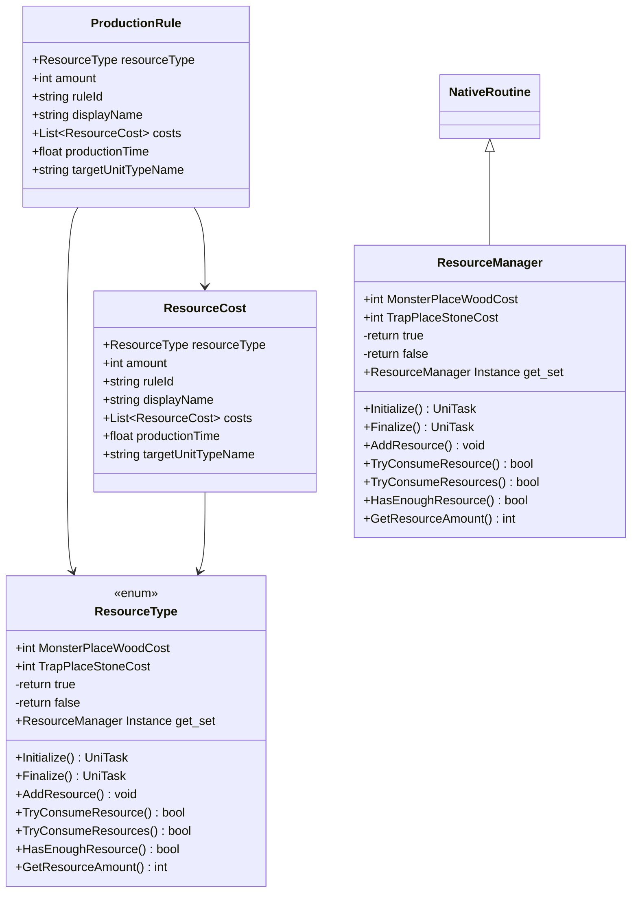

# Package `Production` UML Class Diagram

**소스 경로:** `Assets/Production`

### 📋 스크립트 클래스 명세

#### `ResourceCost` (class)
- **경로:** `Script/Production/ProductionRule.cs`
- **변수/프로퍼티:**
  - `+ResourceType resourceType`
  - `+int amount`
  - `+string ruleId`
  - `+string displayName`
  - `+List~ResourceCost~ costs`
  - `+float productionTime`
  - `+string targetUnitTypeName`

#### `ProductionRule` (class)
- **경로:** `Script/Production/ProductionRule.cs`
- **상속/인터페이스:** `ScriptableObject`
- **변수/프로퍼티:**
  - `+ResourceType resourceType`
  - `+int amount`
  - `+string ruleId`
  - `+string displayName`
  - `+List~ResourceCost~ costs`
  - `+float productionTime`
  - `+string targetUnitTypeName`

#### `ResourceType` (enum)
- **경로:** `Script/Production/ResourceManager.cs`
- **변수/프로퍼티:**
  - `+int MonsterPlaceWoodCost`
  - `+int TrapPlaceStoneCost`
  - `-return true`
  - `-return false`
  - `-return false`
  - `-return true`
  - `+ResourceManager Instance get_set`
- **함수:**
  - `+Initialize() UniTask`
  - `+Finalize() UniTask`
  - `+AddResource() void`
  - `+TryConsumeResource() bool`
  - `+TryConsumeResources() bool`
  - `+HasEnoughResource() bool`
  - `+GetResourceAmount() int`

#### `ResourceManager` (class)
- **경로:** `Script/Production/ResourceManager.cs`
- **상속/인터페이스:** `NativeRoutine`
- **변수/프로퍼티:**
  - `+int MonsterPlaceWoodCost`
  - `+int TrapPlaceStoneCost`
  - `-return true`
  - `-return false`
  - `-return false`
  - `-return true`
  - `+ResourceManager Instance get_set`
- **함수:**
  - `+Initialize() UniTask`
  - `+Finalize() UniTask`
  - `+AddResource() void`
  - `+TryConsumeResource() bool`
  - `+TryConsumeResources() bool`
  - `+HasEnoughResource() bool`
  - `+GetResourceAmount() int`

