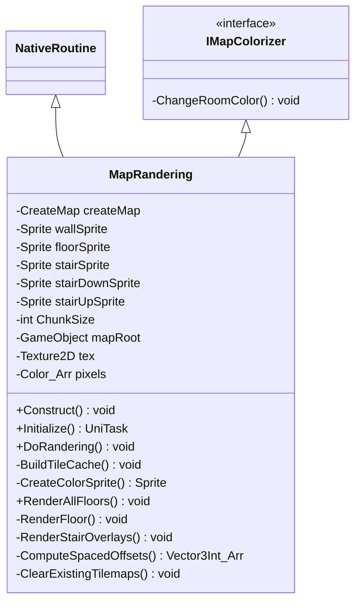

# Package `Randering` UML Class Diagram

**소스 경로:** `Assets/Randering`

### 📋 스크립트 클래스 명세

#### `IMapColorizer` (interface)
- **경로:** `Script/Randering/IMapColorizer.cs`
- **함수:**
  - `-ChangeRoomColor() void`

#### `MapRandering` (class)
- **경로:** `Script/Randering/MapRandering.cs`
- **상속/인터페이스:** `NativeRoutine, IMapColorizer`
- **변수/프로퍼티:**
  - `-CreateMap createMap`
  - `-Sprite wallSprite`
  - `-Sprite floorSprite`
  - `-Sprite stairSprite`
  - `-Sprite stairDownSprite`
  - `-Sprite stairUpSprite`
  - `-int ChunkSize`
  - `-GameObject mapRoot`
  - `-Texture2D tex`
  - `-Color_Arr pixels`
  - `-int floorCount`
  - `-Floor floor`
  - `-GameObject tilemapObj`
  - `-Tilemap tilemap`
  - `-TilemapRenderer renderer`
- **함수:**
  - `+Construct() void`
  - `+Initialize() UniTask`
  - `+DoRandering() void`
  - `-BuildTileCache() void`
  - `-CreateColorSprite() Sprite`
  - `+RenderAllFloors() void`
  - `-RenderFloor() void`
  - `-RenderStairOverlays() void`
  - `-ComputeSpacedOffsets() Vector3Int_Arr`
  - `-ClearExistingTilemaps() void`
  - `+ShowFloor() void`
  - `+ShowAllFloors() void`
  - `+ChangeRoomColor() void`

