# Package `Tests` UML Class Diagram

**소스 경로:** `Assets/Tests`

```mermaid
classDiagram
    class CreateMapPlayTests {
        -var cm
        -return cm
        -var mr
        -return mr
        -var mapRoot
        -Floor floor
        -int w
        -int h
        -Chunks c
        -bool hasStartRoom
        -SetupCreateMap() CreateMap
        -SetupRenderer() MapRandering
        -Cleanup() void
        +InitMap_CreatesFloorArrays() void
        +AllChunks_Have8x8TileArray() void
        +StartRoom_ExistsOnEachFloor() void
        +TileNames_EdgeIsWall_InteriorIsFloor() void
        +InternalWalls_OpenedBetweenSameRoomChunks() void
        +SameSeed_ProducesSameMap() void
        +DifferentSeed_ProducesDifferentMap() void
    }
    class ExplorationSystemTests {
        -float low
        -float higherConcentration
        -float higherLevel
        -float higherUnderstanding
        -float max
        +TrapDisarmSuccessRate_MonotonicAndClamped() void
        +TrapRecordedDirectDisarmThreshold_IsFiftyPercent() void
        +TrapExpectedRateErrorMargin_ShrinksWithUnderstanding() void
        +Parameters_MatchDocumentTable() void
    }
    class GoapPlannerTests {
        -Human _dummyUnit
        -var moveToDoor
        -var openDoor
        -var start
        -var desired
        -List~GoapAction~ plan
        -var expensiveDetour
        -var cheapDirect
        -FakeAction() public
        +Execute() void
        +SetUp() void
        +TearDown() void
        +Plan_ChainsTwoActionsWhenFirstEffectUnlocksSecondPrecondition() void
        +Plan_ReturnsNullWhenGoalUnreachable() void
        +Plan_PicksCheapestPathWhenMultipleSingleStepOptionsExist() void
        +Plan_ReturnsEmptyWhenAlreadySatisfied() void
    }
    class FakeAction {
        -Human _dummyUnit
        -var moveToDoor
        -var openDoor
        -var start
        -var desired
        -List~GoapAction~ plan
        -var expensiveDetour
        -var cheapDirect
        -FakeAction() public
        +Execute() void
        +SetUp() void
        +TearDown() void
        +Plan_ChainsTwoActionsWhenFirstEffectUnlocksSecondPrecondition() void
        +Plan_ReturnsNullWhenGoalUnreachable() void
        +Plan_PicksCheapestPathWhenMultipleSingleStepOptionsExist() void
        +Plan_ReturnsEmptyWhenAlreadySatisfied() void
    }
    GoapAction <|-- FakeAction
    class PerceptionSystemTests {
        -var record
        +DetectionCorrection_AlertAddsTwenty() void
        +GetMentalTier_Boundaries() void
        +MentalVisibilityCorrection_Table() void
        +MentalCorrectionForHuman_UnsetMaxMentalIsStable() void
        +TotalPerceptionVisibility_ExampleFromDoc() void
        -AssertProbabilities() void
        +OutcomeProbabilities_Table() void
        +RollOutcome_SplitsByRollValue() void
        +SuspiciousTileTempWeights_AreFive() void
        +ResolveObjectVisibility_CorpseAndWipeoutAreFixedAt100() void
    }
    class VisionSystemTests {
        -var candidates
        +ViewDistance_Table() void
        +AwarenessDistance_Table() void
        +AwarenessAngle_Table() void
        +AwarenessAngle_MaxedOut_MeansFullVisionConeIsPerceptionCone() void
        +TempWeightForVisionOnlyTile_NonEmptyIsFive() void
        +ResolveBaseVisibility_WallFloorAndOccupant() void
        +FinalVisibility_StealthAndAttackBoost() void
        +FinalVisibility_StealthTable_AllowsNegativeAndKeepsItUnclamped() void
        +CircularPerceptionRadius_Table() void
        +IsHighThreatSurprise_TwiceMeleeExpectedDamage() void
    }
    class WeightSystemTests {
        -float result
        -var ratios
        -var entries
        -var deduped
        -var group
        -float amount
        -var result
        -var rng
        -int noisy
        -bool qualifies
        +PersonalWeightChange_Example() void
        +ReflectionRatio_Example1_WitnessAndIndirect() void
        +ReflectionRatio_Example2_ExperienceAndIndirect() void
        +ReflectionRatio_Example3_WitnessOnly() void
        +Dedup_IdenticalEntries_CollapseToOne() void
        +GlobalReflection_PanicNoiseAveraging_Example() void
        +GlobalReflection_Example1_AllThreeTypes() void
        +GlobalReflection_Example2_WitnessAndIndirectWithDedup() void
        +UnderstandingIncrease_Example() void
        +SpecialUnitUnderstanding_CapsAt50Each() void
    }
```

### 📋 스크립트 클래스 명세

#### `CreateMapPlayTests` (class)
- **경로:** `Tests/CreateMapPlayTests.cs`
- **변수/프로퍼티:**
  - `-var cm`
  - `-return cm`
  - `-var mr`
  - `-return mr`
  - `-var mapRoot`
  - `-var cm`
  - `-var cm`
  - `-Floor floor`
  - `-int w`
  - `-int h`
  - `-Chunks c`
  - `-var cm`
  - `-Floor floor`
  - `-int w`
  - `-int h`
- **함수:**
  - `-SetupCreateMap() CreateMap`
  - `-SetupRenderer() MapRandering`
  - `-Cleanup() void`
  - `+InitMap_CreatesFloorArrays() void`
  - `+AllChunks_Have8x8TileArray() void`
  - `+StartRoom_ExistsOnEachFloor() void`
  - `+TileNames_EdgeIsWall_InteriorIsFloor() void`
  - `+InternalWalls_OpenedBetweenSameRoomChunks() void`
  - `+SameSeed_ProducesSameMap() void`
  - `+DifferentSeed_ProducesDifferentMap() void`
  - `+ConnectedRooms_HaveOpenPassage() void`
  - `+MapRandering_PlacesTilesOnTilemap() void`
  - `+MapRandering_ReturnsGracefully_WhenReferenceMissing() void`
  - `+Floors_HaveCorrectSizes() void`
  - `+Chunks_HaveCorrectFloorId() void`

#### `ExplorationSystemTests` (class)
- **경로:** `Tests/ExplorationSystemTests.cs`
- **변수/프로퍼티:**
  - `-float low`
  - `-float higherConcentration`
  - `-float higherLevel`
  - `-float higherUnderstanding`
  - `-float max`
- **함수:**
  - `+TrapDisarmSuccessRate_MonotonicAndClamped() void`
  - `+TrapRecordedDirectDisarmThreshold_IsFiftyPercent() void`
  - `+TrapExpectedRateErrorMargin_ShrinksWithUnderstanding() void`
  - `+Parameters_MatchDocumentTable() void`

#### `GoapPlannerTests` (class)
- **경로:** `Tests/GoapPlannerTests.cs`
- **변수/프로퍼티:**
  - `-Human _dummyUnit`
  - `-var moveToDoor`
  - `-var openDoor`
  - `-var start`
  - `-var desired`
  - `-List~GoapAction~ plan`
  - `-var openDoor`
  - `-var start`
  - `-var desired`
  - `-List~GoapAction~ plan`
  - `-var expensiveDetour`
  - `-var cheapDirect`
  - `-var start`
  - `-var desired`
  - `-List~GoapAction~ plan`
- **함수:**
  - `-FakeAction() public`
  - `+Execute() void`
  - `+SetUp() void`
  - `+TearDown() void`
  - `+Plan_ChainsTwoActionsWhenFirstEffectUnlocksSecondPrecondition() void`
  - `+Plan_ReturnsNullWhenGoalUnreachable() void`
  - `+Plan_PicksCheapestPathWhenMultipleSingleStepOptionsExist() void`
  - `+Plan_ReturnsEmptyWhenAlreadySatisfied() void`

#### `FakeAction` (class)
- **경로:** `Tests/GoapPlannerTests.cs`
- **상속/인터페이스:** `GoapAction`
- **변수/프로퍼티:**
  - `-Human _dummyUnit`
  - `-var moveToDoor`
  - `-var openDoor`
  - `-var start`
  - `-var desired`
  - `-List~GoapAction~ plan`
  - `-var openDoor`
  - `-var start`
  - `-var desired`
  - `-List~GoapAction~ plan`
  - `-var expensiveDetour`
  - `-var cheapDirect`
  - `-var start`
  - `-var desired`
  - `-List~GoapAction~ plan`
- **함수:**
  - `-FakeAction() public`
  - `+Execute() void`
  - `+SetUp() void`
  - `+TearDown() void`
  - `+Plan_ChainsTwoActionsWhenFirstEffectUnlocksSecondPrecondition() void`
  - `+Plan_ReturnsNullWhenGoalUnreachable() void`
  - `+Plan_PicksCheapestPathWhenMultipleSingleStepOptionsExist() void`
  - `+Plan_ReturnsEmptyWhenAlreadySatisfied() void`

#### `PerceptionSystemTests` (class)
- **경로:** `Tests/PerceptionSystemTests.cs`
- **변수/프로퍼티:**
  - `-var record`
- **함수:**
  - `+DetectionCorrection_AlertAddsTwenty() void`
  - `+GetMentalTier_Boundaries() void`
  - `+MentalVisibilityCorrection_Table() void`
  - `+MentalCorrectionForHuman_UnsetMaxMentalIsStable() void`
  - `+TotalPerceptionVisibility_ExampleFromDoc() void`
  - `-AssertProbabilities() void`
  - `+OutcomeProbabilities_Table() void`
  - `+RollOutcome_SplitsByRollValue() void`
  - `+SuspiciousTileTempWeights_AreFive() void`
  - `+ResolveObjectVisibility_CorpseAndWipeoutAreFixedAt100() void`

#### `VisionSystemTests` (class)
- **경로:** `Tests/VisionSystemTests.cs`
- **변수/프로퍼티:**
  - `-var candidates`
  - `-var candidates`
- **함수:**
  - `+ViewDistance_Table() void`
  - `+AwarenessDistance_Table() void`
  - `+AwarenessAngle_Table() void`
  - `+AwarenessAngle_MaxedOut_MeansFullVisionConeIsPerceptionCone() void`
  - `+TempWeightForVisionOnlyTile_NonEmptyIsFive() void`
  - `+ResolveBaseVisibility_WallFloorAndOccupant() void`
  - `+FinalVisibility_StealthAndAttackBoost() void`
  - `+FinalVisibility_StealthTable_AllowsNegativeAndKeepsItUnclamped() void`
  - `+CircularPerceptionRadius_Table() void`
  - `+IsHighThreatSurprise_TwiceMeleeExpectedDamage() void`
  - `+PriorityRank_Ordering() void`
  - `+ResolveVisionDirection_HigherPriorityWins() void`
  - `+ResolveVisionDirection_TieBreak_ClosestToCurrentDirection() void`
  - `+ResolveVisionDirection_NoCandidates_KeepsCurrentDirection() void`
  - `+DirStepDistance_WrapsAroundCircle() void`

#### `WeightSystemTests` (class)
- **경로:** `Tests/WeightSystemTests.cs`
- **변수/프로퍼티:**
  - `-float result`
  - `-var ratios`
  - `-var ratios`
  - `-var ratios`
  - `-var entries`
  - `-var deduped`
  - `-var group`
  - `-float amount`
  - `-var group`
  - `-float amount`
  - `-var group`
  - `-float amount`
  - `-float result`
  - `-var result`
  - `-var result`
- **함수:**
  - `+PersonalWeightChange_Example() void`
  - `+ReflectionRatio_Example1_WitnessAndIndirect() void`
  - `+ReflectionRatio_Example2_ExperienceAndIndirect() void`
  - `+ReflectionRatio_Example3_WitnessOnly() void`
  - `+Dedup_IdenticalEntries_CollapseToOne() void`
  - `+GlobalReflection_PanicNoiseAveraging_Example() void`
  - `+GlobalReflection_Example1_AllThreeTypes() void`
  - `+GlobalReflection_Example2_WitnessAndIndirectWithDedup() void`
  - `+UnderstandingIncrease_Example() void`
  - `+SpecialUnitUnderstanding_CapsAt50Each() void`
  - `+UnderstandingPoolDecrease_Example() void`
  - `+UnderstandingPoolDecrease_NoOverflow_NoDecrease() void`
  - `+HiddenInfoNoise_Example() void`
  - `+DangerIncrease_Example() void`
  - `+TotalDamageDecrease_Example() void`

