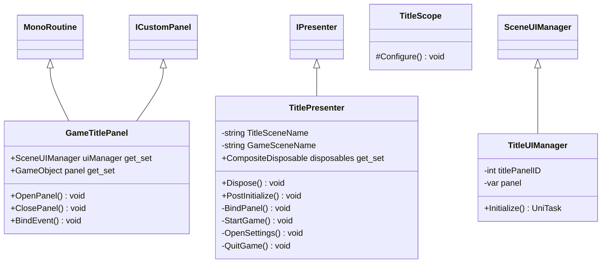

# Package `UI/Title` UML Class Diagram

**소스 경로:** `Assets/UI/Title`

### 📋 스크립트 클래스 명세

#### `GameTitlePanel` (class)
- **경로:** `Script/UI/Title/GameTitlePanel.cs`
- **상속/인터페이스:** `MonoRoutine, ICustomPanel`
- **변수/프로퍼티:**
  - `+SceneUIManager uiManager get_set`
  - `+GameObject panel get_set`
- **함수:**
  - `+OpenPanel() void`
  - `+ClosePanel() void`
  - `+BindEvent() void`

#### `TitlePresenter` (class)
- **경로:** `Script/UI/Title/TitlePresenter.cs`
- **상속/인터페이스:** `IPresenter`
- **변수/프로퍼티:**
  - `-string TitleSceneName`
  - `-string GameSceneName`
  - `+CompositeDisposable disposables get_set`
- **함수:**
  - `+Dispose() void`
  - `+PostInitialize() void`
  - `-BindPanel() void`
  - `-StartGame() void`
  - `-OpenSettings() void`
  - `-QuitGame() void`

#### `TitleScope` (class)
- **경로:** `Script/UI/Title/TitleScope.cs`
- **상속/인터페이스:** `LifetimeScope`
- **함수:**
  - `#Configure() void`

#### `TitleUIManager` (class)
- **경로:** `Script/UI/Title/TitleUIManager.cs`
- **상속/인터페이스:** `SceneUIManager`
- **변수/프로퍼티:**
  - `-int titlePanelID`
  - `-var panel`
- **함수:**
  - `+Initialize() UniTask`

