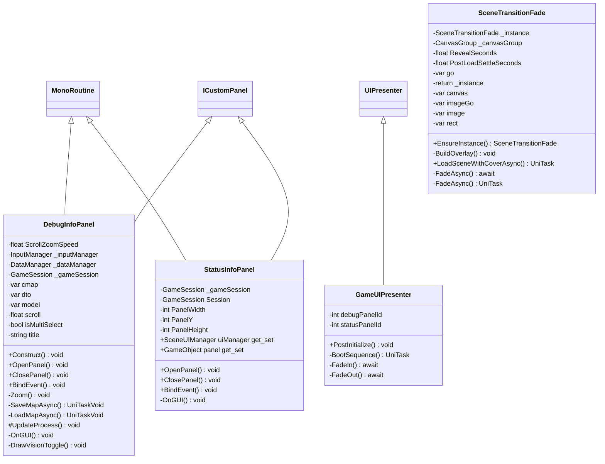

# Package `UI` UML Class Diagram

**소스 경로:** `Assets/UI`

### 📋 스크립트 클래스 명세

#### `DebugInfoPanel` (class)
- **경로:** `Script/UI/DebugInfoPanel.cs`
- **상속/인터페이스:** `MonoRoutine, ICustomPanel`
- **변수/프로퍼티:**
  - `-float ScrollZoomSpeed`
  - `-InputManager _inputManager`
  - `-DataManager _dataManager`
  - `-GameSession _gameSession`
  - `-var cmap`
  - `-var dto`
  - `-var cmap`
  - `-var model`
  - `-float scroll`
  - `-bool isMultiSelect`
  - `-string title`
  - `-Unit u`
  - `-bool current`
  - `-Unit u`
  - `-var sb`
- **함수:**
  - `+Construct() void`
  - `+OpenPanel() void`
  - `+ClosePanel() void`
  - `+BindEvent() void`
  - `-Zoom() void`
  - `-SaveMapAsync() UniTaskVoid`
  - `-LoadMapAsync() UniTaskVoid`
  - `#UpdateProcess() void`
  - `-OnGUI() void`
  - `-DrawVisionToggle() void`
  - `-RefreshSelectedUnitInfo() void`
  - `-BuildMultiSelectListText() string`

#### `GameUIPresenter` (class)
- **경로:** `Script/UI/GameUIPresenter.cs`
- **상속/인터페이스:** `UIPresenter`
- **변수/프로퍼티:**
  - `-int debugPanelId`
  - `-int statusPanelId`
- **함수:**
  - `+PostInitialize() void`
  - `-BootSequence() UniTask`
  - `-FadeIn() await`
  - `-FadeOut() await`
  - `-FadeOut() await`

#### `SceneTransitionFade` (class)
- **경로:** `Script/UI/SceneTransitionFade.cs`
- **상속/인터페이스:** `MonoBehaviour`
- **변수/프로퍼티:**
  - `-SceneTransitionFade _instance`
  - `-CanvasGroup _canvasGroup`
  - `-float RevealSeconds`
  - `-float PostLoadSettleSeconds`
  - `-var go`
  - `-return _instance`
  - `-var canvas`
  - `-var imageGo`
  - `-var image`
  - `-var rect`
  - `-var loadOp`
  - `-await loadOp`
  - `-float t`
- **함수:**
  - `+EnsureInstance() SceneTransitionFade`
  - `-BuildOverlay() void`
  - `+LoadSceneWithCoverAsync() UniTask`
  - `-FadeAsync() await`
  - `-FadeAsync() UniTask`

#### `StatusInfoPanel` (class)
- **경로:** `Script/UI/StatusInfoPanel.cs`
- **상속/인터페이스:** `MonoRoutine, ICustomPanel`
- **변수/프로퍼티:**
  - `-GameSession _gameSession`
  - `-GameSession Session`
  - `-int PanelWidth`
  - `-int PanelY`
  - `-int PanelHeight`
  - `+SceneUIManager uiManager get_set`
  - `+GameObject panel get_set`
- **함수:**
  - `+OpenPanel() void`
  - `+ClosePanel() void`
  - `+BindEvent() void`
  - `-OnGUI() void`

