# GrimArchive Prototype - 전체 스크립트 UML 클래스 다이어그램

본 문서는 프로젝트의 모든 C# 스크립트를 실제 코드 구조(속성, 메소드, 상속 관계, 연관 관계)에 맞춰 구성한 UML 클래스 다이어그램 모음입니다.

- **총 패키지:** 59개
- **총 스크립트/클래스:** 350개

## 📦 Package: `Building`

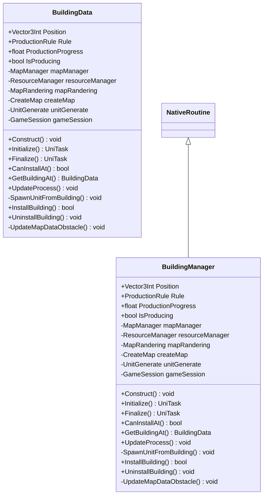
```mermaid
classDiagram
    class BuildingData {
        +Vector3Int Position
        +ProductionRule Rule
        +float ProductionProgress
        +bool IsProducing
        -MapManager mapManager
        -ResourceManager resourceManager
        -MapRandering mapRandering
        -CreateMap createMap
        -UnitGenerate unitGenerate
        -GameSession gameSession
        +Construct() void
        +Initialize() UniTask
        +Finalize() UniTask
        +CanInstallAt() bool
        +GetBuildingAt() BuildingData
        +UpdateProcess() void
        -SpawnUnitFromBuilding() void
        +InstallBuilding() bool
        +UninstallBuilding() void
        -UpdateMapDataObstacle() void
    }
    class BuildingManager {
        +Vector3Int Position
        +ProductionRule Rule
        +float ProductionProgress
        +bool IsProducing
        -MapManager mapManager
        -ResourceManager resourceManager
        -MapRandering mapRandering
        -CreateMap createMap
        -UnitGenerate unitGenerate
        -GameSession gameSession
        +Construct() void
        +Initialize() UniTask
        +Finalize() UniTask
        +CanInstallAt() bool
        +GetBuildingAt() BuildingData
        +UpdateProcess() void
        -SpawnUnitFromBuilding() void
        +InstallBuilding() bool
        +UninstallBuilding() void
        -UpdateMapDataObstacle() void
    }
    NativeRoutine <|-- BuildingManager
```

## 📦 Package: `Camera`

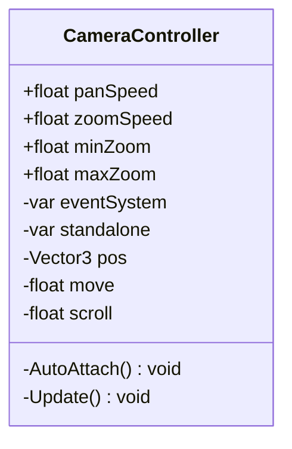
```mermaid
classDiagram
    class CameraController {
        +float panSpeed
        +float zoomSpeed
        +float minZoom
        +float maxZoom
        -var eventSystem
        -var standalone
        -Vector3 pos
        -float move
        -float scroll
        -AutoAttach() void
        -Update() void
    }
```

## 📦 Package: `Editor`


```mermaid
classDiagram
    class EncyclopediaSetup {
        -string prefabPath
        -string addressableKey
        -GameObject prefab
        -AddressableAssetSettings settings
        -AddressableAssetGroup group
        -string guid
        -AddressableAssetEntry entry
        -bool found
        -var entries
        +FixAddressables() void
        +RemoveAddressables() void
    }
    class HaareDemoSetup {
        -string PrefabFolder
        -string SceneFolder
        -string_Arr Scenes
        -var settings
        -var group
        -string scenePath
        -int removedCount
        -var entries
        -bool shouldRemove
        -string guid
        +SetupHaareDemoAddressables() void
        +RemoveHaareDemoAddressables() void
        -RegisterEntry() void
    }
    class HaareUIAddressableSetupWindow {
        -string _prefabName
        -var window
        -string prefabPath
        -string addressableKey
        -GameObject prefab
        -AddressableAssetSettings settings
        -AddressableAssetGroup group
        -string guid
        -AddressableAssetEntry entry
        -bool found
        +ShowWindow() void
        -OnGUI() void
        -RegisterAddressable() void
        -RemoveAddressable() void
    }
    class HaareUISetup {
        -string OutputFolder
        -string CoreCanvasAddress
        -string DebugPanelAddress
        -string LoadingFadePanelAddress
        -string ScenePath
        -string KoreanFontPath
        -GameObject canvasPrefab
        -GameObject panelPrefab
        -GameObject fadePanelPrefab
        -var root
        +SetupHaareUI() void
        -CreateCoreCanvasPrefab() GameObject
        -CreateDebugInfoPanelPrefab() GameObject
        -CreateLoadingFadePanelPrefab() GameObject
        -CreateCustomButton() GameObject
        -RegisterAddressable() void
        -WireCompositionRoot() void
        -GetKoreanFont() TMP_FontAsset
    }
    class JsonToUnitPrefabConverter {
        -string UnitsJsonPath
        -string SkillsJsonPath
        -string OutputFolder
        +bool isSpecialUnit
        +bool isInterestTarget
        +float baseInterest
        +float baseDanger
        +float heavyHitThreshold
        +float stealth
        +float baseVisibility
        +ConvertJsonToPrefabs() void
        -CreateFolderRecursive() void
        -SanitizeFileName() string
    }
    JsonToUnitPrefabConverter --> JsonEffectsData
    JsonToUnitPrefabConverter --> JsonWeaponData
    JsonToUnitPrefabConverter --> JsonWeightData
    JsonToUnitPrefabConverter --> JsonVisualData
    class JsonWeightData {
        -string UnitsJsonPath
        -string SkillsJsonPath
        -string OutputFolder
        +bool isSpecialUnit
        +bool isInterestTarget
        +float baseInterest
        +float baseDanger
        +float heavyHitThreshold
        +float stealth
        +float baseVisibility
        +ConvertJsonToPrefabs() void
        -CreateFolderRecursive() void
        -SanitizeFileName() string
    }
    JsonWeightData --> JsonWeaponData
    JsonWeightData --> JsonVisualData
    JsonWeightData --> JsonEffectsData
    class JsonWeaponData {
        -string UnitsJsonPath
        -string SkillsJsonPath
        -string OutputFolder
        +bool isSpecialUnit
        +bool isInterestTarget
        +float baseInterest
        +float baseDanger
        +float heavyHitThreshold
        +float stealth
        +float baseVisibility
        +ConvertJsonToPrefabs() void
        -CreateFolderRecursive() void
        -SanitizeFileName() string
    }
    JsonWeaponData --> JsonWeightData
    JsonWeaponData --> JsonVisualData
    JsonWeaponData --> JsonEffectsData
    class JsonEffectsData {
        -string UnitsJsonPath
        -string SkillsJsonPath
        -string OutputFolder
        +bool isSpecialUnit
        +bool isInterestTarget
        +float baseInterest
        +float baseDanger
        +float heavyHitThreshold
        +float stealth
        +float baseVisibility
        +ConvertJsonToPrefabs() void
        -CreateFolderRecursive() void
        -SanitizeFileName() string
    }
    JsonEffectsData --> JsonWeaponData
    JsonEffectsData --> JsonWeightData
    JsonEffectsData --> JsonVisualData
    class JsonVisualData {
        -string UnitsJsonPath
        -string SkillsJsonPath
        -string OutputFolder
        +bool isSpecialUnit
        +bool isInterestTarget
        +float baseInterest
        +float baseDanger
        +float heavyHitThreshold
        +float stealth
        +float baseVisibility
        +ConvertJsonToPrefabs() void
        -CreateFolderRecursive() void
        -SanitizeFileName() string
    }
    JsonVisualData --> JsonWeaponData
    JsonVisualData --> JsonWeightData
    JsonVisualData --> JsonEffectsData
    class JsonUnitData {
        -string UnitsJsonPath
        -string SkillsJsonPath
        -string OutputFolder
        +bool isSpecialUnit
        +bool isInterestTarget
        +float baseInterest
        +float baseDanger
        +float heavyHitThreshold
        +float stealth
        +float baseVisibility
        +ConvertJsonToPrefabs() void
        -CreateFolderRecursive() void
        -SanitizeFileName() string
    }
    JsonUnitData --> JsonEffectsData
    JsonUnitData --> JsonWeaponData
    JsonUnitData --> JsonWeightData
    JsonUnitData --> JsonVisualData
    class JsonUnitDatabase {
        -string UnitsJsonPath
        -string SkillsJsonPath
        -string OutputFolder
        +bool isSpecialUnit
        +bool isInterestTarget
        +float baseInterest
        +float baseDanger
        +float heavyHitThreshold
        +float stealth
        +float baseVisibility
        +ConvertJsonToPrefabs() void
        -CreateFolderRecursive() void
        -SanitizeFileName() string
    }
    JsonUnitDatabase --> JsonEffectsData
    JsonUnitDatabase --> JsonWeaponData
    JsonUnitDatabase --> JsonWeightData
    JsonUnitDatabase --> JsonVisualData
    class JsonSkillData {
        -string UnitsJsonPath
        -string SkillsJsonPath
        -string OutputFolder
        +bool isSpecialUnit
        +bool isInterestTarget
        +float baseInterest
        +float baseDanger
        +float heavyHitThreshold
        +float stealth
        +float baseVisibility
        +ConvertJsonToPrefabs() void
        -CreateFolderRecursive() void
        -SanitizeFileName() string
    }
    JsonSkillData --> JsonEffectsData
    JsonSkillData --> JsonWeaponData
    JsonSkillData --> JsonWeightData
    JsonSkillData --> JsonVisualData
    class JsonSkillDatabase {
        -string UnitsJsonPath
        -string SkillsJsonPath
        -string OutputFolder
        +bool isSpecialUnit
        +bool isInterestTarget
        +float baseInterest
        +float baseDanger
        +float heavyHitThreshold
        +float stealth
        +float baseVisibility
        +ConvertJsonToPrefabs() void
        -CreateFolderRecursive() void
        -SanitizeFileName() string
    }
    JsonSkillDatabase --> JsonEffectsData
    JsonSkillDatabase --> JsonWeaponData
    JsonSkillDatabase --> JsonWeightData
    JsonSkillDatabase --> JsonVisualData
    class MapGeneratorTool {
        -CreateMap cm
        -bool showGizmoSettings
        -GUIStyle sectionHeaderStyle
        -GUIStyle boxStyle
        -string errMsg
        -bool hasMap
        -string dirPath
        -string path
        -string defaultName
        -bool isSelected
        +ShowWindow() void
        -OnEnable() void
        -OnGUI() void
        -InitStyles() void
        -DrawDefaultProperties() void
        -DrawGenerateButton() void
        -DrawValidationResult() void
        -DrawSaveLoadButtons() void
        -DrawGizmoSettings() void
        -DrawGizmoFloorSelector() void
    }
    class MapViewTool {
        -CreateMap cm
        -int selectedFloor
        -int selectedChunkX
        -int selectedChunkY
        -int selectedTileX
        -int selectedTileY
        -Vector2 chunkScrollPos
        -Vector2 tileScrollPos
        -bool showChunkGrid
        -bool showTileGrid
        +ShowWindow() void
        -OnEnable() void
        -OnDisable() void
        -OnPlayModeStateChanged() void
        -OnMapUpdated() void
        -OnGUI() void
        -InitStyles() void
        -DrawFloorSelector() void
        -DrawChunkGrid() void
        -DrawTileGrid() void
    }
    class ProjectileSetupTool {
        -GameObject selectedPrefab
        -string assetPath
        -GameObject instance
        -bool modified
        -var rb
        -var colliders
        -var proj
        -var sr
        +ShowWindow() void
        -OnGUI() void
        -SetupProjectilePrefab() void
    }
    class TestMapGen {
        -CreateMap cm
        +Run() void
    }
    class TitleSceneSetup {
        -string PrefabFolder
        -string TitlePanelPrefabPath
        -string TitlePanelAddress
        -string TitleScenePath
        -string SshScenePath
        -string KoreanFontPath
        -Color BackgroundColor
        -Color TitleColor
        -Color ButtonLabelColor
        -GameObject panelPrefab
        +SetupTitleScene() void
        -CreateTitlePanelPrefab() GameObject
        -CreateTitleButton() GameObject
        -BuildAndSaveTitleScene() void
        -WireDefaultUIActions() void
        -AddSceneToBuildSettings() void
        -RegisterAddressable() void
        -GetKoreanFont() TMP_FontAsset
    }
    class UnitVisualEditor {
        -var visual
        -var tex
        -Rect rect
        +OnInspectorGUI() void
    }
    class WeaponSocketSetup {
        -GameObject unitPrefab
        -Sprite weaponSprite
        -string socketName
        -string path
        -GameObject root
        -Transform visual
        -Transform existing
        -GameObject socketGo
        -SpriteRenderer sr
        +ShowWindow() void
        -OnGUI() void
        -AddWeaponSocket() void
    }
    class AddressablesPlayModeSetup {
        -var settings
        -int targetIndex
        -AddressablesPlayModeSetup() static
        +SetPlayModeToAssetDatabase() void
    }
    class OffenseDebugWindow {
        -GameSession _gameSession
        -var root
        -return _gameSession
        -float _customWaveCooldown
        -int _addResourceAmount
        -Room _dummyRoom
        -int randomIndex
        -return null
        -Room targetRoom
        -Vector2Int spawnPos
        +ShowWindow() void
        -OnGUI() void
        -GetRandomRealRoom() Room
    }
    class SetupStatusInfoPanel {
        -string folderPath
        -string prefabPath
        -GameObject go
        -GameObject prefab
        -AddressableAssetSettings settings
        -AddressableAssetGroup group
        -string guid
        -AddressableAssetEntry entry
        +Setup() void
    }
```

## 📦 Package: `Encyclopedia`

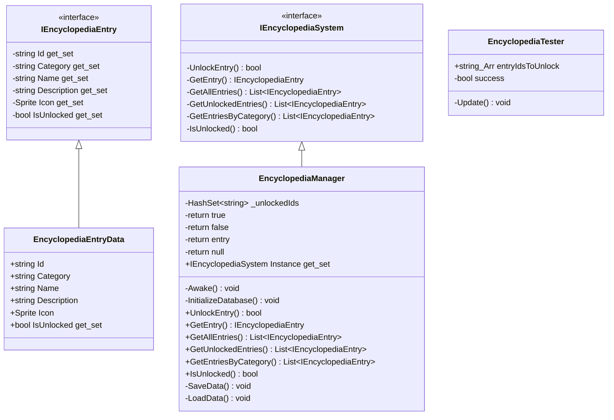
```mermaid
classDiagram
    class EncyclopediaEntryData {
        +string Id
        +string Category
        +string Name
        +string Description
        +Sprite Icon
        +bool IsUnlocked get_set
    }
    IEncyclopediaEntry <|-- EncyclopediaEntryData
    class EncyclopediaManager {
        -HashSet~string~ _unlockedIds
        -return true
        -return false
        -return entry
        -return null
        +IEncyclopediaSystem Instance get_set
        -Awake() void
        -InitializeDatabase() void
        +UnlockEntry() bool
        +GetEntry() IEncyclopediaEntry
        +GetAllEntries() List~IEncyclopediaEntry~
        +GetUnlockedEntries() List~IEncyclopediaEntry~
        +GetEntriesByCategory() List~IEncyclopediaEntry~
        +IsUnlocked() bool
        -SaveData() void
        -LoadData() void
    }
    IEncyclopediaSystem <|-- EncyclopediaManager
    class EncyclopediaTester {
        +string_Arr entryIdsToUnlock
        -bool success
        -Update() void
    }
    class IEncyclopediaEntry {
        <<interface>>
        -string Id get_set
        -string Category get_set
        -string Name get_set
        -string Description get_set
        -Sprite Icon get_set
        -bool IsUnlocked get_set
    }
    class IEncyclopediaSystem {
        <<interface>>
        -UnlockEntry() bool
        -GetEntry() IEncyclopediaEntry
        -GetAllEntries() List~IEncyclopediaEntry~
        -GetUnlockedEntries() List~IEncyclopediaEntry~
        -GetEntriesByCategory() List~IEncyclopediaEntry~
        -IsUnlocked() bool
    }
```

## 📦 Package: `Encyclopedia/UI`

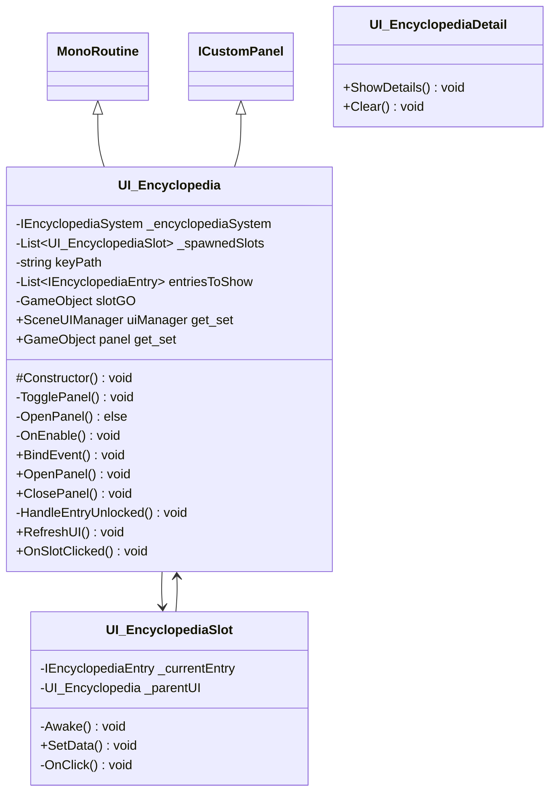
```mermaid
classDiagram
    class UI_Encyclopedia {
        -IEncyclopediaSystem _encyclopediaSystem
        -List~UI_EncyclopediaSlot~ _spawnedSlots
        -string keyPath
        -List~IEncyclopediaEntry~ entriesToShow
        -GameObject slotGO
        +SceneUIManager uiManager get_set
        +GameObject panel get_set
        #Constructor() void
        -TogglePanel() void
        -OpenPanel() else
        -OnEnable() void
        +BindEvent() void
        +OpenPanel() void
        +ClosePanel() void
        -HandleEntryUnlocked() void
        +RefreshUI() void
        +OnSlotClicked() void
    }
    MonoRoutine <|-- UI_Encyclopedia
    ICustomPanel <|-- UI_Encyclopedia
    UI_Encyclopedia --> UI_EncyclopediaSlot
    class UI_EncyclopediaDetail {
        +ShowDetails() void
        +Clear() void
    }
    class UI_EncyclopediaSlot {
        -IEncyclopediaEntry _currentEntry
        -UI_Encyclopedia _parentUI
        -Awake() void
        +SetData() void
        -OnClick() void
    }
    UI_EncyclopediaSlot --> UI_Encyclopedia
```

## 📦 Package: `Haare/Demo/Script`

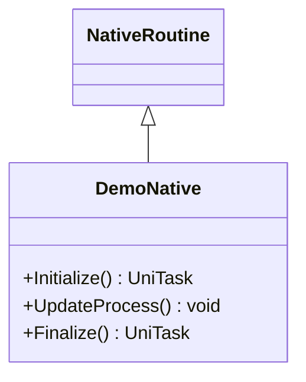
```mermaid
classDiagram
    class DemoNative {
        +Initialize() UniTask
        +UpdateProcess() void
        +Finalize() UniTask
    }
    NativeRoutine <|-- DemoNative
```

## 📦 Package: `Haare/Demo/Script/LoadScene`

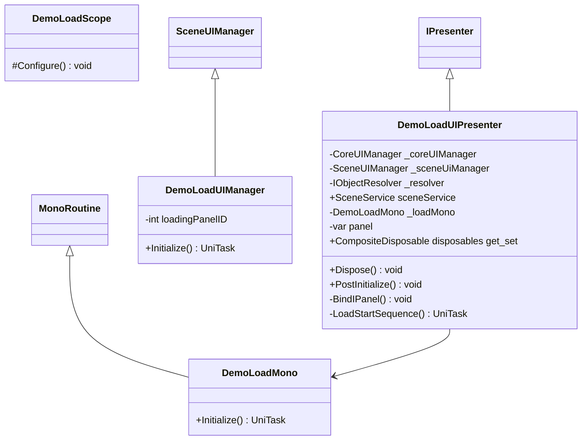
```mermaid
classDiagram
    class DemoLoadMono {
        +Initialize() UniTask
    }
    MonoRoutine <|-- DemoLoadMono
    class DemoLoadScope {
        #Configure() void
    }
    class DemoLoadUIManager {
        -int loadingPanelID
        +Initialize() UniTask
    }
    SceneUIManager <|-- DemoLoadUIManager
    class DemoLoadUIPresenter {
        -CoreUIManager _coreUIManager
        -SceneUIManager _sceneUiManager
        -IObjectResolver _resolver
        +SceneService sceneService
        -DemoLoadMono _loadMono
        -var panel
        +CompositeDisposable disposables get_set
        +Dispose() void
        +PostInitialize() void
        -BindIPanel() void
        -LoadStartSequence() UniTask
    }
    IPresenter <|-- DemoLoadUIPresenter
    DemoLoadUIPresenter --> DemoLoadMono
```

## 📦 Package: `Haare/Demo/Script/LobbyScene`

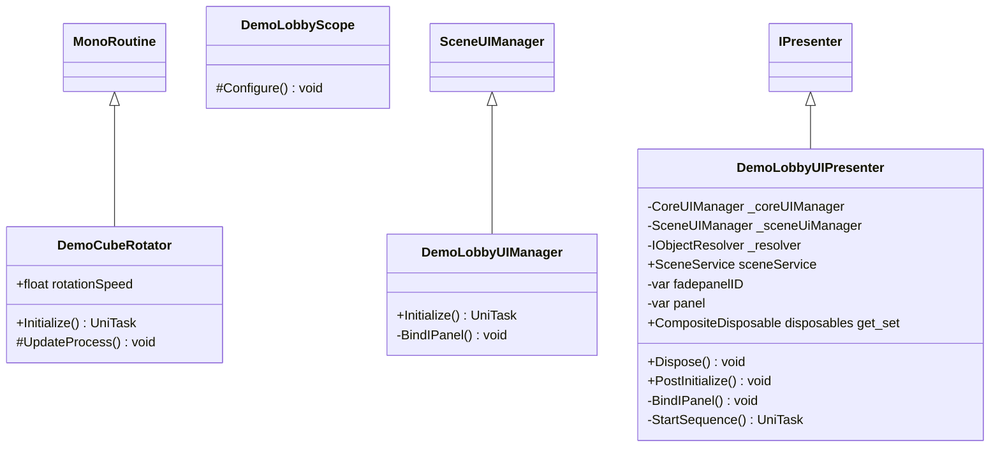
```mermaid
classDiagram
    class DemoCubeRotator {
        +float rotationSpeed
        +Initialize() UniTask
        #UpdateProcess() void
    }
    MonoRoutine <|-- DemoCubeRotator
    class DemoLobbyScope {
        #Configure() void
    }
    class DemoLobbyUIManager {
        +Initialize() UniTask
        -BindIPanel() void
    }
    SceneUIManager <|-- DemoLobbyUIManager
    class DemoLobbyUIPresenter {
        -CoreUIManager _coreUIManager
        -SceneUIManager _sceneUiManager
        -IObjectResolver _resolver
        +SceneService sceneService
        -var fadepanelID
        -var panel
        +CompositeDisposable disposables get_set
        +Dispose() void
        +PostInitialize() void
        -BindIPanel() void
        -StartSequence() UniTask
    }
    IPresenter <|-- DemoLobbyUIPresenter
```

## 📦 Package: `Haare/Demo/Script/TitleScene`

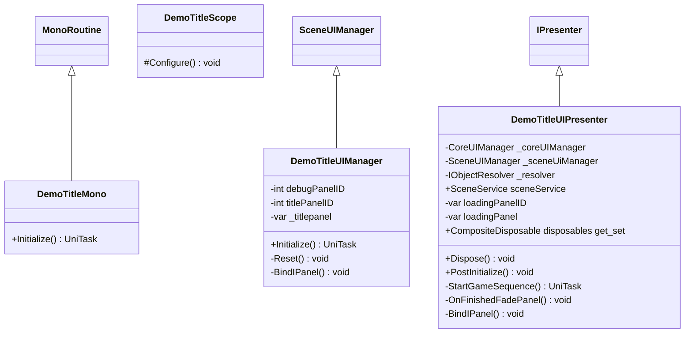
```mermaid
classDiagram
    class DemoTitleMono {
        +Initialize() UniTask
    }
    MonoRoutine <|-- DemoTitleMono
    class DemoTitleScope {
        #Configure() void
    }
    class DemoTitleUIManager {
        -int debugPanelID
        -int titlePanelID
        -var _titlepanel
        +Initialize() UniTask
        -Reset() void
        -BindIPanel() void
    }
    SceneUIManager <|-- DemoTitleUIManager
    class DemoTitleUIPresenter {
        -CoreUIManager _coreUIManager
        -SceneUIManager _sceneUiManager
        -IObjectResolver _resolver
        +SceneService sceneService
        -var loadingPanelID
        -var loadingPanel
        +CompositeDisposable disposables get_set
        +Dispose() void
        +PostInitialize() void
        -StartGameSequence() UniTask
        -OnFinishedFadePanel() void
        -BindIPanel() void
    }
    IPresenter <|-- DemoTitleUIPresenter
```

## 📦 Package: `Haare/Demo/Script/UI`

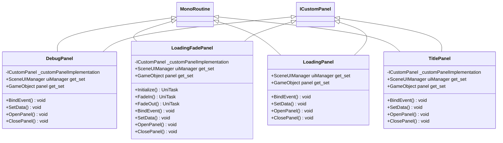
```mermaid
classDiagram
    class DebugPanel {
        -ICustomPanel _customPanelImplementation
        +SceneUIManager uiManager get_set
        +GameObject panel get_set
        +BindEvent() void
        +SetData() void
        +OpenPanel() void
        +ClosePanel() void
    }
    MonoRoutine <|-- DebugPanel
    ICustomPanel <|-- DebugPanel
    class LoadingFadePanel {
        -ICustomPanel _customPanelImplementation
        +SceneUIManager uiManager get_set
        +GameObject panel get_set
        +Initialize() UniTask
        +FadeIn() UniTask
        +FadeOut() UniTask
        +BindEvent() void
        +SetData() void
        +OpenPanel() void
        +ClosePanel() void
    }
    MonoRoutine <|-- LoadingFadePanel
    ICustomPanel <|-- LoadingFadePanel
    class LoadingPanel {
        +SceneUIManager uiManager get_set
        +GameObject panel get_set
        +BindEvent() void
        +SetData() void
        +OpenPanel() void
        +ClosePanel() void
    }
    MonoRoutine <|-- LoadingPanel
    ICustomPanel <|-- LoadingPanel
    class TitlePanel {
        -ICustomPanel _customPanelImplementation
        +SceneUIManager uiManager get_set
        +GameObject panel get_set
        +BindEvent() void
        +SetData() void
        +OpenPanel() void
        +ClosePanel() void
    }
    MonoRoutine <|-- TitlePanel
    ICustomPanel <|-- TitlePanel
```

## 📦 Package: `Haare/Editor`

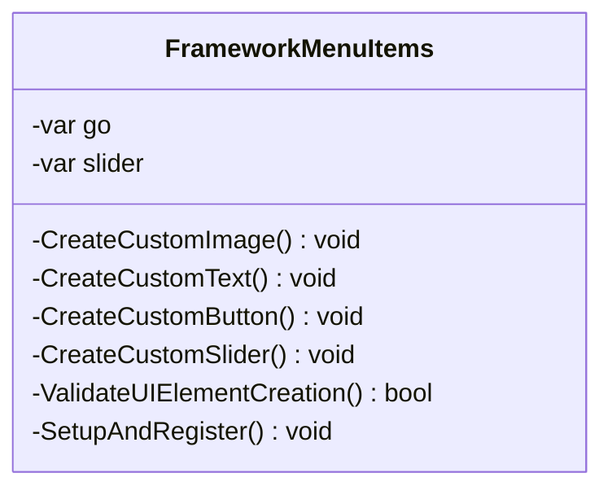
```mermaid
classDiagram
    class FrameworkMenuItems {
        -var go
        -var slider
        -CreateCustomImage() void
        -CreateCustomText() void
        -CreateCustomButton() void
        -CreateCustomSlider() void
        -ValidateUIElementCreation() bool
        -SetupAndRegister() void
    }
```

## 📦 Package: `Haare/Editor/UI`

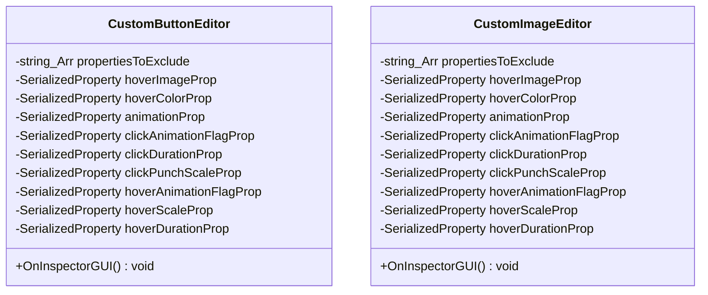
```mermaid
classDiagram
    class CustomButtonEditor {
        -string_Arr propertiesToExclude
        -SerializedProperty hoverImageProp
        -SerializedProperty hoverColorProp
        -SerializedProperty animationProp
        -SerializedProperty clickAnimationFlagProp
        -SerializedProperty clickDurationProp
        -SerializedProperty clickPunchScaleProp
        -SerializedProperty hoverAnimationFlagProp
        -SerializedProperty hoverScaleProp
        -SerializedProperty hoverDurationProp
        +OnInspectorGUI() void
    }
    class CustomImageEditor {
        -string_Arr propertiesToExclude
        -SerializedProperty hoverImageProp
        -SerializedProperty hoverColorProp
        -SerializedProperty animationProp
        -SerializedProperty clickAnimationFlagProp
        -SerializedProperty clickDurationProp
        -SerializedProperty clickPunchScaleProp
        -SerializedProperty hoverAnimationFlagProp
        -SerializedProperty hoverScaleProp
        -SerializedProperty hoverDurationProp
        +OnInspectorGUI() void
    }
```

## 📦 Package: `Haare/Scripts/Client/Core`

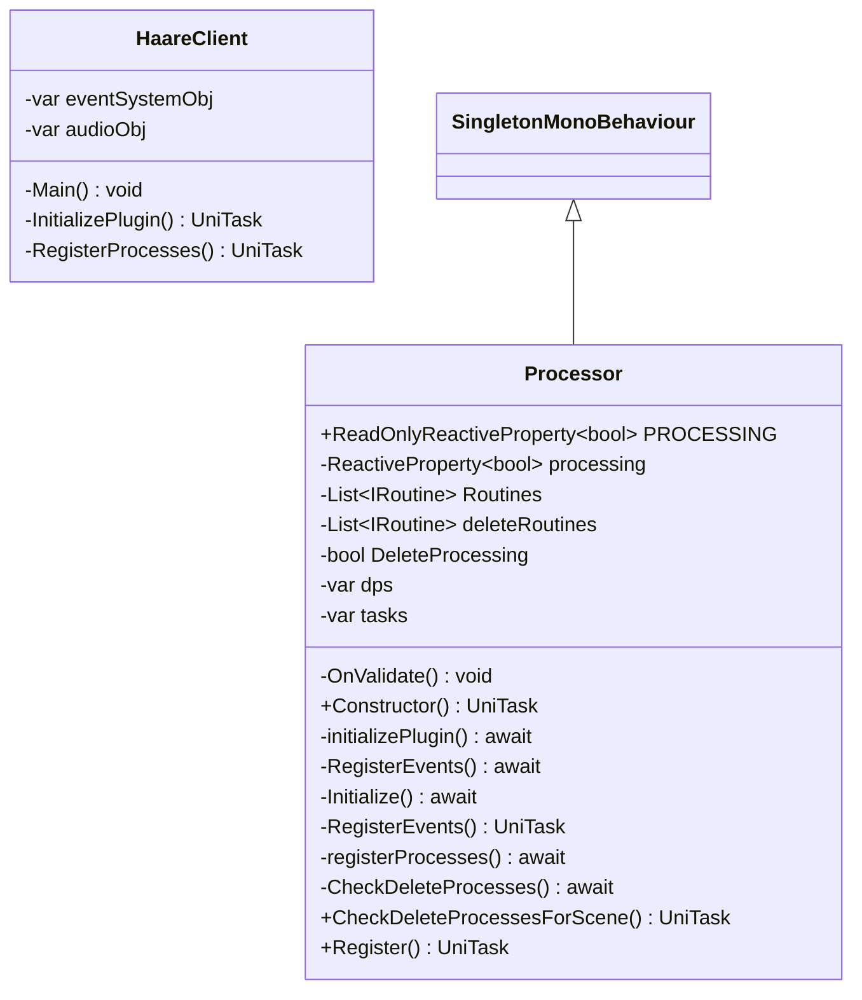
```mermaid
classDiagram
    class HaareClient {
        -var eventSystemObj
        -var audioObj
        -Main() void
        -InitializePlugin() UniTask
        -RegisterProcesses() UniTask
    }
    class Processor {
        +ReadOnlyReactiveProperty~bool~ PROCESSING
        -ReactiveProperty~bool~ processing
        -List~IRoutine~ Routines
        -List~IRoutine~ deleteRoutines
        -bool DeleteProcessing
        -var dps
        -var tasks
        -OnValidate() void
        +Constructor() UniTask
        -initializePlugin() await
        -RegisterEvents() await
        -Initialize() await
        -RegisterEvents() UniTask
        -registerProcesses() await
        -CheckDeleteProcesses() await
        +CheckDeleteProcessesForScene() UniTask
        +Register() UniTask
    }
    SingletonMonoBehaviour <|-- Processor
```

## 📦 Package: `Haare/Scripts/Client/Core/Singleton`

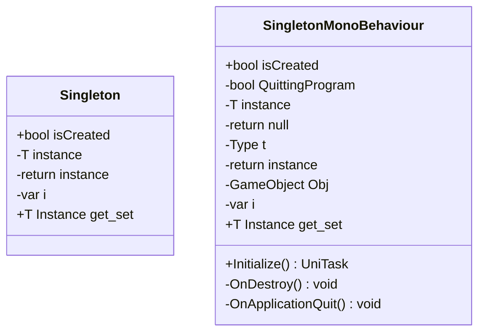
```mermaid
classDiagram
    class Singleton {
        +bool isCreated
        -T instance
        -return instance
        -var i
        +T Instance get_set
    }
    class SingletonMonoBehaviour {
        +bool isCreated
        -bool QuittingProgram
        -T instance
        -return null
        -Type t
        -return instance
        -GameObject Obj
        -var i
        +T Instance get_set
        +Initialize() UniTask
        -OnDestroy() void
        -OnApplicationQuit() void
    }
```

## 📦 Package: `Haare/Scripts/Client/DI/Container`

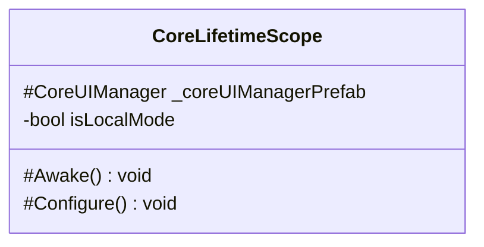
```mermaid
classDiagram
    class CoreLifetimeScope {
        #CoreUIManager _coreUIManagerPrefab
        -bool isLocalMode
        #Awake() void
        #Configure() void
    }
```

## 📦 Package: `Haare/Scripts/Client/DI/Presenter`

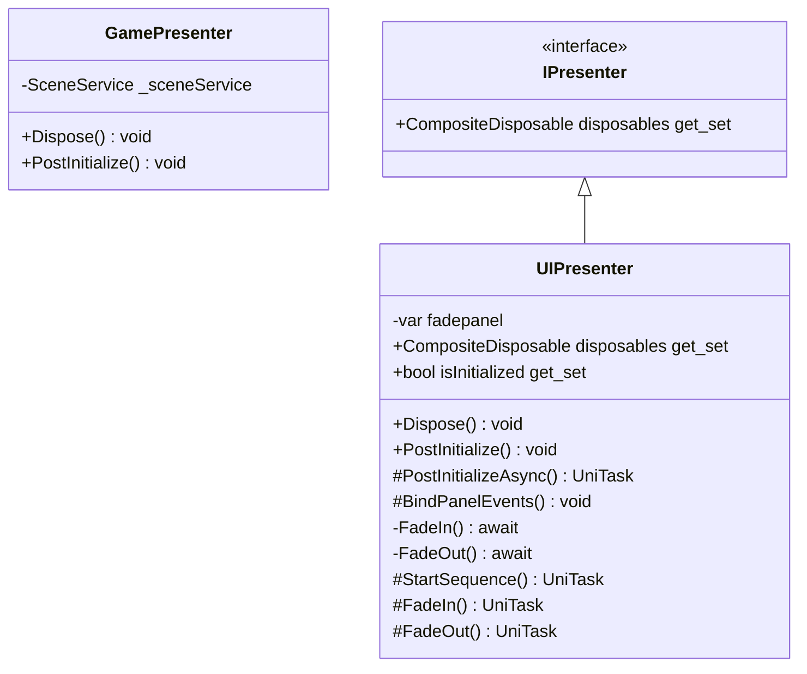
```mermaid
classDiagram
    class GamePresenter {
        -SceneService _sceneService
        +Dispose() void
        +PostInitialize() void
    }
    class IPresenter {
        <<interface>>
        +CompositeDisposable disposables get_set
    }
    class UIPresenter {
        -var fadepanel
        +CompositeDisposable disposables get_set
        +bool isInitialized get_set
        +Dispose() void
        +PostInitialize() void
        #PostInitializeAsync() UniTask
        #BindPanelEvents() void
        -FadeIn() await
        -FadeOut() await
        #StartSequence() UniTask
        #FadeIn() UniTask
        #FadeOut() UniTask
    }
    IPresenter <|-- UIPresenter
```

## 📦 Package: `Haare/Scripts/Client/Data`

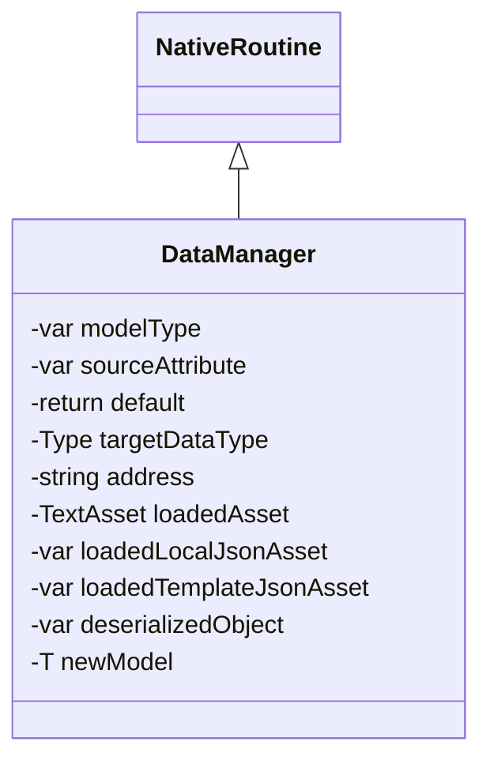
```mermaid
classDiagram
    class DataManager {
        -var modelType
        -var sourceAttribute
        -return default
        -Type targetDataType
        -string address
        -TextAsset loadedAsset
        -var loadedLocalJsonAsset
        -var loadedTemplateJsonAsset
        -var deserializedObject
        -T newModel
    }
    NativeRoutine <|-- DataManager
```

## 📦 Package: `Haare/Scripts/Client/Data/Attribute`

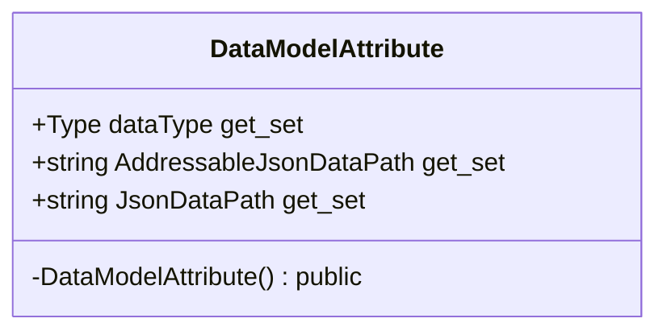
```mermaid
classDiagram
    class DataModelAttribute {
        +Type dataType get_set
        +string AddressableJsonDataPath get_set
        +string JsonDataPath get_set
        -DataModelAttribute() public
    }
```

## 📦 Package: `Haare/Scripts/Client/Data/interface`

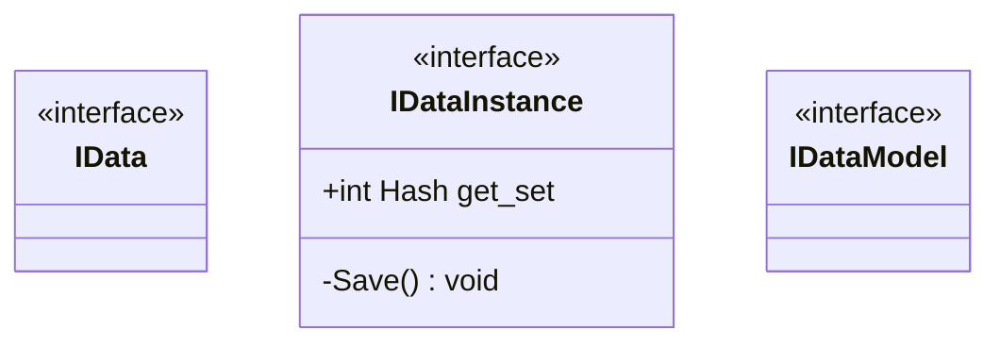
```mermaid
classDiagram
    class IData {
        <<interface>>
    }
    class IDataInstance {
        <<interface>>
        +int Hash get_set
        -Save() void
    }
    class IDataModel {
        <<interface>>
    }
```

## 📦 Package: `Haare/Scripts/Client/Routine`

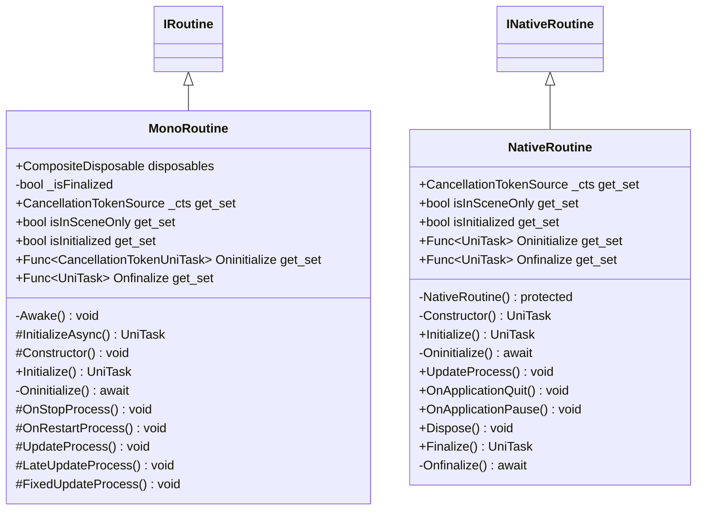
```mermaid
classDiagram
    class MonoRoutine {
        +CompositeDisposable disposables
        -bool _isFinalized
        +CancellationTokenSource _cts get_set
        +bool isInSceneOnly get_set
        +bool isInitialized get_set
        +Func~CancellationTokenUniTask~ Oninitialize get_set
        +Func~UniTask~ Onfinalize get_set
        -Awake() void
        #InitializeAsync() UniTask
        #Constructor() void
        +Initialize() UniTask
        -Oninitialize() await
        #OnStopProcess() void
        #OnRestartProcess() void
        #UpdateProcess() void
        #LateUpdateProcess() void
        #FixedUpdateProcess() void
    }
    IRoutine <|-- MonoRoutine
    class NativeRoutine {
        +CancellationTokenSource _cts get_set
        +bool isInSceneOnly get_set
        +bool isInitialized get_set
        +Func~UniTask~ Oninitialize get_set
        +Func~UniTask~ Onfinalize get_set
        -NativeRoutine() protected
        -Constructor() UniTask
        +Initialize() UniTask
        -Oninitialize() await
        +UpdateProcess() void
        +OnApplicationQuit() void
        +OnApplicationPause() void
        +Dispose() void
        +Finalize() UniTask
        -Onfinalize() await
    }
    INativeRoutine <|-- NativeRoutine
```

## 📦 Package: `Haare/Scripts/Client/Routine/Service/SceneService`

```mermaid
classDiagram
    class SceneLoadRequest {
        +SceneName Scene get_set
        +LoadSceneMode Mode get_set
        +object Argument get_set
        -SceneLoadRequest() public
    }
    class SceneName {
        <<enum>>
        -CoreUIManager _coreUIManager
        -SceneName sceneToUnload
        -ReactiveProperty~SceneLoadPhase~ currentPhaseReactive
        +ReactiveProperty~SceneLoadPhase~ CurrentPhase
        -ReactiveProperty~float~ _loadProgress
        +ReadOnlyReactiveProperty~float~ LoadProgress
        +SceneLoadRequest LoadSceneRequest
        -SceneLoadRequest req
        -var loadOperation
        -var loadSceneTask
        +Initialize() UniTask
        +LoadSceneWithLoad() UniTask
        -LoadSceneInternal() await
        +LoadScene() UniTask
        -LoadSceneInternal() UniTask
        -ExitLoadingSceneTask() await
        -LoadSceneProgressTask() await
        -ExitLoadingSceneTask() UniTask
        -LoadSceneProgressTask() UniTask
        -FakeLoadingProgressTask() UniTask
    }
    SceneName --> SceneLoadPhase
    SceneName --> SceneLoadRequest
    class SceneLoadPhase {
        <<enum>>
        -CoreUIManager _coreUIManager
        -SceneName sceneToUnload
        -ReactiveProperty~SceneLoadPhase~ currentPhaseReactive
        +ReactiveProperty~SceneLoadPhase~ CurrentPhase
        -ReactiveProperty~float~ _loadProgress
        +ReadOnlyReactiveProperty~float~ LoadProgress
        +SceneLoadRequest LoadSceneRequest
        -SceneLoadRequest req
        -var loadOperation
        -var loadSceneTask
        +Initialize() UniTask
        +LoadSceneWithLoad() UniTask
        -LoadSceneInternal() await
        +LoadScene() UniTask
        -LoadSceneInternal() UniTask
        -ExitLoadingSceneTask() await
        -LoadSceneProgressTask() await
        -ExitLoadingSceneTask() UniTask
        -LoadSceneProgressTask() UniTask
        -FakeLoadingProgressTask() UniTask
    }
    SceneLoadPhase --> SceneName
    SceneLoadPhase --> SceneLoadRequest
    class SceneService {
        -CoreUIManager _coreUIManager
        -SceneName sceneToUnload
        -ReactiveProperty~SceneLoadPhase~ currentPhaseReactive
        +ReactiveProperty~SceneLoadPhase~ CurrentPhase
        -ReactiveProperty~float~ _loadProgress
        +ReadOnlyReactiveProperty~float~ LoadProgress
        +SceneLoadRequest LoadSceneRequest
        -SceneLoadRequest req
        -var loadOperation
        -var loadSceneTask
        +Initialize() UniTask
        +LoadSceneWithLoad() UniTask
        -LoadSceneInternal() await
        +LoadScene() UniTask
        -LoadSceneInternal() UniTask
        -ExitLoadingSceneTask() await
        -LoadSceneProgressTask() await
        -ExitLoadingSceneTask() UniTask
        -LoadSceneProgressTask() UniTask
        -FakeLoadingProgressTask() UniTask
    }
    NativeRoutine <|-- SceneService
    SceneService --> SceneLoadPhase
    SceneService --> SceneName
    SceneService --> SceneLoadRequest
```

## 📦 Package: `Haare/Scripts/Client/Routine/Service/SceneService/interface`

```mermaid
classDiagram
    class ISceneWasLoaded {
        <<interface>>
        -OnSceneWasLoaded() void
    }
```

## 📦 Package: `Haare/Scripts/Client/Routine/interface`

```mermaid
classDiagram
    class INativeRoutine {
        <<interface>>
        -UpdateProcess() void
        -OnApplicationQuit() void
        -OnApplicationPause() void
    }
    IRoutine <|-- INativeRoutine
    class IRoutine {
        <<interface>>
        -CancellationTokenSource _cts get_set
        -bool isRegistered get_set
        -bool isInSceneOnly get_set
        -bool isInitialized get_set
        -Func~CancellationTokenUniTask~ Oninitialize get_set
        -Func~UniTask~ Onfinalize get_set
        -Initialize() UniTask
        -Finalize() UniTask
    }
```

## 📦 Package: `Haare/Scripts/Client/UI/Animator`

```mermaid
classDiagram
    class UIAnimator {
        -Transform targetTransform
        -Tween currentHoverTween
        -Vector3 originalScale
        +RectTransform panelRectTransform
        -Sequence sequence
        -UIAnimator() public
        +TriggerHoverEnter() void
        +TriggerHoverExit() void
        +TriggerClickAsync() UniTask
        +TriggerClick() void
        +clearSlidePostion() void
        +SlideOpenPanel() void
        +SlideClosePanel() void
        +OpenPopup() void
        +ClosePopup() void
    }
```

## 📦 Package: `Haare/Scripts/Client/UI/Button`

```mermaid
classDiagram
    class CustomButton {
        +bool INTERACTIABLE
        +bool OPTION_HOVERIMAGE
        +bool OPTION_HOVERALPHA
        +bool OPTION_ANIMATION
        -bool _isLocked
        -UIAnimator _animator
        -return true
        -return false
        +Initialize() UniTask
        +SetInteractable() void
        +Finalize() UniTask
        +OnPointerClick() void
        +OnPointerDown() void
        +OnPointerExit() void
        +OnPointerEnter() void
        -CheckAndStartCooldown() bool
        -CooldownRoutine() UniTaskVoid
    }
    MonoRoutine <|-- CustomButton
```

## 📦 Package: `Haare/Scripts/Client/UI/Image`

```mermaid
classDiagram
    class CustomImage {
        +Image _image
        -Sprite CommonSprite
        -Sprite HoveredSprite
        -Sprite ClickedSprite
        +bool OPTION_ANIMATION
        +bool ANIMATION_SLIDE
        +bool ANIMATION_POPUP
        -Color _originalColor
        -UIAnimator _animator
        -float time
        #Constructor() void
        +Initialize() UniTask
        +ClearSlidePosition() void
        +SlideOpenPanel() void
        +PopupOpenPanel() void
        +PopupclosePanel() void
        -SetupImage() void
        +ChangeColor() void
        +Fade() UniTask
        +ChangeHoverColor() void
    }
    MonoRoutine <|-- CustomImage
```

## 📦 Package: `Haare/Scripts/Client/UI/Panel/Attribute`

```mermaid
classDiagram
    class PanelAttribute {
        +string AddressablePath get_set
        -PanelAttribute() public
    }
```

## 📦 Package: `Haare/Scripts/Client/UI/Panel/interface`

```mermaid
classDiagram
    class ICustomPanel {
        <<interface>>
        -Func~UniTask~ setData
        +SceneUIManager uiManager get_set
        +GameObject panel get_set
        +OpenPanel() void
        +ClosePanel() void
        +ReloadPanel() void
        -setData() await
        -setDataWithData() await
        -bindEventWithData() await
        +BindEvent() void
        +BindEvent() UniTask
        +SetData() UniTask
    }
    class IPanelData {
        <<interface>>
    }
```

## 📦 Package: `Haare/Scripts/Client/UI/Slider`

```mermaid
classDiagram
    class CustomSlider {
        -Slider _slider
        +float Value
        #Constructor() void
        +Initialize() UniTask
        +Setup() void
        +SetValue() void
    }
    MonoRoutine <|-- CustomSlider
```

## 📦 Package: `Haare/Scripts/Client/UI/Text`

```mermaid
classDiagram
    class CustomText {
        -TMP_Text _text
        +TMP_Text Text get_set
        #Constructor() void
        +SetupText() void
        +SetupTextColor() void
    }
    MonoRoutine <|-- CustomText
```

## 📦 Package: `Haare/Scripts/Client/UI/UiManager`

```mermaid
classDiagram
    class CoreUIManager {
        +Initialize() UniTask
    }
    SceneUIManager <|-- CoreUIManager
    class SceneUIManager {
        -Stack~PanelType~ TypePanelStack
        +bool ILoadedScene
        -Rect safeArea
        -Vector2 anchorMin
        -Vector2 anchorMax
        -PanelType key
        -return null
        -var findRentPanel
        -var pageTypeToRegister
        -var panel
        +Initialize() UniTask
        -OnValidate() void
        -ApplySafeArea() void
        +PeekPanel() ICustomPanel
        -onCompletedTask() await
        +ClosePeekPanel() void
        -PanelType() public
        +OnSceneWasLoaded() void
    }
    MonoRoutine <|-- SceneUIManager
    ISceneWasLoaded <|-- SceneUIManager
    SceneUIManager --> PanelType
    class PanelType {
        -Stack~PanelType~ TypePanelStack
        +bool ILoadedScene
        -Rect safeArea
        -Vector2 anchorMin
        -Vector2 anchorMax
        -PanelType key
        -return null
        -var findRentPanel
        -var pageTypeToRegister
        -var panel
        +Initialize() UniTask
        -OnValidate() void
        -ApplySafeArea() void
        +PeekPanel() ICustomPanel
        -onCompletedTask() await
        +ClosePeekPanel() void
        -PanelType() public
        +OnSceneWasLoaded() void
    }
```

## 📦 Package: `Haare/Scripts/Util/AssetLoader`

```mermaid
classDiagram
    class AddressableLoader {
        +GameObject downMessage
        +Slider downSlider
        +Text sizeInfoText
        +Text downValText
        -long patchSize
        -var init
        -string size
        -return size
        -var labels
        -var handle
        -Start() void
        -InitAddressable() IEnumerator
        -GetFileSize() string
        +Button_Down() void
        -CheckUpdateFiles() IEnumerator
        -PatchFiles() IEnumerator
        -DownLoadLabel() IEnumerator
        -CheckDownLoad() IEnumerator
    }
    class AssetLoader {
        -ReactiveProperty~float~ _dlProgress
        +ReadOnlyReactiveProperty~float~ DownloadProgress
        +Subject~bool~ AssetDownloadTaskFinished
        -CancellationToken cts
        -GameObject instance
        -return component
        -return null
        -AsyncOperationHandle~T~ handle
        -T asset
        -return asset
        +SaveJson() UniTask
        +Exists() bool
        +LoadJsonAsync() UniTask~TextAsset~
    }
    class AssetPath {
        +string SCENE_PATH
        +string SCENE_EXT
    }
    class JsonUtil {
        -var method
        -var genericMethod
        +FromJson() object
    }
    class JsonUtilityGeneric {
        -var method
        -var genericMethod
        +FromJson() object
    }
```

## 📦 Package: `Haare/Scripts/Util/FPSLogger`

```mermaid
classDiagram
    class FPSLogger {
        +CustomText fpsText
        -float deltaTime
        -float fps
        +Initialize() UniTask
        #UpdateProcess() void
    }
    MonoRoutine <|-- FPSLogger
```

## 📦 Package: `Haare/Scripts/Util/HashGenerator`

```mermaid
classDiagram
    class HashGenerator {
        -string UniqueId
        -return 0
        +GetUniqueHashCode() int
    }
```

## 📦 Package: `Haare/Scripts/Util/LogHelper`

```mermaid
classDiagram
    class LogHelper {
        -string message
        -StringBuilder headerBuilder
        -StringBuilder sb
        +string DEMO
        +string CANCELLED
        +string TASK
        +string SERVER
        +string CLIENT
        +string FRAMEWORK
        +string SERVICE
        +Log() void
        +LogTask() void
        +Warning() void
        +Error() void
    }
```

## 📦 Package: `Haare/Scripts/Util/Prefab`

```mermaid
classDiagram
    class PrefabPath {
        +string CORE_CANVAS
        -string DEBUG_PANEL
        -string DEMO_TITLE_PANEL
        -string DEMO_LOADING_PANEL
        -string DEMO_LOADINGFADE_PANEL
        -string LOBBY_BASE_PANEL
        -string LOBBY_PANEL
        -string ITEM_PANEL
        +string SCENE_PATH
        +string SCENE_EXT
    }
    class PrefabUtil {
        -AsyncOperationHandle~GameObject~ handle
        -GameObject instance
        -return component
        -return null
        +string PrefabPath
        -PrefabParam() public
    }
    class PrefabParam {
        -AsyncOperationHandle~GameObject~ handle
        -GameObject instance
        -return component
        -return null
        +string PrefabPath
        -PrefabParam() public
    }
```

## 📦 Package: `Map`

```mermaid
classDiagram
    class CreateMap {
        -int w
        -int h
        -int_Arr ddx
        -int_Arr ddy
        -int idA
        -int nx
        -int ny
        -int idB
        -var roomRoleMap
        -var subPurposeIds
        -BuildGraph() void
        -AddEdge() void
        -ConnectRooms() void
        -BridgeDisconnectedRoom() bool
        -OpenPassage() void
        -RegisterGate() else
        -ComputeGateWidth() int
        -RegisterGate() void
        -OpenPassageBetweenChunks() void
        -OpenHorizontalPassage() int
    }
    CreateMap --> Gate
    CreateMap --> Chunks
    CreateMap --> RoomRole
    class CreateMap {
        +Map map
        +FloorConfig_Arr floorConfigs
        +bool useFixedSeed
        +int seed
        +int currentFloorIndex
        +int maxRetryCount
        +bool showGizmos
        +bool gizmoShowRoomBounds
        +bool gizmoShowPassages
        +bool gizmoShowStairs
        +GenerateMap() void
        -InitMap() void
        -SetRoomRole() void
    }
    CreateMap --> Floor
    CreateMap --> Chunks
    CreateMap --> Map
    CreateMap --> FloorConfig
    class CreateMap {
    }
    class CreateMap {
        -bool bossOccupied
        -int w
        -int h
        -string fmt
        -var shapes
        -var corners
        -int sx
        -float da
        -float db
        -bool placed
        -PlaceBossRoom() void
        -PlaceRooms() void
        -PlaceRoomsOfSize() void
        -CanPlaceRect() bool
        -PlaceRoomsWithShapes() void
        -FillRemainingWithSingle() void
        -MergeAdjacentSingleRooms() void
        -AssignStartRoom() void
    }
    CreateMap --> Chunks
    class CreateMap {
        -int w
        -int h
        -var roomIds
        -int startRoomId
        -bool hasBossAlready
        -Chunks c
        -var distFromStart
        -var sortedByDist
        -int da
        -int db
        -AssignRoomRoles() void
        -PruneExcessRooms() void
        -PruneRoomSet() void
        -EnsureSubPurposeRooms() void
        -HasNonSubNeighbor() bool
    }
    CreateMap --> Chunks
    class CreateMap {
        -return default
        -var key
        -Floor floor
        -int count
        -int w
        -Chunks c
        -return count
        -string json
        -int h
        -bool isControlled
        +GetCurrentFloor() Floor
        +SerializeMap() string
        +ApplyMap() void
        +GetRoomFloorTileCount() int
        +DeserializeMap() void
        +SaveMapToFile() void
        +LoadMapFromFile() void
        +ConquerRoom() void
        +RetreatFromRoom() void
        -SetChunksOccupation() void
    }
    CreateMap --> Floor
    CreateMap --> Chunks
    CreateMap --> Tile
    CreateMap --> Gate
    class CreateMap {
        -int w
        -int h
        -int lobbyId
        -string lobbyName
        -Chunks c
        -Tile t
        -int w0
        -int h0
        -int stairX
        -int stairY
        -GenerateFloor0() void
        -PlaceStairs() void
        -UpdateGateWidthsAfterStairs() void
        -PlaceBossRoomStair() void
        -PlaceStairTiles() void
        -InitOccupationAndDanger() void
        -InitWeightVisibilityLandform() void
        -AssignFootprint() void
        -GetNormalFootprint() int
        -GetBossFootprint() int
    }
    CreateMap --> Chunks
    CreateMap --> Tile
    CreateMap --> Gate
    class CreateMap {
        -int w
        -int h
        -Chunks c
        -int thkMin
        -int thkMax
        -var roomBounds
        -bool isLeft
        -bool isRight
        -bool isBottom
        -bool isTop
        -AssignTileNames() void
        -ApplyOuterWallThickness() void
        -SampleThicknessForSpan() int
        -OpenInternalWalls() void
        -GetRoomId() int
        -IsWorldBorder() bool
        -GetWallThickness() int
        -RemoveHorizontalWall() void
        -RemoveVerticalWall() void
    }
    CreateMap --> Chunks
    class CreateMap {
        -var errors
        -return errors
        -int fId
        -int w
        -int h
        -int startCount
        -var startIds
        -var bossIds
        -var subIds
        -var normalIds
        +ValidateMap() List~string~
        -ValidateFloor() List~string~
        -ParseExpectedBossChunkCount() int
        -ValidateFloor0() List~string~
        -ValidateStairs() List~string~
        -FloodFillReachableRooms() HashSet~int~
        -IsChunkReachable() bool
    }
    CreateMap --> Chunks
    CreateMap --> Tile
    CreateMap --> Gate
    class InteractableObject {
        +string Id
        +Vector3Int Position
        +float BaseInterest
        +float BaseDanger
        +float BaseVisibility
        +bool IsFullyBlocking
        +bool IsCollected
        +bool IsInvestigated
        +List~string~ Tags
        +DangerStage CauserStage
        -InteractableObject() public
    }
    class FloorId {
        <<enum>>
        +int roomA
        +int roomB
        +int chunkAX
        +int chunkAY
        +int chunkBX
        +int chunkBY
        +int width
        +bool isHorizontal
        +string name
        +TileEffect effect
        +Wall() Tile
        +Floor() Tile
        +Stair() Tile
        +CreateDefault() FloorConfig_Arr
    }
    FloorId --> Map
    FloorId --> Floor
    FloorId --> TileEffect
    FloorId --> RoomRole
    FloorId --> Chunks
    class RoomRole {
        <<enum>>
        +int roomA
        +int roomB
        +int chunkAX
        +int chunkAY
        +int chunkBX
        +int chunkBY
        +int width
        +bool isHorizontal
        +string name
        +TileEffect effect
        +Wall() Tile
        +Floor() Tile
        +Stair() Tile
        +CreateDefault() FloorConfig_Arr
    }
    RoomRole --> Map
    RoomRole --> Floor
    RoomRole --> TileEffect
    RoomRole --> Chunks
    RoomRole --> FloorConfig
    class OccupationState {
        <<enum>>
        +int roomA
        +int roomB
        +int chunkAX
        +int chunkAY
        +int chunkBX
        +int chunkBY
        +int width
        +bool isHorizontal
        +string name
        +TileEffect effect
        +Wall() Tile
        +Floor() Tile
        +Stair() Tile
        +CreateDefault() FloorConfig_Arr
    }
    OccupationState --> Map
    OccupationState --> Floor
    OccupationState --> TileEffect
    OccupationState --> RoomRole
    OccupationState --> Chunks
    class TileEffect {
        <<enum>>
        +int roomA
        +int roomB
        +int chunkAX
        +int chunkAY
        +int chunkBX
        +int chunkBY
        +int width
        +bool isHorizontal
        +string name
        +TileEffect effect
        +Wall() Tile
        +Floor() Tile
        +Stair() Tile
        +CreateDefault() FloorConfig_Arr
    }
    TileEffect --> Map
    TileEffect --> Floor
    TileEffect --> RoomRole
    TileEffect --> Chunks
    TileEffect --> FloorConfig
    class Footprint {
        <<enum>>
        +int roomA
        +int roomB
        +int chunkAX
        +int chunkAY
        +int chunkBX
        +int chunkBY
        +int width
        +bool isHorizontal
        +string name
        +TileEffect effect
        +Wall() Tile
        +Floor() Tile
        +Stair() Tile
        +CreateDefault() FloorConfig_Arr
    }
    Footprint --> Map
    Footprint --> Floor
    Footprint --> TileEffect
    Footprint --> RoomRole
    Footprint --> Chunks
    class Gate {
        <<struct>>
        +int roomA
        +int roomB
        +int chunkAX
        +int chunkAY
        +int chunkBX
        +int chunkBY
        +int width
        +bool isHorizontal
        +string name
        +TileEffect effect
        +Wall() Tile
        +Floor() Tile
        +Stair() Tile
        +CreateDefault() FloorConfig_Arr
    }
    Gate --> Map
    Gate --> Floor
    Gate --> TileEffect
    Gate --> RoomRole
    Gate --> Chunks
    class Tile {
        <<struct>>
        +int roomA
        +int roomB
        +int chunkAX
        +int chunkAY
        +int chunkBX
        +int chunkBY
        +int width
        +bool isHorizontal
        +string name
        +TileEffect effect
        +Wall() Tile
        +Floor() Tile
        +Stair() Tile
        +CreateDefault() FloorConfig_Arr
    }
    Tile --> Map
    Tile --> Floor
    Tile --> TileEffect
    Tile --> RoomRole
    Tile --> Chunks
    class Chunks {
        <<struct>>
        +int roomA
        +int roomB
        +int chunkAX
        +int chunkAY
        +int chunkBX
        +int chunkBY
        +int width
        +bool isHorizontal
        +string name
        +TileEffect effect
        +Wall() Tile
        +Floor() Tile
        +Stair() Tile
        +CreateDefault() FloorConfig_Arr
    }
    Chunks --> Map
    Chunks --> Floor
    Chunks --> TileEffect
    Chunks --> RoomRole
    Chunks --> FloorConfig
    class Floor {
        <<struct>>
        +int roomA
        +int roomB
        +int chunkAX
        +int chunkAY
        +int chunkBX
        +int chunkBY
        +int width
        +bool isHorizontal
        +string name
        +TileEffect effect
        +Wall() Tile
        +Floor() Tile
        +Stair() Tile
        +CreateDefault() FloorConfig_Arr
    }
    Floor --> Map
    Floor --> TileEffect
    Floor --> RoomRole
    Floor --> Chunks
    Floor --> FloorConfig
    class Map {
        <<struct>>
        +int roomA
        +int roomB
        +int chunkAX
        +int chunkAY
        +int chunkBX
        +int chunkBY
        +int width
        +bool isHorizontal
        +string name
        +TileEffect effect
        +Wall() Tile
        +Floor() Tile
        +Stair() Tile
        +CreateDefault() FloorConfig_Arr
    }
    Map --> Floor
    Map --> TileEffect
    Map --> RoomRole
    Map --> Chunks
    Map --> FloorConfig
    class FloorConfig {
        <<struct>>
        +int roomA
        +int roomB
        +int chunkAX
        +int chunkAY
        +int chunkBX
        +int chunkBY
        +int width
        +bool isHorizontal
        +string name
        +TileEffect effect
        +Wall() Tile
        +Floor() Tile
        +Stair() Tile
        +CreateDefault() FloorConfig_Arr
    }
    FloorConfig --> Map
    FloorConfig --> Floor
    FloorConfig --> TileEffect
    FloorConfig --> RoomRole
    FloorConfig --> Chunks
    class MapData {
        <<struct>>
        +int roomA
        +int roomB
        +int chunkAX
        +int chunkAY
        +int chunkBX
        +int chunkBY
        +int width
        +bool isHorizontal
        +string name
        +TileEffect effect
        +Wall() Tile
        +Floor() Tile
        +Stair() Tile
        +CreateDefault() FloorConfig_Arr
    }
    MapData --> Map
    MapData --> Floor
    MapData --> TileEffect
    MapData --> RoomRole
    MapData --> Chunks
    class TileFactory {
        +int roomA
        +int roomB
        +int chunkAX
        +int chunkAY
        +int chunkBX
        +int chunkBY
        +int width
        +bool isHorizontal
        +string name
        +TileEffect effect
        +Wall() Tile
        +Floor() Tile
        +Stair() Tile
        +CreateDefault() FloorConfig_Arr
    }
    TileFactory --> Map
    TileFactory --> Floor
    TileFactory --> TileEffect
    TileFactory --> RoomRole
    TileFactory --> Chunks
    class RoomIdGenerator {
        +int roomA
        +int roomB
        +int chunkAX
        +int chunkAY
        +int chunkBX
        +int chunkBY
        +int width
        +bool isHorizontal
        +string name
        +TileEffect effect
        +Wall() Tile
        +Floor() Tile
        +Stair() Tile
        +CreateDefault() FloorConfig_Arr
    }
    RoomIdGenerator --> Map
    RoomIdGenerator --> Floor
    RoomIdGenerator --> TileEffect
    RoomIdGenerator --> RoomRole
    RoomIdGenerator --> Chunks
    class FloorConfigFactory {
        +int roomA
        +int roomB
        +int chunkAX
        +int chunkAY
        +int chunkBX
        +int chunkBY
        +int width
        +bool isHorizontal
        +string name
        +TileEffect effect
        +Wall() Tile
        +Floor() Tile
        +Stair() Tile
        +CreateDefault() FloorConfig_Arr
    }
    FloorConfigFactory --> Map
    FloorConfigFactory --> Floor
    FloorConfigFactory --> TileEffect
    FloorConfigFactory --> RoomRole
    FloorConfigFactory --> Chunks
    class MapManager {
        -CreateMap _createMap
        -MapRandering _mapRandering
        -WaveSpawner _waveSpawner
        +MapRandering mapRandering
        +WaveSpawner waveSpawner
        +Construct() void
        +Initialize() UniTask
        +SetupAndVisualizeMap() void
    }
    NativeRoutine <|-- MapManager
    MapManager --> CreateMap
    class MapSaveModel {
        +Map Map get_set
        -MapSaveModel() public
    }
    IDataModel <|-- MapSaveModel
    class MapSerializer {
        -var dto
        -return dto
        -Floor floor
        -var floorDto
        -int w
        -int h
        -Chunks c
        -var cDto
        -var map
        -return map
        +ToJson() string
        +FromJson() Map
        -DtoToMap() return
        +MapToDto() MapDto
        +DtoToMap() Map
    }
    MapSerializer --> Floor
    MapSerializer --> RoomRole
    MapSerializer --> Chunks
    MapSerializer --> FloorConfig
    MapSerializer --> FloorDto
    class MapDto {
        -var dto
        -return dto
        -Floor floor
        -var floorDto
        -int w
        -int h
        -Chunks c
        -var cDto
        -var map
        -return map
        +ToJson() string
        +FromJson() Map
        -DtoToMap() return
        +MapToDto() MapDto
        +DtoToMap() Map
    }
    IData <|-- MapDto
    MapDto --> Floor
    MapDto --> RoomRole
    MapDto --> Chunks
    MapDto --> FloorConfig
    MapDto --> FloorDto
    class FloorDto {
        -var dto
        -return dto
        -Floor floor
        -var floorDto
        -int w
        -int h
        -Chunks c
        -var cDto
        -var map
        -return map
        +ToJson() string
        +FromJson() Map
        -DtoToMap() return
        +MapToDto() MapDto
        +DtoToMap() Map
    }
    FloorDto --> Floor
    FloorDto --> RoomRole
    FloorDto --> Chunks
    FloorDto --> FloorConfig
    FloorDto --> Gate
    class ChunksDto {
        -var dto
        -return dto
        -Floor floor
        -var floorDto
        -int w
        -int h
        -Chunks c
        -var cDto
        -var map
        -return map
        +ToJson() string
        +FromJson() Map
        -DtoToMap() return
        +MapToDto() MapDto
        +DtoToMap() Map
    }
    ChunksDto --> Floor
    ChunksDto --> RoomRole
    ChunksDto --> Chunks
    ChunksDto --> FloorConfig
    ChunksDto --> FloorDto
```

## 📦 Package: `Plugins/Demigiant/DOTween/Modules`

```mermaid
classDiagram
    class DOTweenModuleAudio {
        -return t
        -float currVal
        -return currVal
        +DOComplete() int
        +DOKill() int
        +DOFlip() int
        +DOGoto() int
        +DOPause() int
        +DOPlay() int
        +DOPlayBackwards() int
        +DOPlayForward() int
        +DORestart() int
        +DORewind() int
    }
    class DOTweenModulePhysics {
        -return t
        -float startPosY
        -float offsetY
        -bool offsetYSet
        -Sequence s
        -Tween yTween
        -Vector3 pos
        -return s
        -PathMode pathMode
        -Transform trans
        +DOJump() Sequence
    }
    class DOTweenModulePhysics2D {
        -return t
        -float startPosY
        -float offsetY
        -bool offsetYSet
        -Sequence s
        -Tween yTween
        -Vector3 pos
        -return s
        -PathMode pathMode
        -int len
        +DOJump() Sequence
    }
    class DOTweenModuleSprite {
        -return t
        -Sequence s
        -GradientColorKey_Arr colors
        -int len
        -GradientColorKey c
        -float colorDuration
        -return s
        -Color to
        -Color diff
        +DOGradientColor() Sequence
        +DOBlendableColor() Tweener
    }
    class DOTweenModuleUI {
        -return t
        -Sequence s
        -GradientColorKey_Arr colors
        -int len
        -GradientColorKey c
        -float colorDuration
        -return s
        -float startPosY
        -float offsetY
        -bool offsetYSet
        +DOGradientColor() Sequence
        +DOPunchAnchorPos() Tweener
        +DOShakeAnchorPos() Tweener
        +DOJumpAnchorPos() Sequence
        +DONormalizedPos() Tweener
        +DOHorizontalNormalizedPos() Tweener
        +DOVerticalNormalizedPos() Tweener
        +DOBlendableColor() Tweener
        +SwitchToRectTransform() Vector2
    }
    class Utils {
        -return t
        -Sequence s
        -GradientColorKey_Arr colors
        -int len
        -GradientColorKey c
        -float colorDuration
        -return s
        -float startPosY
        -float offsetY
        -bool offsetYSet
        +DOGradientColor() Sequence
        +DOPunchAnchorPos() Tweener
        +DOShakeAnchorPos() Tweener
        +DOJumpAnchorPos() Sequence
        +DONormalizedPos() Tweener
        +DOHorizontalNormalizedPos() Tweener
        +DOVerticalNormalizedPos() Tweener
        +DOBlendableColor() Tweener
        +SwitchToRectTransform() Vector2
    }
    class DOTweenModuleUnityVersion {
        -Sequence s
        -GradientColorKey_Arr colors
        -int len
        -GradientColorKey c
        -float colorDuration
        -return s
        -return null
        -return t
        -Tween t
        -int elapsedLoops
        +DOGradientColor() Sequence
        +WaitForCompletion() CustomYieldInstruction
        +WaitForRewind() CustomYieldInstruction
        +WaitForKill() CustomYieldInstruction
        +WaitForElapsedLoops() CustomYieldInstruction
        +WaitForPosition() CustomYieldInstruction
        +WaitForStart() CustomYieldInstruction
        -WaitForCompletion() public
        -WaitForRewind() public
        -WaitForKill() public
    }
    class DOTweenCYInstruction {
        -Sequence s
        -GradientColorKey_Arr colors
        -int len
        -GradientColorKey c
        -float colorDuration
        -return s
        -return null
        -return t
        -Tween t
        -int elapsedLoops
        +DOGradientColor() Sequence
        +WaitForCompletion() CustomYieldInstruction
        +WaitForRewind() CustomYieldInstruction
        +WaitForKill() CustomYieldInstruction
        +WaitForElapsedLoops() CustomYieldInstruction
        +WaitForPosition() CustomYieldInstruction
        +WaitForStart() CustomYieldInstruction
        -WaitForCompletion() public
        -WaitForRewind() public
        -WaitForKill() public
    }
    class WaitForCompletion {
        -Sequence s
        -GradientColorKey_Arr colors
        -int len
        -GradientColorKey c
        -float colorDuration
        -return s
        -return null
        -return t
        -Tween t
        -int elapsedLoops
        +DOGradientColor() Sequence
        +WaitForCompletion() CustomYieldInstruction
        +WaitForRewind() CustomYieldInstruction
        +WaitForKill() CustomYieldInstruction
        +WaitForElapsedLoops() CustomYieldInstruction
        +WaitForPosition() CustomYieldInstruction
        +WaitForStart() CustomYieldInstruction
        -WaitForCompletion() public
        -WaitForRewind() public
        -WaitForKill() public
    }
    class WaitForRewind {
        -Sequence s
        -GradientColorKey_Arr colors
        -int len
        -GradientColorKey c
        -float colorDuration
        -return s
        -return null
        -return t
        -Tween t
        -int elapsedLoops
        +DOGradientColor() Sequence
        +WaitForCompletion() CustomYieldInstruction
        +WaitForRewind() CustomYieldInstruction
        +WaitForKill() CustomYieldInstruction
        +WaitForElapsedLoops() CustomYieldInstruction
        +WaitForPosition() CustomYieldInstruction
        +WaitForStart() CustomYieldInstruction
        -WaitForCompletion() public
        -WaitForRewind() public
        -WaitForKill() public
    }
    class WaitForKill {
        -Sequence s
        -GradientColorKey_Arr colors
        -int len
        -GradientColorKey c
        -float colorDuration
        -return s
        -return null
        -return t
        -Tween t
        -int elapsedLoops
        +DOGradientColor() Sequence
        +WaitForCompletion() CustomYieldInstruction
        +WaitForRewind() CustomYieldInstruction
        +WaitForKill() CustomYieldInstruction
        +WaitForElapsedLoops() CustomYieldInstruction
        +WaitForPosition() CustomYieldInstruction
        +WaitForStart() CustomYieldInstruction
        -WaitForCompletion() public
        -WaitForRewind() public
        -WaitForKill() public
    }
    class WaitForElapsedLoops {
        -Sequence s
        -GradientColorKey_Arr colors
        -int len
        -GradientColorKey c
        -float colorDuration
        -return s
        -return null
        -return t
        -Tween t
        -int elapsedLoops
        +DOGradientColor() Sequence
        +WaitForCompletion() CustomYieldInstruction
        +WaitForRewind() CustomYieldInstruction
        +WaitForKill() CustomYieldInstruction
        +WaitForElapsedLoops() CustomYieldInstruction
        +WaitForPosition() CustomYieldInstruction
        +WaitForStart() CustomYieldInstruction
        -WaitForCompletion() public
        -WaitForRewind() public
        -WaitForKill() public
    }
    class WaitForPosition {
        -Sequence s
        -GradientColorKey_Arr colors
        -int len
        -GradientColorKey c
        -float colorDuration
        -return s
        -return null
        -return t
        -Tween t
        -int elapsedLoops
        +DOGradientColor() Sequence
        +WaitForCompletion() CustomYieldInstruction
        +WaitForRewind() CustomYieldInstruction
        +WaitForKill() CustomYieldInstruction
        +WaitForElapsedLoops() CustomYieldInstruction
        +WaitForPosition() CustomYieldInstruction
        +WaitForStart() CustomYieldInstruction
        -WaitForCompletion() public
        -WaitForRewind() public
        -WaitForKill() public
    }
    class WaitForStart {
        -Sequence s
        -GradientColorKey_Arr colors
        -int len
        -GradientColorKey c
        -float colorDuration
        -return s
        -return null
        -return t
        -Tween t
        -int elapsedLoops
        +DOGradientColor() Sequence
        +WaitForCompletion() CustomYieldInstruction
        +WaitForRewind() CustomYieldInstruction
        +WaitForKill() CustomYieldInstruction
        +WaitForElapsedLoops() CustomYieldInstruction
        +WaitForPosition() CustomYieldInstruction
        +WaitForStart() CustomYieldInstruction
        -WaitForCompletion() public
        -WaitForRewind() public
        -WaitForKill() public
    }
    class DOTweenModuleUtils {
        -bool _initialized
        -Assembly_Arr loadedAssemblies
        -MethodInfo mi
        -return false
        -bool rBodyFoundAndTweened
        -Rigidbody rBody
        -Rigidbody2D rBody2D
        -return t
        +Init() void
        -Preserver() void
        +SetOrientationOnPath() void
        +HasRigidbody2D() bool
        +HasRigidbody() bool
    }
    class Physics {
        -bool _initialized
        -Assembly_Arr loadedAssemblies
        -MethodInfo mi
        -return false
        -bool rBodyFoundAndTweened
        -Rigidbody rBody
        -Rigidbody2D rBody2D
        -return t
        +Init() void
        -Preserver() void
        +SetOrientationOnPath() void
        +HasRigidbody2D() bool
        +HasRigidbody() bool
    }
```

## 📦 Package: `Production`

```mermaid
classDiagram
    class ResourceCost {
        +ResourceType resourceType
        +int amount
        +string ruleId
        +string displayName
        +List~ResourceCost~ costs
        +float productionTime
        +string targetUnitTypeName
    }
    ResourceCost --> ResourceType
    class ProductionRule {
        +ResourceType resourceType
        +int amount
        +string ruleId
        +string displayName
        +List~ResourceCost~ costs
        +float productionTime
        +string targetUnitTypeName
    }
    ProductionRule --> ResourceType
    ProductionRule --> ResourceCost
    class ResourceType {
        <<enum>>
        +int MonsterPlaceWoodCost
        +int TrapPlaceStoneCost
        -return true
        -return false
        +ResourceManager Instance get_set
        +Initialize() UniTask
        +Finalize() UniTask
        +AddResource() void
        +TryConsumeResource() bool
        +TryConsumeResources() bool
        +HasEnoughResource() bool
        +GetResourceAmount() int
    }
    class ResourceManager {
        +int MonsterPlaceWoodCost
        +int TrapPlaceStoneCost
        -return true
        -return false
        +ResourceManager Instance get_set
        +Initialize() UniTask
        +Finalize() UniTask
        +AddResource() void
        +TryConsumeResource() bool
        +TryConsumeResources() bool
        +HasEnoughResource() bool
        +GetResourceAmount() int
    }
    NativeRoutine <|-- ResourceManager
```

## 📦 Package: `Randering`

```mermaid
classDiagram
    class IMapColorizer {
        <<interface>>
        -ChangeRoomColor() void
    }
    class MapRandering {
        -CreateMap createMap
        -Sprite wallSprite
        -Sprite floorSprite
        -Sprite stairSprite
        -Sprite stairDownSprite
        -Sprite stairUpSprite
        -int ChunkSize
        -GameObject mapRoot
        -Texture2D tex
        -Color_Arr pixels
        +Construct() void
        +Initialize() UniTask
        +DoRandering() void
        -BuildTileCache() void
        -CreateColorSprite() Sprite
        +RenderAllFloors() void
        -RenderFloor() void
        -RenderStairOverlays() void
        -ComputeSpacedOffsets() Vector3Int_Arr
        -ClearExistingTilemaps() void
    }
    NativeRoutine <|-- MapRandering
    IMapColorizer <|-- MapRandering
```

## 📦 Package: `Tests`

```mermaid
classDiagram
    class CreateMapPlayTests {
        -var cm
        -return cm
        -var mr
        -return mr
        -var mapRoot
        -Floor floor
        -int w
        -int h
        -Chunks c
        -bool hasStartRoom
        -SetupCreateMap() CreateMap
        -SetupRenderer() MapRandering
        -Cleanup() void
        +InitMap_CreatesFloorArrays() void
        +AllChunks_Have8x8TileArray() void
        +StartRoom_ExistsOnEachFloor() void
        +TileNames_EdgeIsWall_InteriorIsFloor() void
        +InternalWalls_OpenedBetweenSameRoomChunks() void
        +SameSeed_ProducesSameMap() void
        +DifferentSeed_ProducesDifferentMap() void
    }
    class ExplorationSystemTests {
        -float low
        -float higherConcentration
        -float higherLevel
        -float higherUnderstanding
        -float max
        +TrapDisarmSuccessRate_MonotonicAndClamped() void
        +TrapRecordedDirectDisarmThreshold_IsFiftyPercent() void
        +TrapExpectedRateErrorMargin_ShrinksWithUnderstanding() void
        +Parameters_MatchDocumentTable() void
    }
    class GoapPlannerTests {
        -Human _dummyUnit
        -var moveToDoor
        -var openDoor
        -var start
        -var desired
        -List~GoapAction~ plan
        -var expensiveDetour
        -var cheapDirect
        -FakeAction() public
        +Execute() void
        +SetUp() void
        +TearDown() void
        +Plan_ChainsTwoActionsWhenFirstEffectUnlocksSecondPrecondition() void
        +Plan_ReturnsNullWhenGoalUnreachable() void
        +Plan_PicksCheapestPathWhenMultipleSingleStepOptionsExist() void
        +Plan_ReturnsEmptyWhenAlreadySatisfied() void
    }
    class FakeAction {
        -Human _dummyUnit
        -var moveToDoor
        -var openDoor
        -var start
        -var desired
        -List~GoapAction~ plan
        -var expensiveDetour
        -var cheapDirect
        -FakeAction() public
        +Execute() void
        +SetUp() void
        +TearDown() void
        +Plan_ChainsTwoActionsWhenFirstEffectUnlocksSecondPrecondition() void
        +Plan_ReturnsNullWhenGoalUnreachable() void
        +Plan_PicksCheapestPathWhenMultipleSingleStepOptionsExist() void
        +Plan_ReturnsEmptyWhenAlreadySatisfied() void
    }
    GoapAction <|-- FakeAction
    class PerceptionSystemTests {
        -var record
        +DetectionCorrection_AlertAddsTwenty() void
        +GetMentalTier_Boundaries() void
        +MentalVisibilityCorrection_Table() void
        +MentalCorrectionForHuman_UnsetMaxMentalIsStable() void
        +TotalPerceptionVisibility_ExampleFromDoc() void
        -AssertProbabilities() void
        +OutcomeProbabilities_Table() void
        +RollOutcome_SplitsByRollValue() void
        +SuspiciousTileTempWeights_AreFive() void
        +ResolveObjectVisibility_CorpseAndWipeoutAreFixedAt100() void
    }
    class VisionSystemTests {
        -var candidates
        +ViewDistance_Table() void
        +AwarenessDistance_Table() void
        +AwarenessAngle_Table() void
        +AwarenessAngle_MaxedOut_MeansFullVisionConeIsPerceptionCone() void
        +TempWeightForVisionOnlyTile_NonEmptyIsFive() void
        +ResolveBaseVisibility_WallFloorAndOccupant() void
        +FinalVisibility_StealthAndAttackBoost() void
        +FinalVisibility_StealthTable_AllowsNegativeAndKeepsItUnclamped() void
        +CircularPerceptionRadius_Table() void
        +IsHighThreatSurprise_TwiceMeleeExpectedDamage() void
    }
    class WeightSystemTests {
        -float result
        -var ratios
        -var entries
        -var deduped
        -var group
        -float amount
        -var result
        -var rng
        -int noisy
        -bool qualifies
        +PersonalWeightChange_Example() void
        +ReflectionRatio_Example1_WitnessAndIndirect() void
        +ReflectionRatio_Example2_ExperienceAndIndirect() void
        +ReflectionRatio_Example3_WitnessOnly() void
        +Dedup_IdenticalEntries_CollapseToOne() void
        +GlobalReflection_PanicNoiseAveraging_Example() void
        +GlobalReflection_Example1_AllThreeTypes() void
        +GlobalReflection_Example2_WitnessAndIndirectWithDedup() void
        +UnderstandingIncrease_Example() void
        +SpecialUnitUnderstanding_CapsAt50Each() void
    }
```

## 📦 Package: `UI`

```mermaid
classDiagram
    class DebugInfoPanel {
        -float ScrollZoomSpeed
        -InputManager _inputManager
        -DataManager _dataManager
        -GameSession _gameSession
        -var cmap
        -var dto
        -var model
        -float scroll
        -bool isMultiSelect
        -string title
        +Construct() void
        +OpenPanel() void
        +ClosePanel() void
        +BindEvent() void
        -Zoom() void
        -SaveMapAsync() UniTaskVoid
        -LoadMapAsync() UniTaskVoid
        #UpdateProcess() void
        -OnGUI() void
        -DrawVisionToggle() void
    }
    MonoRoutine <|-- DebugInfoPanel
    ICustomPanel <|-- DebugInfoPanel
    class GameUIPresenter {
        -int debugPanelId
        -int statusPanelId
        +PostInitialize() void
        -BootSequence() UniTask
        -FadeIn() await
        -FadeOut() await
    }
    UIPresenter <|-- GameUIPresenter
    class SceneTransitionFade {
        -SceneTransitionFade _instance
        -CanvasGroup _canvasGroup
        -float RevealSeconds
        -float PostLoadSettleSeconds
        -var go
        -return _instance
        -var canvas
        -var imageGo
        -var image
        -var rect
        +EnsureInstance() SceneTransitionFade
        -BuildOverlay() void
        +LoadSceneWithCoverAsync() UniTask
        -FadeAsync() await
        -FadeAsync() UniTask
    }
    class StatusInfoPanel {
        -GameSession _gameSession
        -GameSession Session
        -int PanelWidth
        -int PanelY
        -int PanelHeight
        +SceneUIManager uiManager get_set
        +GameObject panel get_set
        +OpenPanel() void
        +ClosePanel() void
        +BindEvent() void
        -OnGUI() void
    }
    MonoRoutine <|-- StatusInfoPanel
    ICustomPanel <|-- StatusInfoPanel
```

## 📦 Package: `UI/Title`

```mermaid
classDiagram
    class GameTitlePanel {
        +SceneUIManager uiManager get_set
        +GameObject panel get_set
        +OpenPanel() void
        +ClosePanel() void
        +BindEvent() void
    }
    MonoRoutine <|-- GameTitlePanel
    ICustomPanel <|-- GameTitlePanel
    class TitlePresenter {
        -string TitleSceneName
        -string GameSceneName
        +CompositeDisposable disposables get_set
        +Dispose() void
        +PostInitialize() void
        -BindPanel() void
        -StartGame() void
        -OpenSettings() void
        -QuitGame() void
    }
    IPresenter <|-- TitlePresenter
    class TitleScope {
        #Configure() void
    }
    class TitleUIManager {
        -int titlePanelID
        -var panel
        +Initialize() UniTask
    }
    SceneUIManager <|-- TitleUIManager
```

## 📦 Package: `Unit/AI`

```mermaid
classDiagram
    class Action_Panic {
        -Dir randomDir
        -Vector2Int target
        -Vector3Int interactPos
        -bool isTrace
        -Vector2Int approachPos
        -Vector2Int best
        -int bestScore
        -bool occupiedByOther
        -Vector2Int diff
        -int dist
        -Action_Panic() public
        +Execute() void
        -Action_MoveToPlayerTarget() public
        -Action_CompletePlayerCommand() public
        -Action_MoveToStairs() public
        -PickFreeApproachTile() Vector2Int
        -Action_CrossStairs() public
        -Action_RandomExplore() public
        -Action_EngageEnemy() public
        -ExecuteSkillActionBased() void
    }
    GoapAction <|-- Action_Panic
    class Action_MoveToPlayerTarget {
        -Dir randomDir
        -Vector2Int target
        -Vector3Int interactPos
        -bool isTrace
        -Vector2Int approachPos
        -Vector2Int best
        -int bestScore
        -bool occupiedByOther
        -Vector2Int diff
        -int dist
        -Action_Panic() public
        +Execute() void
        -Action_MoveToPlayerTarget() public
        -Action_CompletePlayerCommand() public
        -Action_MoveToStairs() public
        -PickFreeApproachTile() Vector2Int
        -Action_CrossStairs() public
        -Action_RandomExplore() public
        -Action_EngageEnemy() public
        -ExecuteSkillActionBased() void
    }
    GoapAction <|-- Action_MoveToPlayerTarget
    class Action_CompletePlayerCommand {
        -Dir randomDir
        -Vector2Int target
        -Vector3Int interactPos
        -bool isTrace
        -Vector2Int approachPos
        -Vector2Int best
        -int bestScore
        -bool occupiedByOther
        -Vector2Int diff
        -int dist
        -Action_Panic() public
        +Execute() void
        -Action_MoveToPlayerTarget() public
        -Action_CompletePlayerCommand() public
        -Action_MoveToStairs() public
        -PickFreeApproachTile() Vector2Int
        -Action_CrossStairs() public
        -Action_RandomExplore() public
        -Action_EngageEnemy() public
        -ExecuteSkillActionBased() void
    }
    GoapAction <|-- Action_CompletePlayerCommand
    class Action_MoveToStairs {
        -Dir randomDir
        -Vector2Int target
        -Vector3Int interactPos
        -bool isTrace
        -Vector2Int approachPos
        -Vector2Int best
        -int bestScore
        -bool occupiedByOther
        -Vector2Int diff
        -int dist
        -Action_Panic() public
        +Execute() void
        -Action_MoveToPlayerTarget() public
        -Action_CompletePlayerCommand() public
        -Action_MoveToStairs() public
        -PickFreeApproachTile() Vector2Int
        -Action_CrossStairs() public
        -Action_RandomExplore() public
        -Action_EngageEnemy() public
        -ExecuteSkillActionBased() void
    }
    GoapAction <|-- Action_MoveToStairs
    class Action_CrossStairs {
        -Dir randomDir
        -Vector2Int target
        -Vector3Int interactPos
        -bool isTrace
        -Vector2Int approachPos
        -Vector2Int best
        -int bestScore
        -bool occupiedByOther
        -Vector2Int diff
        -int dist
        -Action_Panic() public
        +Execute() void
        -Action_MoveToPlayerTarget() public
        -Action_CompletePlayerCommand() public
        -Action_MoveToStairs() public
        -PickFreeApproachTile() Vector2Int
        -Action_CrossStairs() public
        -Action_RandomExplore() public
        -Action_EngageEnemy() public
        -ExecuteSkillActionBased() void
    }
    GoapAction <|-- Action_CrossStairs
    class Action_RandomExplore {
        -Dir randomDir
        -Vector2Int target
        -Vector3Int interactPos
        -bool isTrace
        -Vector2Int approachPos
        -Vector2Int best
        -int bestScore
        -bool occupiedByOther
        -Vector2Int diff
        -int dist
        -Action_Panic() public
        +Execute() void
        -Action_MoveToPlayerTarget() public
        -Action_CompletePlayerCommand() public
        -Action_MoveToStairs() public
        -PickFreeApproachTile() Vector2Int
        -Action_CrossStairs() public
        -Action_RandomExplore() public
        -Action_EngageEnemy() public
        -ExecuteSkillActionBased() void
    }
    GoapAction <|-- Action_RandomExplore
    class Action_EngageEnemy {
        -Dir randomDir
        -Vector2Int target
        -Vector3Int interactPos
        -bool isTrace
        -Vector2Int approachPos
        -Vector2Int best
        -int bestScore
        -bool occupiedByOther
        -Vector2Int diff
        -int dist
        -Action_Panic() public
        +Execute() void
        -Action_MoveToPlayerTarget() public
        -Action_CompletePlayerCommand() public
        -Action_MoveToStairs() public
        -PickFreeApproachTile() Vector2Int
        -Action_CrossStairs() public
        -Action_RandomExplore() public
        -Action_EngageEnemy() public
        -ExecuteSkillActionBased() void
    }
    GoapAction <|-- Action_EngageEnemy
    class Action_TrapJoinWait {
        -Dir randomDir
        -Vector2Int target
        -Vector3Int interactPos
        -bool isTrace
        -Vector2Int approachPos
        -Vector2Int best
        -int bestScore
        -bool occupiedByOther
        -Vector2Int diff
        -int dist
        -Action_Panic() public
        +Execute() void
        -Action_MoveToPlayerTarget() public
        -Action_CompletePlayerCommand() public
        -Action_MoveToStairs() public
        -PickFreeApproachTile() Vector2Int
        -Action_CrossStairs() public
        -Action_RandomExplore() public
        -Action_EngageEnemy() public
        -ExecuteSkillActionBased() void
    }
    GoapAction <|-- Action_TrapJoinWait
    class Action_MoveToTrap {
        -Dir randomDir
        -Vector2Int target
        -Vector3Int interactPos
        -bool isTrace
        -Vector2Int approachPos
        -Vector2Int best
        -int bestScore
        -bool occupiedByOther
        -Vector2Int diff
        -int dist
        -Action_Panic() public
        +Execute() void
        -Action_MoveToPlayerTarget() public
        -Action_CompletePlayerCommand() public
        -Action_MoveToStairs() public
        -PickFreeApproachTile() Vector2Int
        -Action_CrossStairs() public
        -Action_RandomExplore() public
        -Action_EngageEnemy() public
        -ExecuteSkillActionBased() void
    }
    GoapAction <|-- Action_MoveToTrap
    class Action_TrapDisarmPerform {
        -Dir randomDir
        -Vector2Int target
        -Vector3Int interactPos
        -bool isTrace
        -Vector2Int approachPos
        -Vector2Int best
        -int bestScore
        -bool occupiedByOther
        -Vector2Int diff
        -int dist
        -Action_Panic() public
        +Execute() void
        -Action_MoveToPlayerTarget() public
        -Action_CompletePlayerCommand() public
        -Action_MoveToStairs() public
        -PickFreeApproachTile() Vector2Int
        -Action_CrossStairs() public
        -Action_RandomExplore() public
        -Action_EngageEnemy() public
        -ExecuteSkillActionBased() void
    }
    GoapAction <|-- Action_TrapDisarmPerform
    class Action_TrapBypass {
        -Dir randomDir
        -Vector2Int target
        -Vector3Int interactPos
        -bool isTrace
        -Vector2Int approachPos
        -Vector2Int best
        -int bestScore
        -bool occupiedByOther
        -Vector2Int diff
        -int dist
        -Action_Panic() public
        +Execute() void
        -Action_MoveToPlayerTarget() public
        -Action_CompletePlayerCommand() public
        -Action_MoveToStairs() public
        -PickFreeApproachTile() Vector2Int
        -Action_CrossStairs() public
        -Action_RandomExplore() public
        -Action_EngageEnemy() public
        -ExecuteSkillActionBased() void
    }
    GoapAction <|-- Action_TrapBypass
    class Action_TrapPass {
        -Dir randomDir
        -Vector2Int target
        -Vector3Int interactPos
        -bool isTrace
        -Vector2Int approachPos
        -Vector2Int best
        -int bestScore
        -bool occupiedByOther
        -Vector2Int diff
        -int dist
        -Action_Panic() public
        +Execute() void
        -Action_MoveToPlayerTarget() public
        -Action_CompletePlayerCommand() public
        -Action_MoveToStairs() public
        -PickFreeApproachTile() Vector2Int
        -Action_CrossStairs() public
        -Action_RandomExplore() public
        -Action_EngageEnemy() public
        -ExecuteSkillActionBased() void
    }
    GoapAction <|-- Action_TrapPass
    class Action_TrapDestroy {
        -Dir randomDir
        -Vector2Int target
        -Vector3Int interactPos
        -bool isTrace
        -Vector2Int approachPos
        -Vector2Int best
        -int bestScore
        -bool occupiedByOther
        -Vector2Int diff
        -int dist
        -Action_Panic() public
        +Execute() void
        -Action_MoveToPlayerTarget() public
        -Action_CompletePlayerCommand() public
        -Action_MoveToStairs() public
        -PickFreeApproachTile() Vector2Int
        -Action_CrossStairs() public
        -Action_RandomExplore() public
        -Action_EngageEnemy() public
        -ExecuteSkillActionBased() void
    }
    GoapAction <|-- Action_TrapDestroy
    class Action_MoveToInvestigateTarget {
        -Dir randomDir
        -Vector2Int target
        -Vector3Int interactPos
        -bool isTrace
        -Vector2Int approachPos
        -Vector2Int best
        -int bestScore
        -bool occupiedByOther
        -Vector2Int diff
        -int dist
        -Action_Panic() public
        +Execute() void
        -Action_MoveToPlayerTarget() public
        -Action_CompletePlayerCommand() public
        -Action_MoveToStairs() public
        -PickFreeApproachTile() Vector2Int
        -Action_CrossStairs() public
        -Action_RandomExplore() public
        -Action_EngageEnemy() public
        -ExecuteSkillActionBased() void
    }
    GoapAction <|-- Action_MoveToInvestigateTarget
    class Action_InvestigatePerform {
        -Dir randomDir
        -Vector2Int target
        -Vector3Int interactPos
        -bool isTrace
        -Vector2Int approachPos
        -Vector2Int best
        -int bestScore
        -bool occupiedByOther
        -Vector2Int diff
        -int dist
        -Action_Panic() public
        +Execute() void
        -Action_MoveToPlayerTarget() public
        -Action_CompletePlayerCommand() public
        -Action_MoveToStairs() public
        -PickFreeApproachTile() Vector2Int
        -Action_CrossStairs() public
        -Action_RandomExplore() public
        -Action_EngageEnemy() public
        -ExecuteSkillActionBased() void
    }
    GoapAction <|-- Action_InvestigatePerform
    class Action_AlertApproach {
        -Dir randomDir
        -Vector2Int target
        -Vector3Int interactPos
        -bool isTrace
        -Vector2Int approachPos
        -Vector2Int best
        -int bestScore
        -bool occupiedByOther
        -Vector2Int diff
        -int dist
        -Action_Panic() public
        +Execute() void
        -Action_MoveToPlayerTarget() public
        -Action_CompletePlayerCommand() public
        -Action_MoveToStairs() public
        -PickFreeApproachTile() Vector2Int
        -Action_CrossStairs() public
        -Action_RandomExplore() public
        -Action_EngageEnemy() public
        -ExecuteSkillActionBased() void
    }
    GoapAction <|-- Action_AlertApproach
    class Action_AlertPerimeterSearch {
        -Dir randomDir
        -Vector2Int target
        -Vector3Int interactPos
        -bool isTrace
        -Vector2Int approachPos
        -Vector2Int best
        -int bestScore
        -bool occupiedByOther
        -Vector2Int diff
        -int dist
        -Action_Panic() public
        +Execute() void
        -Action_MoveToPlayerTarget() public
        -Action_CompletePlayerCommand() public
        -Action_MoveToStairs() public
        -PickFreeApproachTile() Vector2Int
        -Action_CrossStairs() public
        -Action_RandomExplore() public
        -Action_EngageEnemy() public
        -ExecuteSkillActionBased() void
    }
    GoapAction <|-- Action_AlertPerimeterSearch
    class Action_Wait {
        -Dir randomDir
        -Vector2Int target
        -Vector3Int interactPos
        -bool isTrace
        -Vector2Int approachPos
        -Vector2Int best
        -int bestScore
        -bool occupiedByOther
        -Vector2Int diff
        -int dist
        -Action_Panic() public
        +Execute() void
        -Action_MoveToPlayerTarget() public
        -Action_CompletePlayerCommand() public
        -Action_MoveToStairs() public
        -PickFreeApproachTile() Vector2Int
        -Action_CrossStairs() public
        -Action_RandomExplore() public
        -Action_EngageEnemy() public
        -ExecuteSkillActionBased() void
    }
    GoapAction <|-- Action_Wait
    class Action_MoveToEscortSlotMelee {
        -Dir randomDir
        -Vector2Int target
        -Vector3Int interactPos
        -bool isTrace
        -Vector2Int approachPos
        -Vector2Int best
        -int bestScore
        -bool occupiedByOther
        -Vector2Int diff
        -int dist
        -Action_Panic() public
        +Execute() void
        -Action_MoveToPlayerTarget() public
        -Action_CompletePlayerCommand() public
        -Action_MoveToStairs() public
        -PickFreeApproachTile() Vector2Int
        -Action_CrossStairs() public
        -Action_RandomExplore() public
        -Action_EngageEnemy() public
        -ExecuteSkillActionBased() void
    }
    GoapAction <|-- Action_MoveToEscortSlotMelee
    class Action_MoveToEscortSlotRanged {
        -Dir randomDir
        -Vector2Int target
        -Vector3Int interactPos
        -bool isTrace
        -Vector2Int approachPos
        -Vector2Int best
        -int bestScore
        -bool occupiedByOther
        -Vector2Int diff
        -int dist
        -Action_Panic() public
        +Execute() void
        -Action_MoveToPlayerTarget() public
        -Action_CompletePlayerCommand() public
        -Action_MoveToStairs() public
        -PickFreeApproachTile() Vector2Int
        -Action_CrossStairs() public
        -Action_RandomExplore() public
        -Action_EngageEnemy() public
        -ExecuteSkillActionBased() void
    }
    GoapAction <|-- Action_MoveToEscortSlotRanged
    class Action_HoldFormation {
        -Dir randomDir
        -Vector2Int target
        -Vector3Int interactPos
        -bool isTrace
        -Vector2Int approachPos
        -Vector2Int best
        -int bestScore
        -bool occupiedByOther
        -Vector2Int diff
        -int dist
        -Action_Panic() public
        +Execute() void
        -Action_MoveToPlayerTarget() public
        -Action_CompletePlayerCommand() public
        -Action_MoveToStairs() public
        -PickFreeApproachTile() Vector2Int
        -Action_CrossStairs() public
        -Action_RandomExplore() public
        -Action_EngageEnemy() public
        -ExecuteSkillActionBased() void
    }
    GoapAction <|-- Action_HoldFormation
    class Goal_Panic {
        -return 0f
        -return 99f
        -return 140f
        -IEnumerable~Unit~ enemies
        -return 100f
        -return false
        -return 90f
        -return 94f
        -return 91f
        -Goal_Panic() public
        +GetPriority() float
        -Goal_PlayerCommand() public
        -Goal_UseStairs() public
        -Goal_DefeatEnemy() public
        -Goal_Explore() public
        -Goal_TrapResponse() public
        +ShouldInterrupt() bool
        -Goal_Alert() public
        -Goal_Investigate() public
    }
    GoapGoal <|-- Goal_Panic
    class Goal_PlayerCommand {
        -return 0f
        -return 99f
        -return 140f
        -IEnumerable~Unit~ enemies
        -return 100f
        -return false
        -return 90f
        -return 94f
        -return 91f
        -Goal_Panic() public
        +GetPriority() float
        -Goal_PlayerCommand() public
        -Goal_UseStairs() public
        -Goal_DefeatEnemy() public
        -Goal_Explore() public
        -Goal_TrapResponse() public
        +ShouldInterrupt() bool
        -Goal_Alert() public
        -Goal_Investigate() public
    }
    GoapGoal <|-- Goal_PlayerCommand
    class Goal_UseStairs {
        -return 0f
        -return 99f
        -return 140f
        -IEnumerable~Unit~ enemies
        -return 100f
        -return false
        -return 90f
        -return 94f
        -return 91f
        -Goal_Panic() public
        +GetPriority() float
        -Goal_PlayerCommand() public
        -Goal_UseStairs() public
        -Goal_DefeatEnemy() public
        -Goal_Explore() public
        -Goal_TrapResponse() public
        +ShouldInterrupt() bool
        -Goal_Alert() public
        -Goal_Investigate() public
    }
    GoapGoal <|-- Goal_UseStairs
    class Goal_DefeatEnemy {
        -return 0f
        -return 99f
        -return 140f
        -IEnumerable~Unit~ enemies
        -return 100f
        -return false
        -return 90f
        -return 94f
        -return 91f
        -Goal_Panic() public
        +GetPriority() float
        -Goal_PlayerCommand() public
        -Goal_UseStairs() public
        -Goal_DefeatEnemy() public
        -Goal_Explore() public
        -Goal_TrapResponse() public
        +ShouldInterrupt() bool
        -Goal_Alert() public
        -Goal_Investigate() public
    }
    GoapGoal <|-- Goal_DefeatEnemy
    class Goal_Explore {
        -return 0f
        -return 99f
        -return 140f
        -IEnumerable~Unit~ enemies
        -return 100f
        -return false
        -return 90f
        -return 94f
        -return 91f
        -Goal_Panic() public
        +GetPriority() float
        -Goal_PlayerCommand() public
        -Goal_UseStairs() public
        -Goal_DefeatEnemy() public
        -Goal_Explore() public
        -Goal_TrapResponse() public
        +ShouldInterrupt() bool
        -Goal_Alert() public
        -Goal_Investigate() public
    }
    GoapGoal <|-- Goal_Explore
    class Goal_TrapResponse {
        -return 0f
        -return 99f
        -return 140f
        -IEnumerable~Unit~ enemies
        -return 100f
        -return false
        -return 90f
        -return 94f
        -return 91f
        -Goal_Panic() public
        +GetPriority() float
        -Goal_PlayerCommand() public
        -Goal_UseStairs() public
        -Goal_DefeatEnemy() public
        -Goal_Explore() public
        -Goal_TrapResponse() public
        +ShouldInterrupt() bool
        -Goal_Alert() public
        -Goal_Investigate() public
    }
    GoapGoal <|-- Goal_TrapResponse
    class Goal_Alert {
        -return 0f
        -return 99f
        -return 140f
        -IEnumerable~Unit~ enemies
        -return 100f
        -return false
        -return 90f
        -return 94f
        -return 91f
        -Goal_Panic() public
        +GetPriority() float
        -Goal_PlayerCommand() public
        -Goal_UseStairs() public
        -Goal_DefeatEnemy() public
        -Goal_Explore() public
        -Goal_TrapResponse() public
        +ShouldInterrupt() bool
        -Goal_Alert() public
        -Goal_Investigate() public
    }
    GoapGoal <|-- Goal_Alert
    class Goal_Investigate {
        -return 0f
        -return 99f
        -return 140f
        -IEnumerable~Unit~ enemies
        -return 100f
        -return false
        -return 90f
        -return 94f
        -return 91f
        -Goal_Panic() public
        +GetPriority() float
        -Goal_PlayerCommand() public
        -Goal_UseStairs() public
        -Goal_DefeatEnemy() public
        -Goal_Explore() public
        -Goal_TrapResponse() public
        +ShouldInterrupt() bool
        -Goal_Alert() public
        -Goal_Investigate() public
    }
    GoapGoal <|-- Goal_Investigate
    class Goal_Wait {
        -return 0f
        -return 99f
        -return 140f
        -IEnumerable~Unit~ enemies
        -return 100f
        -return false
        -return 90f
        -return 94f
        -return 91f
        -Goal_Panic() public
        +GetPriority() float
        -Goal_PlayerCommand() public
        -Goal_UseStairs() public
        -Goal_DefeatEnemy() public
        -Goal_Explore() public
        -Goal_TrapResponse() public
        +ShouldInterrupt() bool
        -Goal_Alert() public
        -Goal_Investigate() public
    }
    GoapGoal <|-- Goal_Wait
    class Goal_ProtectiveFormation {
        -return 0f
        -return 99f
        -return 140f
        -IEnumerable~Unit~ enemies
        -return 100f
        -return false
        -return 90f
        -return 94f
        -return 91f
        -Goal_Panic() public
        +GetPriority() float
        -Goal_PlayerCommand() public
        -Goal_UseStairs() public
        -Goal_DefeatEnemy() public
        -Goal_Explore() public
        -Goal_TrapResponse() public
        +ShouldInterrupt() bool
        -Goal_Alert() public
        -Goal_Investigate() public
    }
    GoapGoal <|-- Goal_ProtectiveFormation
    class GoapState {
        +string Name
        +GoapState DesiredState
        +string ActionName
        +float Cost
        +GoapState Preconditions
        +GoapState Effects
        -IEnumerable~Unit~ enemies
        -Unit target
        -float d
        -return target
        +GetPriority() float
        +IsValid() bool
        +Execute() void
        #GetClosestEnemy() Unit
        #MoveTowardsPos() void
        #MoveAwayFromTarget() void
        #MoveToEscortSlot() void
        -GoapBrain() public
        +PlanText() string
        +JudgeState() void
    }
    GoapState --> GoapGoal
    GoapState --> GoapAction
    class GoapGoal {
        +string Name
        +GoapState DesiredState
        +string ActionName
        +float Cost
        +GoapState Preconditions
        +GoapState Effects
        -IEnumerable~Unit~ enemies
        -Unit target
        -float d
        -return target
        +GetPriority() float
        +IsValid() bool
        +Execute() void
        #GetClosestEnemy() Unit
        #MoveTowardsPos() void
        #MoveAwayFromTarget() void
        #MoveToEscortSlot() void
        -GoapBrain() public
        +PlanText() string
        +JudgeState() void
    }
    GoapGoal --> GoapState
    GoapGoal --> GoapAction
    class GoapAction {
        +string Name
        +GoapState DesiredState
        +string ActionName
        +float Cost
        +GoapState Preconditions
        +GoapState Effects
        -IEnumerable~Unit~ enemies
        -Unit target
        -float d
        -return target
        +GetPriority() float
        +IsValid() bool
        +Execute() void
        #GetClosestEnemy() Unit
        #MoveTowardsPos() void
        #MoveAwayFromTarget() void
        #MoveToEscortSlot() void
        -GoapBrain() public
        +PlanText() string
        +JudgeState() void
    }
    GoapAction --> GoapGoal
    GoapAction --> GoapState
    class GoapBrain {
        +string Name
        +GoapState DesiredState
        +string ActionName
        +float Cost
        +GoapState Preconditions
        +GoapState Effects
        -IEnumerable~Unit~ enemies
        -Unit target
        -float d
        -return target
        +GetPriority() float
        +IsValid() bool
        +Execute() void
        #GetClosestEnemy() Unit
        #MoveTowardsPos() void
        #MoveAwayFromTarget() void
        #MoveToEscortSlot() void
        -GoapBrain() public
        +PlanText() string
        +JudgeState() void
    }
    GoapBrain --> GoapGoal
    GoapBrain --> GoapState
    class GoapPlanner {
        -int MaxDepth
        +GoapState State
        +List~GoapAction~ Path
        +float Cost
        -var validActions
        -var frontier
        -var bestCost
        -int bestIdx
        -Node node
        -string nodeKey
        +Plan() List~GoapAction~
        +ApplyAll() GoapState
        -IsSatisfied() bool
        -Satisfies() bool
        -Apply() GoapState
        -Serialize() string
    }
    GoapPlanner --> GoapState
    GoapPlanner --> GoapAction
    GoapPlanner --> Node
    class Node {
        -int MaxDepth
        +GoapState State
        +List~GoapAction~ Path
        +float Cost
        -var validActions
        -var frontier
        -var bestCost
        -int bestIdx
        -Node node
        -string nodeKey
        +Plan() List~GoapAction~
        +ApplyAll() GoapState
        -IsSatisfied() bool
        -Satisfies() bool
        -Apply() GoapState
        -Serialize() string
    }
    Node --> GoapState
    Node --> GoapAction
    class GoapWorldState {
        +int StairArrivalRadius
        -int dx
        -int dy
        -var state
        -bool enemyVisible
        -var trap
        -bool investigateNeeded
        -bool atEscortSlot
        -float backDistance
        -Vector2Int slot
        +DistanceToStairBlock() int
        +Build() GoapState
    }
```

## 📦 Package: `Unit/Combat`

```mermaid
classDiagram
    class DefenseType {
        <<enum>>
        +DefenseType type
        +float score
        +float weight
        -List~DefenseCandidate~ candidates
        -DefenseCandidate selected
        -List~DefenseCandidate~ result
        -float durability
        -float resistance
        -float agility
        -float sense
        -DefenseCandidate() public
        +EvaluateEarlyReaction() void
        +EvaluateImpactDefense() float
        -ExecuteImpactDefense() return
        -BuildDefenseCandidates() List~DefenseCandidate~
        -SelectDefense() DefenseCandidate
        -HasPathWithoutWalls() bool
        -ExecuteEarlyReaction() void
        -ExecuteImpactDefense() float
        -FindSafeTiles() List~Vector2Int~
    }
    DefenseType --> DefenseCandidate
    DefenseType --> Hitbox
    class DefenseCandidate {
        +DefenseType type
        +float score
        +float weight
        -List~DefenseCandidate~ candidates
        -DefenseCandidate selected
        -List~DefenseCandidate~ result
        -float durability
        -float resistance
        -float agility
        -float sense
        -DefenseCandidate() public
        +EvaluateEarlyReaction() void
        +EvaluateImpactDefense() float
        -ExecuteImpactDefense() return
        -BuildDefenseCandidates() List~DefenseCandidate~
        -SelectDefense() DefenseCandidate
        -HasPathWithoutWalls() bool
        -ExecuteEarlyReaction() void
        -ExecuteImpactDefense() float
        -FindSafeTiles() List~Vector2Int~
    }
    DefenseCandidate --> DefenseType
    DefenseCandidate --> Hitbox
    class DefenseSystem {
        +DefenseType type
        +float score
        +float weight
        -List~DefenseCandidate~ candidates
        -DefenseCandidate selected
        -List~DefenseCandidate~ result
        -float durability
        -float resistance
        -float agility
        -float sense
        -DefenseCandidate() public
        +EvaluateEarlyReaction() void
        +EvaluateImpactDefense() float
        -ExecuteImpactDefense() return
        -BuildDefenseCandidates() List~DefenseCandidate~
        -SelectDefense() DefenseCandidate
        -HasPathWithoutWalls() bool
        -ExecuteEarlyReaction() void
        -ExecuteImpactDefense() float
        -FindSafeTiles() List~Vector2Int~
    }
    DefenseSystem --> DefenseType
    DefenseSystem --> Hitbox
    DefenseSystem --> DefenseCandidate
    class Hitbox {
        <<struct>>
        +Vector2 center
        +Vector2 size
        +float rotation
        -Vector2_Arr axes
        -float angle1
        -float angle2
        -Vector2_Arr corners1
        -Vector2_Arr corners2
        -return false
        -return true
        +ToRect() Rect
        +Overlaps() bool
        -GetCorners() Vector2_Arr
        -OverlapOnAxis() bool
        +CalculateOverlapArea() float
        +CalculateOverlapRatio() float
        +IsInside() bool
    }
    class Projectile {
        -Unit _attacker
        -SkillData _skillData
        -Hitbox _logicalCollider
        -Vector2 _moveDir
        -Vector2 _startPos
        -float _maxDistance
        -bool _isInitialized
        -HashSet~Unit~ _hitTargets
        -float angle
        -float currentSpeed
        +Init() void
        -Update() void
        -ApplyHitEffect() void
        -DestroyProjectile() void
        -GetVisualPosition() Vector3
        -OnDrawGizmos() void
    }
    Projectile --> Hitbox
    class ThreatShape {
        <<enum>>
        +ThreatShape shape
        +int range
        +int width
        +int depth
        +Color color
        +Hitbox hitbox
        +Create() ThreatTileData
    }
    ThreatShape --> Hitbox
    class ThreatTileData {
        +ThreatShape shape
        +int range
        +int width
        +int depth
        +Color color
        +Hitbox hitbox
        +Create() ThreatTileData
    }
    ThreatTileData --> Hitbox
    ThreatTileData --> ThreatShape
```

## 📦 Package: `Unit/Core`

```mermaid
classDiagram
    class AIStateComponent {
        -Unit _owner
        +UnitAIWeightState AIWeightState
        +HashSet~Unit~ reactedAttackers
        +float currentReactionWindow
        +ThreatTileData reactingThreat
        +Unit reactingAttacker
        +ThreatTileData currentThreat
        -AIStateComponent() public
        +OnUpdate() void
        +OnDespawn() void
    }
    IUnitComponent <|-- AIStateComponent
    AIStateComponent --> Unit
    AIStateComponent --> UnitAIWeightState
    class BaseStatComponent {
        -Unit _owner
        +float agility
        +float sense
        +float sterngth
        +float Durability
        +float walkSpeed
        +float reaction
        +float statusResistance
        +float leadershipRange
        +float charisma
        -BaseStatComponent() public
        +OnUpdate() void
        +OnDespawn() void
    }
    IUnitComponent <|-- BaseStatComponent
    BaseStatComponent --> Unit
    class CombatStatComponent {
        -Unit _owner
        +float physicalAttack
        +float magicalAttack
        +float physicalDefense
        +float magicalDefense
        +float criticalChance
        +float attackspeed
        -CombatStatComponent() public
        +OnUpdate() void
        +OnDespawn() void
    }
    IUnitComponent <|-- CombatStatComponent
    CombatStatComponent --> Unit
    class CombatStateComponent {
        -Unit _owner
        +UnitCombatState State
        -CombatStateComponent() public
        +OnUpdate() void
        +OnDespawn() void
    }
    IUnitComponent <|-- CombatStateComponent
    CombatStateComponent --> Unit
    CombatStateComponent --> UnitCombatState
    class FactionData {
        +int_Arr discoveredMap
        +List~Unit~ spottedEnemyUnits
        -int floorCount
        -int w
        -int h
        -FactionData() public
        +InitMap() void
    }
    FactionData --> Unit
    class FactionType {
        <<enum>>
    }
    class HealthComponent {
        -Unit _owner
        +float maxHp
        +float hp
        +float maxMp
        +float mp
        -HealthComponent() public
        +OnUpdate() void
        +OnDespawn() void
    }
    IUnitComponent <|-- HealthComponent
    HealthComponent --> Unit
    class HumanFactionBehavior {
        +IsEnemy() bool
        +OnUpdate() void
        +OnDeath() void
        +OnEnterRoom() void
    }
    IFactionBehavior <|-- HumanFactionBehavior
    class IFactionBehavior {
        <<interface>>
        -IsEnemy() bool
        -OnUpdate() void
        -OnDeath() void
        -OnEnterRoom() void
    }
    class IOffenseQuery {
        <<interface>>
        -GetUnitsInRoom() IReadOnlyList~Unit~
    }
    class IPerceptible {
        <<interface>>
        -Vector2Int PerceptiblePosition get_set
        -int PerceptibleFloor get_set
        -float PerceptibleStealth get_set
        -float PerceptibleSpotting get_set
        -FactionData PerceptibleFactionData get_set
        -IFactionBehavior PerceptibleFactionBehavior get_set
        -bool IsPerceptibleSpecialUnit get_set
    }
    class ITargetable {
        <<interface>>
        -Vector2Int TargetPosition get_set
        -int TargetFloor get_set
        -float TargetHp get_set
        -FactionData TargetFactionData get_set
        -TakePhysicalDamage() void
        -TakeMagicalDamage() void
        -TakeMentalDamage() void
        -ApplyDirectDamage() void
    }
    class IUnitComponent {
        <<interface>>
        -OnUpdate() void
        -OnDespawn() void
    }
    class MemoryComponent {
        -Unit _owner
        +PersonalMapKnowledge personalMap
        +List~string~ collectedObjects
        -MemoryComponent() public
        +OnUpdate() void
        +OnDespawn() void
    }
    IUnitComponent <|-- MemoryComponent
    MemoryComponent --> Unit
    class OffenseProcessor {
        -IMapColorizer _colorizer
        -bool hasPlayer
        -bool hasWild
        -var roomUnits
        +Room currentOffenseRoom get_set
        -OffenseProcessor() public
        +StartOffense() void
        +UpdateProcess() void
        -FailOffense() void
        -OnOffenseSuccess() void
    }
    class PartyComponent {
        -Unit _owner
        +Party party
        -PartyComponent() public
        +OnUpdate() void
        +OnDespawn() void
    }
    IUnitComponent <|-- PartyComponent
    PartyComponent --> Unit
    class PerceptionComponent {
        -Unit _owner
        +UnitPerceptionState State
        +bool IsAlert
        +int AlertRecordCount get_set
        -PerceptionComponent() public
        +NotifyPerceptionSuspiciousChanged() void
        +RemovePerceptionRecord() void
        +OnUpdate() void
        +OnDespawn() void
    }
    IUnitComponent <|-- PerceptionComponent
    PerceptionComponent --> Unit
    PerceptionComponent --> UnitPerceptionState
    class PlayerMonsterBehavior {
        +IsEnemy() bool
        +OnUpdate() void
        +OnDeath() void
        +OnEnterRoom() void
    }
    IFactionBehavior <|-- PlayerMonsterBehavior
    class ResourceAccumulator {
        -ResourceAccumulator _instance
        -return _instance
        -int _accumulatedResourceB
        +int AccumulatedResourceB
        +ResourceAccumulator Instance get_set
        +AccumulateResourceB() void
        +CommitResourceB() void
        +ClearResourceB() void
    }
    class RoomType {
        <<enum>>
        -int rx
        -int ry
        -List~Unit~ _containedUnits
        +IReadOnlyList~Unit~ ContainedUnits
        +string RoomName get_set
        +FactionType RoomFaction get_set
        +RoomType Type get_set
        +RectInt Bounds get_set
        +bool HasActiveSpawner get_set
        +GetRandomPosInRoom() Vector2Int
        +AddUnit() void
        +RemoveUnit() void
    }
    RoomType --> Unit
    class Room {
        -int rx
        -int ry
        -List~Unit~ _containedUnits
        +IReadOnlyList~Unit~ ContainedUnits
        +string RoomName get_set
        +FactionType RoomFaction get_set
        +RoomType Type get_set
        +RectInt Bounds get_set
        +bool HasActiveSpawner get_set
        +GetRandomPosInRoom() Vector2Int
        +AddUnit() void
        +RemoveUnit() void
    }
    Room --> Unit
    class StatusEffectsComponent {
        -Unit _owner
        +UnitStatusEffects State
        -StatusEffectsComponent() public
        +OnUpdate() void
        +OnDespawn() void
    }
    IUnitComponent <|-- StatusEffectsComponent
    StatusEffectsComponent --> Unit
    StatusEffectsComponent --> UnitStatusEffects
    class Unit {
        +List~IUnitComponent~ Components
        -return null
        -HealthComponent _healthComp
        -CombatStateComponent _combatStateComp
        -CombatStatComponent _combatStatComp
        -PerceptionComponent _perceptionComp
        -VisionStatComponent _visionStatComp
        -BaseStatComponent _baseStatComp
        -StatusEffectsComponent _statusEffectsComp
        -AIStateComponent _aiStateComp
        -OnEnable() void
        +HasPerceivedThreatCollider() bool
        -Normalize() float
        +CalculateDerivedStats() void
        +SetupStats() void
        +GetDirRotation() Quaternion
        +TakeDamage() void
        +TakePhysicalDamage() void
        +TakeMagicalDamage() void
        +TakeMentalDamage() void
    }
    Unit --> StatusEffectsComponent
    class Human {
        +List~IUnitComponent~ Components
        -return null
        -HealthComponent _healthComp
        -CombatStateComponent _combatStateComp
        -CombatStatComponent _combatStatComp
        -PerceptionComponent _perceptionComp
        -VisionStatComponent _visionStatComp
        -BaseStatComponent _baseStatComp
        -StatusEffectsComponent _statusEffectsComp
        -AIStateComponent _aiStateComp
        -OnEnable() void
        +HasPerceivedThreatCollider() bool
        -Normalize() float
        +CalculateDerivedStats() void
        +SetupStats() void
        +GetDirRotation() Quaternion
        +TakeDamage() void
        +TakePhysicalDamage() void
        +TakeMagicalDamage() void
        +TakeMentalDamage() void
    }
    UnitFunction <|-- Human
    Human --> StatusEffectsComponent
    class Monster {
        +List~IUnitComponent~ Components
        -return null
        -HealthComponent _healthComp
        -CombatStateComponent _combatStateComp
        -CombatStatComponent _combatStatComp
        -PerceptionComponent _perceptionComp
        -VisionStatComponent _visionStatComp
        -BaseStatComponent _baseStatComp
        -StatusEffectsComponent _statusEffectsComp
        -AIStateComponent _aiStateComp
        -OnEnable() void
        +HasPerceivedThreatCollider() bool
        -Normalize() float
        +CalculateDerivedStats() void
        +SetupStats() void
        +GetDirRotation() Quaternion
        +TakeDamage() void
        +TakePhysicalDamage() void
        +TakeMagicalDamage() void
        +TakeMentalDamage() void
    }
    UnitFunction <|-- Monster
    Monster --> StatusEffectsComponent
    class UnitStatusEffects {
        <<struct>>
        +float stunDuration
        +float slowDuration
        +float poisonDuration
        +float burnDuration
        +float physicalAttackSpeed
        +float magicalCastSpeed
        +float actionCooldown
        +float_Arr skillCooldowns
        +bool isHitThisTurn
        +bool oneTimeReactUsed
    }
    UnitStatusEffects --> Unit
    class UnitCombatState {
        <<struct>>
        +float stunDuration
        +float slowDuration
        +float poisonDuration
        +float burnDuration
        +float physicalAttackSpeed
        +float magicalCastSpeed
        +float actionCooldown
        +float_Arr skillCooldowns
        +bool isHitThisTurn
        +bool oneTimeReactUsed
    }
    UnitCombatState --> Unit
    class UnitPerceptionState {
        <<struct>>
        +float stunDuration
        +float slowDuration
        +float poisonDuration
        +float burnDuration
        +float physicalAttackSpeed
        +float magicalCastSpeed
        +float actionCooldown
        +float_Arr skillCooldowns
        +bool isHitThisTurn
        +bool oneTimeReactUsed
    }
    UnitPerceptionState --> Unit
    class UnitAIWeightState {
        <<struct>>
        +float stunDuration
        +float slowDuration
        +float poisonDuration
        +float burnDuration
        +float physicalAttackSpeed
        +float magicalCastSpeed
        +float actionCooldown
        +float_Arr skillCooldowns
        +bool isHitThisTurn
        +bool oneTimeReactUsed
    }
    UnitAIWeightState --> Unit
    class UnitFunction {
        -float prevHp
        -float damage
        -bool defenderIsHuman
        -bool attackerIsHuman
        -string incidentId
        -bool attackerIdentified
        -bool directionKnown
        -float dist
        -float effectiveSpotting
        -float perceptionDistance
        +TakeDamage() void
        +TakePhysicalDamage() void
        +TakeMagicalDamage() void
        +RecordHitWeightEvent() void
        -ForceReidentifyAttacker() void
        -IsFullyBlockedTowards() bool
        -IsAttackerIdentified() bool
        -IsCurrentlyIdentified() return
        -BroadcastWitnessEvent() void
        +TakeMentalDamage() void
    }
    Unit <|-- UnitFunction
    IVisionContext <|-- UnitFunction
    UnitFunction --> FactionData
    class Dir {
        <<enum>>
        +string typeName
        +Vector2 footprint
        +float BASE_REACTION_TIME_MS
        +float MIN_REACTION_TIME_MS
        +float MAX_REACTION_TIME_MS
        +float BLOCK_PREPARE_TIME_MS
        +float DODGE_PREPARE_TIME_MS
        +float BLINK_PREPARE_TIME_MS
        +float PARRY_PREPARE_TIME_MS
        +float MIN_DEFENSE_SUCCESS_RATE
        -Knight() public
        -HumanBaseType() public
        -MeleeTank() public
        -WildBaseType() public
        -Archer() public
    }
    class UnitType {
        +string typeName
        +Vector2 footprint
        +float BASE_REACTION_TIME_MS
        +float MIN_REACTION_TIME_MS
        +float MAX_REACTION_TIME_MS
        +float BLOCK_PREPARE_TIME_MS
        +float DODGE_PREPARE_TIME_MS
        +float BLINK_PREPARE_TIME_MS
        +float PARRY_PREPARE_TIME_MS
        +float MIN_DEFENSE_SUCCESS_RATE
        -Knight() public
        -HumanBaseType() public
        -MeleeTank() public
        -WildBaseType() public
        -Archer() public
    }
    class Knight {
        +string typeName
        +Vector2 footprint
        +float BASE_REACTION_TIME_MS
        +float MIN_REACTION_TIME_MS
        +float MAX_REACTION_TIME_MS
        +float BLOCK_PREPARE_TIME_MS
        +float DODGE_PREPARE_TIME_MS
        +float BLINK_PREPARE_TIME_MS
        +float PARRY_PREPARE_TIME_MS
        +float MIN_DEFENSE_SUCCESS_RATE
        -Knight() public
        -HumanBaseType() public
        -MeleeTank() public
        -WildBaseType() public
        -Archer() public
    }
    UnitType <|-- Knight
    class HumanBaseType {
        +string typeName
        +Vector2 footprint
        +float BASE_REACTION_TIME_MS
        +float MIN_REACTION_TIME_MS
        +float MAX_REACTION_TIME_MS
        +float BLOCK_PREPARE_TIME_MS
        +float DODGE_PREPARE_TIME_MS
        +float BLINK_PREPARE_TIME_MS
        +float PARRY_PREPARE_TIME_MS
        +float MIN_DEFENSE_SUCCESS_RATE
        -Knight() public
        -HumanBaseType() public
        -MeleeTank() public
        -WildBaseType() public
        -Archer() public
    }
    UnitType <|-- HumanBaseType
    class MeleeTank {
        +string typeName
        +Vector2 footprint
        +float BASE_REACTION_TIME_MS
        +float MIN_REACTION_TIME_MS
        +float MAX_REACTION_TIME_MS
        +float BLOCK_PREPARE_TIME_MS
        +float DODGE_PREPARE_TIME_MS
        +float BLINK_PREPARE_TIME_MS
        +float PARRY_PREPARE_TIME_MS
        +float MIN_DEFENSE_SUCCESS_RATE
        -Knight() public
        -HumanBaseType() public
        -MeleeTank() public
        -WildBaseType() public
        -Archer() public
    }
    UnitType <|-- MeleeTank
    class WildBaseType {
        +string typeName
        +Vector2 footprint
        +float BASE_REACTION_TIME_MS
        +float MIN_REACTION_TIME_MS
        +float MAX_REACTION_TIME_MS
        +float BLOCK_PREPARE_TIME_MS
        +float DODGE_PREPARE_TIME_MS
        +float BLINK_PREPARE_TIME_MS
        +float PARRY_PREPARE_TIME_MS
        +float MIN_DEFENSE_SUCCESS_RATE
        -Knight() public
        -HumanBaseType() public
        -MeleeTank() public
        -WildBaseType() public
        -Archer() public
    }
    UnitType <|-- WildBaseType
    class Archer {
        +string typeName
        +Vector2 footprint
        +float BASE_REACTION_TIME_MS
        +float MIN_REACTION_TIME_MS
        +float MAX_REACTION_TIME_MS
        +float BLOCK_PREPARE_TIME_MS
        +float DODGE_PREPARE_TIME_MS
        +float BLINK_PREPARE_TIME_MS
        +float PARRY_PREPARE_TIME_MS
        +float MIN_DEFENSE_SUCCESS_RATE
        -Knight() public
        -HumanBaseType() public
        -MeleeTank() public
        -WildBaseType() public
        -Archer() public
    }
    UnitType <|-- Archer
    class CombatConstants {
        +string typeName
        +Vector2 footprint
        +float BASE_REACTION_TIME_MS
        +float MIN_REACTION_TIME_MS
        +float MAX_REACTION_TIME_MS
        +float BLOCK_PREPARE_TIME_MS
        +float DODGE_PREPARE_TIME_MS
        +float BLINK_PREPARE_TIME_MS
        +float PARRY_PREPARE_TIME_MS
        +float MIN_DEFENSE_SUCCESS_RATE
        -Knight() public
        -HumanBaseType() public
        -MeleeTank() public
        -WildBaseType() public
        -Archer() public
    }
    class VisionStatComponent {
        -Unit _owner
        +float stealth
        +float spotting
        +float baseVisibility
        +float attackVisibilityBoostTimer
        -VisionStatComponent() public
        +OnUpdate() void
        +OnDespawn() void
    }
    IUnitComponent <|-- VisionStatComponent
    VisionStatComponent --> Unit
    class WildBaseSpawnerComponent {
        +GameObject debugVisual
        -Unit _owner
        -Room _targetRoom
        -float _spawnInterval
        -CancellationTokenSource _cts
        -UnitType monsterType
        -Vector2Int spawnPos
        -int attempts
        -Monster monster
        -WildBaseSpawnerComponent() public
        -SpawnLoop() UniTaskVoid
        +OnUpdate() void
        -SpawnMonster() void
        +OnDespawn() void
    }
    IUnitComponent <|-- WildBaseSpawnerComponent
    WildBaseSpawnerComponent --> Unit
    WildBaseSpawnerComponent --> Room
    WildBaseSpawnerComponent --> UnitType
    WildBaseSpawnerComponent --> Monster
    class WildMonsterBehavior {
        -int rewardAmount
        +IsEnemy() bool
        +OnUpdate() void
        +OnDeath() void
        +OnEnterRoom() void
    }
    IFactionBehavior <|-- WildMonsterBehavior
```

## 📦 Package: `Unit/Data`

```mermaid
classDiagram
    class UnitStatsData {
        +string skillName
        +float baseDelayMs
        +float baseCooldown
        +int cooldownSlot
        +bool isProjectile
        +GameObject projectilePrefab
        +float projectileSpeed
        +bool isPiercing
        +GameObject hitEffectPrefab
        +string hitShape
    }
    class SkillData {
        +string skillName
        +float baseDelayMs
        +float baseCooldown
        +int cooldownSlot
        +bool isProjectile
        +GameObject projectilePrefab
        +float projectileSpeed
        +bool isPiercing
        +GameObject hitEffectPrefab
        +string hitShape
    }
```

## 📦 Package: `Unit/Debug`

```mermaid
classDiagram
    class AreaBasedDamageValidator {
        -GameSession _gameSession
        -GameSession Session
        -float testInterval
        -float testTimer
        -bool showLogging
        -Hitbox attackHitbox
        -float attackArea
        -Hitbox enemyHitbox
        -float enemyArea
        -float overlapArea
        -Update() void
        -ValidateAreaBasedDamage() void
        +TestOverlapCalculation() void
        +TestPartialVsFullHit() void
    }
    class AttackAngleTestValidator {
        -GameSession _gameSession
        -GameSession Session
        -float testInterval
        -float testTimer
        -IEnumerable~Unit~ enemies
        -Vector2 dirToTarget
        -float expectedAngle
        -float distance
        -float attackRange
        -float angleDiff
        -Update() void
        -ValidateAttackAngleMechanics() void
        -ValidateMovementDirections() void
        +ValidateAttackRecognition() void
    }
```

## 📦 Package: `Unit/Exploration`

```mermaid
classDiagram
    class AlertSearchState {
        +Vector2Int_Opt TargetPosition
        +bool IsPostCombatSweep
        +float ElapsedSeconds
    }
    class ExplorationMath {
        +float AlertMoveSpeedRatio
        +float AlertReactionSpeedRatio
        +float PostCombatAlertSeconds
        +float UnidentifiedAttackSearchSeconds
        +float SuspiciousTargetVisibilityBoostPerMove
        +float InvestigatePenaltyRatio
        +float InvestigateInterruptLossRatio
        +float InvestigateDurationSeconds
        +float TrapPenaltyRatio
        +float TrapDisarmInterruptLossRatio
        +TrapDisarmSuccessRate() float
    }
    class FormationState {
        +Human EscortTarget
    }
    class InvestigationState {
        +string TargetObjectId
        +Vector3Int TargetPosition
        +float Progress01
        +bool PenaltyActive
    }
    class TrapPhase {
        <<enum>>
        +TrapPhase Phase
        +string TrapObjectId
        +Vector3Int TrapPosition
        +bool JoinWaitElapsed
        +float JoinWaitTimer
        +Human HigherRateJoiner
        +float DestroyProgressDamage
        +bool PenaltyActive
        +float DisarmProgress01
        +bool_Opt IsBlockingPath
    }
    class TrapInteractionState {
        +TrapPhase Phase
        +string TrapObjectId
        +Vector3Int TrapPosition
        +bool JoinWaitElapsed
        +float JoinWaitTimer
        +Human HigherRateJoiner
        +float DestroyProgressDamage
        +bool PenaltyActive
        +float DisarmProgress01
        +bool_Opt IsBlockingPath
    }
    TrapInteractionState --> TrapPhase
    class WaitReason {
        <<enum>>
        +WaitReason Reason
        +Vector2Int_Opt WaitPosition
    }
    class WaitState {
        +WaitReason Reason
        +Vector2Int_Opt WaitPosition
    }
    WaitState --> WaitReason
```

## 📦 Package: `Unit/Movement`

```mermaid
classDiagram
    class AStarMovement {
        +Vector2Int Pos
        +AStarNode Parent
        +int GCost
        +int HCost
        +int FCost
        -FactionData myData
        -int floorIdx
        -int mapW
        -int mapH
        -Vector2Int startPos
        +TryGetNextStep() bool
        -TryFallbackMove() return
        #IsTileWalkable() bool
        -IsCoordBlocked() bool
        -GetHeuristic() int
        #TryFallbackMove() bool
    }
    IMovementAlgorithm <|-- AStarMovement
    AStarMovement --> AStarNode
    class AStarNode {
        +Vector2Int Pos
        +AStarNode Parent
        +int GCost
        +int HCost
        +int FCost
        -FactionData myData
        -int floorIdx
        -int mapW
        -int mapH
        -Vector2Int startPos
        +TryGetNextStep() bool
        -TryFallbackMove() return
        #IsTileWalkable() bool
        -IsCoordBlocked() bool
        -GetHeuristic() int
        #TryFallbackMove() bool
    }
    class IMovementAlgorithm {
        <<interface>>
        -TryGetNextStep() bool
    }
    class RoomConfinedMovement {
        -Room _cachedRoom
        -int _lastCheckFloor
        -bool baseWalkable
        -return false
        -return true
        #IsTileWalkable() bool
    }
    AStarMovement <|-- RoomConfinedMovement
```

## 📦 Package: `Unit/Party`

```mermaid
classDiagram
    class Party {
        +string Id
        +string Name
        +List~Human~ Members
        +Human Leader
        +Vector2Int_Opt RallyPoint
        +bool IsRallyActive
        -Human best
        -float bestLeadership
        +List~Monster~ WaveMonsters
        +bool WaveEnded
        +AssignLeaderIfNeeded() void
        -Party() public
        +GetSurvivors() List~Unit~
    }
    class PartyService {
        -ObjectSpawner _objectSpawner
        -var party
        -return party
        -var knowledge
        -Unit causer
        -DangerStage causerStage
        -string traceId
        -string objId
        -Vector3Int gridPos
        -List~string~ tags
        +Construct() void
        +CreateParty() Party
        +CheckPartyWaveState() void
    }
```

## 📦 Package: `Unit/Session`

```mermaid
classDiagram
    class CombatEventService {
        -Unit attacker
        -var knowledge
        -bool victimIsHuman
        -bool attackerIsHuman
        -string incidentId
        +RecordKillWeightEvent() void
    }
    class DebugInputHandler {
        -IObjectResolver _resolver
        -GameSession _gameSession
        -GameSession _cachedGameSession
        -UnitGenerate _unitGenerate
        -UnitType_Arr types
        -Vector2Int_Arr offsets
        -int floorIdx
        -UnitType type
        -Vector2Int spawnPos
        -Vector2Int pos
        +Construct() void
        +HandleDebugInput() void
        +OnKeyDown_H() void
        -GetRandomStartRoomPos() Vector2Int
        +OnKeyDown_M() void
        +OnKeyDown_K() void
        +OnKeyDown_O() void
    }
    DebugInputHandler --> GameSession
    class GameBootstrapper {
        -IObjectResolver _resolver
        -var mapRandering
        -var waveSpawner
        -var humanWaveMgr
        -var mapManager
        -var inputManager
        -var gameSession
        -GameBootstrapper() public
        +StartAsync() UniTask
    }
    class GameCompositionRoot {
        #Awake() void
        #Configure() void
    }
    CoreLifetimeScope <|-- GameCompositionRoot
    class GameSession {
        +UnitGenerate unitGenerate
        +MapManager mapManager
        +MapRandering mapRandering
        +HumanWaveManager humanWaveManager
        -UnitGenerate _unitGenerate
        -ThreatTileRenderer _threatTileRenderer
        -IObjectResolver _resolver
        -DataManager _dataManager
        +OffenseProcessor OffenseProcessor
        -UnitRegistry _unitRegistry
        +Construct() void
        +GetUnitsInRoom() IReadOnlyList~Unit~
        +RegisterUnitPos() void
        +UnregisterUnitPos() void
        -GameSession() public
        +Initialize() UniTask
        +BuildRoomGrid() void
        +UpdateProcess() void
        -HandleDebugInput() void
        -RemoveDeadUnit() void
    }
    NativeRoutine <|-- GameSession
    IOffenseQuery <|-- GameSession
    GameSession --> UnitRegistry
    GameSession --> CombatEventService
    class InputManager {
        +List~Unit~ selectedUnits
        -float DragThresholdPixels
        -bool _isMouseDown
        -bool _dragBoxActive
        -Vector2 _dragStartScreenPos
        -Vector2 _dragCurrentScreenPos
        -float DoubleClickTimeThreshold
        -float SameTypeNearbyRadius
        -Unit _lastClickedUnit
        -float _lastClickTime
        +Construct() void
        -IsPointInFootprint() bool
        -FindUnitAtGridPos() Unit
        -ScreenToWorldPoint() Vector3
        -ScreenToGridPos() Vector3Int
        -Update() void
        -DoClickSelect() void
        -DoBoxSelect() void
        -SelectNearbySameType() void
        -OnGUI() void
    }
    InputManager --> GameSession
    class ObjectSpawner {
        -MapRandering _mapRandering
        -GameObject visual
        -SpriteRenderer sr
        -Texture2D tex
        -Color_Arr pixels
        -Sprite sprite
        -Vector3 offset
        -GameObject childTilemap
        -var obj
        +Construct() void
        +SpawnObject() void
        +CollectObject() void
    }
    class UIManager {
        -GameSession _gameSession
        -float WaveStartWarningSeconds
        -HumanWaveManager wm
        -GUIStyle style
        -float w
        -Rect rect
        -Color prevColor
        -int y
        -GameObject go
        -Vector3 pos
        +Construct() void
        -OnGUI() void
        -DrawWaveStartBanner() void
        -DrawTopLeftUI() void
        -DrawUnitLabels() void
        +ShowFloatingText() void
        -GetWorldTextPosition() Vector3
    }
    UIManager --> GameSession
    class UnitRegistry {
        -OffenseProcessor _offenseProcessor
        -IObjectResolver _resolver
        -GameSession _gameSession
        -GameSession _cachedGameSession
        -int w
        -int h
        +Construct() void
        +RegisterUnitPos() void
        +UnregisterUnitPos() void
    }
    UnitRegistry --> GameSession
```

## 📦 Package: `Unit/Skills`

```mermaid
classDiagram
    class SkillAction {
        -List~Unit~ result
        -bool isEnemy
        -return result
        -Vector2 size
        -Hitbox targetBox
        -float overlapRatio
        -float finalDamage
        -Vector2 dir
        -Vector2 unitCenter
        -Vector2 offset
        +BuildSkillHitbox() Hitbox
        -BuildRectHitboxWithAngle() return
        -BuildLineHitboxWithAngle() return
        +IsAvailable() bool
        +GetPriority() float
        +Execute() void
        +BeginAttackCast() void
        +GetEnemiesInHitbox() List~Unit~
        +GetUnitHitbox() Hitbox
        +DamageEnemiesInHitbox() void
    }
    class SkillAction_Generic {
        -SkillData _d
        -float p
        -return p
        -float finalDelayMs
        -var threat
        -SkillAction_Generic() public
        +GetPriority() float
        +Execute() void
    }
    SkillAction <|-- SkillAction_Generic
    class SkillAction_Projectile {
        -SkillData _d
        -GameObject _projectilePrefab
        -float p
        -return p
        -float finalDelayMs
        -var threat
        -float finalWidth
        -var sr
        -int maxRange
        -Hitbox maxHitbox
        -SkillAction_Projectile() public
        +GetPriority() float
        +Execute() void
        -FireProjectile() void
        -CreateFallbackSprite() Sprite
    }
    SkillAction <|-- SkillAction_Projectile
```

## 📦 Package: `Unit/Vision`

```mermaid
classDiagram
    class IVisionContext {
        <<interface>>
        -GameSession Session get_set
        -ResolveReachedTarget() PerceptionOutcome
        -HasReachedPerceptionThisPass() bool
        -HasVisionOnlyNonEmptyTile() bool
        -AddVisionOnlyNonEmptyTile() void
        -AddPersonalSpottedEnemy() void
    }
    class IVisionTileHandler {
        <<interface>>
        -Handle() void
    }
    class ObjectPerceptionHandler {
        -float objVisibility
        -PerceptionOutcome outcome
        -bool isBossRoom
        +Handle() void
    }
    IVisionTileHandler <|-- ObjectPerceptionHandler
    ObjectPerceptionHandler --> PerceptionOutcome
    class PerceptionMath {
        +float AlertDetectionBonus
        +float MentalTierBoundary1
        +float MentalTierBoundary2
        +float MentalTierBoundary3
        +float MentalTierBoundary4
        +float MentalTierBoundary5
        +float MentalCorrectionExcited
        +float MentalCorrectionCalm
        +float MentalCorrectionStable
        +float MentalCorrectionTension
        +GetMentalTier() MentalTier
        +MentalCorrectionForHuman() float
        +RollOutcome() PerceptionOutcome
    }
    class PerceptionTargetKind {
        <<enum>>
        +float AlertDetectionBonus
        +float MentalTierBoundary1
        +float MentalTierBoundary2
        +float MentalTierBoundary3
        +float MentalTierBoundary4
        +float MentalTierBoundary5
        +float MentalCorrectionExcited
        +float MentalCorrectionCalm
        +float MentalCorrectionStable
        +float MentalCorrectionTension
        +GetMentalTier() MentalTier
        +MentalCorrectionForHuman() float
        +RollOutcome() PerceptionOutcome
    }
    class PerceptionRecord {
        +PerceptionOutcome Outcome
        +bool WasInRange
        +bool PendingSuspiciousInvestigation
        +Vector3Int LastKnownTile
        +bool IsSuspicious
        +float TempDanger
        +float TempInterest
        +PerceptionTargetKind TargetKind
        +PerceptionReactionCandidate_Arr ReactionCandidates
    }
    PerceptionRecord --> PerceptionReactionCandidate
    PerceptionRecord --> PerceptionTargetKind
    PerceptionRecord --> PerceptionOutcome
    class TerrainRevealHandler {
        -bool tileIsWall
        -bool isFirstReveal
        -bool isBossRoom
        -int totalFloorTiles
        +Handle() void
    }
    IVisionTileHandler <|-- TerrainRevealHandler
    class UnitPerceptionHandler {
        -bool isEnemy
        -PerceptionOutcome outcome
        -float danger
        -float interest
        -bool isBossRoom
        +Handle() void
    }
    IVisionTileHandler <|-- UnitPerceptionHandler
    UnitPerceptionHandler --> PerceptionOutcome
    class PerceptionOutcome {
        <<enum>>
    }
    class MentalTier {
        <<enum>>
    }
    class PerceptionReactionCandidate {
        <<enum>>
    }
    class VisionDirectionReason {
        <<enum>>
    }
    class VisionMath {
        +float DetectionStatMax
        +float BaseViewAngleDeg
        +int BaseViewDistanceTiles
        +int ViewDistancePerSpottingStep
        +int BaseAwarenessDistanceTiles
        +int AwarenessDistancePerSpottingStep
        +float BaseAwarenessAngleDeg
        +float MaxAwarenessAngleDeg
        +int AwarenessAnglePerSpottingStep
        +float AwarenessAngleStepDeg
        +ViewDistance() int
        +AwarenessDistance() int
        +AwarenessAngle() float
        +ResolveBaseVisibility() float
        +FinalVisibility() float
        +ResolveObjectVisibility() float
        +CircularPerceptionRadius() int
        +DirStepDistance() int
        -VisionDirectionCandidate() public
        +ResolveVisionDirection() Dir
    }
    VisionMath --> VisionDirectionReason
    class VisionDirectionCandidate {
        <<struct>>
        +float DetectionStatMax
        +float BaseViewAngleDeg
        +int BaseViewDistanceTiles
        +int ViewDistancePerSpottingStep
        +int BaseAwarenessDistanceTiles
        +int AwarenessDistancePerSpottingStep
        +float BaseAwarenessAngleDeg
        +float MaxAwarenessAngleDeg
        +int AwarenessAnglePerSpottingStep
        +float AwarenessAngleStepDeg
        +ViewDistance() int
        +AwarenessDistance() int
        +AwarenessAngle() float
        +ResolveBaseVisibility() float
        +FinalVisibility() float
        +ResolveObjectVisibility() float
        +CircularPerceptionRadius() int
        +DirStepDistance() int
        -VisionDirectionCandidate() public
        +ResolveVisionDirection() Dir
    }
    VisionDirectionCandidate --> VisionDirectionReason
```

## 📦 Package: `Unit/Visual`

```mermaid
classDiagram
    class AnimationEventVfxSpawner {
        -VfxEventDefinition def
        -Transform reference
        -Vector3 pos
        -Quaternion rot
        -GameObject instance
        -float lifetime
        -ParticleSystem ps
        +OnVfxEvent() void
    }
    AnimationEventVfxSpawner --> VfxEventDefinition
    class ThreatTileRenderer {
        -string AttackZoneLibraryResourcePath
        -bool_Arr_Arr LabelPatterns
        -SpriteLibraryAsset _attackZoneLibrary
        -string _attackZoneCategory
        +Transform root
        +List~SpriteRenderer~ cellSprites
        -Transform _root
        -UnitGenerate _unitGenerate
        -Sprite s
        -return s
        +Construct() void
        -ThreatTileRenderer() public
        -GetLabelSprite() Sprite
        -GetOrCreateCellSprite() SpriteRenderer
        +Render() void
    }
    ThreatTileRenderer --> UnitGenerate
    class ThreatVisual {
        -string AttackZoneLibraryResourcePath
        -bool_Arr_Arr LabelPatterns
        -SpriteLibraryAsset _attackZoneLibrary
        -string _attackZoneCategory
        +Transform root
        +List~SpriteRenderer~ cellSprites
        -Transform _root
        -UnitGenerate _unitGenerate
        -Sprite s
        -return s
        +Construct() void
        -ThreatTileRenderer() public
        -GetLabelSprite() Sprite
        -GetOrCreateCellSprite() SpriteRenderer
        +Render() void
    }
    ThreatVisual --> UnitGenerate
    class UnitAnimationController {
        -float MOVE_THRESHOLD
        -int IDLE_DEBOUNCE
        -Animator animator
        -SpriteRenderer sr
        -PlayableGraph graph
        -AnimationMixerPlayable mixer
        -Transform movementRoot
        -AnimState state
        -Vector3 lastRootPos
        -int stationaryFrames
        -Awake() void
        -BuildGraph() void
        -Update() void
        -TransitionTo() void
        -SetWeights() void
        -OnDestroy() void
    }
    UnitAnimationController --> AnimState
    class AnimState {
        <<enum>>
        -float MOVE_THRESHOLD
        -int IDLE_DEBOUNCE
        -Animator animator
        -SpriteRenderer sr
        -PlayableGraph graph
        -AnimationMixerPlayable mixer
        -Transform movementRoot
        -AnimState state
        -Vector3 lastRootPos
        -int stationaryFrames
        -Awake() void
        -BuildGraph() void
        -Update() void
        -TransitionTo() void
        -SetWeights() void
        -OnDestroy() void
    }
    class UnitGenerate {
        +bool ShowAllVisionRanges
        -float SelectionRingDiameterRatio
        -float SelectionRingFlatten
        -float SelectionRingFootOffset
        -int SelectionMarkerSortingOrder
        -int SelectionRingTextureSize
        -float SelectionRingInnerRatio
        -float SelectionRingOuterRatio
        -Color SelectionRingColorHuman
        -Color SelectionRingColorMonster
        -CreateRingSprite() Sprite
        -GetCache() VisualCache
        -GetMapRandering() MapRandering
        +Construct() void
        -SetupUnitVisual() void
        -BuildFallbackVisual() GameObject
        +UpdateUnitSpriteForDirection() void
        -UpdateSpriteResolver() void
        -GetFloorTilemapTransform() Transform
        +GetFloorOffset() Vector3
    }
    UnitGenerate --> UnitVisualDefinition
    class VisualCache {
        +bool ShowAllVisionRanges
        -float SelectionRingDiameterRatio
        -float SelectionRingFlatten
        -float SelectionRingFootOffset
        -int SelectionMarkerSortingOrder
        -int SelectionRingTextureSize
        -float SelectionRingInnerRatio
        -float SelectionRingOuterRatio
        -Color SelectionRingColorHuman
        -Color SelectionRingColorMonster
        -CreateRingSprite() Sprite
        -GetCache() VisualCache
        -GetMapRandering() MapRandering
        +Construct() void
        -SetupUnitVisual() void
        -BuildFallbackVisual() GameObject
        +UpdateUnitSpriteForDirection() void
        -UpdateSpriteResolver() void
        -GetFloorTilemapTransform() Transform
        +GetFloorOffset() Vector3
    }
    VisualCache --> UnitVisualDefinition
    class UnitSpriteManager {
        -string UnitPrefabResourceFolder
        -var prefab
        -var visualDef
        -var list
        -return list
        -var cats
        +GetPrefab() GameObject
        +GetSkills() List~SkillAction~
        +GetEngageDistance() int
        +GetSpriteLabelForDirection() void
        +GetVariationCategories() List~string~
        +PickRandomVariation() string
    }
    class UnitVisual {
        +Unit boundUnit
        -LineRenderer _visionRangeLine
        -LineRenderer _perceptionRangeLine
        -LineRenderer _circularPerceptionLine
        -Color HumanVisionColor
        -Color HumanPerceptionColor
        -Color HumanCircularColor
        -Color MonsterVisionColor
        -Color MonsterPerceptionColor
        -Color MonsterCircularColor
        +Setup() void
        +UpdateStatusLabel() void
        -EnsureStatusLabel() void
        +UpdateBelowLabel() void
        -EnsureBelowLabel() void
        -CreateRangeLine() LineRenderer
        +SetVisionRangesVisible() void
        +DrawVisionAndPerceptionRange() void
        -DrawCone() void
        -DrawCircle() void
    }
    class UnitVisualDefinition {
        +string unitTypeName
        +Vector2 footprint
        +int engageDistance
        +UnitStatsData stats
        +List~SkillData~ skills
        +GameObject hitSparkPrefab
        +GameObject guardPrefab
        +GameObject parryPrefab
        +GameObject attackFailPrefab
        +bool isSpecialUnit
        +ApplyStatsTo() void
        +BuildSkillActions() List~SkillAction~
        +LoadDataFromJson() void
    }
    UnitVisualDefinition --> UnitsJsonWrapper
    UnitVisualDefinition --> SkillsJsonWrapper
    UnitVisualDefinition --> UnitJsonNode
    class UnitsJsonWrapper {
        +string unitTypeName
        +Vector2 footprint
        +int engageDistance
        +UnitStatsData stats
        +List~SkillData~ skills
        +GameObject hitSparkPrefab
        +GameObject guardPrefab
        +GameObject parryPrefab
        +GameObject attackFailPrefab
        +bool isSpecialUnit
        +ApplyStatsTo() void
        +BuildSkillActions() List~SkillAction~
        +LoadDataFromJson() void
    }
    UnitsJsonWrapper --> SkillsJsonWrapper
    UnitsJsonWrapper --> UnitJsonNode
    class UnitJsonNode {
        +string unitTypeName
        +Vector2 footprint
        +int engageDistance
        +UnitStatsData stats
        +List~SkillData~ skills
        +GameObject hitSparkPrefab
        +GameObject guardPrefab
        +GameObject parryPrefab
        +GameObject attackFailPrefab
        +bool isSpecialUnit
        +ApplyStatsTo() void
        +BuildSkillActions() List~SkillAction~
        +LoadDataFromJson() void
    }
    UnitJsonNode --> SkillsJsonWrapper
    UnitJsonNode --> UnitsJsonWrapper
    class SkillsJsonWrapper {
        +string unitTypeName
        +Vector2 footprint
        +int engageDistance
        +UnitStatsData stats
        +List~SkillData~ skills
        +GameObject hitSparkPrefab
        +GameObject guardPrefab
        +GameObject parryPrefab
        +GameObject attackFailPrefab
        +bool isSpecialUnit
        +ApplyStatsTo() void
        +BuildSkillActions() List~SkillAction~
        +LoadDataFromJson() void
    }
    SkillsJsonWrapper --> UnitJsonNode
    SkillsJsonWrapper --> UnitsJsonWrapper
    class VfxEventDefinition {
        +string eventKey
        +GameObject effectPrefab
        +Transform referenceTransform
        +Vector3 positionOffset
        +Vector3 rotationOffset
    }
    class VFXManager {
        -Transform parent
        -Vector3 worldPos
        -var go
        -var ps
        -float lifetime
        -Vector3 offset
        +Spawn() void
        -GetWorldPos() Vector3
    }
    class WeaponAttachment {
        +Dir direction
        +Vector2 offset
        +int sortingOrder
        -DirectionalPose_Arr poses
        -SpriteRenderer _sr
        -Dir _lastDir
        -bool mirror
        -Dir lookup
        -DirectionalPose pose
        -float targetAngle
        -Awake() void
        +UpdatePose() void
    }
    WeaponAttachment --> DirectionalPose
    class DirectionalPose {
        +Dir direction
        +Vector2 offset
        +int sortingOrder
        -DirectionalPose_Arr poses
        -SpriteRenderer _sr
        -Dir _lastDir
        -bool mirror
        -Dir lookup
        -DirectionalPose pose
        -float targetAngle
        -Awake() void
        +UpdatePose() void
    }
```

## 📦 Package: `Unit/Weight`

```mermaid
classDiagram
    class HumanKnowledgeBase {
        -List~IncidentEntry~ _pendingIncidents
        -return s
        -string targetId
        -bool isIndividualTarget
        -MentalErrorState mentalState
        -string key
        -float ratio
        -var survivorNames
        -var survivorEntries
        -var groups
        -GetOrCreateSpecies() SpeciesWeightState
        -GetOrCreateIndividual() IndividualWeightState
        +RecordEvent() void
        -RecordEventForWeight() void
        +GetMentalState() MentalErrorState
        +InitializeNewUnitPersonalInfo() void
        -SetPersonalInitial() void
        +OnWaveEnd() void
        -ApplyUnderstandingGlobal() void
        -ApplyRawUnderstanding() void
    }
    HumanKnowledgeBase --> DangerStage
    HumanKnowledgeBase --> MentalErrorState
    HumanKnowledgeBase --> IncidentEntry
    class WipeoutTraceRecord {
        -List~IncidentEntry~ _pendingIncidents
        -return s
        -string targetId
        -bool isIndividualTarget
        -MentalErrorState mentalState
        -string key
        -float ratio
        -var survivorNames
        -var survivorEntries
        -var groups
        -GetOrCreateSpecies() SpeciesWeightState
        -GetOrCreateIndividual() IndividualWeightState
        +RecordEvent() void
        -RecordEventForWeight() void
        +GetMentalState() MentalErrorState
        +InitializeNewUnitPersonalInfo() void
        -SetPersonalInitial() void
        +OnWaveEnd() void
        -ApplyUnderstandingGlobal() void
        -ApplyRawUnderstanding() void
    }
    WipeoutTraceRecord --> DangerStage
    WipeoutTraceRecord --> MentalErrorState
    WipeoutTraceRecord --> IncidentEntry
    class IncidentEntry {
        +string IncidentId
        +EventId EventId
        +string TargetId
        +WeightType WeightType
        +InfoType InfoType
        +float ChangeValue
        +MentalErrorState MentalStateAtRecord
        +string ObserverUnitName
        +bool IsIndividualTarget
        +string DedupKey
        -IncidentEntry() public
    }
    IncidentEntry --> EventId
    IncidentEntry --> WeightType
    IncidentEntry --> InfoType
    IncidentEntry --> MentalErrorState
    class PersonalMapKnowledge {
        +IEnumerable~Vector3Int~ KnownInterestTiles
        -string objId
        -bool newInterestPresent
        -float elapsed
        -var stage
        -float baseTileDanger
        -float objectDanger
        +IEnumerable~Vector3Int~ KnownDangerTiles
        -HashSet~int~ _dirtyTerrainFloors
        -bool isFirstReveal
        +TickTileInterestConfirm() void
        +GetTileDanger() float
        +SetTileDangerFromUnit() void
        +TickTileSafety() void
        +RevealTile() bool
        +GetTerrainTexture() Texture2D
        +RegisterObject() void
        +GetTileInterest() float
        -GetUnitInterestAtTile() float
        +OnObjectInvestigated() void
    }
    PersonalMapKnowledge --> RoomExploreState
    PersonalMapKnowledge --> InfoType
    class MonsterSighting {
        +IEnumerable~Vector3Int~ KnownInterestTiles
        -string objId
        -bool newInterestPresent
        -float elapsed
        -var stage
        -float baseTileDanger
        -float objectDanger
        +IEnumerable~Vector3Int~ KnownDangerTiles
        -HashSet~int~ _dirtyTerrainFloors
        -bool isFirstReveal
        +TickTileInterestConfirm() void
        +GetTileDanger() float
        +SetTileDangerFromUnit() void
        +TickTileSafety() void
        +RevealTile() bool
        +GetTerrainTexture() Texture2D
        +RegisterObject() void
        +GetTileInterest() float
        -GetUnitInterestAtTile() float
        +OnObjectInvestigated() void
    }
    MonsterSighting --> RoomExploreState
    MonsterSighting --> InfoType
    class RoomExploreState {
        <<enum>>
        +IEnumerable~Vector3Int~ KnownInterestTiles
        -string objId
        -bool newInterestPresent
        -float elapsed
        -var stage
        -float baseTileDanger
        -float objectDanger
        +IEnumerable~Vector3Int~ KnownDangerTiles
        -HashSet~int~ _dirtyTerrainFloors
        -bool isFirstReveal
        +TickTileInterestConfirm() void
        +GetTileDanger() float
        +SetTileDangerFromUnit() void
        +TickTileSafety() void
        +RevealTile() bool
        +GetTerrainTexture() Texture2D
        +RegisterObject() void
        +GetTileInterest() float
        -GetUnitInterestAtTile() float
        +OnObjectInvestigated() void
    }
    RoomExploreState --> InfoType
    class RoomKnowledge {
        +IEnumerable~Vector3Int~ KnownInterestTiles
        -string objId
        -bool newInterestPresent
        -float elapsed
        -var stage
        -float baseTileDanger
        -float objectDanger
        +IEnumerable~Vector3Int~ KnownDangerTiles
        -HashSet~int~ _dirtyTerrainFloors
        -bool isFirstReveal
        +TickTileInterestConfirm() void
        +GetTileDanger() float
        +SetTileDangerFromUnit() void
        +TickTileSafety() void
        +RevealTile() bool
        +GetTerrainTexture() Texture2D
        +RegisterObject() void
        +GetTileInterest() float
        -GetUnitInterestAtTile() float
        +OnObjectInvestigated() void
    }
    RoomKnowledge --> RoomExploreState
    RoomKnowledge --> InfoType
    class PersonalWeightRecord {
        +string TargetId
        +WeightType Type
        +float StoredValue
        +int AppliedValue
        +InfoType LastInfoType
        +MentalErrorState MentalStateAtRecord
        -PersonalWeightRecord() public
    }
    PersonalWeightRecord --> WeightType
    PersonalWeightRecord --> InfoType
    PersonalWeightRecord --> MentalErrorState
    class SpeciesWeightState {
        +string SpeciesKey
        +float UnderstandingStored
        +int LastUnderstandingUpdateWave
        +float DangerAccumulatedStored
        +float SpecialActionCap
        +float SummonAccum
        +float BuffAccum
        +float DebuffAccum
        +string UnitId
        -SpeciesWeightState() public
        -IndividualWeightState() public
    }
    class IndividualWeightState {
        +string SpeciesKey
        +float UnderstandingStored
        +int LastUnderstandingUpdateWave
        +float DangerAccumulatedStored
        +float SpecialActionCap
        +float SummonAccum
        +float BuffAccum
        +float DebuffAccum
        +string UnitId
        -SpeciesWeightState() public
        -IndividualWeightState() public
    }
    class WeightType {
        <<enum>>
    }
    class InfoType {
        <<enum>>
    }
    class MentalErrorState {
        <<enum>>
    }
    class DangerStage {
        <<enum>>
    }
    class InterestStage {
        <<enum>>
    }
    class EventId {
        <<enum>>
    }
    class WeightEventTable {
        -string JsonPath
        +float Understanding
        +float Danger
        +string id
        +float understanding
        +float danger
        -return _table
        -var db
        -return default
        -Delta() public
        -Load() void
        +Get() Delta
    }
    class Delta {
        <<struct>>
        -string JsonPath
        +float Understanding
        +float Danger
        +string id
        +float understanding
        +float danger
        -return _table
        -var db
        -return default
        -Delta() public
        -Load() void
        +Get() Delta
    }
    class JsonEvent {
        -string JsonPath
        +float Understanding
        +float Danger
        +string id
        +float understanding
        +float danger
        -return _table
        -var db
        -return default
        -Delta() public
        -Load() void
        +Get() Delta
    }
    class JsonEventDatabase {
        -string JsonPath
        +float Understanding
        +float Danger
        +string id
        +float understanding
        +float danger
        -return _table
        -var db
        -return default
        -Delta() public
        -Load() void
        +Get() Delta
    }
    class WeightMath {
        +float UnderstandingMin
        +float DangerMin
        +float InterestMin
        -var distinct
        -float sum
        -var result
        -return result
        -var seen
        +float PanicWeight
        -var panic
        +Clamp() float
        +DedupExact() List~IncidentEntry~
        -ResolvePanicBlend() List~float~
        -RepresentativeChange() float
        +ComputeGlobalReflectionAmount() float
        +ComposeUnderstanding() float
        -Clamp() return
        -PoolOverflowResult() public
        +ComputePoolDecrease() PoolOverflowResult
        +HiddenInfoNoiseRatio() float
    }
    class PoolOverflowResult {
        <<struct>>
        +float UnderstandingMin
        +float DangerMin
        +float InterestMin
        -var distinct
        -float sum
        -var result
        -return result
        -var seen
        +float PanicWeight
        -var panic
        +Clamp() float
        +DedupExact() List~IncidentEntry~
        -ResolvePanicBlend() List~float~
        -RepresentativeChange() float
        +ComputeGlobalReflectionAmount() float
        +ComposeUnderstanding() float
        -Clamp() return
        -PoolOverflowResult() public
        +ComputePoolDecrease() PoolOverflowResult
        +HiddenInfoNoiseRatio() float
    }
```

## 📦 Package: `VFX/Shader/Editor`

```mermaid
classDiagram
    class FXFlatLabGUI {
        -bool showRender
        -bool showMain
        -bool showMotion
        -bool showNoise
        -bool showMask
        -bool showDissolve
        -bool showGradient
        -bool showDistortion
        -bool showStyle
        -MaterialProperty p
        +OnGUI() void
        -P() MaterialProperty
        -FindProperty() return
        -DrawProp() void
        -DrawTex() void
        -DrawPresetButtons() void
        -SetFloat() void
        -DrawRender() void
        -DrawMain() void
        -DrawMotion() void
    }
    class FXMaterialDesignerWindow {
        -TargetType targetType
        -StylePreset stylePreset
        -string materialName
        -Color tintColor
        -Color emissionColor
        -float alpha
        -float emissionPower
        -float noiseStrength
        -float noiseScale
        -float scrollX
        +Open() void
        -OnGUI() void
        -ApplyPreset() void
        -CreateMaterial() void
        -ApplyValuesToMaterial() void
        -Set() void
    }
    FXMaterialDesignerWindow --> TargetType
    FXMaterialDesignerWindow --> StylePreset
    class TargetType {
        <<enum>>
        -TargetType targetType
        -StylePreset stylePreset
        -string materialName
        -Color tintColor
        -Color emissionColor
        -float alpha
        -float emissionPower
        -float noiseStrength
        -float noiseScale
        -float scrollX
        +Open() void
        -OnGUI() void
        -ApplyPreset() void
        -CreateMaterial() void
        -ApplyValuesToMaterial() void
        -Set() void
    }
    TargetType --> StylePreset
    class StylePreset {
        <<enum>>
        -TargetType targetType
        -StylePreset stylePreset
        -string materialName
        -Color tintColor
        -Color emissionColor
        -float alpha
        -float emissionPower
        -float noiseStrength
        -float noiseScale
        -float scrollX
        +Open() void
        -OnGUI() void
        -ApplyPreset() void
        -CreateMaterial() void
        -ApplyValuesToMaterial() void
        -Set() void
    }
    StylePreset --> TargetType
```

## 📦 Package: `Wave`

```mermaid
classDiagram
    class WaveState {
        <<enum>>
        +float waveCooldown
        +WaveSpawner targetSpawner
        +WaveState currentState
        +float cooldownTimer
        +Party activeParty
        +InteractableObject dummyTarget
        +DummyTargetState targetState
        +Human targetCarrier
        +Vector2Int exitAreaPos
        -float PreSpawnLeadSeconds
        +Initialize() UniTask
        -WaveLoop() UniTaskVoid
        -PreSpawnWaveUnits() void
        -ResolveStairPositions() bool
        -FindSpawnPosNearFloor0Entrance() Vector2Int
        -UpdateStagingStairWalk() void
        -ForceCrossToTargetFloor() void
        -RetreatMemberToFloor0() void
        -StartWave() void
        -MonitorWave() void
    }
    WaveState --> DummyTargetState
    WaveState --> WaveSpawner
    class DummyTargetState {
        <<enum>>
        +float waveCooldown
        +WaveSpawner targetSpawner
        +WaveState currentState
        +float cooldownTimer
        +Party activeParty
        +InteractableObject dummyTarget
        +DummyTargetState targetState
        +Human targetCarrier
        +Vector2Int exitAreaPos
        -float PreSpawnLeadSeconds
        +Initialize() UniTask
        -WaveLoop() UniTaskVoid
        -PreSpawnWaveUnits() void
        -ResolveStairPositions() bool
        -FindSpawnPosNearFloor0Entrance() Vector2Int
        -UpdateStagingStairWalk() void
        -ForceCrossToTargetFloor() void
        -RetreatMemberToFloor0() void
        -StartWave() void
        -MonitorWave() void
    }
    DummyTargetState --> WaveSpawner
    DummyTargetState --> WaveState
    class HumanWaveManager {
        +float waveCooldown
        +WaveSpawner targetSpawner
        +WaveState currentState
        +float cooldownTimer
        +Party activeParty
        +InteractableObject dummyTarget
        +DummyTargetState targetState
        +Human targetCarrier
        +Vector2Int exitAreaPos
        -float PreSpawnLeadSeconds
        +Initialize() UniTask
        -WaveLoop() UniTaskVoid
        -PreSpawnWaveUnits() void
        -ResolveStairPositions() bool
        -FindSpawnPosNearFloor0Entrance() Vector2Int
        -UpdateStagingStairWalk() void
        -ForceCrossToTargetFloor() void
        -RetreatMemberToFloor0() void
        -StartWave() void
        -MonitorWave() void
    }
    NativeRoutine <|-- HumanWaveManager
    HumanWaveManager --> DummyTargetState
    HumanWaveManager --> WaveSpawner
    HumanWaveManager --> WaveState
    class WaveUnitGroup {
        +string unitTypeName
        +int count
        +string partyName
        +PartyFaction faction
        +List~WaveUnitGroup~ units
        +float waveCooldown
        +SpawnMode spawnMode
        +int targetFloor
        +Vector3 spawnCenter
        +int spawnTileRadius
    }
    WaveUnitGroup --> SpawnMode
    WaveUnitGroup --> WavePartyConfig
    WaveUnitGroup --> PartyFaction
    class PartyFaction {
        <<enum>>
        +string unitTypeName
        +int count
        +string partyName
        +PartyFaction faction
        +List~WaveUnitGroup~ units
        +float waveCooldown
        +SpawnMode spawnMode
        +int targetFloor
        +Vector3 spawnCenter
        +int spawnTileRadius
    }
    PartyFaction --> SpawnMode
    PartyFaction --> WaveUnitGroup
    PartyFaction --> WavePartyConfig
    class WavePartyConfig {
        +string unitTypeName
        +int count
        +string partyName
        +PartyFaction faction
        +List~WaveUnitGroup~ units
        +float waveCooldown
        +SpawnMode spawnMode
        +int targetFloor
        +Vector3 spawnCenter
        +int spawnTileRadius
    }
    WavePartyConfig --> SpawnMode
    WavePartyConfig --> WaveUnitGroup
    WavePartyConfig --> PartyFaction
    class WaveData {
        +string unitTypeName
        +int count
        +string partyName
        +PartyFaction faction
        +List~WaveUnitGroup~ units
        +float waveCooldown
        +SpawnMode spawnMode
        +int targetFloor
        +Vector3 spawnCenter
        +int spawnTileRadius
    }
    WaveData --> SpawnMode
    WaveData --> WavePartyConfig
    WaveData --> PartyFaction
    WaveData --> WaveUnitGroup
    class SpawnMode {
        <<enum>>
        +WaveData waveData
        -List~Monster~ spawnedMonsters
        -List~Party~ spawnedParties
        -Monster monster
        -List~Human~ members
        -Human human
        -string partyName
        -Party party
        -Type t
        -UnitType tempInstance
        +SpawnWave() void
        -ResolveUnitType() Type
        -CreateUnitTypeInstance() UnitType
        -InstantiateMonster() Monster
        -InstantiateHuman() Human
        +InstantiatePreSpawnHumanAt() Human
        -FindValidSpawnPosition() Vector2Int
        -TryFindPosByRoomRole() bool
        -TryPickTileInChunks() return
        -TryFindPosByRoomId() bool
    }
    SpawnMode --> WaveData
    class WaveSpawner {
        +WaveData waveData
        -List~Monster~ spawnedMonsters
        -List~Party~ spawnedParties
        -Monster monster
        -List~Human~ members
        -Human human
        -string partyName
        -Party party
        -Type t
        -UnitType tempInstance
        +SpawnWave() void
        -ResolveUnitType() Type
        -CreateUnitTypeInstance() UnitType
        -InstantiateMonster() Monster
        -InstantiateHuman() Human
        +InstantiatePreSpawnHumanAt() Human
        -FindValidSpawnPosition() Vector2Int
        -TryFindPosByRoomRole() bool
        -TryPickTileInChunks() return
        -TryFindPosByRoomId() bool
    }
    WaveSpawner --> WaveData
```

## 📦 Package: `Wave/Editor`

```mermaid
classDiagram
    class WaveDataEditor {
        -SerializedProperty waveCooldownProp
        -SerializedProperty spawnModeProp
        -SerializedProperty targetFloorProp
        -SerializedProperty spawnCenterProp
        -SerializedProperty spawnTileRadiusProp
        -SerializedProperty targetRoomRoleProp
        -SerializedProperty targetRoomIdProp
        -SerializedProperty partiesProp
        -SpawnMode mode
        -OnEnable() void
        +OnInspectorGUI() void
    }
    class WaveSpawnerEditor {
        -SerializedProperty waveDataProp
        -WaveData newData
        -string path
        -OnEnable() void
        -OnDisable() void
        +OnInspectorGUI() void
    }
```

