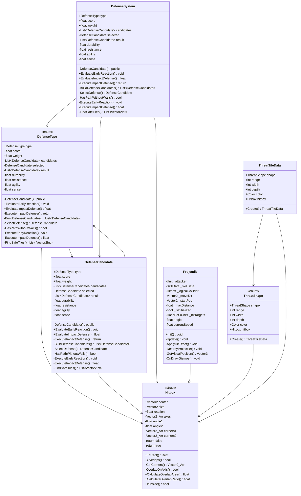

# Package `Unit/Combat` UML Class Diagram

**소스 경로:** `Assets/Unit/Combat`

### 📋 스크립트 클래스 명세

#### `DefenseType` (enum)
- **경로:** `Script/Unit/Combat/DefenseSystem.cs`
- **변수/프로퍼티:**
  - `+DefenseType type`
  - `+float score`
  - `+float weight`
  - `-List~DefenseCandidate~ candidates`
  - `-DefenseCandidate selected`
  - `-List~DefenseCandidate~ candidates`
  - `-DefenseCandidate selected`
  - `-List~DefenseCandidate~ result`
  - `-float durability`
  - `-float resistance`
  - `-float agility`
  - `-float sense`
  - `-float focus`
  - `-float magic`
  - `-float dodgeScore`
- **함수:**
  - `-DefenseCandidate() public`
  - `+EvaluateEarlyReaction() void`
  - `+EvaluateImpactDefense() float`
  - `-ExecuteImpactDefense() return`
  - `-BuildDefenseCandidates() List~DefenseCandidate~`
  - `-SelectDefense() DefenseCandidate`
  - `-HasPathWithoutWalls() bool`
  - `-ExecuteEarlyReaction() void`
  - `-ExecuteImpactDefense() float`
  - `-FindSafeTiles() List~Vector2Int~`
  - `-TryDodgeMove() bool`
  - `-GetOverlapArea() float`

#### `DefenseCandidate` (class)
- **경로:** `Script/Unit/Combat/DefenseSystem.cs`
- **변수/프로퍼티:**
  - `+DefenseType type`
  - `+float score`
  - `+float weight`
  - `-List~DefenseCandidate~ candidates`
  - `-DefenseCandidate selected`
  - `-List~DefenseCandidate~ candidates`
  - `-DefenseCandidate selected`
  - `-List~DefenseCandidate~ result`
  - `-float durability`
  - `-float resistance`
  - `-float agility`
  - `-float sense`
  - `-float focus`
  - `-float magic`
  - `-float dodgeScore`
- **함수:**
  - `-DefenseCandidate() public`
  - `+EvaluateEarlyReaction() void`
  - `+EvaluateImpactDefense() float`
  - `-ExecuteImpactDefense() return`
  - `-BuildDefenseCandidates() List~DefenseCandidate~`
  - `-SelectDefense() DefenseCandidate`
  - `-HasPathWithoutWalls() bool`
  - `-ExecuteEarlyReaction() void`
  - `-ExecuteImpactDefense() float`
  - `-FindSafeTiles() List~Vector2Int~`
  - `-TryDodgeMove() bool`
  - `-GetOverlapArea() float`

#### `DefenseSystem` (class)
- **경로:** `Script/Unit/Combat/DefenseSystem.cs`
- **변수/프로퍼티:**
  - `+DefenseType type`
  - `+float score`
  - `+float weight`
  - `-List~DefenseCandidate~ candidates`
  - `-DefenseCandidate selected`
  - `-List~DefenseCandidate~ candidates`
  - `-DefenseCandidate selected`
  - `-List~DefenseCandidate~ result`
  - `-float durability`
  - `-float resistance`
  - `-float agility`
  - `-float sense`
  - `-float focus`
  - `-float magic`
  - `-float dodgeScore`
- **함수:**
  - `-DefenseCandidate() public`
  - `+EvaluateEarlyReaction() void`
  - `+EvaluateImpactDefense() float`
  - `-ExecuteImpactDefense() return`
  - `-BuildDefenseCandidates() List~DefenseCandidate~`
  - `-SelectDefense() DefenseCandidate`
  - `-HasPathWithoutWalls() bool`
  - `-ExecuteEarlyReaction() void`
  - `-ExecuteImpactDefense() float`
  - `-FindSafeTiles() List~Vector2Int~`
  - `-TryDodgeMove() bool`
  - `-GetOverlapArea() float`

#### `Hitbox` (struct)
- **경로:** `Script/Unit/Combat/Hitbox.cs`
- **변수/프로퍼티:**
  - `+Vector2 center`
  - `+Vector2 size`
  - `+float rotation`
  - `-Vector2_Arr axes`
  - `-float angle1`
  - `-float angle2`
  - `-Vector2_Arr corners1`
  - `-Vector2_Arr corners2`
  - `-return false`
  - `-return true`
  - `-Vector2 right`
  - `-Vector2 up`
  - `-float min1`
  - `-float proj`
  - `-float min2`
- **함수:**
  - `+ToRect() Rect`
  - `+Overlaps() bool`
  - `-GetCorners() Vector2_Arr`
  - `-OverlapOnAxis() bool`
  - `+CalculateOverlapArea() float`
  - `+CalculateOverlapRatio() float`
  - `+IsInside() bool`

#### `Projectile` (class)
- **경로:** `Script/Unit/Combat/Projectile.cs`
- **상속/인터페이스:** `MonoBehaviour`
- **변수/프로퍼티:**
  - `-Unit _attacker`
  - `-SkillData _skillData`
  - `-Hitbox _logicalCollider`
  - `-Vector2 _moveDir`
  - `-Vector2 _startPos`
  - `-float _maxDistance`
  - `-bool _isInitialized`
  - `-HashSet~Unit~ _hitTargets`
  - `-float angle`
  - `-float currentSpeed`
  - `-List~Unit~ hitEnemies`
  - `-bool hasHitNewEnemy`
  - `-Hitbox enemyBox`
  - `-float overlapRatio`
  - `-float finalRatio`
- **함수:**
  - `+Init() void`
  - `-Update() void`
  - `-ApplyHitEffect() void`
  - `-DestroyProjectile() void`
  - `-GetVisualPosition() Vector3`
  - `-OnDrawGizmos() void`

#### `ThreatShape` (enum)
- **경로:** `Script/Unit/Combat/ThreatTileData.cs`
- **변수/프로퍼티:**
  - `+ThreatShape shape`
  - `+int range`
  - `+int width`
  - `+int depth`
  - `+Color color`
  - `+Hitbox hitbox`
- **함수:**
  - `+Create() ThreatTileData`

#### `ThreatTileData` (class)
- **경로:** `Script/Unit/Combat/ThreatTileData.cs`
- **변수/프로퍼티:**
  - `+ThreatShape shape`
  - `+int range`
  - `+int width`
  - `+int depth`
  - `+Color color`
  - `+Hitbox hitbox`
- **함수:**
  - `+Create() ThreatTileData`

