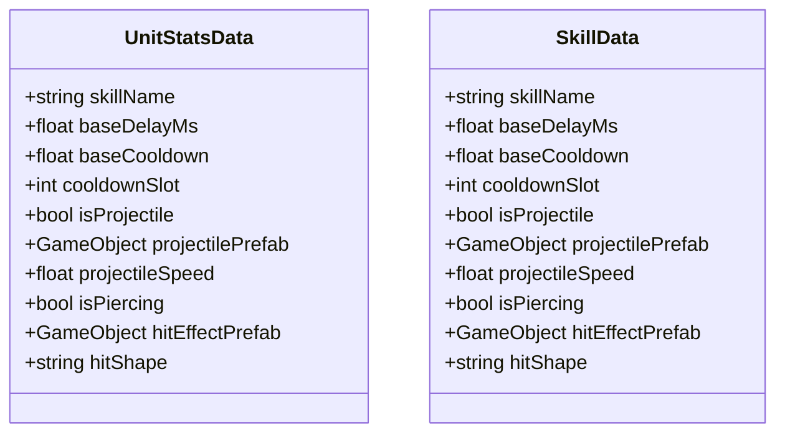

# Package `Unit/Data` UML Class Diagram

**소스 경로:** `Assets/Unit/Data`

### 📋 스크립트 클래스 명세

#### `UnitStatsData` (class)
- **경로:** `Script/Unit/Data/UnitStatsData.cs`
- **변수/프로퍼티:**
  - `+string skillName`
  - `+float baseDelayMs`
  - `+float baseCooldown`
  - `+int cooldownSlot`
  - `+bool isProjectile`
  - `+GameObject projectilePrefab`
  - `+float projectileSpeed`
  - `+bool isPiercing`
  - `+GameObject hitEffectPrefab`
  - `+string hitShape`
  - `+float damageMultiplier`
  - `+bool hasStun`
  - `+float stunDuration`
  - `+float priorityBase`
  - `+float priorityKillMultiplier`

#### `SkillData` (class)
- **경로:** `Script/Unit/Data/UnitStatsData.cs`
- **변수/프로퍼티:**
  - `+string skillName`
  - `+float baseDelayMs`
  - `+float baseCooldown`
  - `+int cooldownSlot`
  - `+bool isProjectile`
  - `+GameObject projectilePrefab`
  - `+float projectileSpeed`
  - `+bool isPiercing`
  - `+GameObject hitEffectPrefab`
  - `+string hitShape`
  - `+float damageMultiplier`
  - `+bool hasStun`
  - `+float stunDuration`
  - `+float priorityBase`
  - `+float priorityKillMultiplier`

