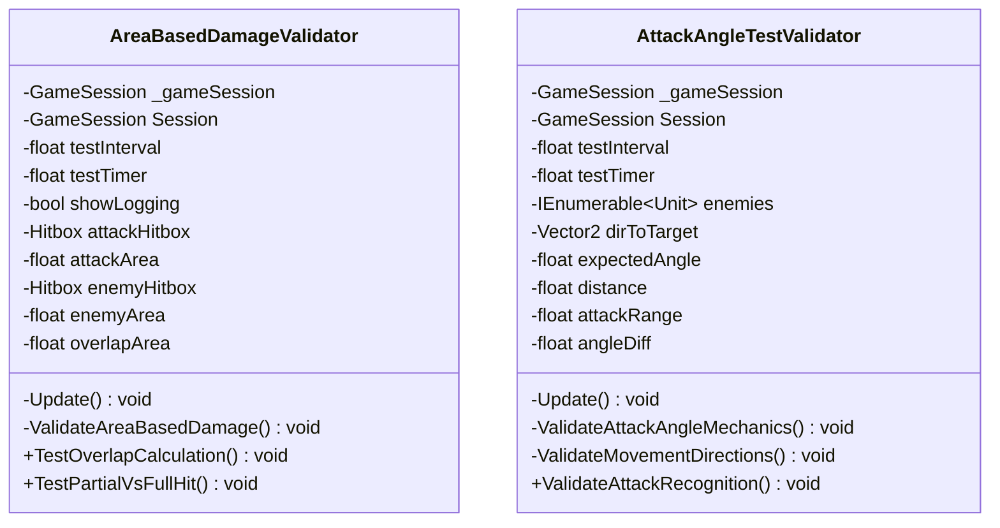

# Package `Unit/Debug` UML Class Diagram

**소스 경로:** `Assets/Unit/Debug`

### 📋 스크립트 클래스 명세

#### `AreaBasedDamageValidator` (class)
- **경로:** `Script/Unit/Debug/AreaBasedDamageValidator.cs`
- **상속/인터페이스:** `MonoBehaviour`
- **변수/프로퍼티:**
  - `-GameSession _gameSession`
  - `-GameSession Session`
  - `-float testInterval`
  - `-float testTimer`
  - `-bool showLogging`
  - `-Hitbox attackHitbox`
  - `-float attackArea`
  - `-Hitbox enemyHitbox`
  - `-float enemyArea`
  - `-float overlapArea`
  - `-float overlapRatio`
  - `-float baseDamage`
  - `-float expectedDamage`
  - `-Hitbox box1`
  - `-Hitbox box2`
- **함수:**
  - `-Update() void`
  - `-ValidateAreaBasedDamage() void`
  - `+TestOverlapCalculation() void`
  - `+TestPartialVsFullHit() void`

#### `AttackAngleTestValidator` (class)
- **경로:** `Script/Unit/Debug/AttackAngleTestValidator.cs`
- **상속/인터페이스:** `MonoBehaviour`
- **변수/프로퍼티:**
  - `-GameSession _gameSession`
  - `-GameSession Session`
  - `-float testInterval`
  - `-float testTimer`
  - `-IEnumerable~Unit~ enemies`
  - `-Vector2 dirToTarget`
  - `-float expectedAngle`
  - `-float distance`
  - `-float attackRange`
  - `-float angleDiff`
  - `-Unit testUnit`
  - `-int validDirectionCount`
  - `-Vector2Int dirVec`
  - `-List~ThreatTileData~ threats`
  - `-Hitbox attackerBox`
- **함수:**
  - `-Update() void`
  - `-ValidateAttackAngleMechanics() void`
  - `-ValidateMovementDirections() void`
  - `+ValidateAttackRecognition() void`

