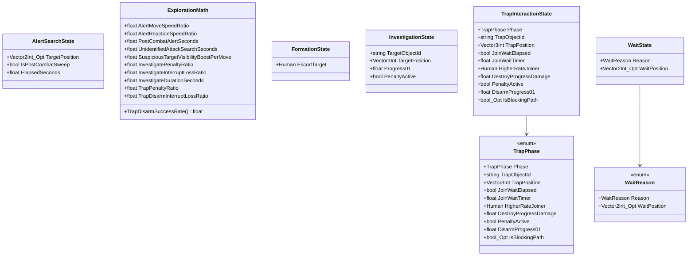

# Package `Unit/Exploration` UML Class Diagram

**소스 경로:** `Assets/Unit/Exploration`

### 📋 스크립트 클래스 명세

#### `AlertSearchState` (class)
- **경로:** `Script/Unit/Exploration/AlertSearchState.cs`
- **변수/프로퍼티:**
  - `+Vector2Int_Opt TargetPosition`
  - `+bool IsPostCombatSweep`
  - `+float ElapsedSeconds`

#### `ExplorationMath` (class)
- **경로:** `Script/Unit/Exploration/ExplorationMath.cs`
- **변수/프로퍼티:**
  - `+float AlertMoveSpeedRatio`
  - `+float AlertReactionSpeedRatio`
  - `+float PostCombatAlertSeconds`
  - `+float UnidentifiedAttackSearchSeconds`
  - `+float SuspiciousTargetVisibilityBoostPerMove`
  - `+float InvestigatePenaltyRatio`
  - `+float InvestigateInterruptLossRatio`
  - `+float InvestigateDurationSeconds`
  - `+float TrapPenaltyRatio`
  - `+float TrapDisarmInterruptLossRatio`
  - `+float TrapJoinWaitSeconds`
  - `+float TrapRecordedDirectDisarmThreshold`
  - `+float TrapPassMinHpRatioAfterHit`
  - `+float TrapAllyRescueMinHpRatioAfterHit`
  - `+float TrapAllyRescueUnrecordedMinCurrentHpRatio`
- **함수:**
  - `+TrapDisarmSuccessRate() float`

#### `FormationState` (class)
- **경로:** `Script/Unit/Exploration/FormationState.cs`
- **변수/프로퍼티:**
  - `+Human EscortTarget`

#### `InvestigationState` (class)
- **경로:** `Script/Unit/Exploration/InvestigationState.cs`
- **변수/프로퍼티:**
  - `+string TargetObjectId`
  - `+Vector3Int TargetPosition`
  - `+float Progress01`
  - `+bool PenaltyActive`

#### `TrapPhase` (enum)
- **경로:** `Script/Unit/Exploration/TrapInteractionState.cs`
- **변수/프로퍼티:**
  - `+TrapPhase Phase`
  - `+string TrapObjectId`
  - `+Vector3Int TrapPosition`
  - `+bool JoinWaitElapsed`
  - `+float JoinWaitTimer`
  - `+Human HigherRateJoiner`
  - `+float DestroyProgressDamage`
  - `+bool PenaltyActive`
  - `+float DisarmProgress01`
  - `+bool_Opt IsBlockingPath`

#### `TrapInteractionState` (class)
- **경로:** `Script/Unit/Exploration/TrapInteractionState.cs`
- **변수/프로퍼티:**
  - `+TrapPhase Phase`
  - `+string TrapObjectId`
  - `+Vector3Int TrapPosition`
  - `+bool JoinWaitElapsed`
  - `+float JoinWaitTimer`
  - `+Human HigherRateJoiner`
  - `+float DestroyProgressDamage`
  - `+bool PenaltyActive`
  - `+float DisarmProgress01`
  - `+bool_Opt IsBlockingPath`

#### `WaitReason` (enum)
- **경로:** `Script/Unit/Exploration/WaitState.cs`
- **변수/프로퍼티:**
  - `+WaitReason Reason`
  - `+Vector2Int_Opt WaitPosition`

#### `WaitState` (class)
- **경로:** `Script/Unit/Exploration/WaitState.cs`
- **변수/프로퍼티:**
  - `+WaitReason Reason`
  - `+Vector2Int_Opt WaitPosition`

