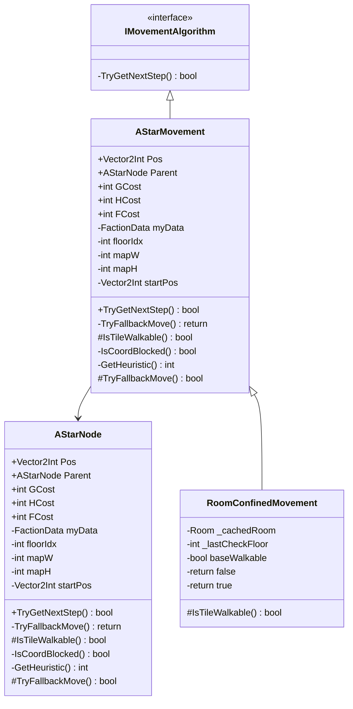

# Package `Unit/Movement` UML Class Diagram

**소스 경로:** `Assets/Unit/Movement`

### 📋 스크립트 클래스 명세

#### `AStarMovement` (class)
- **경로:** `Script/Unit/Movement/AStarMovement.cs`
- **상속/인터페이스:** `IMovementAlgorithm`
- **변수/프로퍼티:**
  - `+Vector2Int Pos`
  - `+AStarNode Parent`
  - `+int GCost`
  - `+int HCost`
  - `+int FCost`
  - `-FactionData myData`
  - `-int floorIdx`
  - `-int mapW`
  - `-int mapH`
  - `-Vector2Int startPos`
  - `-List~AStarNode~ openList`
  - `-HashSet~Vector2Int~ closedSet`
  - `-AStarNode startNode`
  - `-int maxIter`
  - `-int iter`
- **함수:**
  - `+TryGetNextStep() bool`
  - `-TryFallbackMove() return`
  - `#IsTileWalkable() bool`
  - `-IsCoordBlocked() bool`
  - `-GetHeuristic() int`
  - `#TryFallbackMove() bool`

#### `AStarNode` (class)
- **경로:** `Script/Unit/Movement/AStarMovement.cs`
- **변수/프로퍼티:**
  - `+Vector2Int Pos`
  - `+AStarNode Parent`
  - `+int GCost`
  - `+int HCost`
  - `+int FCost`
  - `-FactionData myData`
  - `-int floorIdx`
  - `-int mapW`
  - `-int mapH`
  - `-Vector2Int startPos`
  - `-List~AStarNode~ openList`
  - `-HashSet~Vector2Int~ closedSet`
  - `-AStarNode startNode`
  - `-int maxIter`
  - `-int iter`
- **함수:**
  - `+TryGetNextStep() bool`
  - `-TryFallbackMove() return`
  - `#IsTileWalkable() bool`
  - `-IsCoordBlocked() bool`
  - `-GetHeuristic() int`
  - `#TryFallbackMove() bool`

#### `IMovementAlgorithm` (interface)
- **경로:** `Script/Unit/Movement/IMovementAlgorithm.cs`
- **함수:**
  - `-TryGetNextStep() bool`

#### `RoomConfinedMovement` (class)
- **경로:** `Script/Unit/Movement/RoomConfinedMovement.cs`
- **상속/인터페이스:** `AStarMovement`
- **변수/프로퍼티:**
  - `-Room _cachedRoom`
  - `-int _lastCheckFloor`
  - `-bool baseWalkable`
  - `-return false`
  - `-return true`
- **함수:**
  - `#IsTileWalkable() bool`

