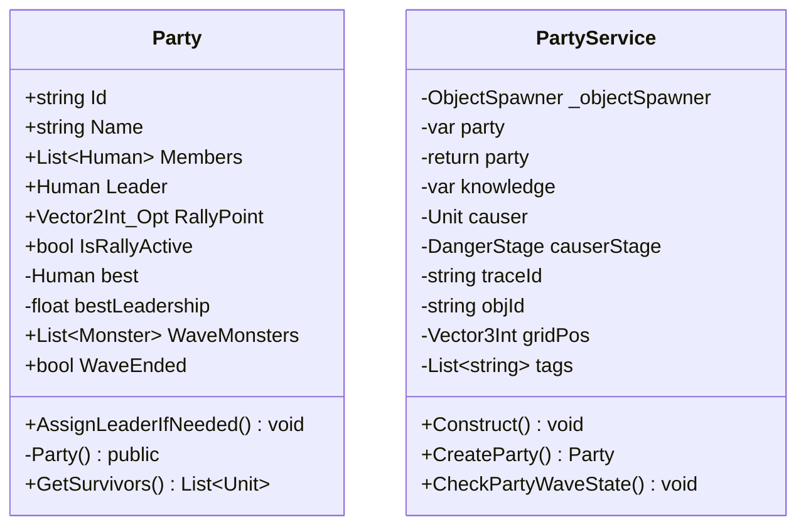

# Package `Unit/Party` UML Class Diagram

**소스 경로:** `Assets/Unit/Party`

### 📋 스크립트 클래스 명세

#### `Party` (class)
- **경로:** `Script/Unit/Party/Party.cs`
- **변수/프로퍼티:**
  - `+string Id`
  - `+string Name`
  - `+List~Human~ Members`
  - `+Human Leader`
  - `+Vector2Int_Opt RallyPoint`
  - `+bool IsRallyActive`
  - `-Human best`
  - `-float bestLeadership`
  - `+List~Monster~ WaveMonsters`
  - `+bool WaveEnded`
  - `-return true`
  - `-return true`
  - `-var survivors`
  - `-return survivors`
  - `+bool IsWiped get_set`
- **함수:**
  - `+AssignLeaderIfNeeded() void`
  - `-Party() public`
  - `+GetSurvivors() List~Unit~`

#### `PartyService` (class)
- **경로:** `Script/Unit/Party/PartyService.cs`
- **변수/프로퍼티:**
  - `-ObjectSpawner _objectSpawner`
  - `-var party`
  - `-return party`
  - `-var knowledge`
  - `-var party`
  - `-Unit causer`
  - `-DangerStage causerStage`
  - `-string traceId`
  - `-string objId`
  - `-Vector3Int gridPos`
  - `-List~string~ tags`
  - `-InteractableObject wipeoutObj`
  - `-var survivors`
  - `+List~Party~ parties get_set`
- **함수:**
  - `+Construct() void`
  - `+CreateParty() Party`
  - `+CheckPartyWaveState() void`

